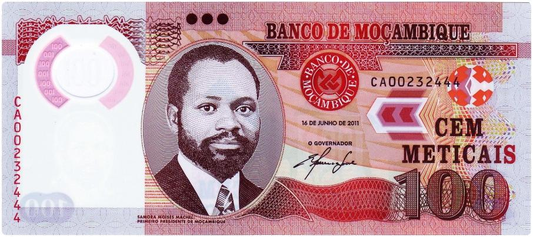

Mozambique's national currency, the metical (MZN), is a fundamental component of the nation's economic framework. Officially introduced in 1980, the metical replaced the Mozambican escudo, marking a significant shift in the country's monetary history. The term "metical" is derived from the Arabic word "mithqal," which was historically used across various trading regions to denote a unit of weight, underscoring the currency's deep-rooted historical significance. The metical is pivotal not just for domestic economic transactions but also serves as a vital instrument in Mozambique's engagement with global markets.

Throughout its history, the metical has been a barometer of Mozambique's economic health and resilience. From its inception, the currency has been instrumental in navigating the economic challenges posed by the post-independence turbulence and subsequent civil war, which strained Mozambique's economic stability. Despite these challenges, the implementation of economic reforms and strategic monetary policies facilitated a gradual economic recovery, enabling the metical to stabilize over time.



In the broader context of global finance, currency plays a crucial role by facilitating international trade and investment. A nation's currency reflects its economic standing and determines its interaction in the global economic arena. For Mozambique, the metical is not only a medium of exchange but a symbol of national identity and sovereignty, influencing both domestic policies and international trade relations.

This article will explore various facets of the metical, including its historical journey, Mozambique's economic landscape, and the influence of modern trading techniques such as algorithmic trading. By understanding these elements, we can grasp the broader implications of currency management on Mozambique's economy and its interactions in the global economic system.

## Table of Contents

## Historical Background of the Metical

The term "metical" is derived from the Arabic word "mithqal," which referred to a unit of weight for gold and other precious metals. This reference underscores the historical significance of trade and commerce in shaping currency systems. The metical was officially introduced in Mozambique in 1980, replacing the Mozambican escudo following the nation's independence from Portugal in 1975. This change signified a pivotal step for Mozambique in asserting its economic sovereignty.

The metical's early years were marked by considerable challenges, most notably hyperinflation. During the 1980s and 1990s, Mozambique's economy faced severe disruptions due to a protracted civil war and economic instability. These conditions contributed to the relentless devaluation of the metical, heightening inflation rates and undermining public confidence in the currency. Hyperinflation resulted in the need for increasingly large denominations, complicating everyday transactions and eroding the metical's purchasing power.

To stabilize the national currency and restore economic confidence, Mozambique undertook a redenomination of the metical in 2006. This involved introducing the new metical (MZN), with an exchange rate of 1,000 old meticals to 1 new metical. The redenomination aimed to simplify financial transactions, curb inflationary expectations, and strengthen the currency's standing domestically and internationally. The issuance of the new metical was accompanied by efforts to enhance financial management and monetary policies, reflecting Mozambique's commitment to stabilizing and revitalizing its economy.

## The Economic Landscape of Mozambique

Mozambique's economic landscape is intricately linked to its historical path toward independence and the resulting civil strife. The country gained independence from Portugal on June 25, 1975, after a prolonged liberation struggle led by the Frente de Libertação de Moçambique (FRELIMO). This victory, while momentous, soon spiraled into a devastating civil war that lasted from 1977 to 1992. This violent conflict severely disrupted economic activities and infrastructural development, leading to a dramatic decline in Mozambique's economic stability.

The impact of the civil war on Mozambique’s economy was profound. Infrastructure was damaged, agricultural productivity plummeted, and industrial output slowed due to the constant state of unrest. The war resulted in widespread famine and displacement, contributing to a weakened economic foundation. In the aftermath of the conflict, Mozambique was left as one of the world's poorest nations, heavily reliant on foreign aid and humanitarian support.

Post-independence, Mozambique embarked on ambitious economic reforms aimed at stabilizing the economy and spurring growth. The end of the civil war marked the beginning of a gradual recovery process. Key economic reforms included the liberalization of markets, privatization of state-owned enterprises, and opening up to international trade and investment. In the late 1990s and early 2000s, Mozambique implemented structural adjustments under the guidance of the International Monetary Fund (IMF) and the World Bank, leading to notable progress in macroeconomic stability.

In terms of contemporary economic conditions, Mozambique has experienced varying levels of GDP growth over the years. According to the World Bank, the nation recorded an average annual GDP growth rate of approximately 7% from 1993 to 2015, fueled by substantial investments in the mining and natural gas sectors. However, recent economic growth has slowed due to several factors, including political uncertainty and climatic challenges. Inflation remains a critical concern, influenced by both domestic and international factors, impacting the cost of living and purchasing power of Mozambicans.

Foreign exchange acceptance and management play a pivotal role in Mozambique's economic performance. The country's currency, the metical (MZN), is subject to external market fluctuations and domestic economic policies. The Banco de Moçambique employs monetary policies to stabilize the currency and mitigate inflationary pressures, aiming to create a favorable environment for economic growth and development.

In summary, Mozambique’s economic landscape is shaped by its tumultuous history and its continuous efforts toward recovery and growth. While the nation faces numerous challenges, ongoing reforms and investments present opportunities for sustained economic development.

## Understanding the New Metical (MZN)

The transition to the new metical (MZN) in 2006 marked a significant change in Mozambique's monetary system. This redenomination, motivated by the need to stabilize the economy and simplify monetary transactions, replaced the old metical at a rate of 1,000 old meticais to 1 new metical. This reform was crucial in addressing the hyperinflation that had plagued the currency, restoring confidence in Mozambique's financial system.

The design of the new metical banknotes and coins reflects Mozambique’s rich history and cultural heritage. The banknotes feature prominent figures and national symbols. For example, the 20 metical note depicts Eduardo Mondlane, a key figure in Mozambique’s struggle for independence. Besides honoring historic personalities, the notes showcase Mozambique's natural and cultural landmarks, such as the Island of Mozambique and Gorongosa National Park.

Banco de Moçambique plays a central role in issuing and regulating the new metical. As the country’s central bank, it is responsible for maintaining currency stability, ensuring adequate circulation of banknotes and coins, and setting monetary policy. The bank's policies influence the management of inflation and interest rates, which are critical for economic stability.

Modern banknotes incorporate several security features to deter counterfeiting. The MZN includes advanced anti-counterfeiting measures such as watermarks with portraits, security threads embedded in the paper, and see-through registers. Additionally, iridescent stripes, micro-printing, and color-shifting inks enhance the authenticity of the currency. These features are crucial for maintaining the trust of the public and preserving the integrity of the financial system.

The introduction and subsequent management of the new metical demonstrate Mozambique's efforts to establish a sound monetary system amid economic challenges. The thoughtful integration of historical and modern elements in its currency further emphasizes Mozambique’s commitment to honoring its past while embracing future economic growth.

## The Impact of Algorithmic Trading on the MZN

Algorithmic trading, or automated trading, involves using computer programs and algorithms to execute trades in financial markets. This technology has transformed global currency markets by enabling rapid and efficient trade executions, minimizing human error, and allowing traders to capitalize on market trends and opportunities at speeds impossible for manual trading.

For the Mozambican metical (MZN), [algorithmic trading](/wiki/algorithmic-trading) offers both potential benefits and risks. On the benefits side, algorithmic trading can improve market [liquidity](/wiki/liquidity-risk-premium) and efficiency by increasing the [volume](/wiki/volume-trading-strategy) and speed of trade executions. This is particularly advantageous in smaller, emerging markets like Mozambique, where liquidity may be limited. Increased liquidity can lead to narrower bid-ask spreads, potentially reducing transaction costs for traders. Additionally, the use of sophisticated algorithms can help traders better manage the risks associated with volatile currency markets by implementing complex strategies that can analyze vast amounts of data in real time.

However, there are risks associated with algorithmic trading that could impact the MZN. The reliance on high-frequency trades could lead to increased market [volatility](/wiki/volatility-trading-strategies), especially during periods of low liquidity. Furthermore, technical issues such as software bugs or connectivity problems could disrupt trading activities, potentially leading to significant financial losses. Regulatory challenges also emerge as monitoring and controlling algorithmic trading activities can be complex, requiring robust regulatory frameworks to mitigate risks such as market manipulation.

Technology significantly influences foreign exchange trading in Mozambique by enabling more significant participation in global currency markets. With advancements in telecommunications infrastructure and increased internet penetration, more market participants in Mozambique have access to algorithmic trading platforms. These platforms facilitate foreign exchange activities, allowing for efficient cross-border transactions and supporting the country's integration into the global economy.

One notable example of algorithmic trading impacting the MZN occurred when international hedge funds began incorporating MZN into their currency portfolios. By deploying algorithms that analyzed macroeconomic indicators, these institutions could execute trades based on real-time economic data. This approach allowed for more dynamic and informed trading decisions, taking into account factors such as Mozambique's GDP growth rates, inflation trends, and macroeconomic policies.

The algorithms used in currency trading often involve complex mathematical models and statistical techniques. For instance, traders might use mean reversion strategies, where the algorithm identifies currency pair prices that deviate significantly from their historical average and executes trades with the expectation that prices will revert to the mean. 

Python, a preferred language for developing algorithmic trading models, offers libraries such as NumPy and Pandas for handling data and constructing algorithms. Below is a simple example of a Python script that might be used for a mean-reversion algorithm:

```python
import numpy as np
import pandas as pd
import matplotlib.pyplot as plt

# Load historical exchange rate data
data = pd.read_csv('metical_exchange_rate.csv')

# Calculate moving average and standard deviation
data['MA'] = data['ExchangeRate'].rolling(window=20).mean()
data['STD'] = data['ExchangeRate'].rolling(window=20).std()

# Identify buy/sell signals based on mean reversion
data['Buy'] = np.where(data['ExchangeRate'] < data['MA'] - data['STD'], 1, 0)
data['Sell'] = np.where(data['ExchangeRate'] > data['MA'] + data['STD'], -1, 0)

# Plot the exchange rates and signals
plt.figure(figsize=(14, 7))
plt.plot(data['ExchangeRate'], label='Exchange Rate')
plt.plot(data['MA'], label='Moving Average')
plt.scatter(data.index, data['ExchangeRate'][data['Buy'] == 1], label='Buy Signal', marker='^', color='g')
plt.scatter(data.index, data['ExchangeRate'][data['Sell'] == -1], label='Sell Signal', marker='v', color='r')
plt.legend()
plt.show()
```

This script analyzes historical exchange rate data for the MZN, calculates a moving average, and identifies buy and sell signals based on deviations from this average. While simplified, it illustrates how algorithmic strategies can be formulated to make informed decisions in currency trading using technology. As Mozambique continues to develop its digital infrastructure and regulatory environment, algorithmic trading may play an increasingly important role in shaping the dynamics of the MZN within global currency markets.

## Challenges and Opportunities

Mozambique, a southeastern African nation, faces several economic challenges influencing the stability of its currency, the metical. Among these challenges, high inflation rates play a significant role, eroding the purchasing power of the metical and affecting consumer confidence. Political instability and governance challenges further exacerbate economic uncertainties, weakening investor trust and complicating efforts to stabilize the currency. Natural disasters also periodically disrupt economic activities, undermining growth and stability. Moreover, Mozambique's external debt burden impacts fiscal policies, constraining public spending and investment in crucial sectors.

Despite these challenges, Mozambique holds considerable opportunities for economic growth and investment. The country's vast natural resources, including natural gas, coal, and minerals, offer substantial potential for revenue generation and foreign investment. The development of liquefied natural gas (LNG) projects, particularly in the Rovuma Basin, is anticipated to significantly boost economic growth, create employment, and increase foreign exchange reserves. Additionally, Mozambique's strategic geographical location provides access to regional and international markets, promising opportunities for trade expansion.

International trade and aid play crucial roles in supporting Mozambique's economy. The country's engagement with major trading partners, such as South Africa, China, and the European Union, facilitates market access for Mozambican goods and services. Foreign aid and development assistance from international organizations, such as the International Monetary Fund (IMF) and the World Bank, support infrastructure development, sectoral reforms, and poverty alleviation initiatives. These efforts contribute to economic growth and enhance the resilience of the metical.

Looking ahead, Mozambique's currency and economic reforms present both challenges and prospects for the future. The successful implementation of economic policies, focused on diversification, fiscal responsibility, and strengthening governance, will be vital for stabilizing the metical. Moreover, sustainable management of natural resources and investment in infrastructure and human capital will be key drivers of economic growth. Continued international support and collaboration with development partners can bolster Mozambique's efforts toward achieving economic stability and prosperity.

## Conclusion

The historical journey of Mozambique's national currency, the metical, is a testament to the nation's resilience and adaptability. Originating from the Arabic term 'mithqal,' the metical was officially introduced in 1980, replacing the Mozambican escudo. This transition marked a significant step in establishing Mozambique's economic identity post-independence. However, the currency faced severe challenges, including periods of hyperinflation that threatened its stability and value. In response, the country underwent a redenomination process in 2006, introducing the new metical (MZN) in an effort to stabilize the economy and restore public confidence in the national currency.

Mozambique's economic landscape continues to face significant challenges. The nation, emerging from a long period of civil war, struggles with issues such as poverty, infrastructure deficits, and a dependence on foreign aid. Nevertheless, there are promising opportunities for growth and investment. With rich natural resources and a vibrant agricultural sector, Mozambique has the potential to become a key player in the regional economy. Economic reforms aimed at improving the business environment and investment climate could further strengthen its economic prospects.

Looking ahead, the future trajectory of the metical is closely tied to Mozambique's broader economic performance. As technology and globalization continue to influence global finance, the adoption of innovations such as algorithmic trading could present both opportunities and risks for the MZN. Mozambique's engagement in international trade and efforts to attract foreign investment will be crucial in supporting the currency's stability and growth. With strategic economic reforms and investment in key sectors, there is hope for a more stable and prosperous economic future for Mozambique and its national currency in the global marketplace.

## References & Further Reading

[1]: Lo, Andrew W. ("Efficient Markets Hypothesis."](https://web.mit.edu/Alo/www/Papers/EMH_Final.pdf) In The New Palgrave Dictionary of Economics. Palgrave Macmillan, 2008.

[2]: ["Mozambique - From Civil War to Reconstruction: The Definition of a Valued and Sustainable Transition (Overview),"](https://en.wikipedia.org/wiki/Mozambican_Civil_War) The World Bank Group Report, 2017.

[3]: ["Algorithmic and High-Frequency Trading: Mathematics, Statistics, and Engineering"](https://api.pageplace.de/preview/DT0400.9781316455579_A25606943/preview-9781316455579_A25606943.pdf) by Álvaro Cartea, Sebastian Jaimungal, and José Penalva

[4]: ["Africa's Emerging Economies: Continuity and Change"](https://www.amazon.com/Africas-Emerging-Economies-Continuity-Change/dp/1447328393) by Mthuli Ncube and Charles Leyeka Lufumpa

[5]: ["Using Python for Algorithmic Trading"](https://www.freecodecamp.org/news/algorithmic-trading-in-python/) by Yves Hilpisch