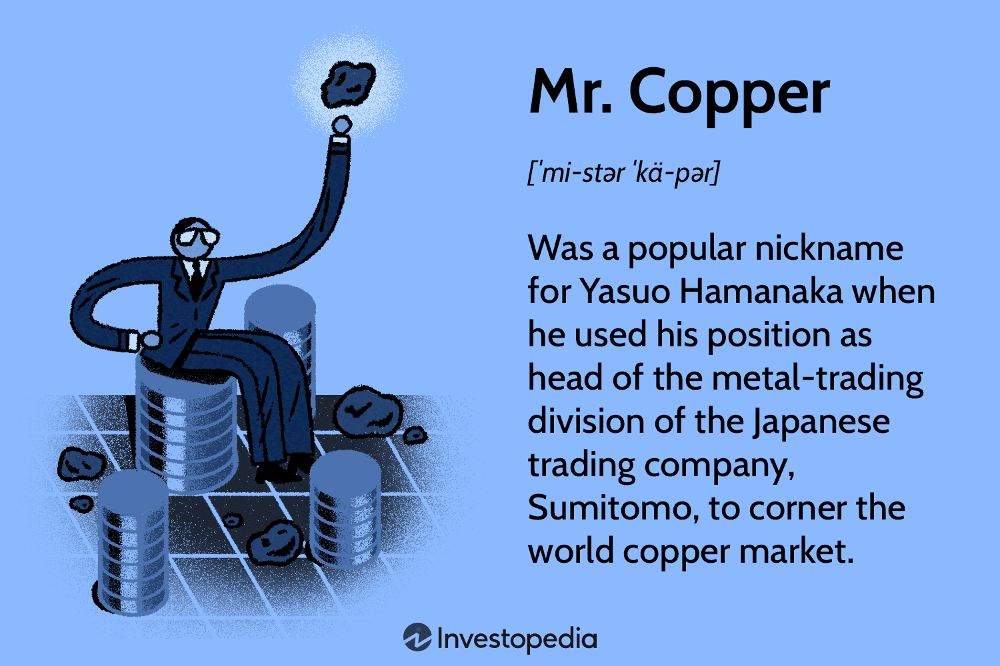

## Table of Contents

## What is Mr. Copper in the context of the commodities market?

Mr. Copper is a nickname given to copper in the commodities market. It's called Mr. Copper because it is seen as a good indicator of the health of the global economy. When the demand for copper goes up, it often means that industries like construction and manufacturing are doing well, which can be a sign that the economy is growing.

Copper is used in many things, like electrical wiring, plumbing, and electronics. Because it is used in so many important industries, changes in the price of copper can give us clues about what is happening in the economy. If the price of copper is going up, it might mean that people are building more houses or making more cars. If the price is going down, it could be a sign that these industries are slowing down.

## How did the term 'Mr. Copper' originate?

The term 'Mr. Copper' started being used because people noticed that the price of copper can tell us a lot about how the economy is doing. Copper is used in so many things, like buildings and cars, that when more copper is needed, it usually means the economy is doing well. This is why copper got the nickname 'Mr. Copper' - it's like a helpful friend that gives us hints about the economy.

The exact start of the term 'Mr. Copper' is not clear, but it became popular among people who watch the commodities market. They started calling copper 'Mr. Copper' because it was an easy way to remember that copper prices can be a good sign of economic health. Over time, the nickname stuck and is now used widely in the world of finance and economics.

## What role does copper play in the global economy?

Copper is very important for the global economy because it is used in lots of things that help the world run. It is used to make electrical wires, pipes for water, and parts for machines and electronics. Because copper is needed for so many things, how much people want to buy copper can show us how well the economy is doing. If more copper is being bought, it usually means that people are building more houses, making more cars, and using more electronics, which means the economy is growing.

Copper is also important because it is traded all over the world. Countries that have a lot of copper, like Chile and Peru, can sell it to other countries that need it. This trade helps the global economy by making sure that copper is available where it is needed. When the price of copper goes up or down, it can affect the economies of the countries that produce and use copper. So, watching the price of copper can give us clues about what is happening in the global economy.

## How is the price of copper determined in the commodities market?

The price of copper in the commodities market is determined by how many people want to buy it and how much is available to sell. If a lot of people want copper but there isn't much to sell, the price will go up. If there is a lot of copper but not many people want to buy it, the price will go down. This is called supply and demand. Big companies that need copper for things like building houses or making electronics can affect the price by buying a lot of it. Also, things like strikes at copper mines or new copper mines opening can change how much copper is available and affect the price.

Another thing that can change the price of copper is what people think will happen in the future. If people think that the economy will grow and more copper will be needed, they might buy copper now, even if they don't need it right away. This can make the price go up. On the other hand, if people think the economy will slow down and less copper will be needed, they might not buy as much copper, which can make the price go down. The price of copper can also be affected by the value of the U.S. dollar because copper is usually bought and sold in dollars. If the dollar gets stronger, it can make copper more expensive for people using other currencies, which can affect demand and the price.

## What are the main factors that influence copper prices?

The price of copper goes up and down based on how much people want it and how much is available. This is called supply and demand. When a lot of people want copper but there isn't much to sell, the price goes up. If there is a lot of copper but not many people want to buy it, the price goes down. Big companies that use copper for things like building houses or making electronics can change the price by buying a lot of it. Also, things like strikes at copper mines or new copper mines opening can change how much copper is available and affect the price.

What people think will happen in the future can also change the price of copper. If people think the economy will grow and more copper will be needed, they might buy copper now, even if they don't need it right away. This can make the price go up. On the other hand, if people think the economy will slow down and less copper will be needed, they might not buy as much copper, which can make the price go down. The value of the U.S. dollar also affects copper prices because copper is usually bought and sold in dollars. If the dollar gets stronger, it can make copper more expensive for people using other currencies, which can change how much they want to buy.

## How can investors use Mr. Copper as an indicator for economic health?

Investors can use Mr. Copper, or the price of copper, as a way to guess how the economy is doing. When the price of copper goes up, it usually means that more people want to buy it. This can happen because companies are building more things like houses and cars, which use a lot of copper. So, if copper prices are going up, it might be a sign that the economy is getting better and growing.

On the other hand, if the price of copper goes down, it might mean that fewer people want to buy it. This can happen when companies are not building as much, which can be a sign that the economy is slowing down. By watching the price of copper, investors can get clues about what might happen in the economy and make better choices about where to put their money.

## What are the historical trends of copper prices and their impacts on the market?

Over the years, copper prices have gone up and down a lot, and these changes have had big effects on the market. For example, in the early 2000s, copper prices started to go up a lot because countries like China were building a lot of things and needed more copper. This made copper prices reach very high levels by 2006 and 2007. But then, when the big economic crisis happened in 2008, copper prices fell a lot because people were not building as much. After the crisis, copper prices started to go up again as the economy got better, but they have not been as high as they were before the crisis.

More recently, copper prices have been affected by things like trade fights between big countries, problems at copper mines, and changes in how much people want to buy copper. For example, in 2020, when the whole world was dealing with a big health crisis, copper prices went down at first because many factories stopped working. But then, as things started to get better and more people started to buy things again, copper prices went up. These ups and downs in copper prices can make companies that use copper change their plans, and they can also affect the stock market because investors watch copper prices to guess what might happen with the economy.

## How do geopolitical events affect the copper market and Mr. Copper?

Geopolitical events can have a big impact on the copper market and Mr. Copper. When countries have disagreements or conflicts, it can change how much copper is available or how much people want to buy it. For example, if there is a war or a trade fight between countries that produce a lot of copper, like Chile and Peru, it might be harder to get copper from those places. This can make the price of copper go up because there is less of it to buy. Also, if big countries like China and the United States have trade problems, it can change how much copper they buy and sell, which can make the price go up or down.

Another way geopolitical events affect the copper market is by changing what people think will happen in the future. If there is a lot of uncertainty because of political problems, people might be scared to buy copper because they don't know what will happen next. This can make the price of copper go down because fewer people want to buy it. On the other hand, if a big country starts to build a lot of things to help its economy, like roads and buildings, it might need more copper, which can make the price go up. So, watching what is happening in the world can help people understand why copper prices are changing.

## What are the different ways to invest in copper, and how does Mr. Copper relate to these?

There are several ways to invest in copper. One way is to buy copper futures, which are contracts that let you agree to buy or sell copper at a certain price in the future. Another way is to buy stocks in companies that mine copper, like Freeport-McMoRan or BHP. You can also invest in copper exchange-traded funds (ETFs), which are like baskets of investments that track the price of copper. Lastly, you can buy physical copper, like copper bars or coins, though this is less common because it can be hard to store and sell.

Mr. Copper relates to these investments because it helps investors understand how the economy is doing, which can affect the price of copper and the value of their investments. If Mr. Copper, or the price of copper, is going up, it might mean that the economy is growing and that companies that use copper are doing well. This can make copper futures, mining stocks, and ETFs more valuable. On the other hand, if Mr. Copper is going down, it might mean that the economy is slowing down, which can make these investments less valuable. So, by watching Mr. Copper, investors can make better choices about when to buy or sell their copper investments.

## How can traders use technical analysis to predict movements in copper prices?

Traders can use technical analysis to predict movements in copper prices by looking at charts and patterns. They use tools like moving averages, which help them see the average price of copper over time. If the price of copper goes above a moving average, it might mean that the price will keep going up. If the price goes below a moving average, it might mean that the price will keep going down. Traders also look at support and resistance levels, which are prices where copper often stops going up or down. If the price of copper keeps bouncing off a certain level, that level is important and can help traders guess where the price might go next.

Another way traders use technical analysis is by looking at chart patterns, like head and shoulders or double tops and bottoms. These patterns can show when the price of copper might change direction. For example, if traders see a head and shoulders pattern, it might mean that the price of copper will go down soon. Traders also use indicators like the Relative Strength Index (RSI) to see if copper is overbought or oversold. If the RSI is high, it might mean that the price of copper has gone up too fast and could go down soon. If the RSI is low, it might mean that the price of copper has gone down too fast and could go up soon. By using these tools, traders can make better guesses about where the price of copper might go next.

## What are the risks associated with investing in copper, considering Mr. Copper's influence?

Investing in copper can be risky because the price of copper can go up and down a lot. Mr. Copper, which is the nickname for copper, is used to guess how the economy is doing. If the economy is doing well, more people want to buy copper, and the price goes up. But if the economy slows down, fewer people want to buy copper, and the price goes down. This means that if you invest in copper and the economy gets worse, you could lose money because the price of copper might drop.

Another risk is that things like strikes at copper mines, new mines opening, or big changes in how much copper countries like China buy can change the price of copper a lot. These things can happen quickly and without warning, making it hard to predict what will happen next. If you are not ready for these changes, you might end up buying copper when the price is high and then have to sell it when the price is low, which can also make you lose money. So, it's important to think about these risks before you decide to invest in copper.

## How does the concept of Mr. Copper apply to other commodities markets?

The idea of Mr. Copper can also be used for other commodities like oil, gold, and steel. Just like copper, these commodities can tell us a lot about how the economy is doing. For example, if more people want to buy oil, it might mean that more cars and planes are being used, which can be a sign that the economy is growing. If the price of gold goes up, it might mean that people are worried about the economy and want to keep their money safe. So, by watching the prices of these commodities, we can get clues about what is happening in the economy.

Other commodities like steel can also act like Mr. Copper because they are used in things like buildings and cars. If the price of steel goes up, it might mean that more buildings and cars are being made, which can be a good sign for the economy. But if the price goes down, it might mean that fewer things are being made, which can be a bad sign. So, just like Mr. Copper, other commodities can help us understand the health of the economy by showing us how much people want to buy them and how much is available to sell.

## How can one develop an algorithmic trading strategy for copper?

Developing an [algorithmic trading](/wiki/algorithmic-trading) strategy for copper involves several key steps, beginning with the clear definition of trading objectives. These objectives should align with the trader's risk tolerance, capital availability, and expected returns. The selection of technical indicators is crucial for generating buy and sell signals. Commonly utilized indicators include moving averages, which help identify trends by smoothing out price data, and the Relative Strength Index (RSI), which measures the magnitude of recent price changes to evaluate overbought or oversold conditions.

Algorithm development for copper trading extensively relies on programming languages like Python due to its versatility and vast array of libraries. Libraries such as Pandas and NumPy are crucial for efficient data manipulation and analysis, while libraries like TA-Lib provide pre-built functions for implementing technical indicators. Moving averages, for example, are calculated by averaging a certain number of past price data points. The formula for a simple moving average (SMA) is:

$$
SMA(t) = \frac{P_{t} + P_{t-1} + \ldots + P_{t-n+1}}{n}
$$

where $P_{t}$ represents the price at time $t$ and $n$ is the number of periods.

Backtesting is an essential step that involves testing the strategy against historical data to evaluate its performance. This process helps in identifying any inefficiencies or potential adjustments needed before deploying the strategy in a live market environment. Python libraries like Backtrader and Zipline provide robust frameworks for conducting thorough [backtesting](/wiki/backtesting), allowing traders to simulate their strategies across various historical datasets to measure performance metrics such as the Sharpe Ratio and maximum drawdown.

Optimization and forward testing are the next critical steps after backtesting. During optimization, a strategy is fine-tuned by tweaking various parameters, such as the period for moving averages or thresholds for RSI, to enhance performance. However, caution should be exercised to avoid overfitting, where the strategy is too closely tailored to historical data and performs poorly under new market conditions.

Forward testing, also known as paper trading or walk-forward testing, involves applying the optimized strategy to a live market with simulated trading to ensure its robustness and adaptability to market changes. This step is crucial for validating the strategy's effectiveness in real-time market conditions without risking actual capital.

In conclusion, developing a robust algorithmic trading strategy for copper requires a structured approach encompassing objective setting, indicator selection, backtesting, optimization, and forward testing. Leveraging modern programming tools and techniques, traders can build strategies that are responsive and resilient to evolving market dynamics.

## References & Further Reading

- **Algorithmic Trading: Winning Strategies and Their Rationale** by Ernest P. Chan provides an in-depth exploration of algorithmic trading techniques, with a particular focus on quantitative strategies. This book is an excellent primer for those wishing to understand the underpinnings of trading algorithms, covering topics like statistical arbitrage, market making, and mean reversion strategies.

- **High-Frequency Trading: A Practical Guide to Algorithmic Strategies and Trading Systems** by Irene Aldridge offers insights into the fast-paced world of high-frequency trading (HFT). The book discusses various HFT strategies, technical and structural aspects of trading systems, and the importance of risk management. It is a valuable resource for traders and developers aiming to understand and construct high-speed trading mechanisms.

- **Advances in Financial Machine Learning** by Marcos Lopez de Prado introduces machine learning techniques applied to finance. This book is particularly useful for developing advanced predictive models and optimizing existing algorithms. Lopez de Prado discusses concepts such as meta-labeling, bet sizing, and backtesting frameworks, offering a comprehensive guide for those integrating machine learning with trading.

- **Quantitative Trading: How to Build Your Own Algorithmic Trading Business** by Ernest P. Chan explores the practicalities of setting up an algorithmic trading business. This book covers operational aspects, including algorithm development, data acquisition, strategy testing, and portfolio management. It provides a step-by-step guide to developing a robust trading framework, emphasizing the importance of continuous strategy adaptation and innovation.

