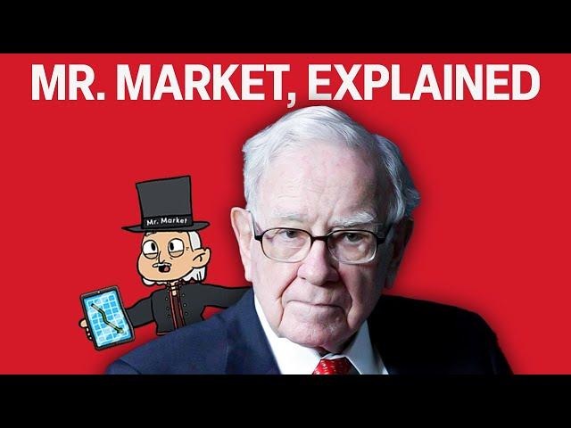

## Table of Contents

## What is the concept of Mr. Market?

Mr. Market is a concept created by Benjamin Graham, a famous investor and teacher. He used it to explain how the stock market works. Imagine Mr. Market as a business partner who comes to you every day with a price at which he is willing to either buy your share of the business or sell you his share. The important thing is that Mr. Market's prices can be very emotional and change a lot from day to day. Sometimes he is very optimistic and offers high prices, and other times he is very pessimistic and offers low prices.

The key lesson from Mr. Market is that you don't have to follow his mood swings. You can choose to buy from him when his prices are low and sell to him when his prices are high. This way, you can take advantage of his emotional behavior. The main idea is to focus on the real value of the business, not on Mr. Market's daily price changes. By doing this, you can make better investment decisions and not get caught up in the ups and downs of the market.

## Who created the metaphor of Mr. Market?

The metaphor of Mr. Market was created by Benjamin Graham. He was a famous investor and teacher who wanted to explain how the stock market works in a simple way.

Graham used Mr. Market to show that the stock market can be emotional. Mr. Market is like a business partner who offers to buy or sell shares every day. His prices can change a lot because of his feelings. Sometimes he is happy and offers high prices, and other times he is sad and offers low prices. The lesson is that you don't have to follow Mr. Market's emotions. You can choose to buy when his prices are low and sell when they are high. This way, you focus on the real value of the business, not on the daily ups and downs of the market.

## How does the 75th anniversary relate to Mr. Market?

The 75th anniversary relates to Mr. Market because it marks 75 years since Benjamin Graham first introduced the concept in his book "The Intelligent Investor," which was published in 1949. This book is very important in the world of investing because it teaches people how to make smart choices with their money. The idea of Mr. Market helps people understand that the stock market can be emotional and that it's better to focus on the real value of a business instead of daily price changes.

Celebrating the 75th anniversary of "The Intelligent Investor" reminds us how timeless and useful the Mr. Market concept is. Even though the book was written a long time ago, the lessons it teaches are still important today. Investors still use the idea of Mr. Market to stay calm and make good decisions, no matter how the market is behaving. This anniversary shows that Benjamin Graham's teachings continue to help people navigate the ups and downs of the stock market.

## What are the key lessons from the Mr. Market metaphor?

The key lesson from the Mr. Market metaphor is that the stock market can be very emotional. Mr. Market is like a business partner who comes to you every day with a price to buy or sell shares. His prices can change a lot because of his feelings. Sometimes he is happy and offers high prices, and other times he is sad and offers low prices. The important thing to remember is that you don't have to follow Mr. Market's emotions. You can choose to buy from him when his prices are low and sell to him when his prices are high. This way, you can take advantage of his mood swings.

Another important lesson is to focus on the real value of the business, not on Mr. Market's daily price changes. The value of a business doesn't change as much as Mr. Market's prices do. By understanding the true worth of a company, you can make better investment decisions. Instead of getting caught up in the ups and downs of the market, you can stay calm and think about the long-term value of your investments. This approach helps you avoid making decisions based on short-term emotions and instead focus on what really matters for your financial future.

## How can beginners apply the Mr. Market concept to their investment strategy?

Beginners can apply the Mr. Market concept to their investment strategy by understanding that the stock market can be very emotional. Imagine Mr. Market as a friend who comes to you every day with a price to buy or sell shares. Sometimes he is happy and offers high prices, and other times he is sad and offers low prices. As a beginner, you don't have to follow Mr. Market's mood swings. When he is feeling down and offers low prices, you can buy shares because they are a good deal. When he is feeling happy and offers high prices, you can sell shares if you think they are too expensive. This way, you can take advantage of his emotions and make better choices.

Another way beginners can use the Mr. Market concept is by focusing on the real value of a business, not just the daily price changes. The true worth of a company doesn't change as much as Mr. Market's prices do. As a beginner, you should learn about the companies you want to invest in. Look at their earnings, their products, and how they are doing in the market. By understanding the real value of a business, you can make smarter decisions about when to buy or sell shares. This approach helps you avoid getting caught up in the ups and downs of the market and instead think about the long-term value of your investments.

## What insights did Warren Buffett share about Mr. Market?

Warren Buffett, a famous investor who learned a lot from Benjamin Graham, often talks about Mr. Market. He says that Mr. Market is like a friend who comes to you every day with a price to buy or sell shares. Sometimes Mr. Market is happy and offers high prices, and other times he is sad and offers low prices. Buffett teaches that you don't have to follow Mr. Market's feelings. When Mr. Market is feeling down and offers low prices, you can buy shares because they are a good deal. When he is happy and offers high prices, you can sell shares if you think they are too expensive. This way, you can take advantage of Mr. Market's mood swings.

Buffett also says that it's important to focus on the real value of a business, not just the daily price changes. The true worth of a company doesn't change as much as Mr. Market's prices do. By understanding the real value of a business, you can make smarter decisions about when to buy or sell shares. Buffett learned this lesson from Graham and uses it to stay calm and think about the long-term value of his investments. He believes that by not getting caught up in the ups and downs of the market, you can make better choices and build wealth over time.

## How has the interpretation of Mr. Market evolved over the years?

When Benjamin Graham first introduced the idea of Mr. Market in 1949, it was a new way to think about the stock market. He used it to teach people that the market can be very emotional. Mr. Market was like a friend who came to you every day with a price to buy or sell shares. Sometimes he was happy and offered high prices, and other times he was sad and offered low prices. Graham's lesson was that you don't have to follow Mr. Market's feelings. You can buy when his prices are low and sell when they are high. This way, you focus on the real value of a business, not just the daily ups and downs of the market.

Over the years, the way people understand Mr. Market has changed a bit. More investors, like Warren Buffett, have used the idea to stay calm and make smart choices. They learned that it's important to look at the long-term value of a company, not just the short-term price changes. Today, people still use Mr. Market to remind themselves not to get caught up in the emotions of the market. They know that by focusing on the true worth of a business, they can make better decisions and build wealth over time. Even though the stock market has changed a lot since 1949, the basic lesson of Mr. Market is still very useful.

## Can you explain the psychological aspects of Mr. Market that investors should be aware of?

Mr. Market is a way to understand how emotions can affect the stock market. Imagine Mr. Market as a friend who comes to you every day with a price to buy or sell shares. Sometimes he is happy and offers high prices, and other times he is sad and offers low prices. This shows how the market can be influenced by feelings. When investors see the market going up, they can get excited and want to buy more, even if the prices are too high. When the market goes down, they can get scared and want to sell, even if the prices are too low. This emotional behavior can lead to bad decisions if investors don't stay calm and think about the real value of the business.

To use Mr. Market wisely, investors need to be aware of their own emotions. It's easy to get caught up in the excitement or fear of the market. But the key is to stay focused on the long-term value of a company. If you understand that the true worth of a business doesn't change as much as the market's daily prices, you can make better choices. By not following Mr. Market's mood swings, you can buy when prices are low and sell when they are high. This way, you can take advantage of the market's emotions and build wealth over time.

## What are some common misconceptions about Mr. Market?

One common misconception about Mr. Market is that you should always follow his prices. Some people think that if the market is going up, they should buy more shares, and if it's going down, they should sell everything. But this is not what Mr. Market teaches. The lesson is that you don't have to follow the market's emotions. You can choose to buy when Mr. Market is sad and offers low prices, and sell when he is happy and offers high prices. By doing this, you focus on the real value of the business, not just the daily ups and downs of the market.

Another misconception is that Mr. Market's prices always reflect the true value of a company. People sometimes think that if the market says a stock is worth a certain amount, then that must be its real value. But Mr. Market's prices can be very emotional and change a lot from day to day. The true worth of a business doesn't change as much as the market's prices do. By understanding the real value of a company, you can make better decisions about when to buy or sell shares. This way, you can avoid getting caught up in the market's short-term emotions and focus on the long-term value of your investments.

## How do expert investors use the Mr. Market metaphor to gain an advantage in the market?

Expert investors use the Mr. Market metaphor to stay calm and make smart choices. They know that the stock market can be very emotional, like a friend who comes to you every day with a price to buy or sell shares. Sometimes this friend is happy and offers high prices, and other times he is sad and offers low prices. Expert investors don't follow these mood swings. When the market is feeling down and offers low prices, they buy shares because they are a good deal. When the market is happy and offers high prices, they might sell shares if they think they are too expensive. This way, they can take advantage of the market's emotions and make better decisions.

Another way expert investors use the Mr. Market metaphor is by focusing on the real value of a business, not just the daily price changes. They understand that the true worth of a company doesn't change as much as the market's prices do. By learning about the companies they want to invest in, looking at their earnings, products, and how they are doing in the market, expert investors can make smarter choices. They avoid getting caught up in the ups and downs of the market and instead think about the long-term value of their investments. This approach helps them build wealth over time by not making decisions based on short-term emotions.

## What are the criticisms of the Mr. Market concept and how does it hold up against them?

Some people say that the Mr. Market concept is too simple. They think it doesn't explain everything about how the stock market works. They believe that the market is more complicated than just being influenced by emotions. They also say that it's hard to know the real value of a business, so it's not easy to decide when to buy or sell shares based on Mr. Market's prices. These critics think that the metaphor might make investing seem easier than it really is.

Even though there are criticisms, the Mr. Market concept still helps a lot of investors. It reminds them that the market can be emotional and that it's important to stay calm. By not following the market's ups and downs, investors can focus on the long-term value of a business. This approach has worked well for many people, including famous investors like Warren Buffett. The idea of Mr. Market might be simple, but it teaches a valuable lesson about not getting caught up in short-term emotions and instead thinking about the real worth of a company.

## How can the principles of Mr. Market be integrated into modern portfolio management strategies?

The principles of Mr. Market can be integrated into modern portfolio management strategies by helping investors stay calm and focus on the long-term value of their investments. Imagine Mr. Market as a friend who comes to you every day with a price to buy or sell shares. Sometimes he is happy and offers high prices, and other times he is sad and offers low prices. Instead of following these mood swings, investors can use this metaphor to buy shares when the market is feeling down and prices are low, and sell when the market is happy and prices are high. This approach helps investors take advantage of the market's emotions and make better decisions about when to buy or sell.

Another way to integrate Mr. Market into modern portfolio management is by focusing on the real value of the businesses in the portfolio, not just the daily price changes. The true worth of a company doesn't change as much as the market's prices do. By understanding the earnings, products, and overall performance of the companies they invest in, investors can make smarter choices. This helps them avoid getting caught up in the short-term ups and downs of the market and instead think about the long-term value of their investments. By using the Mr. Market concept, investors can build a more stable and successful portfolio over time.

## References & Further Reading

[1]: Graham, B. (2006). ["The Intelligent Investor: The Definitive Book on Value Investing."](https://www.amazon.com/Intelligent-Investor-Definitive-Investing-Essentials/dp/0060555661) Harper Business.

[2]: Hagstrom, R. G. (2013). ["The Warren Buffett Way."](https://www.wiley.com/en-us/The+Warren+Buffett+Way%2C+3rd+Edition-p-9781118503256) Wiley.

[3]: Kahneman, D. (2011). ["Thinking, Fast and Slow."](https://link.springer.com/article/10.1007/s00362-013-0533-y) Farrar, Straus and Giroux.

[4]: Easley, D., & Kleinberg, J. (2010). ["Networks, Crowds, and Markets: Reasoning About a Highly Connected World."](https://www.cs.cornell.edu/home/kleinber/networks-book/) Cambridge University Press.

[5]: Chan, E. (2009). ["Quantitative Trading: How to Build Your Own Algorithmic Trading Business."](https://github.com/ftvision/quant_trading_echan_book) Wiley.

[6]: Simons, J. (2019). ["The Man Who Solved the Market: How Jim Simons Launched the Quant Revolution."](https://www.amazon.com/Man-Who-Solved-Market-Revolution/dp/073521798X) Dutton.