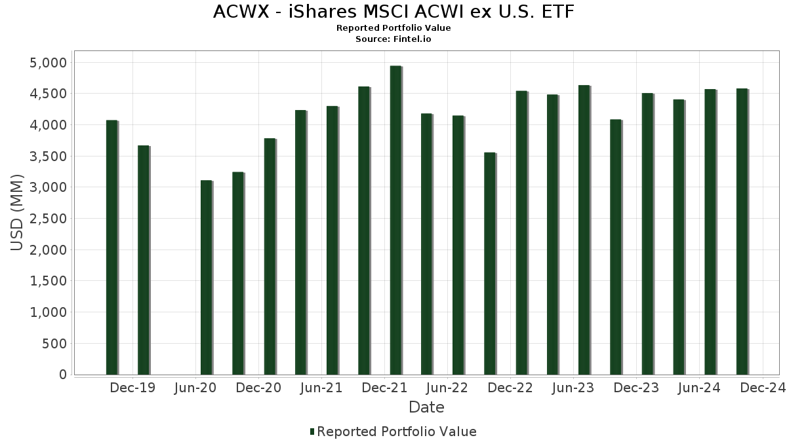

## Table of Contents

## What is the MSCI ACWI Ex-U.S. index?

The MSCI ACWI Ex-U.S. index is a stock market index that tracks the performance of companies from around the world, but it does not include companies from the United States. It covers about 85% of the total market value of stocks in countries outside the U.S., including both developed and emerging markets. This index helps investors see how well companies in other parts of the world are doing without the influence of the U.S. market.

Investors use the MSCI ACWI Ex-U.S. index to diversify their investments. By focusing on companies outside the U.S., they can spread their risk and potentially benefit from growth in other countries. This index is often used as a benchmark to compare the performance of international investment funds and portfolios.

## Why was the MSCI ACWI Ex-U.S. index created?

The MSCI ACWI Ex-U.S. index was created to give investors a way to look at how companies outside the United States are doing. Before this index, it was hard for investors to see the performance of international markets without including the U.S. market. By leaving out U.S. companies, the index helps investors understand the growth and risks in other parts of the world more clearly.

Investors also use this index to spread their investments across different countries. This can help reduce the risk that comes from focusing too much on one market, like the U.S. The MSCI ACWI Ex-U.S. index makes it easier for investors to diversify their portfolios and possibly benefit from growth in other countries. It's a useful tool for anyone looking to invest internationally.

## Which countries and regions are included in the MSCI ACWI Ex-U.S. index?

The MSCI ACWI Ex-U.S. index includes countries from all over the world, except the United States. It covers both developed and emerging markets. Some of the developed markets in the index are countries like Japan, the United Kingdom, Germany, France, and Canada. These countries have strong economies and well-established stock markets.

Emerging markets in the index include places like China, India, Brazil, and South Korea. These countries are growing quickly but might have more risks than developed markets. The index also includes other regions like Europe, Asia, Latin America, and the Middle East, making sure it represents a wide range of countries and economies.

By including so many different countries and regions, the MSCI ACWI Ex-U.S. index gives a good picture of how companies are doing around the world, outside of the U.S. This helps investors see where they might want to put their money to spread their risk and possibly find new opportunities for growth.

## How does the MSCI ACWI Ex-U.S. differ from the MSCI ACWI?

The MSCI ACWI Ex-U.S. and the MSCI ACWI are both stock market indexes created by MSCI, but they cover different parts of the world. The MSCI ACWI, which stands for All Country World Index, includes companies from all around the world, including the United States. This means it gives a complete picture of how companies are doing everywhere. On the other hand, the MSCI ACWI Ex-U.S. leaves out companies from the United States. It focuses only on companies from other countries, both in developed and emerging markets.

The main reason for having these two different indexes is to help investors in different ways. If someone wants to see how the whole world's stock markets are doing, including the U.S., they would use the MSCI ACWI. But if an investor wants to focus on markets outside the U.S. and see how those are doing without the influence of the U.S. market, they would use the MSCI ACWI Ex-U.S. This helps investors spread their money across different countries and reduce risks by not putting all their eggs in one basket, especially if that basket is the U.S. market.

## What types of securities are included in the MSCI ACWI Ex-U.S. index?

The MSCI ACWI Ex-U.S. index includes common stocks of companies from countries all over the world, except the United States. These stocks represent companies in both developed and emerging markets. Developed markets include countries like Japan, the United Kingdom, and Germany, while emerging markets include countries like China, India, and Brazil. The index covers about 85% of the total market value of stocks in these countries.

The index focuses on large and mid-sized companies. This means it includes stocks from big companies that are well-known and smaller companies that are still growing. By including different sizes of companies, the index gives a good overall picture of how companies outside the U.S. are doing. This helps investors see where they might want to invest to spread their risk and find new opportunities for growth.

## How is the MSCI ACWI Ex-U.S. index calculated?

The MSCI ACWI Ex-U.S. index is calculated by looking at the prices of stocks from companies in countries all over the world, except the United States. It includes stocks from big companies and smaller ones too, making sure to cover about 85% of the total value of stocks in these countries. Each stock's impact on the index depends on how big the company is. Bigger companies have a bigger effect on the index's value.

To figure out the index's value, MSCI uses a method called market capitalization weighting. This means that companies with a higher total value have more influence on the index. If a big company's stock price goes up or down, it will change the index more than if a smaller company's stock price changes. MSCI also makes sure to update the index regularly to keep it accurate, by adding new companies and taking out others that no longer fit the rules.

## What are the criteria for a company to be included in the MSCI ACWI Ex-U.S. index?

For a company to be included in the MSCI ACWI Ex-U.S. index, it must meet certain rules. The company must be from a country outside the United States, and it must be part of either a developed or an emerging market. The company also needs to have a certain size, measured by its market value, which means how much all its stocks are worth together. MSCI looks at this value to decide if the company is big enough to be in the index.

Another important rule is that the company's stocks must be easy to buy and sell. This means there should be enough trading of the company's stocks in the market. MSCI also checks if the company follows the rules of its home country and if it reports its financial information regularly. By meeting these criteria, a company can be added to the MSCI ACWI Ex-U.S. index, helping investors see how companies outside the U.S. are doing.

## How often is the MSCI ACWI Ex-U.S. index rebalanced and reconstituted?

The MSCI ACWI Ex-U.S. index is rebalanced and reconstituted twice a year, in May and November. Rebalancing means adjusting the weights of the companies in the index to make sure bigger companies still have a bigger impact on the index's value. Reconstitution means checking which companies should be added or removed from the index based on the rules.

During these times, MSCI looks at all the companies in the index to see if they still meet the criteria. They add new companies that fit the rules and take out companies that no longer do. This helps keep the index accurate and up-to-date, giving investors a good picture of how companies outside the U.S. are doing.

## What are the benefits of investing in the MSCI ACWI Ex-U.S. index?

Investing in the MSCI ACWI Ex-U.S. index can help you spread your money across many different countries and companies. This is called diversification. By focusing on companies outside the U.S., you can lower the risk that comes from putting all your money in one place. If the U.S. market goes down, your investments in other countries might still do well. This can help protect your money and possibly make it grow.

Another benefit is that you can take advantage of growth in other parts of the world. Some countries might be growing faster than the U.S., and by investing in the MSCI ACWI Ex-U.S. index, you can be part of that growth. It's a good way to see how companies in places like Japan, China, and Europe are doing. This can open up new opportunities for your investments and help you find new places where your money can grow.

## How does the performance of the MSCI ACWI Ex-U.S. index compare to other global indices?

The MSCI ACWI Ex-U.S. index focuses on companies outside the United States, so its performance can be different from other global indices that include U.S. companies. For example, the MSCI ACWI, which includes U.S. companies, might do better if the U.S. market is strong. But if the U.S. market is not doing well, the MSCI ACWI Ex-U.S. index might perform better because it's not affected by the U.S. market's ups and downs.

Compared to other indices like the MSCI EAFE, which focuses on developed markets in Europe, Australasia, and the Far East, the MSCI ACWI Ex-U.S. index includes both developed and emerging markets. This means it can capture growth from fast-growing countries like China and India, which the MSCI EAFE does not. Over time, the performance of the MSCI ACWI Ex-U.S. index can be influenced by how well companies in these emerging markets are doing, making it different from indices that only look at developed markets.

## What are the risks associated with investing in the MSCI ACWI Ex-U.S. index?

Investing in the MSCI ACWI Ex-U.S. index comes with some risks. One big risk is that the markets outside the U.S. might not do as well as the U.S. market. If the U.S. market is doing great, but other countries are not, your investments in the MSCI ACWI Ex-U.S. index might not grow as much. Also, some countries in the index might have more ups and downs than the U.S. market. This can make your investments more risky because the value of your money can go up and down a lot.

Another risk is that changes in currency values can affect your investments. When you invest in companies from other countries, you're also investing in their money, or currency. If the value of that currency goes down compared to the U.S. dollar, your investment might be worth less when you convert it back to dollars. Also, different countries have different rules and risks. Some might have more political problems or economic issues that can hurt the companies in the index. This means you need to be ready for unexpected changes that can affect your money.

## How can investors gain exposure to the MSCI ACWI Ex-U.S. index?

Investors can gain exposure to the MSCI ACWI Ex-U.S. index by buying exchange-traded funds (ETFs) or mutual funds that track this index. These funds are designed to mimic the performance of the index, so when you invest in them, your money goes into a little bit of all the companies in the index. This way, you can easily spread your money across many countries and companies outside the U.S. without having to buy each stock yourself.

Another way to get exposure is through financial products like index funds or index-based investment vehicles. These products also follow the MSCI ACWI Ex-U.S. index and can be a good choice if you want to invest in a way that's easy to manage. By choosing these options, you can benefit from the growth of companies in other parts of the world and diversify your investments to reduce risk.

## References & Further Reading

[1]: ["MSCI ACWI Index"](https://www.msci.com/indexes/index/892400) - MSCI

[2]: ["Advances in Financial Machine Learning"](https://www.amazon.com/Advances-Financial-Machine-Learning-Marcos/dp/1119482089) by Marcos Lopez de Prado

[3]: ["Machine Learning for Algorithmic Trading"](https://github.com/stefan-jansen/machine-learning-for-trading) by Stefan Jansen

[4]: Black, F., & Litterman, R. (1992). ["Global Portfolio Optimization"](https://people.duke.edu/~charvey/Teaching/BA453_2006/Black_Litterman_Global_Portfolio_Optimization_1992.pdf). Financial Analysts Journal, 48(5), 28-43.

[5]: ["Guide to Market Benchmark Indices"](https://www.markets.com/education-centre/benchmark-indices/) - CFA Institute