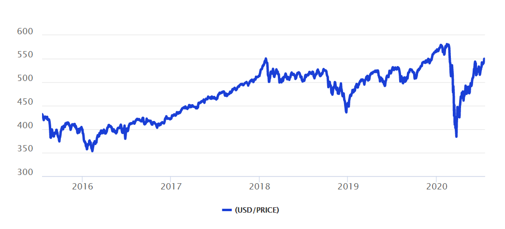

## Table of Contents

## What is the MSCI All Country World Index (ACWI)?

The MSCI All Country World Index (ACWI) is a stock market index created by MSCI Inc. It includes stocks from both developed and emerging markets around the world. This means it covers a wide range of countries and companies, giving a good picture of how the global stock market is doing. The index is used by investors to see how well their investments are doing compared to the world market, and it can also be used as a benchmark for investment funds.

The ACWI includes over 2,900 companies from 47 different countries. It is divided into two main parts: the MSCI World Index, which covers developed markets, and the MSCI Emerging Markets Index, which covers emerging markets. By including both types of markets, the ACWI provides a comprehensive view of the global equity market. This makes it a useful tool for investors who want to understand and invest in the world economy.

## Who created the MSCI ACWI and when was it launched?

The MSCI ACWI was created by MSCI Inc., a company that makes indexes and other tools for investors. MSCI stands for Morgan Stanley Capital International, but it became a separate company in 2009. The ACWI is one of their most important indexes because it covers so many countries and companies around the world.

The MSCI ACWI was launched in 1988. This was a big step because it was one of the first indexes to include both developed and emerging markets. By doing this, it gave investors a way to see how the whole world's stock market was doing, not just parts of it.

## What is the purpose of the MSCI ACWI?

The MSCI ACWI helps investors understand how the world's stock markets are doing. It includes stocks from many different countries, both rich and growing economies. This way, it gives a full picture of the global market. Investors use it to see if their own investments are doing well compared to the whole world.

The index is also used by big investment funds. They can compare their performance to the ACWI to see if they are doing better or worse than the world market. This helps them make decisions about where to put their money. The ACWI is important because it shows how the global economy is doing, all in one number.

## How is the MSCI ACWI constructed?

The MSCI ACWI is made up of over 2,900 companies from 47 countries. It includes stocks from both developed countries like the United States and Japan, and emerging markets like China and Brazil. To be included in the index, a company must meet certain rules set by MSCI. These rules look at things like how big the company is and how easy it is to buy and sell its stock. The index is divided into two parts: the MSCI World Index for developed markets and the MSCI Emerging Markets Index for growing economies.

The way the MSCI ACWI is put together is meant to show a fair picture of the world's stock markets. Each company in the index is given a weight, which is how much it affects the overall index. Bigger companies have a bigger weight, so they have more impact on the index's performance. The weights are updated every quarter to make sure the index stays up to date with changes in the market. This way, the MSCI ACWI gives investors a good idea of how the global economy is doing.

## Which countries and markets are included in the MSCI ACWI?

The MSCI ACWI includes stocks from 47 countries around the world. It covers both developed markets and emerging markets. Developed markets in the index include countries like the United States, Japan, the United Kingdom, and Germany. These are countries with strong economies and well-established stock markets. Emerging markets in the index include countries like China, India, Brazil, and South Africa. These countries are growing quickly but their markets can be riskier.

The index is split into two main parts: the MSCI World Index and the MSCI Emerging Markets Index. The MSCI World Index includes stocks from developed markets, giving investors a view of how these stable economies are doing. The MSCI Emerging Markets Index includes stocks from emerging markets, showing how these growing economies are performing. Together, these two parts make up the MSCI ACWI, giving a full picture of the global stock market.

## What are the criteria for a company to be included in the MSCI ACWI?

To be included in the MSCI ACWI, a company must meet certain rules set by MSCI. One important rule is that the company must be big enough. MSCI looks at the total value of the company's stock to see if it is big enough to be in the index. Another rule is that the company's stock must be easy to buy and sell. This means there should be enough people buying and selling the stock so that it is not hard to trade.

The company also needs to be in a country that MSCI includes in the ACWI. This means the country must be either a developed market or an emerging market that MSCI tracks. Once a company meets these rules, it can be added to the index. MSCI checks these rules every quarter to make sure the companies in the ACWI still meet them. This helps keep the index up to date with changes in the market.

## How does the MSCI ACWI differ from other global indices?

The MSCI ACWI is different from other global indices because it includes stocks from both developed and emerging markets. Many other indices focus only on one type of market, like the S&P 500 which looks at big companies in the U.S., or the FTSE 100 which looks at big companies in the U.K. The MSCI ACWI gives a full picture of the world's stock markets by including over 2,900 companies from 47 countries. This makes it a good choice for investors who want to understand how the whole world's economy is doing.

Another way the MSCI ACWI is different is how it picks and weighs companies. MSCI has strict rules about which companies can be in the index, like how big they are and how easy it is to buy and sell their stock. The weight of each company in the index depends on its size, so bigger companies have a bigger impact on the index's performance. This is different from some other indices that might use different rules for [picking](/wiki/asset-class-picking) companies or weighing them. The MSCI ACWI is also updated every quarter to make sure it stays current with changes in the market, which is not always the case with other indices.

## What are the performance metrics of the MSCI ACWI over different time periods?

The MSCI ACWI has shown different performance over various time periods. Over the last 10 years, it has had an average annual return of about 9%. This means if you had invested in the index 10 years ago, your money would have grown by about 9% each year on average. Over shorter periods like 5 years, the average annual return has been around 10%. This shows that the index has done well over these time frames, but returns can change from year to year.

Looking at longer periods, the MSCI ACWI has had an average annual return of about 7% over the last 20 years. This shows that over a longer time, the growth rate is a bit lower than in the last 10 years. The index can go up and down a lot in the short term, but over many years, it tends to grow. It's important to remember that past performance does not tell us what will happen in the future, but it can give us an idea of how the index has done over time.

## How is the MSCI ACWI used by investors and fund managers?

Investors and fund managers use the MSCI ACWI to see how well their investments are doing compared to the whole world's stock market. They look at the index to check if their own portfolio is doing better or worse than the global market. If their investments are doing better than the MSCI ACWI, they know they are making good choices. If their investments are doing worse, they might decide to change their strategy. The index helps them make these decisions by giving them a big picture of the world's stock markets.

Fund managers also use the MSCI ACWI as a benchmark for their funds. This means they compare their fund's performance to the index to see if they are meeting their goals. Many funds try to beat the MSCI ACWI by picking stocks that they think will do better than the average. Some funds even try to copy the MSCI ACWI by buying the same stocks in the same amounts. This way, they can offer investors a way to invest in the whole world's stock market all at once.

## What are the potential risks and limitations of using the MSCI ACWI as a benchmark?

Using the MSCI ACWI as a benchmark has some risks and limitations. One big risk is that the index includes stocks from many different countries, and some of these countries can be risky. For example, emerging markets like China or Brazil can have big ups and downs in their stock markets. If these markets do badly, it can pull down the whole MSCI ACWI, even if other parts of the world are doing well. Another risk is that the index is very big and spread out, so it might not match what an investor or fund manager is actually trying to do with their money. If someone is focused on just one part of the world, the MSCI ACWI might not be the best way to see how they are doing.

There are also some limitations to using the MSCI ACWI. One limitation is that the index is updated only every three months, so it might not always show the latest changes in the market. This can be a problem if the market changes a lot in between updates. Another limitation is that the MSCI ACWI is made up of big companies, so it might not show what is happening with smaller companies. This means that if smaller companies are doing well or badly, the index might not show it. Also, the index uses a certain way to pick and weigh companies, and this might not be the best fit for every investor or fund manager's goals.

## How does the MSCI ACWI adjust for currency fluctuations and market capitalization?

The MSCI ACWI takes care of currency changes by using a special way to figure out the value of stocks. When the value of one country's money goes up or down compared to another country's money, it can change how much a stock is worth. The MSCI ACWI uses something called a "currency conversion [factor](/wiki/factor-investing)" to make sure all the stocks are measured in the same money, usually the U.S. dollar. This way, if the value of a country's money changes, the index still gives a fair picture of how the stocks are doing around the world.

The MSCI ACWI also pays attention to how big each company is, which is called market capitalization. The index gives more weight to bigger companies, so they have a bigger effect on the overall index. For example, if a big company like Apple does well, it will pull the whole index up more than if a smaller company does well. MSCI checks the size of companies every three months and changes the weights in the index to make sure it stays up to date. This way, the MSCI ACWI shows a good picture of the world's stock markets based on how big the companies are.

## What advanced strategies can be employed using the MSCI ACWI for portfolio management?

One advanced strategy for using the MSCI ACWI in portfolio management is called "sector rotation." This means moving money around different parts of the economy based on what is doing well at the time. For example, if technology companies are doing better than others, an investor might put more money into tech stocks within the MSCI ACWI. By looking at how different sectors in the index are doing, investors can try to pick the ones that will do the best in the future. This can help them make more money, but it also means they need to keep a close eye on the market and be ready to change their investments.

Another strategy is "factor investing," which involves focusing on certain things about stocks, like how big they are or how much they grow. The MSCI ACWI can be broken down into different groups based on these factors. For example, an investor might choose to focus on stocks that have a lot of room to grow, even if they are smaller companies. By using the MSCI ACWI to find these stocks, investors can build a portfolio that matches their goals better. This can be a good way to try to beat the overall market, but it takes a lot of research and understanding of how these factors work.

A third strategy is "risk parity," which aims to balance the risk in a portfolio. Instead of just looking at how much money is in each stock, this strategy looks at how risky each stock is. The MSCI ACWI can help investors see which parts of the world's stock market are more or less risky. By using this information, investors can put their money into different stocks in a way that spreads out the risk evenly. This can help protect their money if one part of the market does badly, but it also means they need to think carefully about how much risk they are willing to take.

## References & Further Reading

[1]: Lopez de Prado, M. (2018). ["Advances in Financial Machine Learning"](https://www.amazon.com/Advances-Financial-Machine-Learning-Marcos/dp/1119482089). Wiley.

[2]: MSCI Inc. (2023). ["MSCI ACWI Index Fact Sheet."](https://www.msci.com/documents/10199/8d97d244-4685-4200-a24c-3e2942e3adeb)

[3]: Chan, E. P. (2009). ["Quantitative Trading: How to Build Your Own Algorithmic Trading Business"](https://github.com/ftvision/quant_trading_echan_book). Wiley.

[4]: Jansen, S. (2018). ["Machine Learning for Algorithmic Trading"](https://github.com/stefan-jansen/machine-learning-for-trading). Packt Publishing.

[5]: Aronson, D. R. (2006). ["Evidence-Based Technical Analysis: Applying the Scientific Method and Statistical Inference to Trading Signals"](https://www.amazon.com/Evidence-Based-Technical-Analysis-Scientific-Statistical/dp/0470008741). Wiley.

[6]: MSCI. (2020). ["The Importance of ESG Metrics in the Modern World - MSCI."](https://www.msci.com/ESG-Metrics)