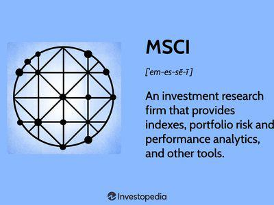

Global stock indices play a crucial role in the financial world by providing investors and financial professionals with a comprehensive overview of market performance across different regions and sectors. These indices serve as benchmarks for evaluating investment performances, guiding asset allocation, and offering insights into economic trends. Among the numerous stock indices, the MSCI All Country World Index (ACWI) stands out as a prominent benchmark. Covering both developed and emerging markets, the MSCI ACWI offers a broad representation of global equities, making it an essential tool for investors seeking exposure to international markets. Its widespread recognition and adoption stem from its ability to efficiently gauge the global equity market's health and trends, thereby supporting diversified investment strategies.

Algorithmic trading has emerged as a dominant force in modern financial markets. By utilizing computer algorithms to execute trades efficiently and effectively, it enhances trading precision and reduces latency. Algorithmic trading strategies often leverage global stock indices like the MSCI ACWI to automate investment decisions and optimize portfolio performance. The fusion of algorithmic trading with global indices signifies a shift towards more scientific and data-driven trading approaches.



This article aims to provide a comprehensive understanding of the MSCI ACWI and its role in the financial ecosystem. Readers will gain insights into how this index serves as a yardstick for global market performance and learn about the integration of algorithmic trading with stock indices to enhance trading outcomes. Additionally, the article will discuss the benefits, challenges, and future trends related to the synergy between MSCI ACWI and algorithmic trading, equipping readers with a well-rounded perspective on these critical aspects of contemporary investing.

## Table of Contents

## Understanding Global Stock Indices

Stock indices are statistical measures that represent the performance of a group of stocks. These indices serve as indicators of the overall health and trends within a financial market. Their primary purpose is to provide investors and policymakers a snapshot of market performance by tracking a selected portfolio of equities, which can often be used as benchmarks against which investors and funds can measure their own performance.

Global stock indices extend this concept by encompassing a wide range of economies and sectors, providing a more comprehensive view of the world's financial markets. Key examples include indices like the MSCI All Country World Index (ACWI), which aggregates data from both developed and emerging markets, offering a holistic picture of global market dynamics.

Investors rely on global stock indices to gauge the performance of international equities, diversify their investment portfolios, and manage risk. These indices allow investors to benchmark their portfolios against the overall market or specific regional segments, thus facilitating more informed investment decisions. They are essential tools in evaluating market sentiment, economic health, and potential investment opportunities across different regions.

The diversity and composition of global stock indices are critical for capturing a representative performance metric. They can vary significantly in terms of the number of constituent stocks, the countries covered, and the weight assigned to each component. For instance, some indices may focus on industry-specific stocks while others encompass a broader market. This diversity allows investors to tailor their assessments based on their strategic interests or target markets.

Indices such as MSCI ACWI are particularly important as they provide valuable insights into global market trends. By covering a multitude of countries and various market conditions, they offer a more diversified understanding of international finance than regional indices could alone. With its broad scope, the MSCI ACWI helps investors identify emerging market trends, review economic conditions across countries, and strategize international investment approaches.

In conclusion, global stock indices are indispensable in providing coherent market assessments. They help investors track performance and make strategic decisions by presenting aggregated data that reflects broader economic conditions. The MSCI ACWI, among other indices, plays a pivotal role in delivering critical market insights which are essential for navigating the complex terrain of global investing.

## Exploring the MSCI ACWI

The MSCI All Country World Index (ACWI) is a comprehensive global equity index that serves as a pivotal benchmark for understanding market performance across a broad spectrum of economies. As a product of MSCI Inc., the ACWI encompasses both developed and emerging market countries, providing a diversified view of global stock market trends. It aims to capture the essence of global economic activity by representing a large portion of the available market capitalization across its constituents.

### Methodology

The methodology of the MSCI ACWI is centered on creating a representative and investable portfolio that reflects the free float-adjusted market capitalization of the world's equity markets. It covers numerous countries and includes large and mid-cap stocks, helping investors achieve broad market exposure. The index is constructed and maintained using a rules-based approach, with periodic rebalancing to ensure that it accurately reflects the dynamics of the included markets.

The construction involves several key steps:
1. **Country Classification**: Markets are classified as either developed or emerging based on considerations such as economic development, market accessibility, and the size and liquidity of market securities.
2. **Security Selection**: Eligible securities from these markets are selected based on market capitalization, liquidity, and free-float criteria. Only those stocks that are available to international investors without significant restrictions are considered.
3. **Weighting**: The index is weighted by free float-adjusted market capitalization, which means that companies with a larger market cap have a more significant impact on the index's performance.

### Criteria for Country Inclusion

For a country to be included in the MSCI ACWI, it must meet specific criteria related to economic development, market size, and openness to foreign investors. The MSCI Market Classification Framework assesses factors such as:
- **Accessibility**: The degree to which foreign investors can buy and sell securities in that market.
- **Operational Efficiency**: How efficiently securities trades can be executed.
- **Regulatory Environment**: The transparency and governance of market regulators.
- **Macroeconomic Stability**: The country's economic stability and its currency environment.

These criteria ensure that the inclusion of a country in the ACWI reflects its readiness and suitability for international investment.

### Role and Impact in Investment Portfolios

The MSCI ACWI plays a crucial role in investment portfolios by offering a reliable benchmark for global market performance. Its comprehensive coverage allows portfolio managers to gauge the relative performance of their investments against a broad global standard. Additionally, the diversification across various international equity markets reduces portfolio risk by spreading exposure across multiple geographic regions and economic sectors.

Investors use the MSCI ACWI as a strategic tool to align their portfolio allocations with global economic projections and to mitigate risks associated with over-reliance on any single market. By reflecting over 85% of the global market capitalization, the MSCI ACWI provides insights into prevailing global economic trends, making it a vital component for strategic asset allocation and risk management within diversified investment portfolios.

In conclusion, the MSCI ACWI embodies a crucial intersection of global market representation and accessibility, serving both institutional and individual investors in constructing globally-geared investment strategies.

## Country Constituents of MSCI ACWI

The MSCI All Country World Index (ACWI) is a prominent benchmark capturing global equity market performance, encompassing both developed and emerging markets. The index includes a diverse range of countries, reflecting the interconnected nature of modern economies.

### Key Countries in MSCI ACWI

The MSCI ACWI comprises large and mid-cap representation across 23 developed markets and 24 emerging markets. Some of the major countries included from developed markets are the United States, Japan, the United Kingdom, Germany, and Canada. From the emerging markets, China, India, South Korea, Brazil, and South Africa are prominently represented.

### Market Weight of Countries

The United States typically holds the largest weight in the MSCI ACWI, often exceeding 50% due to the substantial market capitalization of U.S. equities like Apple, Microsoft, and Amazon. Other significant contributors from developed markets include Japan and the United Kingdom. For emerging markets, China often carries the most substantial weight, attributed to its rapid economic growth and the size of companies like Alibaba and Tencent within the global market.

### Impact on Global Investment Strategies

The composition of the MSCI ACWI serves as a guideline for global investment strategies. Investors often allocate assets based on the index's country weights to mirror global market sentiment. A heavier weight in U.S. equities would suggest a bullish approach toward American markets. Meanwhile, significant positions in emerging markets may indicate a high-risk, high-reward strategy capitalizing on growth opportunities in developing economies.

These allocations affect portfolio diversification, risk management, and capital allocation decisions. By mirroring the MSCI ACWI, investors gain exposure to a broad spectrum of market conditions and economic developments, enhancing potential returns while mitigating risks through diversification.

### Recent Changes and Implications

Changes in the country constituents of the MSCI ACWI can substantially impact global investment strategies. For example, economic reforms or geopolitical shifts can alter a country's weight within the index. Recently, there has been consideration of increased representation for Chinese A-shares, reflecting the country's expanding role in the global economy. Such adjustments can lead portfolio managers to rebalance their investments to maintain alignment with the index, impacting capital flows and market dynamics.

These adaptations require investors to remain vigilant about shifts in international markets. An increase or decrease in the weight of a particular country within the MSCI ACWI often prompts strategic realignments to leverage potential opportunities or mitigate rising risks associated with geopolitical or economic changes.

In summary, the MSCI ACWI's structure mirrors global economic health and trends, offering investors a roadmap for global equity exposure. Constant monitoring and adaptation are essential as countries' economic standings evolve, necessitating informed investment decisions aligned with the index's dynamic composition.

## Algorithmic Trading and Global Indices

Algorithmic trading, commonly known as algo trading, refers to the use of computer algorithms to execute trading orders with speed and efficiency that is beyond the capabilities of human traders. These algorithms can execute pre-defined trading strategies based on parameters such as timing, price, and [volume](/wiki/volume-trading-strategy). The rise of [algorithmic trading](/wiki/algorithmic-trading) has significantly transformed financial markets by increasing the volume of trades, enhancing [liquidity](/wiki/liquidity-risk-premium), and reducing transaction costs.

Global stock indices, like the MSCI All Country World Index (ACWI), play a pivotal role in algorithmic trading strategies. The MSCI ACWI, with its broad coverage of both developed and emerging markets, provides a comprehensive benchmark for evaluating global equity market performance. Algo trading strategies frequently utilize such indices due to their ability to offer a cohesive view of market trends and investment opportunities across diverse geographies. For instance, algorithms can be programmed to analyze the movements of the MSCI ACWI to identify potential investment trends or market anomalies, enabling traders to make informed decisions on a global scale.

The use of algo trading with global indices such as the MSCI ACWI presents several advantages for investors. First, it allows for the execution of trades at the optimal time by continuously analyzing market conditions, which is particularly beneficial given the dynamic nature of global markets. This capability reduces the risk of human error and maximizes the chances of profitability.

Furthermore, algorithmic trading can process vast amounts of data at high speeds, identifying small but profitable trading opportunities that would be impractical to spot manually. For example, high-frequency trading ([HFT](/wiki/high-frequency-trading-strategies)), a subset of algo trading, can capitalize on minute price discrepancies in milliseconds, a feat impossible for human traders. Moreover, algo trading standardizes trading processes, ensuring consistency and discipline in executing strategies without emotional bias.

However, there are challenges and risks associated with algorithmic trading in the context of global indices. While liquidity has generally improved, there are instances where algos can contribute to market [volatility](/wiki/volatility-trading-strategies), particularly during periods of high uncertainty or stress (e.g., the 2010 Flash Crash). Additionally, the reliance on technology and data can expose traders to significant risks, such as technical failures, data inaccuracies, or cyber-attacks.

Another notable risk is the potential for algorithms to exacerbate systemic risks. The interconnected nature of global markets means that an error in an algorithm or mispricing in an index can have widespread implications, affecting market stability. Consequently, regulatory oversight plays a crucial role in monitoring and establishing guidelines for the use of algorithmic trading, ensuring that market integrity is preserved.

In summary, while algorithmic trading offers substantial benefits in terms of efficiency and market analysis through global indices like the MSCI ACWI, it is not without its challenges. Investors must remain diligent in managing these risks, ensuring that robust technological infrastructure and risk management strategies are in place to safeguard against inherent system vulnerabilities.

## Benefits of Combining MSCI ACWI with Algorithmic Trading

Aligning algorithmic trading strategies with the MSCI All Country World Index (ACWI) can provide several benefits to traders and investors. The MSCI ACWI, as a comprehensive stock index representing both developed and emerging markets, offers a robust benchmark for algorithmic trading. By leveraging this index, traders can enjoy increased accuracy and efficiency in executing trades.

Algorithmic trading leverages computer algorithms to automate trading decisions based on pre-set criteria, enhancing precision in trade execution. When combined with the MSCI ACWI, algorithmic strategies can exploit the index's diverse composition to optimize trade selections and manage risks more effectively. The depth and breadth of the MSCI ACWI ensure that trading systems are informed by a global perspective, reducing the potential for over-concentration in specific markets or sectors.

Common strategies used with MSCI ACWI in algorithmic trading include trend-following, mean-reversion, and statistical [arbitrage](/wiki/arbitrage). These strategies can be tailored to exploit the broad market trends and fluctuations captured by the ACWI. For example, a [momentum](/wiki/momentum)-based algorithm might buy stocks in regions where indices show upward trends and sell in regions where indices are declining. Similarly, arbitrage strategies could benefit from price discrepancies across various components of the ACWI, taking advantage of the index's broad geographic representation.

There are notable market scenarios demonstrating the synergy between MSCI ACWI and algorithmic trading. For instance, during periods of market volatility, algorithmic systems grounded in global indices like the ACWI can swiftly adjust portfolios to hedge against potential downturns or capitalize on emerging growth areas. This agility is particularly advantageous for institutional investors managing large, diversified portfolios.

An illustrative case is the use of [machine learning](/wiki/machine-learning) algorithms that have been trained on MSCI ACWI data to detect patterns and predict future movements. Such systems can dynamically update trading signals based on the continuous flow of global financial data, enhancing decision-making and potentially improving returns.

Overall, aligning algorithmic trading with MSCI ACWI allows investors to harness the comprehensive insights provided by this global index, improving trade execution accuracy, capitalizing on global market opportunities, and better managing investment risks.

## Challenges and Considerations

Using algorithmic trading with the MSCI All Country World Index (ACWI) presents various challenges and considerations for investors and traders. These challenges primarily revolve around strategy management, technological infrastructure, and risk management.

One of the core challenges is the need for continuous monitoring and adjustment of trading strategies in response to global market changes. The MSCI ACWI, being a comprehensive index that includes both developed and emerging markets, can be subject to significant fluctuations due to political, economic, and environmental events across different regions. To maintain effective algorithmic trading strategies, it is crucial to have dynamic models that can adapt to these changes. This involves using real-time data analysis to detect market shifts and recalibrate algorithms accordingly. For example, a Python-based solution might involve leveraging libraries such as Pandas and NumPy to process market data and adjust portfolio allocations based on volatility indices.

Technological infrastructure plays a pivotal role in successful algorithmic trading. High-frequency trading, which is a subset of algorithmic trading, demands fast and reliable systems to execute trades within fractions of a second. The necessity for low latency and high processing power means robust computer systems and efficient network setups are imperative. Implementing parallel processing and optimized algorithms can minimize delays and improve execution quality. As such, upgrading hardware and software infrastructure can provide a competitive advantage in executing trades aligned with the MSCI ACWI.

Risk management is another critical consideration. The global nature and diversity of the MSCI ACWI mean exposure to various types of risk, including currency risks, geopolitical risks, and sector-specific risks. To mitigate these risks, traders can utilize strategies such as diversification, hedging, and employing stop-loss orders. A stochastic approach may also be beneficial, employing probabilistic models to estimate potential losses and scenario analyses to predict outcomes under different market conditions.

```python
# Example of a simple risk management strategy using Python
import numpy as np

# Define potential market scenarios
market_scenarios = np.array([0.02, -0.01, 0.015, -0.005])  # Simulated daily returns

# Define portfolio weights aligned with MSCI ACWI
portfolio_weights = np.array([0.5, 0.2, 0.2, 0.1])

# Calculate portfolio returns for each scenario
portfolio_returns = np.dot(market_scenarios, portfolio_weights)

# Implement a simple stop-loss strategy
def stop_loss_strategy(returns, threshold=-0.01):
    return "Sell" if returns < threshold else "Hold"

# Evaluate the strategy
decisions = [stop_loss_strategy(r) for r in portfolio_returns]
```

By addressing these challenges and considerations, traders can enhance the efficacy of their algorithmic trading strategies when aligned with the MSCI ACWI, while also managing risks more effectively in an ever-evolving global market landscape.

## Future Trends and Developments

Global stock indices and algorithmic trading are critical components of the financial landscape, continually evolving to meet the demands of investors worldwide. Several trends and developments in these areas are poised to shape both markets and trading strategies in the coming years.

### Changes in the Composition and Methodology of MSCI ACWI

The MSCI All Country World Index (ACWI) is an influential benchmark representing both developed and emerging market equities. With the dynamic nature of global economies, the composition and methodology of MSCI ACWI are expected to undergo periodic adjustments. Future changes could involve re-evaluating country classifications, weightings, and sector compositions to better reflect prevailing economic conditions and investment opportunities. For instance, shifts in economic growth, geopolitical events, or significant market developments can lead to rebalancing the index to ensure accurate representation.

Additionally, factors such as environmental, social, and governance ([ESG](/wiki/esg-investing)) considerations are increasingly integrated into investment decisions. MSCI is likely to further incorporate ESG metrics into its index methodology, reflecting the growing demand for sustainable investments. This evolution could lead to the introduction of new indices or adjustments in the ACWI's constituent criteria to emphasize ESG performance, thus aligning the index more closely with the values and objectives of contemporary investors.

### Technological Advancements Impacting Algorithmic Trading

The future of algorithmic trading is intrinsically linked to technological innovation. Advancements in [artificial intelligence](/wiki/ai-artificial-intelligence) (AI) and machine learning are expected to enhance the capabilities of trading algorithms, allowing them to process and analyze vast datasets with unprecedented speed and accuracy. This will enable traders to identify patterns, predict market movements, and execute trades with improved precision.

Quantum computing, albeit in its nascent stages, holds the potential to revolutionize algorithmic trading by solving complex problems and optimizing calculations far beyond the capacity of classical computers. As technology develops, it is expected to substantially reduce latency and enhance decision-making processes across trading platforms.

Moreover, blockchain technology might play a role in enhancing transparency and security in trading operations, fostering trust among market participants. Smarter contracts and decentralized finance (DeFi) applications could lead to efficient, autonomous trading systems that can execute trades based on predefined criteria without the need for intermediaries.

### Future Landscape of Global Indices for Investors and Traders

Given these technological and methodological advancements, the future landscape of global indices is likely to become more personalized, with increasing demand for customized indices tailored to specific investment strategies or preferences. This personalized approach could offer investors distinct insights and opportunities to manage risks more effectively.

For traders, emerging trends suggest a continued emphasis on developing more sophisticated algorithmic trading systems that leverage the power of AI and big data analytics. These systems can help traders adapt to rapidly changing market conditions and optimize their strategies in real-time.

Convergence between traditional financial markets and digital asset markets is another trend to anticipate. As more digital assets gain mainstream acceptance, global indices may expand to include cryptocurrencies or tokenized assets, providing more comprehensive coverage of the global investment ecosystem.

Ultimately, the interplay between evolving stock indices and advanced algorithmic trading technologies will shape a more efficient, transparent, and adaptive global financial market, offering investors a multitude of opportunities for growth and diversification.

## Conclusion

The article has explored the intricate relationship between the MSCI All Country World Index (ACWI) and algorithmic trading, illustrating their pivotal roles in the modern financial landscape. Understanding this interplay is crucial as the MSCI ACWI provides a comprehensive snapshot of global equity markets, serving as a benchmark for investors seeking exposure across both developed and emerging markets. This index, representing a broad spectrum of countries, assists investors in diversifying their portfolios and grasping market dynamics on a global scale.

Algorithmic trading, with its efficiency and speed, leverages indices like the MSCI ACWI to execute trades with heightened accuracy. The synergy between these technological trading strategies and the global indices ensures that investors can navigate complex markets more effectively. However, challenges such as technological infrastructure, market volatility, and strategic adjustments must be considered to optimize the benefits of this relationship.

Staying informed about the developments in global stock indices and trading technologies is imperative for investors and traders. As both fields continue to evolve, they bring forth opportunities for refined investment strategies and enhanced market understanding. The ongoing advancements in technology and methodology promise to reshape the future landscape for investors, emphasizing the necessity of remaining adaptable and informed in the ever-changing world of global finance.

## References & Further Reading

[1]: Lopez de Prado, M. (2018). ["Advances in Financial Machine Learning"](https://www.amazon.com/Advances-Financial-Machine-Learning-Marcos/dp/1119482089). Wiley.

[2]: MSCI Inc. (2023). ["MSCI ACWI Index Fact Sheet."](https://www.msci.com/documents/10199/8d97d244-4685-4200-a24c-3e2942e3adeb)

[3]: Chan, E. P. (2009). ["Quantitative Trading: How to Build Your Own Algorithmic Trading Business"](https://github.com/ftvision/quant_trading_echan_book). Wiley.

[4]: Jansen, S. (2018). ["Machine Learning for Algorithmic Trading"](https://github.com/stefan-jansen/machine-learning-for-trading). Packt Publishing.

[5]: Aronson, D. R. (2006). ["Evidence-Based Technical Analysis: Applying the Scientific Method and Statistical Inference to Trading Signals"](https://www.amazon.com/Evidence-Based-Technical-Analysis-Scientific-Statistical/dp/0470008741). Wiley.

[6]: MSCI. (2020). ["The Importance of ESG Metrics in the Modern World - MSCI."](https://www.msci.com/ESG-Metrics)