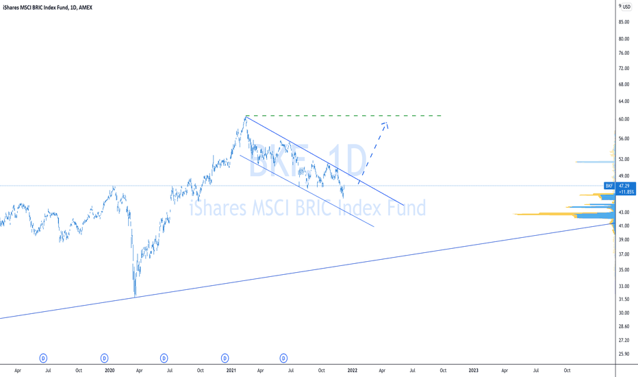

## Table of Contents

## What is the MSCI BIC Index?

The MSCI BIC Index is a stock market index created by MSCI, a company that specializes in providing investment decision support tools. The index tracks the performance of large and mid-sized companies in three countries: Brazil, India, and China. These countries are often grouped together because they are seen as emerging markets with high growth potential. The index helps investors understand how stocks in these countries are doing overall.

The MSCI BIC Index includes companies from various industries, such as technology, finance, and energy. By looking at the index, investors can see if the stock markets in Brazil, India, and China are going up or down. This can help them decide where to invest their money. The index is updated regularly to reflect changes in the stock market, making it a useful tool for keeping track of market trends in these important emerging economies.

## Which countries are included in the MSCI BIC Index?

The MSCI BIC Index includes companies from three countries: Brazil, India, and China. These countries are known as emerging markets, which means they are growing quickly and can offer good opportunities for investors.

The index helps people see how well the stock markets in Brazil, India, and China are doing. By looking at the index, investors can decide if they want to put their money into companies in these countries. The index is updated often to show the latest changes in the stock market.

## How is the MSCI BIC Index calculated?

The MSCI BIC Index is calculated by looking at the stock prices of big and medium-sized companies in Brazil, India, and China. Each company in the index has a certain weight, which means some companies affect the index more than others. The weight is based on the size of the company, so bigger companies have a bigger impact on the index. To find the value of the index, MSCI adds up the value of all the companies, taking into account their weights.

The index is updated every day to show the latest stock prices. If a company's stock price goes up, it can make the index go up too, depending on how much weight that company has. If a company's stock price goes down, it can make the index go down. MSCI also makes changes to the index over time, like adding new companies or removing old ones, to make sure it stays a good reflection of the stock markets in Brazil, India, and China.

## What is the purpose of the MSCI BIC Index?

The MSCI BIC Index helps investors understand how the stock markets in Brazil, India, and China are doing. These countries are known as emerging markets, which means they are growing quickly and can be good places to invest money. The index tracks the performance of big and medium-sized companies in these countries, giving investors a clear picture of how well the markets are doing overall.

By looking at the MSCI BIC Index, investors can decide if they want to put their money into companies in Brazil, India, or China. The index is updated every day to show the latest changes in stock prices, so it's a useful tool for keeping track of market trends. This helps investors make smart choices about where to invest their money in these important emerging economies.

## How does the MSCI BIC Index differ from other MSCI indices?

The MSCI BIC Index is different from other MSCI indices because it focuses only on three countries: Brazil, India, and China. These countries are known as emerging markets, which means they are growing quickly and can be good places to invest money. Other MSCI indices might cover different countries or regions, like the MSCI World Index, which includes developed markets from around the world, or the MSCI Emerging Markets Index, which covers a broader range of emerging markets beyond just Brazil, India, and China.

Another way the MSCI BIC Index differs is in its specific focus on large and mid-sized companies within these three countries. This means it gives investors a clear picture of how well the stock markets in Brazil, India, and China are doing, without including smaller companies or companies from other countries. In contrast, other MSCI indices might include companies of all sizes or from a wider range of countries, depending on their specific focus. This makes the MSCI BIC Index a specialized tool for investors interested in these three key emerging markets.

## What are the eligibility criteria for companies to be included in the MSCI BIC Index?

To be included in the MSCI BIC Index, a company must be from Brazil, India, or China. It also needs to be a big or medium-sized company. The size of the company is important because the index only includes companies that are large enough to have a significant impact on the stock market in these countries.

The index looks at how much a company is worth and how many shares it has available to the public. If a company meets these size and location requirements, it can be added to the index. MSCI also checks the company regularly to make sure it still fits the criteria, and they might add new companies or remove old ones to keep the index up to date.

## How often is the MSCI BIC Index rebalanced and reconstituted?

The MSCI BIC Index is rebalanced every quarter. This means that every three months, MSCI checks the weights of the companies in the index and adjusts them if needed. This helps make sure that the index still accurately shows how the stock markets in Brazil, India, and China are doing.

The index is also reconstituted once a year. This happens in May, when MSCI looks at all the companies in the index and decides if any new companies should be added or if any old ones should be removed. This yearly check helps keep the index up to date with the latest changes in the stock markets of these three countries.

## What are the historical performance trends of the MSCI BIC Index?

The MSCI BIC Index has shown a lot of ups and downs over the years. This is because Brazil, India, and China are emerging markets, which means their economies can grow quickly but can also be unpredictable. For example, the index did really well in the early 2000s when these countries were growing fast. But then, it went down during the global financial crisis in 2008 because many investors were worried about the economy. After that, the index had some good years and some bad years, depending on what was happening in these countries and around the world.

In more recent years, the MSCI BIC Index has continued to be a bit of a roller coaster. For instance, it went up a lot in 2017 when China's economy was doing well, but then it dropped in 2018 because of trade tensions between the U.S. and China. The index also felt the impact of the COVID-19 pandemic in 2020, going down sharply at first but then recovering as the economies of Brazil, India, and China started to bounce back. Overall, the index shows that investing in these emerging markets can be risky but can also offer big rewards if you're willing to ride out the ups and downs.

## How can investors use the MSCI BIC Index to guide their investment decisions?

Investors can use the MSCI BIC Index to understand how the stock markets in Brazil, India, and China are doing. By looking at the index, they can see if the markets are going up or down. This helps them decide if they want to invest in companies from these countries. If the index is going up, it might be a good time to buy stocks because the market is doing well. If the index is going down, investors might want to wait or sell their stocks to avoid losing money.

The MSCI BIC Index also helps investors see trends over time. For example, if the index has been going up for a while, it might mean that the economies of Brazil, India, and China are growing. This can be a good sign for investors looking for long-term growth. On the other hand, if the index is going down, it might mean there are problems in these countries that could affect their stock markets. By keeping an eye on the index, investors can make smarter choices about when to buy or sell stocks in these emerging markets.

## What are the risks associated with investing in the MSCI BIC Index?

Investing in the MSCI BIC Index can be risky because it focuses on stocks from Brazil, India, and China. These countries are known as emerging markets, which means their economies can grow quickly but can also be unpredictable. For example, if there are political problems or economic troubles in any of these countries, it can cause the stock market to go down. This means that if you invest in the MSCI BIC Index, your money could lose value if something bad happens in Brazil, India, or China.

Another risk is that the MSCI BIC Index can be affected by changes in the global economy. For instance, if there are trade tensions between big countries like the U.S. and China, it can make the stock markets in Brazil, India, and China go down. Also, events like the global financial crisis or the COVID-19 pandemic can cause big drops in the index. So, investing in the MSCI BIC Index means you need to be ready for ups and downs and be willing to take on more risk than you might with more stable investments.

## How does the MSCI BIC Index correlate with global economic indicators?

The MSCI BIC Index, which tracks stocks from Brazil, India, and China, often moves along with global economic indicators. For example, when the global economy is doing well, the MSCI BIC Index tends to go up because these countries are big parts of the world economy. If there's good news about global trade or if other big economies like the U.S. or Europe are growing, it can make investors feel more confident about investing in Brazil, India, and China. This means the index can go up when global economic indicators are positive.

On the other hand, the MSCI BIC Index can also go down when there are problems in the global economy. If there's a big economic crisis, like the one in 2008, or if there are trade tensions between countries, it can make the stock markets in Brazil, India, and China drop. This is because these countries are affected by what happens around the world. So, the MSCI BIC Index is closely tied to global economic indicators, and investors need to keep an eye on these to understand how the index might move.

## What advanced analytical tools can be used to forecast the future performance of the MSCI BIC Index?

To forecast the future performance of the MSCI BIC Index, investors can use advanced analytical tools like [machine learning](/wiki/machine-learning) algorithms. These algorithms can look at a lot of data from the past, like how the stock markets in Brazil, India, and China have moved before. They can also look at other things, like how the global economy is doing or what's happening in these countries. By finding patterns in all this data, machine learning can make guesses about where the MSCI BIC Index might go in the future. This can help investors make smarter choices about when to buy or sell stocks.

Another tool that can be useful is time series analysis. This tool looks at how the MSCI BIC Index has changed over time and tries to predict what might happen next. It can use things like moving averages, which show the average value of the index over a certain period, to see if the index is going up or down. Time series analysis can also use more complex methods, like ARIMA models, to make forecasts. These models can be really helpful for investors who want to understand the ups and downs of the MSCI BIC Index and plan their investments better.

## References & Further Reading

[1]: ["MSCI-BIC Index Methodology"](https://www.msci.com/indexes/index/127300) - MSCI

[2]: Chan, E. P. (2009). ["Quantitative Trading: How to Build Your Own Algorithmic Trading Business"](https://github.com/ftvision/quant_trading_echan_book) John Wiley & Sons.

[3]: Lopez de Prado, M. (2018). ["Advances in Financial Machine Learning"](https://www.amazon.com/Advances-Financial-Machine-Learning-Marcos/dp/1119482089) Wiley.

[4]: Aronson, D. R. (2007). ["Evidence-Based Technical Analysis: Applying the Scientific Method and Statistical Inference to Trading Signals"](https://onlinelibrary.wiley.com/doi/book/10.1002/9781118268315) Wiley.

[5]: Jansen, S. (2020). ["Machine Learning for Algorithmic Trading"](https://www.amazon.com/Machine-Learning-Algorithmic-Trading-alternative/dp/1839217715) Packt Publishing.

[6]: Bergstra, J., Bardenet, R., Bengio, Y., & Kégl, B. (2011). ["Algorithms for Hyper-Parameter Optimization"](https://dl.acm.org/doi/10.5555/2986459.2986743) Advances in Neural Information Processing Systems 24.