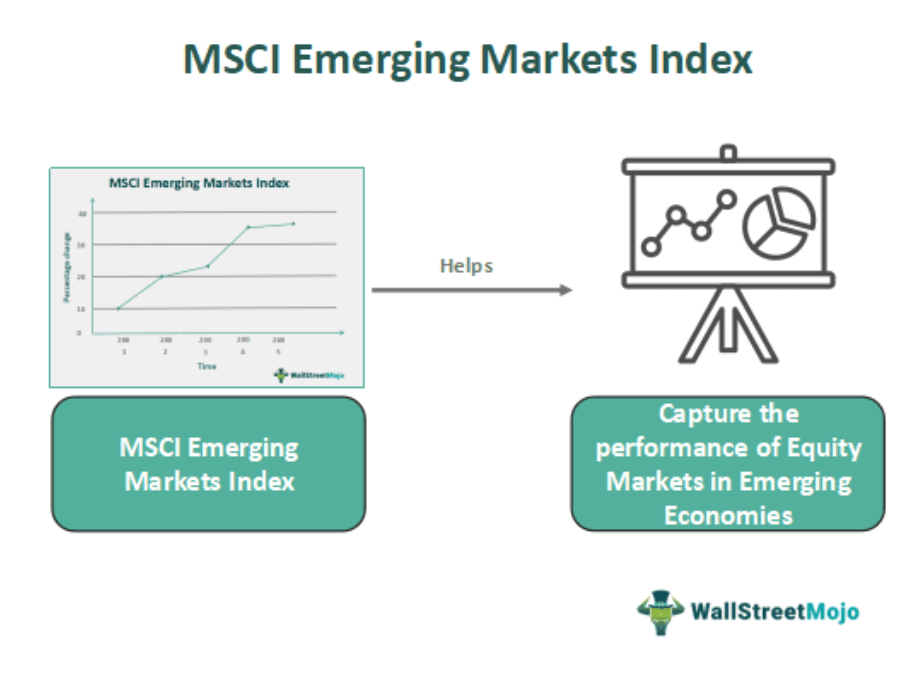

The MSCI EMU Index is a pivotal tool for investors targeting the eurozone equity market. It encompasses mid- and large-cap companies from 10 developed markets within the European Economic and Monetary Union (EMU). This inclusion offers a comprehensive scope of diverse economic activities present in the region, providing investors with substantial representative exposure to the eurozone.

European equity investments often carry a layer of complexity due to diverse market dynamics, currency considerations, and regulatory environments. However, the MSCI EMU Index simplifies this complexity by offering a diversified investment approach. The index aims to cover approximately 85% of the free float-adjusted market capitalization within the EMU, ensuring that investors have exposure to a substantial portion of the market while also mitigating individual market volatility and sector-specific risks.



This article will further examine the MSCI EMU Index by highlighting its importance and exploring its application within the investment landscape. Additionally, we will discuss how algorithmic trading strategies, characterized by the utilization of advanced data analytics and automated trading techniques, can be applied to improve investment results. By doing so, the article will provide valuable insights into leveraging this index to enhance portfolio management and optimize returns for investors engaging with Europe's developed markets.

## Table of Contents

## Understanding the MSCI EMU Index

The MSCI EMU (Economic and Monetary Union) Index is a vital financial instrument designed to track mid- and large-cap equities within the eurozone. It is a market capitalization-weighted index, meaning companies with larger market capitalizations have a more significant influence on the index's overall performance. This weighting approach reflects the economic size and market value of the companies listed, offering a representative snapshot of the eurozone's equity market.

The MSCI EMU Index includes approximately 85% of the free float-adjusted market capitalization of the EMU. Free float-adjustment ensures that only shares readily available for trading by public investors are considered, providing a more accurate depiction of market availability and [liquidity](/wiki/liquidity-risk-premium). This adjustment is crucial for capturing a realistic portrayal of market dynamics and investor opportunities.

A significant portion of the MSCI EMU Index's composition comes from countries like France, Germany, and the Netherlands. These nations are among the largest economies within the eurozone, contributing a substantial share of the index's market capitalization. The index's robust representation from these economically influential countries highlights its comprehensive nature, making it an effective tool for investors seeking to assess the eurozone's economic landscape.

Introduced by Morgan Stanley in April 1998, the MSCI EMU Index adheres to MSCI's rigorous methodology. This methodology emphasizes global comparability, allowing investors to evaluate the eurozone in alignment with other international markets. The comprehensive framework ensures a consistent and transparent evaluation process across varying market segments, facilitating informed investment decisions.

In conclusion, the MSCI EMU Index offers a systematic and diversified approach to understanding the eurozone's equity market, aiming to capture the core economic activities and market trends within its scope.

## Key Market Insights

The MSCI EMU Index is a benchmark covering a spectrum of industries within the eurozone, designed to provide investors with a diversified exposure to the region's equity market. Key sectors represented in this index include Consumer Discretionary, Industrials, Financials, and Information Technology. These sectors collectively capture the dynamic and diverse nature of the eurozone, with Consumer Discretionary and Information Technology offering exposure to both cyclical and growth-oriented investments.

As of 2024, prominent constituents of the MSCI EMU Index are ASML Holding, SAP, and LVMH Moet Hennessy. ASML Holding is a leading player in the information technology sector, focusing on semiconductor production equipment, a critical industry for technological advancement. SAP is a global leader in enterprise software solutions, catering to various industries with its cutting-edge software platforms. LVMH Moet Hennessy, a luxury goods conglomerate, represents the Consumer Discretionary sector and reflects the eurozone's influential presence in global luxury markets.

The index’s diversification across multiple industries significantly aids investors in managing risk. By including companies from different sectors, the MSCI EMU Index enables investors to mitigate the impact of sector-specific downturns and take advantage of potential upswings in various parts of the economy. Diversification, therefore, serves as a fundamental strategy for maintaining a balanced portfolio, minimizing [volatility](/wiki/volatility-trading-strategies), and enhancing potential long-term returns. This diversified approach also aligns with modern portfolio theory, which emphasizes the benefits of spreading investments across various asset classes to optimize risk-adjusted returns.

## Investing in the MSCI EMU Index

U.S. investors seeking exposure to the eurozone markets can efficiently access the MSCI EMU Index through Exchange Traded Funds (ETFs) such as the iShares MSCI Eurozone [ETF](/wiki/etf-trading-strategies). ETFs serve as a crucial financial tool, enabling investors to invest in a broad market index in a cost-effective manner. By doing so, they capture both the price appreciation and dividend yield performance of publicly traded securities within the eurozone. 

An ETF, like the iShares MSCI Eurozone ETF, pools together various stocks from companies included in the MSCI EMU Index, providing diversification benefits and a simplified investment process compared to purchasing individual stocks. This diversification helps to mitigate risk, as the investment is spread across multiple sectors and companies within the eurozone.

For investors considering ETFs linked to the MSCI EMU Index, a critical evaluation of the expense ratio is necessary. The expense ratio, which represents the fund's annual operating expenses, directly impacts the investor's net returns. A lower expense ratio is generally preferable, as it reduces the drag on performance attributed to fund management costs.

Additionally, historical performance data should be carefully assessed. This data offers insights into how the ETF has performed relative to its benchmarks during different market cycles. Analyzing past performance can help investors set realistic expectations and make informed investment choices. However, it is essential to remember that past performance is not indicative of future results. 

Investors utilizing ETFs to gain exposure to the MSCI EMU Index must consider these factors, blending them with their investment goals and risk tolerance to optimize their investment strategy in the eurozone equity market.

## The Role of Algorithmic Trading

Algorithmic trading, often referred to as algo-trading, utilizes advanced data-driven techniques to streamline and automate the investment process. This approach involves employing algorithms—step-by-step computational formulas—to identify and act on specific market trends with minimal human intervention. By analyzing data at high speeds, these algorithms can execute trades almost instantaneously when predetermined criteria are met. 

Investors can take advantage of [algorithmic trading](/wiki/algorithmic-trading) by optimizing their portfolios, particularly with indices like the MSCI EMU Index. The systematic nature of algorithms allows for continuous monitoring of market conditions and real-time adjustments to portfolio positions, facilitating a dynamic response to market movements. For example, an algorithm may be designed to increase exposure to certain sectors within the MSCI EMU Index when favorable conditions are detected. Conversely, the same algorithm can reduce exposure when the market metrics indicate potential declines.

The use of algorithmic trading helps minimize human error and eliminate emotional decision-making, which can often lead to suboptimal investment outcomes. The precision and speed provided by algorithms are particularly advantageous in highly volatile markets, where rapid responses can significantly impact the performance of an investment portfolio.

A basic example in Python shows how algorithms use real-time data to make decisions:

```python
import pandas as pd
import numpy as np

# Sample market data for the MSCI EMU Index
market_data = pd.DataFrame({
    'Date': pd.date_range(start='2024-01-01', periods=100, freq='D'),
    'Price': np.random.uniform(low=90, high=110, size=100)
})

# Simple moving average strategy
short_window = 40
long_window = 100

# Calculate moving averages
market_data['Short_MA'] = market_data['Price'].rolling(window=short_window, min_periods=1).mean()
market_data['Long_MA'] = market_data['Price'].rolling(window=long_window, min_periods=1).mean()

# Generate buy/sell signals
market_data['Signal'] = 0
market_data['Signal'][short_window:] = np.where(
    market_data['Short_MA'][short_window:] > market_data['Long_MA'][short_window:], 1, -1)

print(market_data.head())
```

This simple strategy applies moving averages to MSCI EMU Index market data to generate buy or sell signals based on whether a short-term moving average crosses above or below a long-term moving average. Professional algorithmic trading strategies incorporate a far greater number of variables and deliver more sophisticated analyses.

Overall, leveraging algorithmic trading in conjunction with indices like the MSCI EMU Index can enhance return potential while simultaneously managing risk. By facilitating efficient and rational decision-making, algorithmic trading embodies a forward-looking approach to modern investing.

## Conclusion

The MSCI EMU Index serves as a strategic instrument for investors aiming to gain exposure to Europe's developed markets. This index captures a significant portion of the eurozone's equity landscape by encompassing mid- and large-cap companies, offering a robust representation of the region's market dynamics. By thoroughly understanding the composition of the MSCI EMU Index, investors can strategically enhance their portfolios. Incorporating algorithmic trading techniques enables sophisticated analysis and execution, which can lead to improved returns while effectively managing associated risks.

Algorithmic trading offers a structured approach wherein data-driven insights guide investment decisions. By harnessing real-time market information, algorithms can automatically adjust portfolio exposures, alleviating human error and mitigating emotional biases that typically affect manual trading. This can be accomplished using [machine learning](/wiki/machine-learning) techniques or predefined rules to identify trends or pivotal financial signals. For example, Python code leveraging libraries such as pandas for data manipulation and scikit-learn for machine learning can streamline such tasks.  

```python
import pandas as pd
from sklearn.linear_model import LinearRegression

# Example: Using historical data to forecast trend
def predict_trend(data):
    model = LinearRegression()

    # Reshape data for the model
    X = data.index.values.reshape(-1, 1)
    y = data['Price']

    model.fit(X, y)
    trend = model.predict(X)

    return trend

# Assume 'historical_data' is a DataFrame with price history
historical_data = pd.DataFrame({
    'Date': pd.date_range(start='1/1/2020', periods=60, freq='M'),
    'Price': [100 + i*0.5 for i in range(60)]  # Sample price data
}).set_index('Date')

trend = predict_trend(historical_data)
```

To maintain success in European stock index investing using the MSCI EMU Index, investors must stay informed about evolving market trends. Continuous refinement of trading strategies is crucial, necessitating ongoing learning and adaptation to new financial data and technological advancements. By doing so, they enhance their ability to make informed decisions, balancing the pursuit of higher returns with the adherence to prudent risk management principles. This proactive approach ensures that investors can navigate the complexities of the eurozone's market environment with competence and foresight.

## References & Further Reading

[1]: ["MSCI EMU Index Factsheet"](https://www.msci.com/documents/10199/7395c222-b136-4372-baa7-a4480d7d003c) by MSCI Inc.

[2]: Blitz, D., & Huij, J. (2012). ["Evaluating the performance of global emerging markets equity ETFs."](https://papers.ssrn.com/sol3/papers.cfm?abstract_id=1757740) The Journal of Index Investing, 3(2), 36-43.

[3]: López de Prado, M. (2018). ["Advances in Financial Machine Learning."](https://www.amazon.com/Advances-Financial-Machine-Learning-Marcos/dp/1119482089) Wiley.

[4]: Aronson, D. R. (2006). ["Evidence-Based Technical Analysis: Applying the Scientific Method and Statistical Inference to Trading Signals."](https://www.amazon.com/Evidence-Based-Technical-Analysis-Scientific-Statistical/dp/0470008741) Wiley.

[5]: Chan, E. P. (2009). ["Quantitative Trading: How to Build Your Own Algorithmic Trading Business."](https://github.com/ftvision/quant_trading_echan_book) John Wiley & Sons.

[6]: Jansen, S. (2020). ["Machine Learning for Algorithmic Trading."](https://github.com/stefan-jansen/machine-learning-for-trading) Packt Publishing.

[7]: Niederhoffer, V. (1997). ["The Education of a Speculator."](https://archive.org/details/educationofspecu0000nied) Wiley.

[8]: MSCI Inc. (2023). ["Methodology for MSCI Equity Indices."](https://www.msci.com/index-methodology)