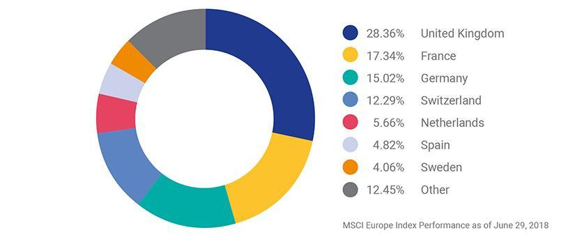

## Table of Contents

## What is the MSCI EMU Index?

The MSCI EMU Index is a stock market index that tracks the performance of large and mid-sized companies in countries that use the euro as their currency. These countries are part of the European Economic and Monetary Union (EMU), which is why the index is called the MSCI EMU Index. The index includes companies from countries like Germany, France, Italy, and Spain, among others. It helps investors see how well these companies are doing overall and gives them a way to compare the performance of the eurozone stock market to other markets around the world.

The MSCI EMU Index is important because it gives investors a broad view of the stock market in the eurozone. By looking at this index, investors can make better decisions about where to put their money. The index is also used as a benchmark, which means it's a standard that other investments are measured against. For example, if a mutual fund says it's trying to beat the MSCI EMU Index, it's using the index as a goal to do better than. This helps investors know if their investments are doing well compared to the overall market in the eurozone.

## What does EMU stand for in the MSCI EMU Index?

In the MSCI EMU Index, EMU stands for European Economic and Monetary Union. This is a group of countries in Europe that use the euro as their money. The countries work together to make their economies stronger and to use the same currency.

The MSCI EMU Index looks at how well big and medium-sized companies in these countries are doing. It helps people who invest money see how the stock market is doing in the places that use the euro. This can help them decide where to put their money to maybe make more money.

## Which countries are included in the MSCI EMU Index?

The MSCI EMU Index includes countries in Europe that use the euro as their money. These countries are part of a group called the European Economic and Monetary Union (EMU). Some of the main countries in the index are Germany, France, Italy, Spain, and the Netherlands. These countries have big and medium-sized companies that the index keeps track of.

Other countries in the MSCI EMU Index are Austria, Belgium, Finland, Greece, Ireland, Luxembourg, Portugal, and Slovenia. Each of these countries adds to the overall picture of how the stock market is doing in the euro area. By looking at all these countries together, the index helps investors see the health of the eurozone economy and make smart choices about where to invest their money.

## How is the MSCI EMU Index calculated?

The MSCI EMU Index is calculated by looking at the prices of stocks from big and medium-sized companies in countries that use the euro. Each company in the index has a certain weight, which means some companies affect the index more than others. The weight depends on how big the company is, measured by its total value in the market. When the price of a company's stock goes up or down, it changes the index based on how much weight that company has.

To make the index, MSCI first picks which companies to include. They choose companies from countries in the European Economic and Monetary Union that are big enough and meet certain rules. Then, they figure out the weight of each company. After that, they add up the value of all the stocks, taking into account their weights. This total value is what makes up the MSCI EMU Index. Every day, as stock prices change, the index gets updated to show the new total value.

## What types of companies are included in the MSCI EMU Index?

The MSCI EMU Index includes big and medium-sized companies from countries in Europe that use the euro. These companies come from places like Germany, France, Italy, and Spain. The index looks at companies from different industries, so it might include businesses that make cars, banks, companies that sell things in stores, and technology firms. The idea is to show how the whole stock market in these countries is doing, not just one type of business.

To be part of the MSCI EMU Index, a company needs to be big enough and meet certain rules set by MSCI. The size of a company is measured by how much it's worth in the market. Some companies will have a bigger effect on the index because they are worth more. This means if the stock price of a really big company goes up or down a lot, it can change the index more than if a smaller company's stock price changes.

## How does the MSCI EMU Index differ from other regional indices?

The MSCI EMU Index is different from other regional indices because it only includes companies from countries in Europe that use the euro. This means it focuses on the stock market performance of the European Economic and Monetary Union (EMU) countries like Germany, France, and Italy. Other regional indices might include companies from a wider area, like the whole of Europe or even the world. For example, the MSCI Europe Index covers a broader range of European countries, including those that do not use the euro, such as the United Kingdom and Switzerland.

Another way the MSCI EMU Index differs is in how it's put together. It only looks at big and medium-sized companies, and each company's impact on the index depends on how much it's worth in the market. This is similar to other indices, but the specific mix of companies and their weights can be different. For instance, the MSCI USA Index includes large and mid-sized companies from the United States, but the companies and their weights will be different because they come from a different region with different economies. So, while the basic idea of tracking stock market performance is the same, the MSCI EMU Index gives a unique view of the eurozone's market.

## What is the historical performance of the MSCI EMU Index?

The MSCI EMU Index has had ups and downs over the years, just like any stock market index. From the early 2000s to now, it has seen big changes. For example, during the global financial crisis in 2008, the index dropped a lot because many companies in Europe were struggling. But after that, it started to recover slowly. Over the last ten years, the index has generally gone up, but there have been some years where it went down. This shows how the stock market in the eurozone can be affected by things like economic problems, political changes, and global events.

Looking at specific years can help understand the index better. In 2017, the MSCI EMU Index did really well, going up by about 12%. This was a good year for the eurozone economy. But in 2020, when the COVID-19 pandemic started, the index fell sharply at first because many businesses had to close. However, it started to bounce back later in the year as things got better. By the end of 2021, the index had recovered a lot and even reached new highs. This shows that while the MSCI EMU Index can go through tough times, it can also recover and grow over time.

## How can investors use the MSCI EMU Index to gauge market performance?

Investors can use the MSCI EMU Index to see how the stock market in countries that use the euro is doing. The index tracks big and medium-sized companies from these countries, so it gives a good overall picture of the market. By looking at the MSCI EMU Index, investors can tell if the market is going up or down, which can help them decide when to buy or sell stocks. For example, if the index is going up, it might be a good time to invest more money in the eurozone market. If it's going down, investors might want to be more careful or wait for a better time to invest.

The MSCI EMU Index can also help investors compare the eurozone market to other markets around the world. For instance, if the MSCI EMU Index is doing better than the MSCI USA Index, it might mean the eurozone market is a better place to put money right now. Investors can use this information to spread their money across different markets and lower their risk. By keeping an eye on the MSCI EMU Index, investors can make smarter choices about where to invest their money and how to manage their portfolios.

## What are the key factors that influence the MSCI EMU Index?

The MSCI EMU Index is affected by many things. One big [factor](/wiki/factor-investing) is how well the economy is doing in the countries that use the euro. If the economy is growing, companies usually do better, and their stock prices go up, which makes the index go up too. But if the economy is not doing well, like during a recession, companies might struggle, and the index can go down. Another thing that matters is what's happening in the world. Events like the global financial crisis in 2008 or the COVID-19 pandemic in 2020 can make the index drop a lot because they affect businesses everywhere.

Interest rates set by the European Central Bank also play a big role. When interest rates are low, it's easier for companies to borrow money and grow, which can help the index go up. But if interest rates go up, borrowing becomes more expensive, and this can slow down the economy and make the index go down. Finally, changes in politics, like elections or new laws, can also influence the index. If people think these changes will be good for the economy, the index might go up. But if they think the changes will be bad, the index can go down.

## How does the MSCI EMU Index rebalance its constituents?

The MSCI EMU Index rebalances its list of companies every year in May. This means they look at all the companies in the index and decide if any should be added or taken away. They do this to make sure the index still shows a good picture of the eurozone stock market. They use certain rules to decide which companies to include. These rules look at things like how big the company is and how much it's worth in the market. If a company gets bigger or smaller, it might change how much it affects the index.

When the MSCI EMU Index rebalances, they also check the weight of each company. The weight is how much each company's stock price changes the overall index. Bigger companies have more weight, so they affect the index more. If a company's size changes a lot during the year, its weight in the index might change too. This helps keep the index fair and accurate. By doing this every year, the MSCI EMU Index stays up to date and reflects the current state of the eurozone market.

## What are the potential risks associated with investing in the MSCI EMU Index?

Investing in the MSCI EMU Index can have some risks. One big risk is that the whole eurozone economy might not do well. If the economy goes into a recession or faces big problems, the companies in the index might lose money, and the index could go down. Another risk is changes in interest rates set by the European Central Bank. If interest rates go up, it can make it harder for companies to borrow money and grow, which might hurt their stock prices and the index.

Another risk is what's happening around the world. Things like global financial crises or pandemics can affect all markets, including the eurozone. If there's a big event like that, the MSCI EMU Index could drop a lot. Also, changes in politics, like elections or new laws, can make the index go up or down. If people think these changes will be bad for the economy, they might sell their stocks, and the index could fall. So, while the MSCI EMU Index can be a good way to invest in the eurozone, it's important to know these risks and be ready for them.

## How does the MSCI EMU Index compare to the broader MSCI Europe Index?

The MSCI EMU Index and the MSCI Europe Index are both stock market indices, but they cover different areas. The MSCI EMU Index only includes companies from countries in Europe that use the euro, like Germany, France, and Italy. This makes it a good way to see how the stock market is doing in the eurozone. On the other hand, the MSCI Europe Index is much broader. It includes companies from all over Europe, not just the countries that use the euro. This means it also covers countries like the United Kingdom and Switzerland, giving a bigger picture of the European stock market.

Because the MSCI EMU Index focuses only on eurozone countries, it can be more affected by things that happen in those countries, like changes in the eurozone economy or decisions made by the European Central Bank. If the eurozone is doing well, the MSCI EMU Index might go up more than the MSCI Europe Index. But if the eurozone has problems, the MSCI EMU Index could go down more too. The MSCI Europe Index, because it includes more countries, might be less affected by problems in just one part of Europe. This makes it a different way to look at the European market, and investors might choose one over the other based on what they think will happen in the future.

## References & Further Reading

[1]: ["MSCI EMU Index Factsheet"](https://www.msci.com/documents/10199/7395c222-b136-4372-baa7-a4480d7d003c) by MSCI Inc.

[2]: Blitz, D., & Huij, J. (2012). ["Evaluating the performance of global emerging markets equity ETFs."](https://papers.ssrn.com/sol3/papers.cfm?abstract_id=1757740) The Journal of Index Investing, 3(2), 36-43.

[3]: López de Prado, M. (2018). ["Advances in Financial Machine Learning."](https://www.amazon.com/Advances-Financial-Machine-Learning-Marcos/dp/1119482089) Wiley.

[4]: Aronson, D. R. (2006). ["Evidence-Based Technical Analysis: Applying the Scientific Method and Statistical Inference to Trading Signals."](https://www.amazon.com/Evidence-Based-Technical-Analysis-Scientific-Statistical/dp/0470008741) Wiley.

[5]: Chan, E. P. (2009). ["Quantitative Trading: How to Build Your Own Algorithmic Trading Business."](https://github.com/ftvision/quant_trading_echan_book) John Wiley & Sons.

[6]: Jansen, S. (2020). ["Machine Learning for Algorithmic Trading."](https://github.com/stefan-jansen/machine-learning-for-trading) Packt Publishing.

[7]: Niederhoffer, V. (1997). ["The Education of a Speculator."](https://archive.org/details/educationofspecu0000nied) Wiley.

[8]: MSCI Inc. (2023). ["Methodology for MSCI Equity Indices."](https://www.msci.com/index-methodology)