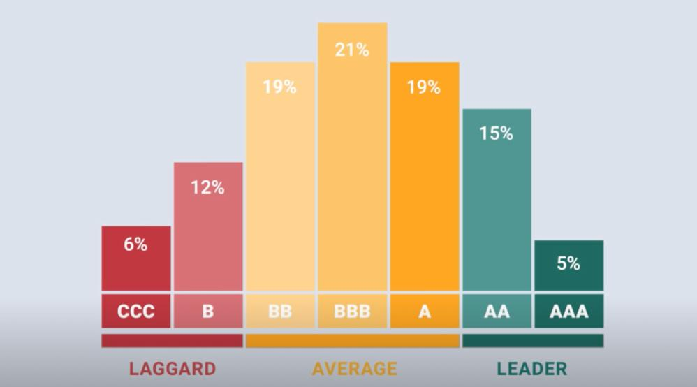

In the era of conscious investing, Environmental, Social, and Governance (ESG) factors have taken center stage in investment decision-making. These criteria provide a framework for evaluating a company's sustainable and ethical impact, highlighting commitment to principles that are increasingly valued by investors globally. ESG ratings serve as a benchmark for this form of investing, offering insights into how companies manage risks and opportunities related to environmental stewardship, social responsibility, and governance practices.

MSCI, a key player in this field, is renowned for its comprehensive assessment of companies worldwide, offering a well-regarded set of ESG ratings. These ratings provide investors with a nuanced understanding of a company's performance across various domains, enabling more informed and responsible investment decisions. By offering a structured approach to analyzing potential investments, MSCI ESG ratings address the growing demand for transparency and accountability in corporate behavior.



Exploring the significance of MSCI ESG ratings involves understanding how they function and their growing influence on algorithmic trading processes. ESG criteria are integral to modern investment strategies, reflecting an adoption of ethical considerations into financial analyses. The integration of ESG factors into algorithmic trading systems is particularly noteworthy, as it can enhance decision-making processes by incorporating sustainability into automated investment strategies. This trend exemplifies how the alignment of investment practices with ethical values is reshaping the financial landscape.

## Table of Contents

## Understanding ESG Ratings

Environmental, Social, and Governance (ESG) ratings are critical measures utilized by investors to evaluate a company's approach to managing long-term ESG risks. These ratings provide a framework that aligns investment strategies with ethical standards and sustainable values. ESG ratings are particularly valuable for socially responsible investors, enabling them to construct portfolios that reflect their ethical and sustainability commitments.

MSCI, a leading provider of ESG ratings, decomposes a company's ESG profile into its fundamental dimensions, offering a detailed assessment that goes beyond surface-level observations. The evaluation focuses on key areas such as a company's environmental footprint, social impact, and governance practices. This comprehensive approach helps investors gain a clearer understanding of a company's overall ESG performance.

The environmental dimension examines a company's management of ecological impacts, including carbon emissions, resource consumption, and waste management practices. It assesses how effectively the company mitigates environmental risks and its contribution to global sustainability efforts. Social factors consider the company's relationships with and impact on employees, customers, and the community. This includes labor practices, product safety, and diversity initiatives, which reflect the company's commitment to social responsibility. Governance practices review the structures and processes guiding the company's leadership, ethical standards, and accountability measures, ensuring that governance frameworks support sustainable business practices.

By incorporating [ESG](/wiki/esg-investing) ratings into the investment decision-making process, investors are better equipped to make informed choices. These ratings support the growing trend toward sustainable investing, providing a strategic tool to identify companies that not only perform well financially but also demonstrate a commitment to addressing ESG issues. As investors and asset managers increasingly prioritize sustainability in their portfolios, the significance of robust ESG evaluations is underscored, prompting a shift in modern investment strategies toward more responsible and impactful practices.

## Importance of MSCI ESG Ratings

MSCI's ESG ratings are recognized as a pivotal tool in the global investment landscape. These ratings assist investors in discerning which companies excel at managing environmental, social, and governance (ESG) risks, thus providing them with a competitive edge. As the emphasis on sustainable and ethical investment grows, asset managers increasingly rely on MSCI's ESG ratings to construct portfolios that are not only profitable but also align with the principles of responsible investing.

A primary advantage of MSCI ESG ratings is their role in identifying companies adept at managing ESG-related risks. By evaluating a company's strategies in handling environmental challenges, social responsibilities, and governance practices, these ratings enable investors to make informed decisions that align with long-term sustainability goals.

For asset managers, MSCI ESG ratings serve as a robust framework for creating sustainable portfolios. These ratings break down complex ESG data into actionable insights, allowing asset managers to select companies that not only meet financial criteria but also adhere to ethical standards. This comprehensive evaluation aids in the alignment of investment portfolios with clients’ values, catering to the expanding market for responsible investing.

Furthermore, the increasing demand for ESG-compliant investments underscores the necessity of rigorous evaluations like those provided by MSCI. With societal and regulatory pressures heightening the focus on corporate responsibility, MSCI's meticulous assessment process places it at the forefront of ESG rating providers.

As the trend towards sustainability continues to gain [momentum](/wiki/momentum), MSCI ESG ratings are likely to play a crucial role in shaping future investment strategies. Their influence extends beyond traditional financial metrics, embedding ethical considerations into the core of investment decision-making processes.

## How MSCI ESG Ratings Work

MSCI evaluates companies based on their exposure to significant ESG risks, employing a rigorous methodology that scores these companies from zero to ten. The evaluation process involves assessing various key issues specific to each industry, where companies receive a letter-based grade ranging from AAA to CCC. These ratings reflect the company's performance relative to its industry peers, providing investors with a clear view of its ESG effectiveness.

Data for these assessments is gathered from multiple sources, including corporate reports, regulatory filings, and third-party databases. This broad approach ensures that MSCI's ESG ratings are comprehensive and accurate, taking into account both quantitative and qualitative aspects of each company's operations.

The MSCI methodology involves industry-relative assessments, meaning that a company's ESG score is not considered in isolation but in comparison to its peers within the same industry. This approach accounts for the varying significance of ESG issues across different sectors and provides a nuanced evaluation of a company's ESG standing.

For instance, a company in the energy sector might be evaluated more rigorously on environmental sustainability compared to a financial services firm, where governance might play a larger role. This industry-relative framework ensures that the ratings offer a meaningful overview of how well companies manage ESG risks within their specific context.

Ultimately, MSCI ESG ratings serve as a critical tool for investors looking to assess and compare the sustainability practices of companies, aiding in the alignment of investment portfolios with ESG principles.

## The Role of ESG Ratings in Algorithmic Trading

Algorithmic trading, a form of trading that uses computer algorithms to manage trading decisions with speed and efficiency, has revolutionized investment practices by relying heavily on quantitative data and pre-defined rules. Incorporating Environmental, Social, and Governance (ESG) ratings into these algorithms offers a valuable dimension by embedding sustainability factors into trading decisions. This inclusion extends beyond traditional financial indicators, enabling traders to consider non-financial risks and opportunities associated with sustainability issues.

### Integration of ESG Ratings

ESG criteria provide a systematic means for traders to incorporate ethical and sustainable goals into their investment strategies. By integrating these criteria, trading algorithms can be programmed to screen and select potential investments based on a firm's ESG performance. This screening process can be designed to filter out companies that fail to meet predetermined sustainability standards, prioritizing those that demonstrate strong ESG practices. The incorporation of ESG data into trading algorithms can be expressed through pseudo coding or logic statements such as:

```python
def esg_filter(company, threshold):
    if company.esg_rating >= threshold:
        return True  # Consider for investment
    else:
        return False  # Exclude from investment
```

This simple function depicts a basic filtering mechanism where companies are evaluated against a specified ESG threshold. Those meeting or exceeding the threshold are considered for potential investment, aligning the trading strategy with sustainability objectives.

### Enhancing Decision-Making

The inclusion of ESG ratings aids traders and fund managers in making more comprehensive and informed decisions. It provides a framework for considering not only financial metrics but also the broader impact of a firm's operations on the environment, society, and its governance practices. Through this lens, [algorithmic trading](/wiki/algorithmic-trading) is enhanced, allowing decision-makers to better assess the long-term viability and ethical standing of potential investment opportunities.

### Risk Mitigation

Integrating ESG factors into algorithmic trading can also play a crucial role in risk management. ESG ratings help identify non-financial risks, such as regulatory changes, reputational damage, or operational inefficiencies tied to environmental or social issues. By factoring these into trading algorithms, traders can anticipate potential risks and adjust investment strategies accordingly. This proactive approach mitigates long-term risks associated with neglecting ESG issues, thus fostering more resilient and sustainable investment portfolios.

Overall, the integration of ESG ratings into algorithmic trading marks a significant advancement in aligning financial markets with broader societal values. By adopting ESG criteria, traders and investors not only pursue profitability but also contribute to sustainable economic development.

## Case Study: Tesla's MSCI ESG Rating

Tesla, Inc. serves as a notable example in the assessment of ESG ratings due to its unique ESG profile. The company is widely recognized for its dedication to environmental sustainability, a core component of its business model. Tesla's innovations in electric vehicles and renewable energy significantly reduce carbon emissions, positioning it as a leader in the environmental aspect of ESG criteria. This emphasis on minimizing environmental impact has propelled Tesla to achieve high scores in the environmental dimension of ESG assessments.

However, Tesla's performance does not uniformly extend across the social and governance dimensions. On a social level, the company faces various challenges. These include controversies related to labor practices, such as allegations of unsafe working conditions and labor rights disputes. Additionally, Tesla has encountered scrutiny over product safety issues, which complicate its social responsibility narrative. Such factors contribute to a more moderate social score in ESG evaluations, reflecting areas where the company could enhance its stakeholder engagement and operational practices.

In terms of governance, Tesla's corporate structure has faced criticism, particularly concerning board independence and executive decision-making transparency. Governance issues are a crucial element of ESG assessments, as they influence a company's internal oversight and long-term strategic direction. These challenges underline the complex nature of evaluating Tesla's ESG performance.

MSCI rates Tesla with an 'A', indicating a robust environmental performance balanced with moderate to low scores in social and governance categories. The comprehensive evaluation performed by MSCI underscores the multifaceted nature of ESG assessments, wherein a company's strengths in one area might be counterbalanced by weaknesses in others. Consequently, Tesla exemplifies the intricate challenge investors face in integrating ESG considerations into investment decision-making processes, necessitating a nuanced understanding of the company's complete ESG profile.

## Conclusion

ESG ratings are essential tools for investors seeking to incorporate sustainability into their investment strategies. As the investing landscape increasingly prioritizes environmental, social, and governance factors, these ratings provide a structured approach to evaluate a company's commitment to sustainable practices. MSCI ESG ratings, in particular, offer a comprehensive evaluation of corporate ESG performance, guiding investors toward more responsible and informed decisions. By highlighting key areas such as environmental impact, social responsibility, and governance practices, MSCI ESG ratings enable investors to better assess the potential risks and opportunities associated with their portfolio choices.

The integration of ESG standards into algorithmic trading systems marks a significant shift in how trading and investment decisions are made. By embedding ESG criteria into algorithms, traders can automate decisions that align with ethical and sustainable goals. This approach supports responsible investing while also mitigating long-term risks associated with environmental and social issues. Such integration enhances not only the ethical dimension of investing but also the efficiency of market operations, ensuring that investment strategies are both forward-looking and resilient.

As ESG considerations continue to evolve, the impact of these ratings on global investment practices is expected to grow. Investors and asset managers who prioritize ESG factors are likely to shape market trends, driving greater accountability and transparency in corporate behavior. This evolution underscores the importance of staying informed about ESG developments and adapting investment strategies accordingly, ensuring they meet the demands of an increasingly conscientious investor base.

## References & Further Reading

[1]: MSCI ESG Research. ["ESG Ratings Methodology."](https://www.msci.com/documents/1296102/34424357/MSCI+ESG+Ratings+Methodology.pdf) MSCI Inc.

[2]: Eccles, R., Ioannou, I., & Serafeim, G. (2014). ["The Impact of Corporate Sustainability on Organizational Processes and Performance."](https://www.jstor.org/stable/24550546) Management Science, 60(11), 2835-2857.

[3]: Friede, G., Busch, T., & Bassen, A. (2015). ["ESG and Financial Performance: Aggregated Evidence from More than 2000 Empirical Studies."](https://www.tandfonline.com/doi/full/10.1080/20430795.2015.1118917) Journal of Sustainable Finance & Investment, 5(4), 210-233.

[4]: Khan, M., Serafeim, G., & Yoon, A. (2016). ["Corporate Sustainability: First Evidence on Materiality."](https://papers.ssrn.com/sol3/papers.cfm?abstract_id=2575912) The Accounting Review, 91(6), 1697-1724.

[5]: Oikonomou, I., Brooks, C., & Pavelin, S. (2014). ["The Effects of Corporate Social Performance on the Cost of Corporate Debt and Credit Ratings."](https://onlinelibrary.wiley.com/doi/10.1111/fire.12025) Financial Review, 49(1), 49-75.