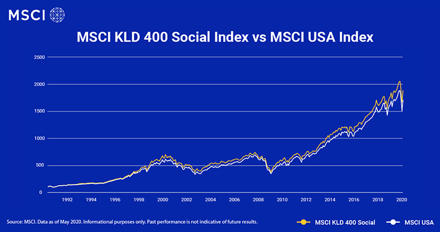

## Table of Contents

## What is the MSCI KLD 400 Social Index?

The MSCI KLD 400 Social Index is a stock market index that focuses on companies that meet certain social and environmental standards. It includes 400 companies from the United States that are chosen because they do well in areas like the environment, community involvement, and how they treat their employees and customers. The index is used by investors who want to put their money into companies that are not only financially successful but also good for society and the planet.

This index was created by MSCI, a company that provides research and data on investments, and KLD Research & Analytics, which specializes in evaluating companies based on their social performance. The MSCI KLD 400 Social Index is often used as a benchmark for socially responsible investing. This means that people can compare their own investments to this index to see if they are doing as well as companies that are known for being socially responsible.

## Who created the MSCI KLD 400 Social Index?

The MSCI KLD 400 Social Index was created by two companies working together: MSCI and KLD Research & Analytics. MSCI is a big company that helps people understand how to invest their money by giving them information and tools. KLD Research & Analytics is a company that looks at how companies behave in terms of social and environmental issues.

Together, they made the MSCI KLD 400 Social Index to help people find companies that are good for the world and also good investments. This index includes 400 companies from the United States that do well in areas like protecting the environment, helping the community, and treating employees and customers fairly.

## What types of companies are included in the MSCI KLD 400 Social Index?

The MSCI KLD 400 Social Index includes companies that are doing well in social and environmental areas. These companies are chosen because they are good at taking care of the environment, helping their communities, and treating their employees and customers well. They come from all kinds of industries, but they all have one thing in common: they are trying to make the world a better place while also being successful businesses.

The index looks at many different factors to decide which companies to include. It checks if the companies are reducing pollution, using energy efficiently, and protecting natural resources. It also looks at how companies treat their workers, if they support their communities, and if they are honest with their customers. By including companies that do well in these areas, the MSCI KLD 400 Social Index helps investors find businesses that are not only profitable but also good for society and the planet.

## How does the MSCI KLD 400 Social Index select its companies?

The MSCI KLD 400 Social Index picks companies based on how well they do in social and environmental areas. It looks at many different things to decide which companies to include. The index checks if companies are reducing pollution, using energy efficiently, and protecting natural resources. It also looks at how companies treat their workers, if they support their communities, and if they are honest with their customers. By doing this, the index makes sure that only companies that are trying to make the world a better place are included.

The companies in the MSCI KLD 400 Social Index come from all kinds of industries. They are all from the United States and are chosen because they do well in areas like the environment, community involvement, and how they treat their employees and customers. The index is made by MSCI and KLD Research & Analytics, who look at a lot of information to find the best companies. This way, investors can find businesses that are not only making money but also helping society and the planet.

## What are the key performance indicators used by the MSCI KLD 400 Social Index?

The MSCI KLD 400 Social Index uses several key performance indicators to choose which companies to include. These indicators help measure how well a company is doing in social and environmental areas. For the environment, the index looks at things like how much pollution a company makes, how they use energy, and if they are protecting natural resources. It also checks if the company is doing anything to help with climate change.

For social performance, the index looks at how companies treat their workers, if they support their communities, and how honest they are with their customers. This includes things like fair wages, safe working conditions, and helping out in the community. The index also considers if the company has any problems with human rights or if they are involved in controversial industries like tobacco or weapons. By looking at all these indicators, the MSCI KLD 400 Social Index makes sure that the companies it includes are trying to make the world a better place.

## How does the MSCI KLD 400 Social Index differ from other social indexes?

The MSCI KLD 400 Social Index is different from other social indexes because it focuses on a specific number of companies, exactly 400, all from the United States. This makes it more targeted than some other indexes that might include companies from all over the world or have a different number of companies. Also, the MSCI KLD 400 Social Index looks at a wide range of social and environmental factors to choose its companies. It cares about things like how a company treats its workers, how it helps the community, and how it protects the environment. This means it is very thorough in making sure the companies it includes are doing good things for the world.

Another way the MSCI KLD 400 Social Index is different is that it was created by two companies, MSCI and KLD Research & Analytics, working together. This collaboration brings together expertise in investment research and social performance evaluation, which is unique. Some other social indexes might be made by just one company or focus more on financial performance and less on social and environmental impact. The MSCI KLD 400 Social Index puts a lot of importance on both being good for the world and being a good investment, which makes it stand out from other indexes that might not balance these things as well.

## What is the historical performance of the MSCI KLD 400 Social Index?

The MSCI KLD 400 Social Index has done well over time. Since it started, it has often done as well or better than other big stock market indexes like the S&P 500. This means that people who put their money into companies that care about the environment and society have also seen their investments grow. The index has shown that you can invest in good companies and still make money.

Over the years, the MSCI KLD 400 Social Index has gone up and down like any other stock market index. But overall, it has had a good track record. This shows that focusing on social and environmental issues does not hurt a company's ability to make money. Instead, it can actually help them do well in the long run. So, the index has proven that being socially responsible can be good for both the world and your wallet.

## How can investors access the MSCI KLD 400 Social Index?

Investors can access the MSCI KLD 400 Social Index by buying funds that track it. These are called index funds or exchange-traded funds (ETFs). You can find these funds through a broker or a financial advisor. They will help you buy shares in the fund, which means you'll own a little bit of all the companies in the index. This way, you can invest in a lot of good companies at once without having to pick them yourself.

Another way to access the MSCI KLD 400 Social Index is by using it as a benchmark. This means you can compare your own investments to see how well they are doing compared to the companies in the index. If your investments are doing as well or better, you know you're doing a good job. If they're not, you might want to think about changing your investments to be more like the companies in the index. This can help you make better choices about where to put your money.

## What are the ESG criteria used in the MSCI KLD 400 Social Index?

The MSCI KLD 400 Social Index uses [ESG](/wiki/esg-investing) criteria, which stands for Environmental, Social, and Governance, to choose its companies. For the environmental part, the index looks at how much pollution a company makes, how they use energy, and if they are protecting natural resources. It also checks if the company is doing anything to help with climate change. This means the index wants companies that care about the planet and are trying to make it better.

For the social part, the index looks at how companies treat their workers, if they support their communities, and how honest they are with their customers. This includes things like fair wages, safe working conditions, and helping out in the community. The index also considers if the company has any problems with human rights or if they are involved in controversial industries like tobacco or weapons. By looking at all these social factors, the index makes sure the companies it includes are good for people and society.

The governance part of the ESG criteria focuses on how well a company is run. This includes things like how the company is managed, if it follows the law, and if it is open and honest about its business practices. Good governance means the company is less likely to have big problems and more likely to be a good investment. By considering all these ESG criteria, the MSCI KLD 400 Social Index picks companies that are not only good for the world but also good for investors.

## How often is the MSCI KLD 400 Social Index rebalanced?

The MSCI KLD 400 Social Index is rebalanced every year. This means that once a year, the companies in the index are checked to see if they still meet the social and environmental standards. If a company is not doing as well as it used to, it might be taken out of the index. And if a new company is doing really well in these areas, it might be added to the index.

Rebalancing helps make sure that the index always includes the best companies for social and environmental performance. By doing this every year, the index stays up to date with the latest information and changes in how companies are doing. This way, investors can trust that their money is going into companies that are trying to make the world a better place.

## What are the benefits of investing in the MSCI KLD 400 Social Index?

Investing in the MSCI KLD 400 Social Index can be good for you and the world. This index includes companies that care about the environment, treat their workers well, and help their communities. By putting your money into these companies, you are supporting businesses that are trying to make the world a better place. This can make you feel good about where your money is going, knowing that you are helping to support good causes.

Another benefit is that the MSCI KLD 400 Social Index has done well over time. It has often done as well or better than other big stock market indexes like the S&P 500. This means that you can invest in good companies and still see your money grow. So, you don't have to choose between making money and doing good for the world. With the MSCI KLD 400 Social Index, you can do both.

## What are the potential risks associated with the MSCI KLD 400 Social Index?

Investing in the MSCI KLD 400 Social Index can have some risks. One risk is that the companies in the index might not do as well as other companies that don't focus on social and environmental issues. This could mean your investment doesn't grow as fast or even loses value. Also, because the index only includes companies from the United States, it might not be as diverse as other indexes that include companies from all over the world. This could make it riskier because if the U.S. economy does badly, the whole index could be affected.

Another risk is that the social and environmental standards used by the index might change over time. If a company is no longer meeting these standards, it could be taken out of the index. This could cause the value of the index to go down if many companies are removed at once. Also, because the index is rebalanced every year, there might be times when the index is changing a lot, which can be risky if you're not ready for those changes. It's important to think about these risks before you decide to invest in the MSCI KLD 400 Social Index.

## References & Further Reading

[1]: Krosinsky, C., Robins, N., & Viederman, S. (2011). ["Evolutions in Sustainable Investing: Strategies, Funds and Thought Leadership."](https://books.google.com/books/about/Evolutions_in_Sustainable_Investing.html?id=oqc5HG88OWkC) Wiley Finance.

[2]: MSCI. (2023). ["MSCI KLD 400 Social Index."](https://www.msci.com/documents/10199/904492e6-527e-4d64-9904-c710bf1533c6) Methodology Document.

[3]: Lopez de Prado, M. (2018). ["Advances in Financial Machine Learning."](https://www.amazon.com/Advances-Financial-Machine-Learning-Marcos/dp/1119482089) Wiley.

[4]: Khan, N., & Hintsa, J. (2019). ["Blockchain and its Implications for Supply Chains."](https://www.researchgate.net/publication/378907870_Blockchain_technology_for_sustainable_supply_chains_A_comprehensive_review_and_future_prospects) Logistics and Supply Chain Management.

[5]: CFA Institute. (2020). ["Environmental, Social, and Governance Issues in Investing: A Guide for Investment Professionals."](https://rpc.cfainstitute.org/en/policy/positions/environmental-social-and-governance-issues-in-investing-a-guide-for-investment-professionals) CFA Institute Research Foundation.