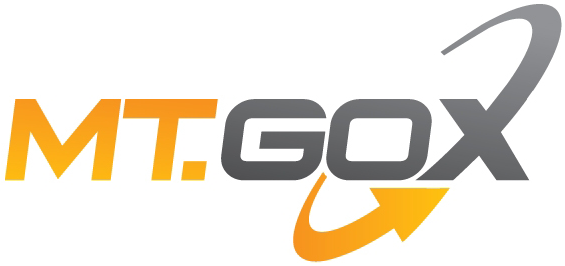

## Table of Contents

## What is Mt. Gox?

Mt. Gox was a website where people could buy and sell a type of digital money called Bitcoin. It started in 2010 and became very popular because it was one of the first places to do this. At its peak, it handled around 70% of all Bitcoin trades worldwide.

However, in 2014, something bad happened. Mt. Gox said that hackers stole a lot of Bitcoins from them, and they had to close down. This made a lot of people lose their money and trust in Bitcoin. Since then, people have been trying to get their money back, but it has been very hard and slow.

## When was Mt. Gox founded?

Mt. Gox was founded in 2010. It started as a place where people could trade cards for a game called Magic: The Gathering. That's why it was called "Mt. Gox" which stands for "Magic: The Gathering Online eXchange."

Later, Mt. Gox changed to become a place where people could buy and sell Bitcoin. It became very popular and was one of the first big websites for trading Bitcoin. At its best time, it handled a lot of Bitcoin trades all over the world.

## Who founded Mt. Gox?

Mt. Gox was founded by Jed McCaleb. He started it in 2010 as a place where people could trade cards for a game called Magic: The Gathering. That's why it was called "Mt. Gox," which stands for "Magic: The Gathering Online eXchange."

Later, Jed McCaleb changed Mt. Gox to become a place where people could buy and sell Bitcoin. It became very popular and was one of the first big websites for trading Bitcoin. At its best time, it handled a lot of Bitcoin trades all over the world.

## What was the primary function of Mt. Gox?

Mt. Gox started as a website where people could trade cards for a game called Magic: The Gathering. That's why it was called "Mt. Gox," which stands for "Magic: The Gathering Online eXchange." It was created by Jed McCaleb in 2010.

Later, Mt. Gox changed its main function. It became a place where people could buy and sell Bitcoin, a type of digital money. It became very popular and was one of the first big websites for trading Bitcoin. At its best time, it handled a lot of Bitcoin trades all over the world.

## How did Mt. Gox become the largest Bitcoin exchange?

Mt. Gox became the largest Bitcoin exchange because it was one of the first places where people could easily buy and sell Bitcoin. It started in 2010, and at that time, there weren't many other places to trade Bitcoin. This made Mt. Gox very popular quickly because people needed a place to trade their Bitcoin. As more and more people started using Bitcoin, Mt. Gox grew bigger and bigger.

At its peak, Mt. Gox handled around 70% of all Bitcoin trades worldwide. This was because it was easy to use and had a lot of users. People trusted Mt. Gox because it was one of the first big exchanges, and it had a lot of Bitcoin available for trading. But in 2014, things went wrong when hackers stole a lot of Bitcoins, and Mt. Gox had to close down.

## What were the early security issues faced by Mt. Gox?

In the early days, Mt. Gox faced a lot of security problems. One big issue was that it didn't have strong enough security to protect users' accounts. Hackers found ways to break into the system and steal Bitcoins. This made people worried about using Mt. Gox because they were afraid their money wasn't safe.

Another problem was that Mt. Gox didn't have good ways to check if people were who they said they were. This meant that someone could pretend to be someone else and take their Bitcoins. These early security issues made it hard for Mt. Gox to keep people's trust, and it was a big reason why it had so many problems later on.

## What led to the eventual collapse of Mt. Gox?

The collapse of Mt. Gox came in 2014 after years of security problems. Hackers had been stealing Bitcoins from the exchange for a long time. Mt. Gox didn't have strong enough security to stop them. They also didn't have good ways to check if people were who they said they were. This made it easy for hackers to take Bitcoins from users' accounts. These security issues made people lose trust in Mt. Gox.

In February 2014, Mt. Gox announced that hackers had stolen a huge amount of Bitcoins, around 850,000, which was worth about $450 million at the time. This was a big shock to everyone. Mt. Gox had to close down because they didn't have enough money to give back to their users. This made a lot of people lose their money and trust in Bitcoin. Since then, people have been trying to get their money back, but it has been very hard and slow.

## When did Mt. Gox file for bankruptcy?

Mt. Gox filed for bankruptcy on February 28, 2014. This happened after they said hackers stole a lot of Bitcoins from them. They couldn't give the money back to the people who used their website. This made a lot of people very upset because they lost their money.

The bankruptcy filing was a big shock to everyone. Mt. Gox was once the biggest place to buy and sell Bitcoin. But because of the security problems and the stolen Bitcoins, they had to close down. Since then, people have been trying to get their money back, but it has been very hard and slow.

## How much Bitcoin was lost during the Mt. Gox collapse?

During the Mt. Gox collapse, around 850,000 Bitcoins were lost. This was a huge amount of money because each Bitcoin was worth about $450 at that time. So, the total value of the lost Bitcoins was around $450 million. This made a lot of people very upset because they lost their money.

The loss happened because hackers were able to steal the Bitcoins from Mt. Gox. The exchange didn't have strong enough security to stop the hackers. When Mt. Gox found out about the stolen Bitcoins, they had to close down because they couldn't give the money back to their users. Since then, people have been trying to get their money back, but it has been very hard and slow.

## What were the legal repercussions following the Mt. Gox collapse?

After the Mt. Gox collapse, there were a lot of legal problems. The people who lost their money were very upset and wanted to get it back. They started suing Mt. Gox and the people who ran it. The founder, Jed McCaleb, had already sold the company before the collapse, so he wasn't in charge when it happened. But the new CEO, Mark Karpelès, was blamed for not doing enough to stop the hackers. He was arrested in Japan in 2015 and charged with fraud and other crimes. He spent time in jail but was later released on bail.

The legal fights went on for a long time. In 2018, a Japanese court approved a plan to help the people who lost money. This plan was about selling the Bitcoins that Mt. Gox still had and using the money to pay back the people who lost money. But it was hard and slow because the value of Bitcoin kept changing. In 2021, Mark Karpelès was found not guilty of the main charges but was given a suspended sentence for other smaller crimes. The whole thing showed how hard it can be to deal with digital money and the laws around it.

## How did the Mt. Gox collapse affect the broader cryptocurrency market?

The Mt. Gox collapse had a big impact on the whole [cryptocurrency](/wiki/cryptocurrency) market. When Mt. Gox closed down in 2014, a lot of people lost trust in Bitcoin. The price of Bitcoin dropped a lot because people were scared and didn't want to use it anymore. This made it hard for other Bitcoin exchanges too because people were worried that the same thing could happen to them. It showed everyone that there were big risks with using cryptocurrencies.

But the collapse also helped make the cryptocurrency market stronger in the long run. People learned from the mistakes of Mt. Gox and started working on better security for their exchanges. New rules and ways to check if exchanges were safe were made. This helped people feel more confident about using cryptocurrencies again. Even though it was a big problem at the time, it made the market grow and become more trusted in the future.

## What lessons can be learned from the Mt. Gox collapse to prevent future exchange failures?

The Mt. Gox collapse taught us a lot about how to keep cryptocurrency exchanges safe. One big lesson is that exchanges need strong security to protect people's money. Mt. Gox didn't have good enough security, which let hackers steal a lot of Bitcoins. Now, exchanges use better security like two-[factor](/wiki/factor-investing) authentication and keeping most of the money in offline storage to stop hackers. They also need to check if people are who they say they are to stop fraud.

Another lesson is that exchanges should be open and honest with their users. Mt. Gox didn't tell people about the problems they were having until it was too late. Now, good exchanges share information about their security and money with users regularly. This helps people trust the exchange more. Also, having clear rules and ways to check if exchanges are doing things right can help prevent big problems like what happened with Mt. Gox.

## References & Further Reading

[1]: Popper, N. (2016). ["Digital Gold: Bitcoin and the Inside Story of the Misfits and Millionaires Trying to Reinvent Money."](https://www.amazon.com/Digital-Gold-Bitcoin-Millionaires-Reinvent/dp/006236250X) Harper.

[2]: Vigna, P., & Casey, M. J. (2016). ["The Age of Cryptocurrency: How Bitcoin and Digital Money Are Challenging the Global Economic Order."](https://archive.org/details/ageofcryptocurre0000vign) St. Martin's Griffin.

[3]: ["Mt. Gox: Legendary Closure - The Full Story of a Bitcoin Bankruptcy."](https://www.wired.com/story/after-a-10-year-wait-mt-gox-bitcoin-is-finally-being-returned/) CoinDesk.

[4]: De Filippi, P., & Wright, A. (2018). ["Blockchain and the Law: The Rule of Code."](https://www.jstor.org/stable/j.ctv2867sp) Harvard University Press.

[5]: Bryans, D. (2014). ["Bitcoin and Money Laundering: Mining for an Effective Solution."](https://www.repository.law.indiana.edu/cgi/viewcontent.cgi?article=11100&context=ilj) Fordham Law Review, 89(2), 503-533.

[6]: Zohar, A. (2015). "Bitcoin: Under the Hood." Communications of the ACM, 58(9), 104-113.