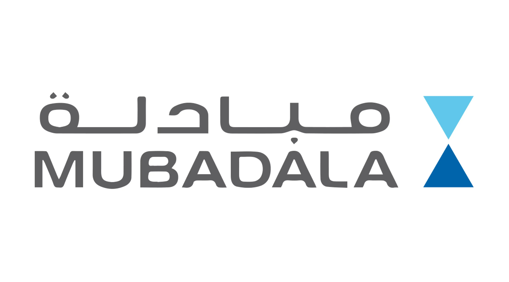

## Table of Contents

## What is Mubadala Development Company?

Mubadala Development Company is a big investment company from Abu Dhabi, in the United Arab Emirates. It was started in 2002 to help grow the economy of Abu Dhabi by investing in different businesses and projects around the world. The company puts money into many different areas like energy, technology, and real estate. This helps to make the economy stronger and create new jobs.

Mubadala works with other big companies and governments to make these investments. They believe in working together to find new opportunities and solve problems. By doing this, they help to bring new ideas and technology to Abu Dhabi and other places. This makes the company important not just for Abu Dhabi, but for the whole world.

## When was Mubadala founded?

Mubadala Development Company was founded in 2002. It is a big investment company from Abu Dhabi, in the United Arab Emirates. The company was started to help grow the economy of Abu Dhabi by investing in different businesses and projects around the world.

Mubadala invests in many different areas like energy, technology, and real estate. This helps to make the economy stronger and create new jobs. The company works with other big companies and governments to find new opportunities and solve problems.

## What is the mission of Mubadala?

Mubadala's mission is to help grow the economy of Abu Dhabi and make it stronger. They do this by investing in different businesses and projects all over the world. This helps to bring new ideas and technology to Abu Dhabi, which can make the city better and create more jobs for people.

The company believes in working together with other big companies and governments. By doing this, they can find new opportunities and solve problems. Mubadala invests in many different areas like energy, technology, and real estate. This helps to make the economy stronger and create a better future for everyone.

## In which sectors does Mubadala invest?

Mubadala invests in many different areas. Some of these areas are energy, technology, and real estate. They also put money into aerospace, healthcare, and financial services. This helps them to spread their investments and reduce risks.

By investing in these different sectors, Mubadala helps to grow the economy of Abu Dhabi. They work with other big companies and governments to find new opportunities. This can bring new ideas and technology to Abu Dhabi, which can make the city better and create more jobs for people.

Mubadala believes in working together to solve problems. They think that by investing in different areas, they can help make the economy stronger and create a better future for everyone. This is why they invest in so many different sectors.

## What are some of the key subsidiaries of Mubadala?

Mubadala has many important companies under it. One of them is Masdar, which works on clean energy and sustainable projects. Another key subsidiary is Emirates Global Aluminium, which is a big company that makes aluminium. Mubadala also owns a part of Piaggio Aerospace, which makes planes and drones.

Another important subsidiary is Mubadala Health, which provides healthcare services. They also have a big stake in Aldar Properties, which builds and manages real estate in Abu Dhabi. These subsidiaries help Mubadala to invest in different areas and make the economy of Abu Dhabi stronger.

Mubadala also owns part of Yahsat, a company that provides satellite communication services. They have a stake in GlobalFoundries, which makes semiconductor chips. These companies help Mubadala to bring new technology and ideas to Abu Dhabi, which can create more jobs and make the city better.

## How does Mubadala contribute to the economic diversification of Abu Dhabi?

Mubadala helps make Abu Dhabi's economy stronger and more diverse by investing in many different areas like energy, technology, and real estate. Instead of relying on just oil, which can go up and down in price, Abu Dhabi can have a more stable economy. By putting money into different businesses and projects, Mubadala helps bring new ideas and technology to the city. This creates more jobs and makes the economy grow in new ways.

Mubadala works with other big companies and governments to find new opportunities. This helps bring more investment into Abu Dhabi and makes the city a place where people want to do business. By investing in different sectors, Mubadala reduces the risk of depending too much on one industry. This makes the economy of Abu Dhabi more balanced and helps it to grow in a healthy way.

## What is the global reach of Mubadala's investments?

Mubadala has investments all over the world. They put money into businesses and projects in many different countries. This helps them to spread their investments and find new opportunities everywhere. By doing this, Mubadala can bring new ideas and technology back to Abu Dhabi, which makes the city better and creates more jobs.

Mubadala works with big companies and governments in different places. They invest in areas like energy, technology, and real estate in countries across North America, Europe, Asia, and the Middle East. This global reach helps Mubadala to grow the economy of Abu Dhabi by making it more diverse and strong. By working together with others, they can solve problems and find new ways to make the world a better place.

## How does Mubadala approach sustainability and corporate social responsibility?

Mubadala cares about sustainability and being responsible. They try to make their investments good for the environment and the community. Mubadala has a company called Masdar that works on clean energy and sustainable projects. This helps to reduce the impact of their investments on the planet. They also look at how their businesses can be more sustainable, like using less energy and making less waste.

Mubadala also focuses on corporate social responsibility. They want to help the communities where they work. They do this by creating jobs and supporting education and health programs. Mubadala believes in giving back to society and making a positive difference. By working with others, they try to solve problems and make the world a better place for everyone.

## What are some notable projects or investments Mubadala has been involved in?

Mubadala has been involved in many important projects. One of them is Masdar City, a place in Abu Dhabi that focuses on clean energy and being sustainable. They are also part of Emirates Global Aluminium, which is a big company that makes aluminium. Another project is their investment in GlobalFoundries, a company that makes semiconductor chips. These chips are used in many electronic devices.

Mubadala also invests in healthcare through Mubadala Health, which provides medical services. They have a stake in Aldar Properties, which builds and manages real estate in Abu Dhabi. Another notable investment is in Yahsat, a company that provides satellite communication services. These projects help Mubadala to grow the economy of Abu Dhabi and make it stronger by bringing in new technology and ideas.

## How does Mubadala manage its investment portfolio?

Mubadala manages its investment portfolio by spreading its money across many different areas like energy, technology, and real estate. This helps them to reduce risks because if one area does not do well, the others might still be strong. They work with other big companies and governments to find new opportunities and make smart investments. By doing this, Mubadala can bring new ideas and technology to Abu Dhabi, which helps the city grow and create more jobs.

Mubadala also looks at how their investments can be good for the environment and the community. They have a company called Masdar that focuses on clean energy and sustainable projects. This helps to make their investments more responsible. Mubadala believes in working together to solve problems and make the world a better place. By managing their portfolio carefully, they can help the economy of Abu Dhabi become stronger and more diverse.

## What is the governance structure of Mubadala?

Mubadala has a clear way of making decisions and managing the company. At the top, there is a Board of Directors. The Board sets the big goals for the company and makes sure it follows the rules. The CEO, who is chosen by the Board, runs the day-to-day work of Mubadala. The CEO works with other leaders in the company to make sure everything goes smoothly.

The company is split into different parts, each focusing on a specific area like energy or technology. Each part has its own leader who reports to the CEO. This helps Mubadala to manage its many investments well. They also have teams that look at risks and make sure the company is being responsible. This way, Mubadala can keep growing and helping Abu Dhabi's economy.

## What are the future strategic plans of Mubadala?

Mubadala wants to keep growing and helping Abu Dhabi's economy in the future. They plan to invest in new areas like technology and clean energy. This will help make the economy more diverse and strong. Mubadala will work with other big companies and governments to find new opportunities. By doing this, they can bring new ideas and technology to Abu Dhabi, which will create more jobs and make the city better.

They also want to focus on being sustainable and responsible. Mubadala will keep supporting projects like Masdar City, which is all about clean energy. They will look at how their investments can be good for the environment and the community. By working together with others, Mubadala hopes to solve problems and make the world a better place. This way, they can help Abu Dhabi grow in a healthy way and be ready for the future.

## References & Further Reading

[1]: Bergstra, J., Bardenet, R., Bengio, Y., & Kégl, B. (2011). ["Algorithms for Hyper-Parameter Optimization."](https://dl.acm.org/doi/10.5555/2986459.2986743) Advances in Neural Information Processing Systems 24.

[2]: ["Advances in Financial Machine Learning"](https://www.amazon.com/Advances-Financial-Machine-Learning-Marcos/dp/1119482089) by Marcos Lopez de Prado

[3]: ["Evidence-Based Technical Analysis: Applying the Scientific Method and Statistical Inference to Trading Signals"](https://www.amazon.com/Evidence-Based-Technical-Analysis-Scientific-Statistical/dp/0470008741) by David Aronson

[4]: ["Machine Learning for Algorithmic Trading"](https://github.com/stefan-jansen/machine-learning-for-trading) by Stefan Jansen

[5]: ["Quantitative Trading: How to Build Your Own Algorithmic Trading Business"](https://www.amazon.com/Quantitative-Trading-Build-Algorithmic-Business/dp/1119800064) by Ernest P. Chan