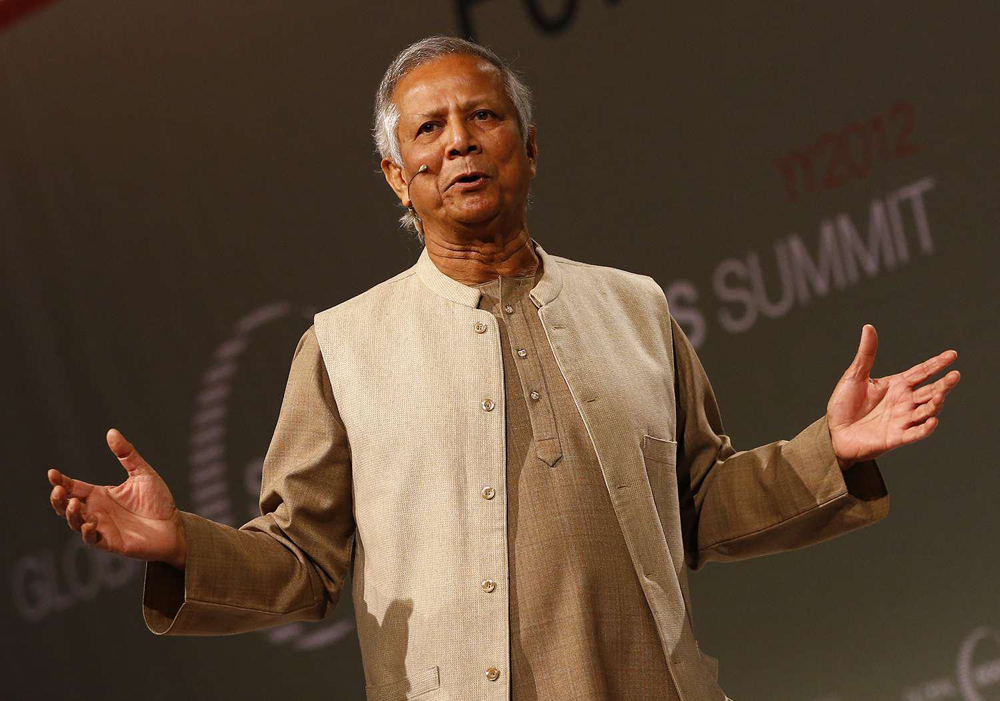

## Table of Contents

## Who is Muhammad Yunus?

Muhammad Yunus is a famous person from Bangladesh who started a special kind of bank called Grameen Bank. He is known for helping poor people, especially women, by giving them small loans to start their own businesses. This idea is called microcredit. Because of his work, many people around the world have been able to improve their lives.

In 2006, Muhammad Yunus and Grameen Bank were given the Nobel Peace Prize. This is a very big award that shows how important his work is. Yunus believes that everyone should have the chance to work and earn money, no matter how poor they are. His ideas have inspired many other people and organizations to help poor people in new ways.

## When and where was Muhammad Yunus born?

Muhammad Yunus was born on June 28, 1940. He was born in a place called Chittagong, which is a city in Bangladesh. 

When he was born, Bangladesh was not yet a separate country. It was part of a bigger country called Pakistan. Later, Bangladesh became its own country in 1971.

## What is the Grameen Bank and how did it start?

The Grameen Bank is a special bank in Bangladesh that helps poor people, especially women, by giving them small loans to start their own businesses. These loans are called microcredit. The bank was started by Muhammad Yunus, who wanted to help people who were too poor to get loans from regular banks. The idea behind Grameen Bank is that even very poor people can improve their lives if they get a small amount of money to start a business.

Muhammad Yunus started the Grameen Bank in 1983, but the idea began much earlier. In the late 1970s, Yunus was a professor and saw that many people in a village near his university were struggling to survive. He decided to lend a small amount of money to a group of women who made bamboo stools. They used the money to buy materials and sell their products. This worked well, so Yunus decided to help more people in the same way. Over time, this grew into the Grameen Bank, which now helps millions of people in Bangladesh and around the world.

## What is microfinance and how did Yunus popularize it?

Microfinance is a way to help poor people by giving them small loans, called microcredit, to start or grow their own small businesses. These loans are usually given to people who can't get money from regular banks because they are too poor or don't have anything to use as a guarantee. Microfinance also includes other financial services like savings accounts and insurance. The idea is to help people lift themselves out of poverty by giving them the tools they need to earn money.

Muhammad Yunus popularized microfinance through his work with the Grameen Bank. He started by lending small amounts of money to poor women in a village in Bangladesh. When he saw that these women could use the money to improve their lives, he decided to help more people in the same way. Over time, the Grameen Bank grew and became a model for other organizations around the world. Yunus's success with microfinance showed that even very small loans can make a big difference in the lives of poor people. This idea spread to many other countries, and now microfinance is used to help millions of people around the world.

## What awards has Muhammad Yunus received for his work?

Muhammad Yunus has received many awards for his work. One of the most important awards he got is the Nobel Peace Prize. He shared this prize with the Grameen Bank in 2006. This award is given to people who help make the world a more peaceful place. Yunus got it because his work with microfinance helps poor people improve their lives and live in peace.

Besides the Nobel Peace Prize, Yunus has also received other important awards. He got the Presidential Medal of Freedom from the United States in 2009. This is a very high honor given by the President of the United States. He also received the Congressional Gold Medal in 2010, which is another big award given by the U.S. Congress. These awards show how much people around the world appreciate his work in helping poor people.

## How has Yunus's work impacted poverty alleviation?

Muhammad Yunus's work has made a big difference in helping poor people around the world. He started the Grameen Bank, which gives small loans to poor people, especially women, so they can start their own businesses. This idea, called microfinance, has helped millions of people lift themselves out of poverty. By giving people the chance to earn money and support their families, Yunus's work has shown that even small loans can change lives. Many people who used to be very poor are now able to buy food, send their children to school, and live better lives because of the help they got from the Grameen Bank.

Yunus's ideas have also inspired other people and organizations to start their own microfinance programs in many different countries. This means that even more poor people can get the help they need to improve their lives. His work has shown the world that poverty can be fought by giving people the tools they need to help themselves. Because of Yunus, more people believe that everyone, no matter how poor, deserves the chance to work and earn money. His impact on poverty alleviation is huge and continues to grow as more people follow his example.

## What are some of the key books written by Muhammad Yunus?

Muhammad Yunus has written several important books that explain his ideas and work. One of his most famous books is "Banker to the Poor: Micro-Lending and the Battle Against World Poverty." In this book, Yunus tells the story of how he started the Grameen Bank and how microfinance can help poor people. He shares his experiences and the challenges he faced, making it easy for readers to understand why his work is so important.

Another key book by Yunus is "Creating a World Without Poverty: Social Business and the Future of Capitalism." In this book, Yunus introduces the idea of social business, which is a type of business that aims to solve social problems rather than just making money. He explains how social businesses can work alongside traditional businesses to help more people and make the world a better place. Both books are important because they share Yunus's vision for a world where everyone can live without poverty.

## What criticisms have been leveled against Yunus and his methods?

Some people have said that Muhammad Yunus's microfinance methods can cause problems. They think that the small loans given by the Grameen Bank can make people get into too much debt. If someone can't pay back their loan, they might have to borrow more money, making their situation worse. Also, some people say that the interest rates on these loans are too high, which can be hard for poor people to handle. Critics worry that instead of helping poor people, microfinance might sometimes make their lives harder.

Another criticism is about how the Grameen Bank works. Some people think it puts too much pressure on borrowers to pay back their loans on time. They say this can be stressful and might not be fair to people who are already struggling. There have also been questions about how the bank manages its money and whether it is always being used in the best way to help people. Despite these criticisms, many people still believe that Yunus's ideas have helped a lot of poor people around the world.

## How has the concept of social business been developed by Yunus?

Muhammad Yunus came up with the idea of social business to help solve social problems in a new way. A social business is a type of company that focuses on helping people and the environment instead of just making money for the owners. In a social business, any profits made are used to grow the business or to help more people, not to give money to shareholders. Yunus believes that social businesses can work alongside regular businesses to make the world a better place. He thinks that if more people start social businesses, we can solve big problems like poverty and hunger.

Yunus wrote a book called "Creating a World Without Poverty: Social Business and the Future of Capitalism" to explain his ideas about social business. In the book, he gives examples of how social businesses can work. For instance, he talks about a company that makes affordable health products for poor people. The company uses any profits to make more products and help more people, not to pay rich shareholders. Yunus hopes that his ideas will inspire more people to start social businesses and make a difference in the world.

## What role has Yunus played in international development and policy?

Muhammad Yunus has had a big impact on international development and policy. He has worked with many groups and countries to spread his ideas about microfinance and social business. He talks to leaders and helps make new rules that can help poor people around the world. He has spoken at the United Nations and other big meetings to share his ideas. Many countries have started their own microfinance programs because of what Yunus has done.

Yunus has also helped start the Yunus Centre and the Grameen Creative Lab, which work with people in different countries to start social businesses. These groups help teach people how to use social business to solve problems like poverty and bad health. Yunus's work has changed how people think about helping poor countries. Instead of just giving money, he shows that giving people tools to help themselves can make a bigger difference. His ideas have become part of many countries' plans to help their people live better lives.

## What are the current projects and initiatives led by Yunus?

Muhammad Yunus is still working on many projects to help people around the world. He runs the Yunus Centre, which helps people start social businesses. These businesses focus on solving problems like poverty and bad health instead of just making money. The Yunus Centre works with people in many countries to teach them how to start these businesses. Yunus also works with the Grameen Creative Lab, which helps people come up with new ideas for social businesses. These projects help more people get the tools they need to improve their lives.

Another important project Yunus is working on is the Social Business Fund. This fund gives money to new social businesses to help them grow. It's a way to make sure that good ideas can turn into real businesses that help people. Yunus believes that if more people start social businesses, we can solve big problems like hunger and poor health. He also works with many groups and governments to spread his ideas about microfinance and social business. His work helps shape new rules and plans to help poor people around the world.

## How has Yunus's approach to economics influenced global economic thought?

Muhammad Yunus's approach to economics has changed how people around the world think about helping poor people. He showed that giving small loans, called microcredit, to poor people can help them start businesses and improve their lives. This idea, called microfinance, has become very popular. Many countries and organizations now use microfinance to help poor people. Yunus's work has made people see that even very small amounts of money can make a big difference. His ideas have also made people think more about how to help poor people in new ways, not just by giving them money but by giving them tools to help themselves.

Yunus also introduced the idea of social business, which is a type of business that focuses on solving social problems instead of just making money. This idea has changed how people think about business and economics. Many people now believe that businesses can be used to help solve big problems like poverty and bad health. Yunus's work has inspired many people to start their own social businesses. His ideas have also influenced how governments and big organizations make plans to help poor people. Overall, Yunus's approach has made people think more about how to use economics to make the world a better place for everyone.

## What are the challenges and criticisms of microfinance?

Microfinance, while a transformative tool for economic empowerment, is not without its detractors and challenges. A primary criticism is its tendency to impose high interest rates on borrowers. Unlike traditional banking systems which often benefit from economies of scale, microfinance institutions (MFIs) face higher operational costs per loan due to the small loan amounts and the geographic [dispersion](/wiki/dispersion-trading) of their clientele. These factors can lead to interest rates that, although lower than informal money lenders, are still considerably higher than conventional bank loans. For example, the operational cost ratio can be represented as:

$$
\text{Operational Cost Ratio} = \frac{\text{Total Operating Costs}}{\text{Average Loan Portfolio}}
$$

This ratio often remains high for MFIs, necessitating higher interest rates to cover expenses and sustain operations.

Additionally, the risk of over-indebtedness among microfinance borrowers is a significant concern. Borrowers may take out multiple loans from different sources to meet immediate financial needs, leading to cyclical debt. The lack of a centralized credit reporting system for low-income borrowers exacerbates this issue, making it challenging for MFIs to assess an individual's existing financial obligations accurately.

Critics also highlight the potential for microloans to create dependency rather than fostering independence. Without proper financial education and guidance, borrowers might mismanage funds, using loans for consumption purposes rather than income-generating activities. This not only hampers their ability to repay but also undermines the fundamental goal of microfinance, which is to enhance long-term economic stability.

To address these criticisms, ethical practices must be prioritized within microfinance institutions. This includes transparent communication about loan terms, providing financial literacy training, and implementing robust assessment processes to determine borrowers' financial health accurately. Balancing financial sustainability with the social mission of poverty alleviation is crucial. MFIs need to adopt a model that ensures fair lending practices while maintaining operational viability.

Moreover, innovation in technology could offer solutions to some of these challenges. For instance, digital platforms can streamline loan processing, reduce operational costs, and provide better insights into borrowers' financial behaviors. However, deploying technologies must be done thoughtfully to ensure they are accessible to underserved communities, aligning with the ethical objectives of microfinance.

## References & Further Reading

[1]: Yunus, M. (2007). ["Creating a World Without Poverty: Social Business and the Future of Capitalism."](https://www.globalurban.org/GUDMag08Vol4Iss2/Yunus.pdf) PublicAffairs.

[2]: Armendáriz, B., & Morduch, J. (2010). ["The Economics of Microfinance."](https://mitpress.mit.edu/9780262513982/the-economics-of-microfinance/) MIT Press.

[3]: Cull, R., Demirgüç-Kunt, A., & Morduch, J. (2009). ["Microfinance Meets the Market."](https://www.aeaweb.org/articles?id=10.1257/jep.23.1.167) Journal of Economic Perspectives, 23(1), 167-192.

[4]: Ledgerwood, J. (1998). ["Microfinance Handbook: An Institutional and Financial Perspective."](https://documents.worldbank.org/en/publication/documents-reports/documentdetail/347491468326386001/microfinance-handbook-an-institutional-and-financial-perspective) World Bank Publications.

[5]: Morvant-Roux, S., Guérin, I., Roesch, M., & Moisseron, J. (2014). ["Adding Value to Randomization with Qualitative Analysis: The Case of Microcredit in Rural Morocco."](https://www.unige.ch/sciences-societe/ideso/recherche/morvant-roux/publications) World Development, 56, 302-312.

[6]: Bateman, M. (2010). ["Why Doesn't Microfinance Work? The Destructive Rise of Local Neoliberalism."](https://www.researchgate.net/publication/348763029_Why_Doesn%27t_Microfinance_Work_The_Destructive_Rise_of_Local_Neoliberalism) Zed Books.

[7]: Roodman, D. (2012). ["Due Diligence: An Impertinent Inquiry into Microfinance."](https://www.cgdev.org/sites/default/files/archive/doc/full_text/DueDiligence/Roodman_Due_Diligence.html) Center for Global Development.

[8]: Sinclair, H. (2012). ["Confessions of a Microfinance Heretic: How Microlending Lost Its Way and Betrayed the Poor."](https://archive.org/details/confessionsofmic0000sinc) Berrett-Koehler Publishers.