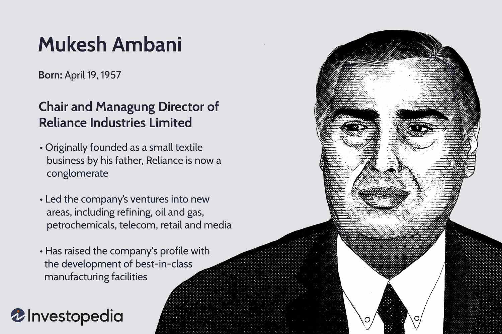

## Table of Contents

## Who is Mukesh Ambani?

Mukesh Ambani is a very rich businessman from India. He is the chairman and biggest shareholder of a big company called Reliance Industries. This company does many things like making oil and gas, and also has stores and phone services. Mukesh was born on April 19, 1957, in Yemen, but he grew up in India. His father, Dhirubhai Ambani, started Reliance Industries, and Mukesh helped make it very successful.

Mukesh Ambani lives in a very big house in Mumbai called Antilia. It is one of the most expensive houses in the world. He is married to Nita Ambani, and they have three children. Mukesh is known for being very smart in business and for making Reliance Industries grow a lot. He is also known for helping with charity work in India, like building schools and hospitals.

## What is Mukesh Ambani's educational background?

Mukesh Ambani went to school at Hill Grange High School in Mumbai. After finishing school, he went to St. Xavier's College in Mumbai for his Bachelor's degree in Chemical Engineering. He did well in his studies and was a good student.

After getting his Bachelor's degree, Mukesh Ambani wanted to learn more about business. So, he went to Stanford University in the United States to study for a Master's degree in Business Administration (MBA). But, he did not finish his MBA because he came back to India to help his father with their family business, Reliance Industries.

## How did Mukesh Ambani start his career?

Mukesh Ambani started his career by joining his father's company, Reliance Industries, right after he left Stanford University. He did not finish his MBA because his father needed help with the business. When Mukesh joined, Reliance was already doing well, but he helped it grow even more. He started working on different projects and soon became very important in the company.

At first, Mukesh worked on making the company's factories better and more efficient. He helped build a big factory in Jamnagar, which was very important for making oil and gas products. As time went on, he took on bigger roles and became the head of the company after his father passed away. Under his leadership, Reliance Industries grew into a huge company that does many different things, like selling things in stores and providing phone services.

## What are the major companies owned by Mukesh Ambani?

Mukesh Ambani owns a big company called Reliance Industries. This company does a lot of different things. It makes oil and gas, which means they find oil and gas in the ground and then sell it. They also have stores where people can buy things like clothes and food. These stores are called Reliance Retail. Another big part of the company is called Jio, which gives people phone and internet services. Jio has become very popular in India because it offers good services at lower prices.

Besides Reliance Industries, Mukesh Ambani also has other businesses. One of them is called Network18, which owns TV channels and websites that give news and entertainment. Another business is called Reliance Jio Infocomm, which is a big part of Jio and focuses on making the internet and phone services better. All these companies together make Mukesh Ambani one of the richest and most powerful business people in India.

## What are some of Mukesh Ambani's notable achievements in business?

Mukesh Ambani has made big achievements in business, especially with Reliance Industries. He helped turn the company into a giant that does many things, like making oil and gas, running stores, and providing phone and internet services. One of his biggest achievements was building a huge factory in Jamnagar for making oil and gas products. This factory helped Reliance become a leader in the oil and gas industry in India. Mukesh also started Jio, which quickly became very popular because it offered cheap and good phone and internet services. Jio changed how people in India use the internet and phones.

Another important achievement is how Mukesh grew Reliance Retail. This part of the company runs many stores where people can buy clothes, food, and other things. Under his leadership, Reliance Retail became one of the biggest retail companies in India. Mukesh also made smart business deals and partnerships that helped the company grow even more. His ability to see new opportunities and take big risks has made Reliance Industries very successful and has helped make him one of the richest people in the world.

## How has Mukesh Ambani influenced the telecommunications industry in India?

Mukesh Ambani changed the telecommunications industry in India a lot when he started Jio. Before Jio, phone and internet services were expensive, and not everyone could use them. But Jio made these services much cheaper. They offered free calls and very cheap data plans. This made it possible for many more people in India to use the internet and phones. Because of Jio, the number of people using the internet in India grew very fast.

Jio also brought new technology to India. They started using 4G services, which are faster and better than the older 3G services. This helped people do more things online, like watching videos and playing games. Jio's competition with other companies made everyone lower their prices and improve their services. This competition was good for customers because they got better services for less money. Mukesh Ambani's work with Jio really changed how people in India use the internet and phones.

## What role does Mukesh Ambani play in the global energy sector?

Mukesh Ambani plays a big role in the global energy sector through his company, Reliance Industries. Reliance is one of the biggest companies in the world that makes oil and gas. They find oil and gas in the ground and then sell it to other countries. Mukesh helped build a huge factory in Jamnagar, India, which makes a lot of oil and gas products. This factory is very important because it helps meet the energy needs of many countries.

Besides oil and gas, Mukesh Ambani is also working on new types of energy. He wants Reliance to be a leader in renewable energy, like solar and wind power. This is important because the world needs to find cleaner ways to make energy. Mukesh's work in both traditional and new energy sources helps make sure that people around the world have the energy they need, while also trying to protect the environment.

## What are Mukesh Ambani's contributions to philanthropy?

Mukesh Ambani and his family do a lot of good things to help people through their charity work. They started the Reliance Foundation, which does many projects to help people in India. The foundation helps build schools and hospitals, so more people can get education and health care. They also help during disasters, like floods or earthquakes, by giving food, water, and other things people need. Mukesh believes it's important to give back to the community and make life better for people.

One big thing Mukesh Ambani did is help build a new hospital in Mumbai called the Sir H.N. Reliance Foundation Hospital. This hospital gives very good medical care to people who might not be able to afford it. Another important project is the Dhirubhai Ambani International School, which is a very good school in Mumbai. This school helps students get a great education and learn important skills. Through these and other projects, Mukesh Ambani and his family are making a big difference in many people's lives in India.

## How has Mukesh Ambani's leadership style evolved over the years?

Mukesh Ambani's leadership style has changed a lot over the years. When he first started working with his father at Reliance Industries, he focused a lot on making the company's factories better and more efficient. He was very hands-on and paid close attention to details. As he took on bigger roles and became the head of the company, his style changed. He started thinking more about the big picture and how to grow the company in new ways. He took risks and made big decisions that helped Reliance become a giant in many different industries.

Now, Mukesh Ambani is known for being a visionary leader. He sees opportunities where others might not and is always looking for new ways to make the company grow. He encourages innovation and is not afraid to try new things, like starting Jio to change the telecommunications industry in India. He also works to make sure that the company helps the community through philanthropy. His leadership style has evolved from being very focused on details to being more about big ideas and making a difference in the world.

## What challenges has Mukesh Ambani faced in his career, and how did he overcome them?

Mukesh Ambani faced many challenges in his career. One big challenge was when his father, Dhirubhai Ambani, passed away in 2002. After that, there was a big fight between Mukesh and his brother, Anil, about who should run the family business. This fight caused a lot of problems and even split the company into two parts. But Mukesh worked hard and stayed focused on growing his part of the business. He made smart decisions and kept working to make Reliance Industries successful again.

Another challenge was when Mukesh started Jio. Many people thought it would be hard to compete with the big phone companies already in India. But Mukesh had a plan. He offered very cheap services and made sure that Jio used the latest technology. This helped Jio become very popular very quickly. Even though it was a big risk, Mukesh's hard work and smart planning helped Jio change the way people use the internet and phones in India. By facing these challenges head-on and not giving up, Mukesh Ambani showed that he is a strong leader who can overcome big problems.

## How does Mukesh Ambani's business strategy impact the Indian economy?

Mukesh Ambani's business strategies have a big impact on the Indian economy. Through Reliance Industries, he has created many jobs for people in India. His company does a lot of different things, like making oil and gas, running stores, and providing phone and internet services. When these parts of the company do well, it helps the economy grow because more people can work and earn money. Also, when Reliance Retail sells things at lower prices, it helps people save money and spend more on other things, which is good for the economy.

Another way Mukesh Ambani's strategies help the Indian economy is by bringing new technology and ideas to the country. When he started Jio, it made phone and internet services much cheaper and easier for people to use. This helped more people in India get online and use the internet for work, school, and fun. Jio's success also made other companies in India work harder and offer better services. This competition is good for the economy because it pushes everyone to do better. Overall, Mukesh Ambani's business moves help make the Indian economy stronger and more modern.

## What are the future prospects and projects that Mukesh Ambani is involved in?

Mukesh Ambani is working on many exciting projects for the future. One big project is about making Reliance Industries a leader in clean energy. He wants to build a lot of solar and wind power plants to help the world use less oil and gas and more clean energy. This is important because it can help stop the earth from getting too hot. Mukesh also plans to make batteries for electric cars, which can help people drive without using gas.

Another project Mukesh is working on is making Reliance Retail even bigger. He wants to open more stores all over India and sell even more things online. This can help more people buy what they need easily and cheaply. Mukesh also wants to use technology to make shopping better, like using apps to order things and get them delivered fast. These projects can help make life better for people in India and around the world.

## References & Further Reading

[1]: ["Dhirubhai Ambani: A Timeline"](https://exhibits.jioinstitute.edu.in/spotlight/shri-dhirubhai-ambani-timeline) - The Hindu

[2]: ["Reliance Industries Limited Annual Report"](https://www.ril.com/ar2023-24/index.html) - Reliance Industries Limited

[3]: ["Reliance Jio's Impact on India"](https://press.farm/ambanis-reliance-jio-and-india-digital-landscape/) - Forbes

[4]: ["Mukesh Ambani Shares Plan for Reliance's Future"](https://www.thehindubusinessline.com/companies/mukesh-ambani-unveils-vision-for-reliance-industries-future-creating-value-and-innovation/article67244524.ece) - Bloomberg

[5]: ["Algorithmic Trading and the Future of Finance"](https://medium.com/@lucaslagone/algorithmic-trading-and-the-future-of-finance-a-comprehensive-analysis-3edc2214c3d7) - Journal of Accountancy

[6]: ["Reliance Foundation: Impact and Initiatives"](https://reliancefoundation.org/) - Reliance Foundation

[7]: ["Introduction to Algorithms"](https://en.wikipedia.org/wiki/Introduction_to_Algorithms) by Thomas H. Cormen, Charles E. Leiserson, Ronald L. Rivest, and Clifford Stein

[8]: ["The Future of Telecommunications in India"](https://www.airtel.in/blog/postpaid/6g-network-the-future-of-telecommunications-in-india/) - IEEE Communications Magazine