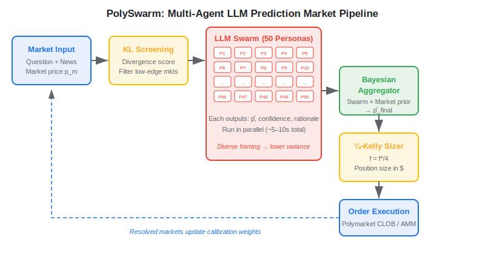
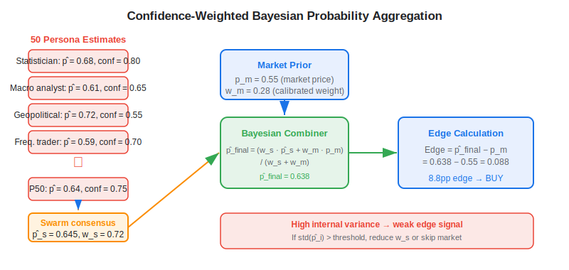
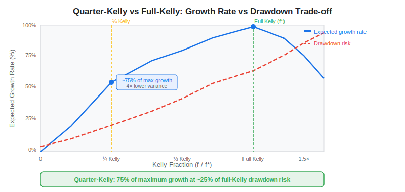

**Multi-agent LLM prediction market trading** is a systematic approach in which a coordinated swarm of large language models — each embodying a different analytical persona — independently estimates the probability of binary real-world events, combines those estimates through confidence-weighted Bayesian aggregation, and executes risk-controlled positions on decentralised prediction markets. The method generalises classical ensemble theory to the language-model domain: where a single LLM suffers from perspective anchoring and overconfidence, a heterogeneous swarm produces better-calibrated probability estimates that can be converted into profitable trades on platforms such as Polymarket. The PolySwarm framework (Chen et al., 2025) is the first published architecture to deploy this idea at scale, running 50 concurrent LLM personas with automated position sizing and latency arbitrage detection.

## Table of Contents

## What Is a Prediction Market?

A **prediction market** is a contract exchange where participants buy and sell binary-outcome contracts. Each contract settles at $1.00 if the stated event occurs and $0.00 if it does not — for example, "Will the Federal Reserve cut rates at the September 2025 meeting?" The contract's real-time market price directly encodes the crowd's collective probability estimate. Polymarket, the largest decentralised prediction market, processed over $3 billion in cumulative trading volume by early 2025 and offers several thousand live markets on macroeconomic, political, and geopolitical events.

The central alpha hypothesis follows directly from probability theory: when your calibrated estimate $\hat{p}$ differs materially from the market-implied probability $p_m$, you hold a positive expected-value position. Buying a contract priced at $p_m$ and holding it to resolution yields an expected profit of $\hat{p} - p_m$ per dollar — provided your estimate is correct more often than it is wrong. The challenge is that prediction market crowds are reasonably well-calibrated on average, so the edge window is narrow and requires genuinely superior information processing.

## The PolySwarm Architecture

PolySwarm deploys four interlocking components that transform a market question into an executed position.

## Swarm of 50 Diverse LLM Personas

Rather than querying a single model, PolySwarm instantiates 50 distinct LLM personas in parallel. Each persona differs in analytical framing: one reasons as a frequentist statistician, another as a geopolitical analyst, a third as a macroeconomic forecaster, and so on. This diversity directly addresses a fundamental weakness of single-model inference — LLMs anchored to a single framing systematically under-explore the hypothesis space and can be overconfident on one side.

All 50 personas receive identical inputs: the market question, a real-time news context, and the current market-implied probability. Each returns a probability estimate, a confidence score in the range [0, 1], and a natural-language rationale. The rationale is used both for audit and as input to the aggregation stage.

## How the Swarm Aggregates Probabilities

Individual persona outputs are combined with the market-implied probability through a confidence-weighted Bayesian update. Denoting the swarm consensus — a confidence-weighted mean of all 50 estimates — as $\hat{p}_s$, and the market-implied probability as $p_m$, the final position probability is:

$$\hat{p}_{\text{final}} = \frac{w_s \cdot \hat{p}_s + w_m \cdot p_m}{w_s + w_m}$$

The weight $w_s$ reflects the reliability of the swarm, and $w_m$ reflects confidence in the market prior. Both are estimated from a rolling window of historically resolved markets using a Brier score calibration. When internal swarm agreement is high — the 50 estimates cluster tightly — $w_s$ grows and the final estimate tilts toward the swarm. When estimates are widely scattered, the market prior dominates, and PolySwarm either reduces the position or skips the market.

Before committing 50 inference calls to any market, an information-theoretic screening engine scores each open market on the KL divergence between the swarm's preliminary distribution and the market-implied distribution. Only markets above a divergence threshold are escalated to the full swarm evaluation, sharply reducing compute cost and focusing capital on the highest-edge opportunities.

## Quarter-Kelly Position Sizing

For a binary bet on an outcome with estimated probability $\hat{p}$ and net return $b$ on a winning wager (where $b = (1 - p_m)/p_m$ for a market bought at price $p_m$), the optimal Kelly fraction is:

$$f^* = \hat{p} - \frac{1 - \hat{p}}{b}$$

Full-Kelly maximises expected log-wealth growth over the long run, but its volatility is extreme: a 25% edge, traded full-Kelly on binary bets, produces drawdowns exceeding 50% with non-trivial probability. PolySwarm applies **quarter-Kelly** ($f = f^*/4$), a standard risk-reduction adjustment that preserves approximately 75% of full-Kelly's compound growth rate while cutting outcome variance by a factor of four. For a $100,000 account and an estimated edge of 8 percentage points on a market priced at 0.50 (so $b = 1.0$ and $f^* = 0.08$), quarter-Kelly allocates 2% of capital — $2,000 — to the position.

The quarter-Kelly rule also guards against model miscalibration: when your probability estimates are imprecise, fractional Kelly strategies lose far less than full Kelly under the same degree of error.

## Swarm vs Single-Agent: Key Trade-offs

| Dimension | Single LLM | 50-Persona Swarm |
|---|---|---|
| Perspective diversity | None — one analytical frame | 50 distinct lenses |
| Overconfidence risk | High — no internal check | Internal disagreement flags weak edges |
| Uncertainty quantification | Implicit in logits | Explicit variance across estimates |
| Compute per market | ~1–2 seconds, 1 inference | ~5–10 seconds (parallelised), 50 inferences |
| Calibration on edge cases | Fragile | Diversified, easier to recalibrate |
| Latency for arbitrage | Fast | Requires a smaller fast-inference model |
| Implementation complexity | Low | Moderate — persona prompts, aggregator, sizing |

The key insight from classical ensemble theory — independent diverse estimators combined correctly reduce variance without increasing bias — transfers directly to LLM swarms, provided the personas are genuinely diverse. A swarm of 50 nearly-identical prompts offers no benefit over a single LLM. Effective diversity means different analytical frameworks, not just paraphrased instructions.

## Practical Considerations in Algo Trading

**Spread and breakeven edge.** Polymarket and similar platforms operate with bid-ask spreads of 1–4 cents on markets near the 0.50 price level. A 3-cent spread requires your probability estimate to beat the market by at least 3 percentage points before the position breaks even. This substantially filters the tradeable universe — markets where the crowd is thin or slow to update on new information offer the widest spreads and therefore the highest potential edges.

**Calibration decay.** LLM probability estimates degrade on events outside the training distribution or in novel policy regimes. A swarm trained on 2023–2024 resolution data may miscalibrate on 2025 macroeconomic events if the Fed reaction function has shifted materially. Continuous recalibration on resolved markets — tracked via Brier score and reliability diagrams — is required to maintain a positive edge. Firms running [LLM trading agents](https://paperswithbacktest.com/wiki/llm-trading-agents) in equity markets face the same distribution-shift problem; prediction markets accelerate the feedback loop because every market resolves with a clear ground truth.

**Latency arbitrage and information processing.** One component of PolySwarm targets latency arbitrage: identifying prediction markets that have not yet updated to reflect breaking news. This is structurally analogous to news-driven [systematic trading](https://paperswithbacktest.com/wiki/systematic-trading-strategies) in equities — the edge is speed and information coverage, not probability estimation alone. Effective latency arbitrage requires a low-latency news feed, a fast smaller model for initial screening, and sub-second order submission to the market.

**Capital capacity constraints.** Prediction markets are small by institutional standards. The entire Polymarket ecosystem had roughly $300 million in open interest in 2024. A systematic strategy trading $500,000 faces meaningful market impact in active markets and faces outright liquidity constraints in smaller ones. The strategy is structurally best suited to individual traders and small funds where capital in the $10,000–$500,000 range can deploy without moving prices.

**Model diversity maintenance.** Over time, if the swarm's personas converge — because underlying model weights are updated and bias shifts in a common direction — the apparent diversity becomes illusory. Maintaining genuine persona diversity requires periodic auditing of per-persona calibration and deliberate injection of structurally different models (open-weight vs proprietary, different sizes, different instruction-tuning).

The combination of [ensemble methods](https://paperswithbacktest.com/wiki/ensemble-methods-trading) and Bayesian [NLP sentiment](https://paperswithbacktest.com/wiki/nlp-sentiment-analysis-trading) applies well beyond prediction markets. The swarm aggregation logic can be adapted for any task where multiple independent LLM assessments — earnings call tone, geopolitical risk scoring, macroeconomic outlook synthesis — are combined into a single calibrated probability for signal generation.

## Conclusion

Multi-agent LLM prediction market trading unifies ensemble learning, confidence-weighted Bayesian aggregation, and fractional Kelly sizing in a framework purpose-built for binary-outcome event markets. PolySwarm's central insight — that 50 diverse LLM personas, properly aggregated, are better-calibrated than any single model — mirrors the wisdom-of-crowds literature that underlies prediction markets themselves. The practical edge is real but bounded: it lives in markets with genuine information asymmetry, at capital scales where market impact is minimal, and requires continuous recalibration to remain sharp. For quant practitioners exploring [agentic AI in finance](https://paperswithbacktest.com/wiki/agentic-ai-finance-copilots-vs-agents), prediction markets offer a uniquely clean laboratory — binary outcomes, rapid resolution, and a direct mapping between probability estimation quality and P&L.

## References & Further Reading

[1]: [PolySwarm: A Multi-Agent Large Language Model Framework for Prediction Market Trading and Latency Arbitrage](https://arxiv.org/abs/2604.03888v1)
[2]: [PolyBench: Benchmarking LLM Forecasting and Trading Capabilities on Live Prediction Market Data](https://arxiv.org/abs/2604.14199v1)
[3]: [Kelly, J. L. (1956). A New Interpretation of Information Rate. Bell System Technical Journal, 35(4), 917–926](https://doi.org/10.1002/j.1538-7305.1956.tb03809.x)
[4]: [Tetlock, P. E., & Gardner, D. (2015). Superforecasting: The Art and Science of Prediction. Crown Publishers](https://www.penguinrandomhouse.com/books/227815/superforecasting-by-philip-e-tetlock-and-dan-gardner/)
[5]: [Ding, R. et al. (2024). A Survey of Large Language Model Agents for Financial Trading](https://arxiv.org/abs/2408.06361)
