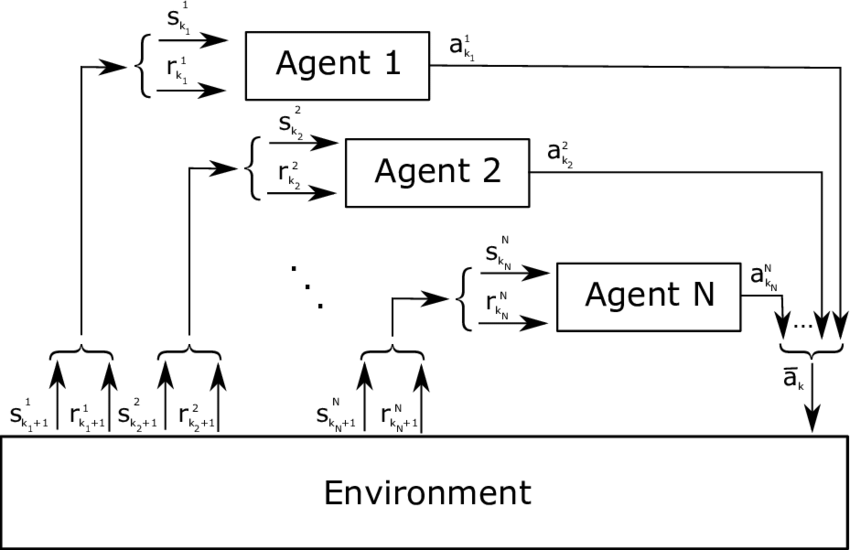

Multi-Agent Reinforcement Learning (MARL) is an advanced method within the broader scope of machine learning that focuses on utilizing multiple learning agents to enhance decision-making processes in complex environments, such as algorithmic trading. MARL extends standard reinforcement learning techniques by incorporating multiple agents that interact with each other and the environment, enabling a collaborative approach to optimizing trading strategies.

In financial markets, the importance of MARL is increasingly recognized due to the complex, dynamic, and competitive nature of these environments. Financial markets involve numerous participants, each attempting to maximize their own returns, often leading to emergent market complexities. MARL's capacity to handle multiple interacting agents makes it particularly suitable for developing sophisticated trading algorithms that can adapt to and anticipate market changes.

The concept of multiple agents working together in trading involves both cooperative and competitive interactions. Agents might share information or strategies to collectively achieve improved market predictions or risk assessments. Alternatively, competitive scenarios involve agents independently striving to maximize their respective rewards. This dual nature of interaction in MARL contributes to its growing importance, as trading systems can be designed to dynamically adapt to various market conditions.

The primary goals of implementing MARL in algorithmic trading are to improve trading performance, optimize asset allocation, enhance risk management, and ultimately increase profitability. Achieving these objectives requires overcoming several significant challenges. Firstly, the coordination among multiple agents adds complexity to the system, often necessitating sophisticated communication and negotiation protocols. Secondly, the scalability of MARL systems is crucial, as the number of agents and the dimensionality of their interaction spaces increase. Finally, the intricate task of balancing exploration and exploitation remains a key challenge, especially as agents must learn to adapt their strategies based on past experiences and evolving market conditions.

Despite these challenges, advancements in computational power and algorithm design continue to drive the development of MARL applications in trading. As research progresses, MARL holds the promise of revolutionizing algorithmic trading by crafting more adaptive, intelligent, and efficient trading systems.

## Table of Contents

## Understanding Reinforcement Learning

Reinforcement Learning (RL) is a subset of machine learning where an agent learns to make decisions through trial and error interactions with an environment. The fundamental aim is to discover a policy that maximizes cumulative rewards over time. RL is characterized by several key components: agents, environments, actions, and rewards.

The agent is the decision-maker that interacts with the environment by taking actions. The environment encompasses everything the agent interacts with, which can change in response to the agent's actions. Actions are the set of all possible moves the agent can make, which affect the state of the environment. The reward is the feedback from the environment, indicating the immediate benefit of an action.

The process of [reinforcement learning](/wiki/reinforcement-learning) typically follows a cycle where the agent observes the current state of the environment, selects an action based on a policy, and consequently receives a reward and a new state from the environment. The objective is to optimize the policy to maximize cumulative reward, often represented as $R_t = \sum_{k=0}^{\infty} \gamma^k r_{t+k+1}$, where $R_t$ denotes the return at time $t$, $r$ is the reward, and $\gamma$ is the discount [factor](/wiki/factor-investing) balancing immediate and future rewards.

In [algorithmic trading](/wiki/algorithmic-trading), RL is applied to facilitate dynamic decision making. A trading agent observes various market indicators as the state, performs trades as actions, and receives financial returns as rewards. The environment is the market itself, which responds dynamically and unpredictably to trading activities. RL equips the agent to continuously adapt its strategy, learning from the returns received, thus enabling improved predictions and decisions over time. This adaptive aspect of RL is particularly advantageous in financial markets, which are volatile and have complex, multifaceted dynamics.

By modeling trading as an RL problem, traders can automate strategies with the capacity to evolve with market conditions. Algorithmic trading through RL can encompass asset allocation, pricing strategies, and risk management, providing a robust foundation for executing trades that adapt to the rapidly changing market landscape.

## The Multi-Agent Approach

A multi-agent system in the context of Multi-Agent Reinforcement Learning (MARL) refers to a framework where multiple autonomous [agents](/wiki/agents) interact within a shared environment, each pursuing its objectives, which collectively contribute toward optimizing a broader, common goal. In algorithmic trading, this involves agents working together to refine trading strategies to maximize financial returns, manage risks, and accommodate market dynamics effectively.

One of the primary advantages of deploying multiple agents in trading environments is the ability to distribute tasks and specialize functions, which enhances the system's adaptability and robustness. This can lead to improved handling of complex scenarios compared to single-agent systems. These agents can operate semi-autonomously, analyzing different data streams or market segments, and executing trades based on specific criteria. This division of labor allows for parallel processing, speeding up decision-making processes and making it possible to react swiftly to market changes.

For instance, agents can be designed to focus on particular assets, market sectors, or trading strategies. Such a setup not only helps in mitigating risk by not relying on a single point of decision-making but also enables the system to capture diverse trade opportunities across various market conditions. Moreover, this modularity aids in incorporating new strategies or assets seamlessly without overhauling the entire system.

The interaction and collaboration among agents are fundamental to achieving a unified trading strategy. Agents communicate and share information about market conditions, trading actions, and rewards, leading to an aggregated understanding of the environment. Techniques like cooperative learning and coordinated decision-making are employed to ensure these agents work synergistically. For example, agents might use a shared reward signal that aligns their individual goals with the collective objective of maximizing the portfolio's overall returns.

To effectively manage interactions among agents, MARL often employs frameworks such as consensus algorithms and negotiation protocols. These methods ensure that the agents agree on the [course](/wiki/best-algorithmic-trading-courses) of action and collaborate effectively, even when their individual actions might seem conflicting. Moreover, learning mechanisms such as shared experiences and policy gradients can be used to enhance cooperation among agents and optimize their collective behavior over time.

In summary, a multi-agent system within MARL operates as a cohesive unit where distinct agents collaborate, share information, and coordinate actions to achieve an overarching goal in algorithmic trading. The system's capability to specialize roles and distribute tasks yields numerous advantages, including enhanced responsiveness to market changes and increased robustness of trading strategies. Through communication and cooperative learning, these agents work together efficiently, enabling complex problem-solving and strategic optimization in dynamic financial environments.

## Application of MARL in Algorithmic Trading

Multi-Agent Reinforcement Learning (MARL) is increasingly being integrated into the domain of algorithmic trading, exploiting its capacity to improve decision-making processes. MARL facilitates enhanced trading strategy optimization by employing multiple agents to work collaboratively. This approach enables the optimization of various trading decisions, including asset allocation, portfolio management, and risk assessment.

In algorithmic trading, MARL is utilized to optimize asset allocation by distributing investment across different assets to achieve desired financial goals while considering market dynamics and risk tolerance. Agents in a MARL system can assess the expected returns and associated risks of various assets and dynamically adjust the portfolio to maximize returns given a specific risk constraint. The collaborative actions of multiple agents allow for more nuanced decision-making as compared to single-agent systems, as agents can share information about the market and adapt to changes swiftly.

Portfolio management is another critical area where MARL finds utility. By leveraging the cooperative nature of multiple agents, MARL systems can manage a diverse portfolio of assets by balancing the trade-off between risk and return. Each agent might specialize in monitoring different segments of the market or diverse asset classes, effectively coordinating to maintain an optimal portfolio composition. This collaboration helps in maintaining diversification and mitigating exposure to market risks.

Risk assessment is refined with MARL through the interaction of agents that specialize in assessing different types of risks, such as market risk, [liquidity](/wiki/liquidity-risk-premium) risk, and credit risk. These agents work together to provide a comprehensive risk profile of investment decisions, thereby offering a holistic understanding of potential exposure and enabling timely interventions to minimize risk.

Several real-world implementations exemplify the potency of MARL in algorithmic trading. For instance, leading financial institutions have started integrating MARL frameworks to autonomously manage large-scale portfolios. These systems utilize historical and real-time data to predict market shifts and adjust strategies accordingly. In one case study, a trading firm utilized MARL to automate the entire trading pipeline, from decision-making to execution, resulting in reduced transaction costs and improved execution quality. Another example includes the use of MARL by hedge funds to dynamically adapt to volatile market conditions, achieving enhanced performance through coordinated agent actions.

Overall, MARL significantly enhances algorithmic trading by optimizing critical trading decisions through its multi-agent framework. While challenges remain, its application continues to advance, offering promising potential for more sophisticated and efficient trading systems.

## Challenges of MARL in Trading

Multi-Agent Reinforcement Learning (MARL) has emerged as a potent tool in algorithmic trading, but its implementation is fraught with significant challenges. These challenges predominantly revolve around scalability, computational complexity, and coordination among multiple agents. For MARL to function effectively in trading, it must adapt to the high-frequency, data-intensive nature of financial markets, which inherently demands scalable solutions. Scalability issues arise when the number of agents increases, leading to exponential growth in state and action spaces. This, in turn, necessitates robust algorithms capable of efficient operation in high-dimensional environments.

Computational complexity is another challenge that stems from the need to process vast amounts of trading data in real-time. The agents must quickly perceive, interpret, and react to market changes, which demands advanced algorithms and significant computational resources. This complexity is compounded by the necessity for agents to make near-instantaneous decisions, which can affect the performance and profitability of trading strategies.

Coordination among agents in MARL poses a unique set of challenges. Each agent operates with partial information, and the lack of a central coordinating structure complicates the decision-making process. Agents must communicate and share information efficiently to maximize collective rewards, often requiring sophisticated communication protocols and mechanisms to ensure seamless collaboration.

The exploration versus exploitation dilemma is particularly pronounced in MARL settings. Agents need to balance exploring new strategies to improve long-term performance against exploiting known strategies that provide immediate gains. In a multi-agent context, this balance becomes more intricate due to dynamic interactions between agents, each with potentially conflicting objectives. Reinforcement learning strategies must be designed to handle these trade-offs effectively, ensuring agents neither converge too quickly on suboptimal strategies nor linger in exploration excessively.

Finally, the convergence and stability of MARL algorithms in trading are significant concerns. The non-stationary nature of financial markets means that agents must constantly adapt to changing conditions, which can lead to instability. Ensuring convergence to optimal or near-optimal strategies while maintaining stability is a formidable task. The complexity of interactions in MARL systems can lead to unpredictable outcomes, necessitating further research into developing algorithms that assure robustness and reliability in dynamic trading environments.

## Recent Advancements and Future Prospects

Recent advancements in Multi-Agent Reinforcement Learning (MARL) have significantly impacted its application in algorithmic trading. The increasing sophistication in MARL research has led to notable breakthroughs that enhance the efficacy and scalability of trading strategies. One key area of advancement is the integration of deep reinforcement learning (DRL) techniques with MARL frameworks, providing a robust approach to processing high-dimensional data prevalent in financial markets.

Deep reinforcement learning incorporates neural networks to approximate decision-making policies, allowing MARL systems to handle complex, non-linear patterns in trading environments. DRL's ability to learn and generalize from vast datasets proves advantageous in predicting market trends and executing trades. Techniques like Actor-Critic methods and Proximal Policy Optimization (PPO) have become integral to contemporary MARL approaches, enabling enhanced learning stability and performance in dynamic trading scenarios.

Furthermore, recent research has explored the use of graph neural networks within MARL to model relationships and interactions among agents and market factors more effectively. This development aids in creating a more comprehensive understanding of market dynamics, allowing trading agents to coordinate and strategize with improved precision.

Emerging trends also point toward the increasing application of transfer learning and meta-learning within MARL frameworks. These approaches facilitate the adaptation of learned policies to new market conditions or different asset classes, improving the versatility and resilience of trading strategies. Transfer learning allows MARL systems to leverage pre-trained models from similar environments, hastening the learning process and reducing computational demands.

As financial markets continue to evolve, MARL is poised to play an essential role in the advancement of algorithmic trading. The foreseeable future holds promising avenues for innovation, particularly in integrating more sophisticated AI methodologies like federated learning, which could enable decentralized trading strategies while preserving data privacy and security. Moreover, advancements in quantum computing may further revolutionize MARL by providing unprecedented computational power to model and solve complex market problems.

In conclusion, the ongoing research and technological advancements in MARL lay a solid foundation for its future development. The synergy between MARL and emerging AI trends promises to enhance the adaptability, efficiency, and success of algorithmic trading strategies in an ever-changing financial landscape.

## Conclusion

Multi-Agent Reinforcement Learning (MARL) presents a transformative potential in the field of algorithmic trading by enhancing the efficiency and sophistication of trading strategies. By leveraging multiple agents that learn and adapt in dynamic financial environments, MARL can significantly improve decision-making processes related to asset allocation, portfolio management, and risk assessment.

The primary benefits of MARL in trading include enhanced adaptability and scalability. The utilization of multiple agents allows for parallel processing and diversified approaches to problem-solving, enabling the system to quickly respond to market fluctuations and complex financial scenarios. The agents' ability to collaborate and share information can result in more robust trading strategies and improved overall performance.

However, the implementation of MARL in trading systems is not without its challenges. Significant computational complexity can arise from the interactions between agents and the larger trading environment. Ensuring effective coordination among agents is crucial for achieving optimal performance, and this requires sophisticated algorithms capable of managing such dependencies. Furthermore, balancing exploration and exploitation remains a persistent issue, impacting the convergence and stability of MARL algorithms.

Despite these challenges, ongoing advancements in MARL, particularly with the integration of [deep learning](/wiki/deep-learning) techniques, are rapidly evolving its application in trading. Continued research is expected to mitigate existing obstacles and enhance the capabilities of MARL. As financial markets and technology continue to evolve, it is anticipated that MARL will play an increasingly pivotal role in optimizing trading strategies, offering unparalleled advantages in an industry where precision and adaptability are key. The future integration of MARL in trading systems promises to not only enhance current practices but also pave the way for new paradigms in algorithmic trading.

## References & Further Reading

[1]: Busoniu, L., Babuska, R., & De Schutter, B. (2008). ["A Comprehensive Survey of Multi-Agent Reinforcement Learning"](https://ieeexplore.ieee.org/document/4445757). IEEE Transactions on Systems, Man, and Cybernetics, Part C (Applications and Reviews).

[2]: Silver, D., Huang, A., Maddison, C. J., Guez, A., Sifre, L., Van Den Driessche, G., ... & Hassabis, D. (2016). ["Mastering the game of Go with deep neural networks and tree search"](https://www.nature.com/articles/nature16961). Nature.

[3]: Zhang, Y., & Choi, D. (2018). ["A Survey on Multi-Agent Reinforcement Learning: Applications, Recent Advances, and Challenges"](https://ieeexplore.ieee.org/document/9904958). arXiv preprint arXiv:1812.11794.

[4]: Stone, P., Kaminka, G. A., Kraus, S., & Rosenschein, J. S. (2010). ["Ad Hoc Autonomous Agent Teams: Collaboration without Pre-Coordination"](https://ojs.aaai.org/index.php/AAAI/article/view/7529). Proceedings of the 24th Conference on Artificial Intelligence (AAAI 2010).

[5]: Tesauro, G. (2003). ["Reinforcement Learning in Financial Markets"](https://www.econstor.eu/bitstream/10419/183139/1/1032172355.pdf). IEEE Intelligent Systems.