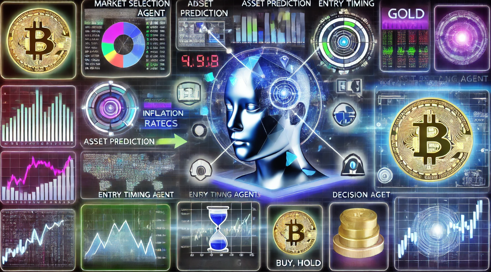

## Table of Contents

## What is a multi-agent trading system?

A multi-agent trading system is a type of computer program used in financial markets where multiple small programs, called agents, work together to buy and sell things like stocks or currencies. Each agent has its own job and makes decisions based on rules or information it has. They can communicate with each other to share information and make better trading decisions. This system can be useful because it can handle a lot of information and make quick decisions, which can be important in fast-moving markets.

These systems are designed to improve trading by using the strengths of many agents working together. For example, one agent might be good at finding good times to buy, while another might be good at figuring out when to sell. By working together, they can make more informed decisions than if they were working alone. This can lead to better results for people using the system, like making more money or reducing the risk of losing money.

## How do multi-agent systems differ from traditional trading systems?

Multi-agent systems and traditional trading systems work differently in how they make decisions and handle information. In a traditional trading system, one main program or a human trader makes all the decisions based on set rules or personal judgment. This system relies on the ability of that single program or person to analyze market data and decide when to buy or sell. On the other hand, a multi-agent system uses many small programs, or agents, each with their own specific job. These agents can work together, sharing information and making decisions as a team, which can lead to better overall results.

The way multi-agent systems handle complexity is another big difference. Traditional systems might struggle with a lot of data or fast-changing markets because they have to process everything through one main decision-making point. Multi-agent systems, however, can manage this complexity better because the workload is spread out among many agents. Each agent can focus on a smaller part of the problem, and together they can handle more information and react more quickly to market changes. This can make multi-agent systems more effective in dynamic and information-rich trading environments.

## What are the basic components of a multi-agent trading system?

A multi-agent trading system is made up of several key parts that work together to make trading decisions. The first part is the agents themselves. These are small programs that each have a specific job, like figuring out the best times to buy or sell. Each agent uses its own set of rules or information to make decisions. The second part is the communication system that lets agents talk to each other. This helps them share important information and work together better.

The third part is the central control system. This part helps manage the agents and make sure they are all working towards the same goal. It can also step in to make big decisions or change the rules if needed. The fourth part is the data management system. This part collects and organizes all the information the agents need, like market prices and news, so they can make smart decisions. Together, these parts help the multi-agent trading system work smoothly and make good trading choices.

## What types of agents are typically used in multi-agent trading systems?

In a multi-agent trading system, different kinds of agents work together to make trading decisions. One common type is the data collection agent. These agents gather information from the market, like prices and news, and share it with other agents. Another type is the analysis agent. These agents use the data to figure out patterns and make predictions about what might happen next in the market. They help decide when it might be a good time to buy or sell.

Another important type is the decision-making agent. These agents take the information and predictions from other agents and make the actual trading decisions. They decide whether to buy, sell, or hold based on the rules they have. Lastly, there are communication agents. These agents help all the other agents talk to each other and share information quickly. They make sure that the whole system works well together to make the best trading decisions possible.

## How do agents interact and communicate within a multi-agent trading system?

In a multi-agent trading system, agents interact and communicate with each other to share important information and make better trading decisions. They use a special communication system that allows them to send messages back and forth. For example, a data collection agent might find out about a new piece of news that could affect the market. It will quickly share this news with the analysis agents, who will then figure out what it means for their predictions.

Once the analysis agents have made their predictions, they will share these with the decision-making agents. The decision-making agents will then use all this information to decide whether to buy, sell, or hold. This communication happens very quickly, often in real-time, so the system can react to changes in the market as they happen. By working together and sharing information, the agents can make smarter trading decisions than if they were working alone.

## What are the advantages of using multi-agent systems in trading?

Multi-agent systems in trading are good because they can handle a lot of information at once. Each agent has a special job, like finding the best times to buy or sell. When they work together, they can look at more data and make better decisions than one big program or person could. This can help make more money or reduce the risk of losing money. Also, because the agents can talk to each other, they can share new information quickly and change their plans if the market changes.

Another advantage is that multi-agent systems can react fast to changes in the market. When the market moves quickly, it's important to make decisions fast too. With many agents working together, the system can handle this better than a single program. Each agent can focus on a small part of the problem, so together they can solve big problems quickly. This makes multi-agent systems great for trading in fast and changing markets.

## What are the potential challenges and limitations of multi-agent trading systems?

One challenge with multi-agent trading systems is that they can be hard to set up and manage. With so many agents working together, it can be tough to make sure they all work well together and follow the right rules. If one agent makes a mistake or gets the wrong information, it can affect the whole system. Also, these systems need a lot of computer power to run all the agents at the same time, which can be expensive.

Another limitation is that multi-agent systems can be hard to understand and explain. Because there are so many agents making decisions, it can be tricky to figure out why the system made a certain choice. This can be a problem if people need to explain their trading decisions to others, like regulators or investors. Plus, if the market changes in a way the system wasn't ready for, the agents might not know how to react, which can lead to bad trading decisions.

## How can multi-agent systems be optimized for better trading performance?

To make multi-agent systems work better for trading, it's important to keep improving the agents and how they work together. One way to do this is by using [machine learning](/wiki/machine-learning). This means the agents can learn from past trades and get better at making decisions over time. They can also learn to work better with each other by figuring out which information is most helpful to share. Another way to improve the system is by making the rules that the agents follow more flexible. This way, they can adapt to new situations in the market without needing a lot of changes from people.

Another important part of making multi-agent systems better is making sure they can handle a lot of information quickly. This means using strong computers and good software to help the agents communicate and process data fast. It's also helpful to test the system a lot, using pretend trades to see how well it works and fix any problems. By doing these things, the system can make better and faster decisions, which can lead to more money and less risk in trading.

## What role does machine learning play in enhancing multi-agent trading systems?

Machine learning helps multi-agent trading systems get better by letting the agents learn from past trades. This means the agents can see what worked well and what didn't, and then make smarter decisions next time. They can also learn how to work better together by figuring out what information is most useful to share with each other. This makes the whole system better at making trading choices because the agents keep improving over time.

Another way machine learning helps is by making the rules that the agents follow more flexible. The market can change a lot, and having rules that can adapt to new situations is important. Machine learning can help the agents change their rules without needing people to make a lot of changes. This means the system can react to new things in the market more quickly and make better trading decisions, which can lead to more money and less risk.

## Can you provide examples of successful implementations of multi-agent trading systems?

One example of a successful multi-agent trading system is used by the company Citadel. They use a system where different agents work together to make trading decisions. Each agent has a special job, like finding the best times to buy or sell, and they share information with each other. This helps Citadel make smart choices and make more money in the market. The system can handle a lot of information and react quickly to changes, which is important in fast-moving markets.

Another example is the multi-agent system used by Deutsche Bank. Their system has agents that collect data, analyze it, and make trading decisions. By working together, these agents can make better choices than if they were working alone. The system helps Deutsche Bank manage the complexity of the market and make profitable trades. It shows how multi-agent systems can be useful for big banks that need to handle a lot of information and make quick decisions.

## How do regulatory and ethical considerations impact the development and use of multi-agent trading systems?

Regulatory and ethical considerations play a big role in how multi-agent trading systems are made and used. Rules from governments and financial groups are important because they want to make sure trading is fair and safe. For example, these rules might say that trading systems need to be clear about how they work and can't do things that might hurt the market. This means people making multi-agent systems have to be careful to follow these rules. They might need to keep good records of what their system does and be ready to explain it to regulators. This can make building and using the system more complicated and time-consuming.

Ethics also matter a lot. People who make and use multi-agent systems need to think about what is right and fair. For example, they should make sure the system doesn't take advantage of other traders or make the market less fair. They also need to think about how the system might affect people's jobs or the economy. If the system makes decisions in ways that are hard to understand, it could be seen as not being fair or honest. So, it's important to keep the system clear and easy to explain, even if that means it might not work as fast or make as much money. Balancing these ethical concerns with making a good trading system is a big challenge.

## What future developments can we expect in the field of multi-agent trading systems?

In the future, multi-agent trading systems will likely get even better at handling lots of information and making quick decisions. This is because of new technology like better computers and smarter software. Machine learning will play a bigger role, helping the agents learn from past trades and get better over time. This means the systems will be able to adapt to new situations in the market more easily. They might also use more data from things like social media and news to make better predictions about what will happen next in the market.

Another big change we might see is more focus on making sure these systems are fair and follow the rules. As these systems become more common, governments and financial groups will probably make more rules to keep trading safe and honest. This means the people who make these systems will need to think carefully about how to explain what their system does and make sure it doesn't do anything wrong. Balancing the need to make money with being fair and ethical will be a big challenge, but it's important for the future of multi-agent trading systems.

## What is the understanding of Multi-Agent Trading Systems?

Multi-agent trading systems are composed of several interacting agents, each performing specialized roles to collectively optimize the trading process. These systems mimic the operations of professional trading firms by distributing tasks among agents, enhancing both data processing efficiency and decision-making accuracy. The architecture is designed for agents to operate autonomously while collaborating to achieve a common objective, thereby translating complex market data into actionable trading strategies.

One of the primary advantages of a multi-agent system is its ability to emulate the intricacies of a trading firm through role specialization. Agents are typically assigned distinct functions such as [fundamental analysis](/wiki/fundamental-analysis), sentiment analysis, technical analysis, and risk management. This segregation of duties ensures that each agent focuses on a specific aspect of trading, leading to a more streamlined and effective decision-making process.

Fundamental analysts within these systems evaluate economic factors and company financials to determine underlying asset values. They perform tasks such as computing discounted cash flows or applying valuation models like the Gordon Growth Model, which is expressed as:

$$
P = \frac{D_1}{r - g}
$$

where $P$ is the price, $D_1$ is the expected dividend, $r$ is the required rate of return, and $g$ is the growth rate.

Sentiment analysts, on the other hand, assess market sentiment through various data sources, such as news articles and social media, to gauge market perceptions and potential impacts on asset prices. This role involves natural language processing techniques and sentiment analysis algorithms to quantify qualitative data into actionable insights.

Technical analysts focus on chart patterns and statistical indicators to predict future price movements. They utilize tools such as moving averages, relative strength index (RSI), and Bollinger Bands. For instance, a simple moving average can be calculated using:

```python
def simple_moving_average(prices, window):
    return [sum(prices[i:i+window])/window for i in range(len(prices)-window+1)]
```

Risk managers are tasked with identifying, assessing, and mitigating trading risks. They employ various strategies such as [value at risk](/wiki/var-value-at-risk) (VaR) calculations and stress testing to ensure the trading system's financial stability. The VaR can be calculated with:

$$
\text{VaR} = \mu - z \times \sigma
$$

where $\mu$ is the mean return, $z$ is the z-score corresponding to the confidence level, and $\sigma$ is the standard deviation.

By leveraging the strengths of each role, multi-agent trading systems achieve a high degree of flexibility and adaptability required for the dynamic nature of financial markets. This collaborative multi-agent architecture not only improves trading accuracy but also enhances the capacity to process and analyze a wide array of data sources, making these systems an integral part of modern [algorithmic trading](/wiki/algorithmic-trading).

## What is the TradingAgents Framework?

TradingAgents represents an innovative framework in the domain of stock trading, distinctly inspired by the operational dynamics of professional trading firms. At its core, the framework employs multiple [agents](/wiki/agents), each assigned specific roles such as analysts, researchers, and traders. This division of labor enables a more efficient and specialized approach to trading, mirroring the structured processes found in large-scale trading firms.

The pivotal feature of TradingAgents is its collaborative methodology, which enhances trading performance through organized debates and structured communication among the agents. Each agent contributes its expertise, allowing the system as a whole to leverage a broader spectrum of data interpretations and strategic insights. The collaborative environment ensures that diverse perspectives are considered before arriving at trading decisions, promoting a more comprehensive analysis of market conditions.

One of the primary metrics to gauge the effectiveness of trading systems is the cumulative return, which measures the total change in investment value over time. TradingAgents has shown notable improvements in cumulative returns, indicating more profitable trading outcomes. Additionally, the framework has demonstrated enhancements in the Sharpe ratio, a measure used to evaluate the risk-adjusted return of an investment strategy. The Sharpe ratio is calculated as follows:

$$
\text{Sharpe Ratio} = \frac{E[R_p - R_f]}{\sigma_p}
$$

Where $E[R_p - R_f]$ is the expected excess return of the portfolio over the risk-free rate, and $\sigma_p$ is the standard deviation of the portfolio's excess return. A higher Sharpe ratio implies a more desirable risk-adjusted return, reflecting the robustness of TradingAgents in optimizing trading performance.

In sum, TradingAgents provides a comprehensive framework where multi-agent collaboration results in superior trading strategies, leveraging structured exchanges of information and specialized roles to achieve enhanced financial metrics.

## References & Further Reading

[1]: LeBaron, B. (2006). ["Agent-based financial markets: Matching stylized facts with style."](https://datascienceassn.org/sites/default/files/Agent-based%20Financial%20Markets%20-%20Matching%20Stylized%20Facts%20With%20Style.pdf) Journal of Economic Dynamics and Control. 

[2]: Lopez de Prado, M. (2018). ["Advances in Financial Machine Learning."](https://www.amazon.com/Advances-Financial-Machine-Learning-Marcos/dp/1119482089) Wiley.

[3]: Wooldridge, M. J., & Jennings, N. R. (1995). ["Intelligent agents: Theory and practice."](https://www.cs.cmu.edu/~motionplanning/papers/sbp_papers/integrated1/woodridge_intelligent_agents.pdf) The Knowledge Engineering Review, 10(2), 115-152.

[4]: Jansen, S. (2020). ["Machine Learning for Algorithmic Trading."](https://github.com/stefan-jansen/machine-learning-for-trading) Packt Publishing.

[5]: Chan, E. P. (2008). ["Quantitative Trading: How to Build Your Own Algorithmic Trading Business."](https://github.com/ftvision/quant_trading_echan_book) Wiley. 

[6]: Chakraborti, A., Toke, I. M., Patriarca, M., & Abergel, F. (2011). ["Econophysics review: I. Empirical facts."](https://www.researchgate.net/publication/227624084_Econophysics_review_I_Empirical_facts) The European Physical Journal B, 71(4), 485-503.