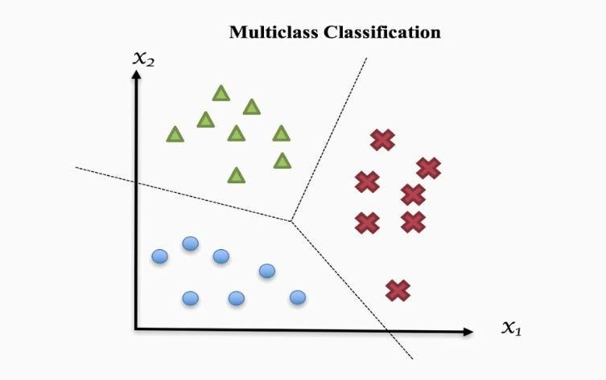

## Table of Contents

## What is multi-class classification in machine learning?

Multi-class classification in machine learning is a type of problem where the goal is to classify instances into one of several possible classes. Imagine you're sorting a bunch of fruits into categories like apples, oranges, and bananas. In this case, each fruit represents an instance, and the categories are the classes. Unlike binary classification, which only has two classes (like yes or no), multi-class classification deals with three or more classes.

To solve multi-class classification problems, different algorithms can be used. Some popular ones include decision trees, random forests, and neural networks. These algorithms learn from the data to figure out which features are important for distinguishing between the classes. For example, when classifying fruits, the algorithm might learn that color and shape are key features. The performance of these models is usually measured using metrics like accuracy, precision, recall, and F1-score, which help us understand how well the model is doing at predicting the correct class for new, unseen instances.

## How does multi-class classification differ from binary classification?

Multi-class classification and binary classification are both types of classification problems in machine learning, but they differ in the number of classes they handle. Binary classification is simpler because it only deals with two classes. Think of it like deciding if an email is spam or not spam. The model learns to put each email into one of these two categories. On the other hand, multi-class classification deals with three or more classes. It's like sorting different types of fruits into apples, oranges, and bananas. The model needs to learn how to distinguish between all these different categories.

In terms of how these problems are solved, binary classification often uses algorithms like logistic regression or support vector machines. These algorithms are designed to make a clear distinction between just two outcomes. For multi-class classification, you might use algorithms like decision trees, random forests, or neural networks. These can handle multiple classes by learning the relationships between different features and the various classes. While binary classification is easier to set up and often quicker to train, multi-class classification requires more complex models and more data to accurately predict the right class for each instance.

## What are some common algorithms used for multi-class classification?

Multi-class classification uses different algorithms to sort things into more than two groups. Some common ones are decision trees, random forests, and neural networks. Decision trees work by making a series of decisions, kind of like playing a game of "20 Questions." They keep splitting the data based on different features until they can put each thing into the right group. Random forests are a bunch of decision trees working together. They make predictions and then take a vote to decide which group is the best fit. Neural networks, on the other hand, are like a brain made of math. They have layers of tiny math problems that help them figure out which group each thing belongs to.

Another algorithm used for multi-class classification is the k-nearest neighbors (k-NN) method. It looks at the closest examples in the data and decides based on what group those examples belong to. It's like asking your neighbors for advice on which group you should join. Support Vector Machines (SVMs) can also be used for multi-class classification, though they were originally made for binary classification. They find the best line or surface to separate the groups. For more than two groups, SVMs can use a technique called "one-vs-rest" or "one-vs-one" to handle multiple classes. Each of these algorithms has its strengths and can be the best choice depending on the type of data you're working with.

## Can you explain the one-vs-all (OvA) approach in multi-class classification?

The one-vs-all (OvA) approach, sometimes called one-vs-rest, is a way to handle multi-class classification problems using algorithms that are good at binary classification. Imagine you have three types of fruits: apples, oranges, and bananas. In the OvA method, you create a separate binary classifier for each fruit. So, you'll have one classifier to tell apples from everything else (oranges and bananas), another to tell oranges from everything else (apples and bananas), and a third to tell bananas from everything else (apples and oranges). Each classifier learns to say "yes" if an item is the fruit it's looking for and "no" if it's anything else.

When you want to classify a new fruit, you use all three classifiers. Each one gives you a score, which can be a probability or a distance from the decision boundary. You then pick the class that has the highest score. For example, if the apple classifier gives a score of 0.8, the orange classifier gives a score of 0.3, and the banana classifier gives a score of 0.5, you'd classify the new fruit as an apple because it has the highest score. This method works well because it breaks down a complex problem into simpler parts, making it easier for the algorithm to learn and make decisions.

## What is the one-vs-one (OvO) approach and how does it work?

The one-vs-one (OvO) approach is another way to handle multi-class classification problems, especially useful when you're using algorithms that are good at binary classification. Imagine you have three types of fruits: apples, oranges, and bananas. In the OvO method, you create a separate binary classifier for every pair of fruits. So, you'll have one classifier to tell apples from oranges, another to tell apples from bananas, and a third to tell oranges from bananas. Each classifier learns to say "yes" if an item is one fruit in the pair and "no" if it's the other.

When you want to classify a new fruit, all the classifiers vote. Each classifier gets a vote for the class it says "yes" to. If the apple vs. orange classifier says "yes" to apples, it gives a vote to apples. The class with the most votes wins. For example, if the apple vs. orange classifier votes for apples, the apple vs. banana classifier votes for apples, and the orange vs. banana classifier votes for oranges, apples would win with two votes. This method can be more computationally intensive than one-vs-all because it creates more classifiers, but it can also be more accurate in some cases.

## How do you handle imbalanced datasets in multi-class classification?

Handling imbalanced datasets in multi-class classification means dealing with situations where some classes have a lot more examples than others. Imagine you're sorting different types of fruits, but you have way more apples than oranges or bananas. This can make it hard for your model to learn about the less common fruits because it sees so many more apples. To fix this, you can use a few tricks. One way is to use something called "oversampling," where you make copies of the less common fruits to balance things out. Another way is "undersampling," where you take away some of the apples so there are fewer of them. You can also try "SMOTE," which makes up new examples of the less common fruits by mixing their features in smart ways.

Another approach to handle imbalanced datasets is to change how you train your model. You can use "class weights" to tell your model that the less common fruits are more important. This means the model will pay more attention to getting the oranges and bananas right. For example, if you're using a decision tree, you might give more weight to the less common classes so the tree splits in a way that helps predict them better. You can also try different ways to measure how well your model is doing, like using the F1-score instead of just accuracy. The F1-score looks at both how many times your model gets it right and how many times it misses the less common fruits, which can give you a better idea of how well it's working overall.

## What evaluation metrics are commonly used for multi-class classification?

When you're trying to see how good your multi-class classification model is, you'll often use different ways to measure it. One common way is accuracy, which tells you the percentage of times your model gets the right answer. But accuracy can be tricky if some classes are much more common than others. So, you might also use precision, which looks at how many of the times your model said a class was right actually were right. Recall is another one, which checks how many of the actual examples of a class your model found. The F1-score combines precision and recall into one number, which can be really helpful when your dataset isn't balanced. You calculate it like this: $$F1 = 2 \times \frac{precision \times recall}{precision + recall}$$.

Another useful way to look at your model's performance is with a confusion matrix. It's a table that shows how many times your model mixed up one class for another. This can help you see where your model is making mistakes. You can also use the macro-average and micro-average of your metrics. The macro-average treats all classes the same and averages the scores for each class. The micro-average, on the other hand, looks at all the predictions together, which can be good if you care about overall performance. For example, if you want to see how your model does across all classes, you might use micro-averaged precision and recall.

Sometimes, you might want to use more advanced metrics like the area under the receiver operating characteristic curve (AUC-ROC) or the area under the precision-recall curve (AUC-PR). These metrics are good for understanding how well your model can tell different classes apart, especially when you're dealing with imbalanced data. The AUC-ROC looks at how well your model can rank examples from different classes, while the AUC-PR focuses more on the positive class's performance. Both can give you a deeper look into how your model is doing, helping you make it even better.

## How can cross-validation be applied to multi-class classification problems?

Cross-validation is a way to check how good your multi-class classification model is by splitting your data into different parts and testing the model on each part. Imagine you have a big pile of fruits like apples, oranges, and bananas. You split this pile into, say, five smaller piles. You use four of these piles to teach your model how to tell the fruits apart, and then you use the last pile to see how well it learned. You do this five times, each time using a different pile for testing. This way, you get a good idea of how your model will work with new fruits it hasn't seen before.

In practice, you can use a method called k-fold cross-validation for multi-class classification. If you choose k=5, you divide your data into five equal parts. You train your model on four parts and test it on the fifth part, repeating this process five times. Each time, you calculate how well your model did using metrics like accuracy, precision, recall, or the F1-score. For example, the F1-score is calculated as $$F1 = 2 \times \frac{precision \times recall}{precision + recall}$$. You then average these scores to get a final measure of your model's performance. This helps you make sure your model works well across all the different types of fruits, not just the ones it saw a lot during training.

## What are the challenges of scaling multi-class classification to a large number of classes?

When you're trying to sort things into a lot of different groups, like sorting a huge pile of fruits into many types, it can get really hard. One big problem is that your computer might need a lot more time and memory to learn how to tell all these groups apart. Imagine if you had to learn about hundreds of different fruits instead of just a few. It would take a lot longer, and you might need more space to keep track of everything. This is called the "computational complexity" problem. Also, when you have a lot of groups, some groups might have way fewer examples than others. This makes it tough for your model to learn about the less common groups because it doesn't see them as often. This is known as the "class imbalance" problem.

Another challenge is that as the number of groups grows, it can be harder to tell them apart. For example, if you have a lot of fruits that look very similar, like different types of apples, your model might get confused. This is called the "class separability" problem. To deal with these challenges, you might need to use special tricks. For example, you could use methods like "one-vs-all" or "one-vs-one" to break the big problem into smaller, easier pieces. Or you might use techniques like "hierarchical classification," where you sort the fruits into big groups first and then into smaller groups. These methods can help your model learn better, but they also make things more complicated to set up and run.

## How does the choice of loss function affect multi-class classification performance?

The choice of loss function is really important for how well your model does at sorting things into different groups. Think of the loss function like a scorekeeper that tells your model how far off it is from the right answer. If you pick a good loss function, your model can learn better and make fewer mistakes. For multi-class classification, a common loss function is the "cross-entropy loss." It works well because it measures how different the model's guess is from the actual group. The formula for cross-entropy loss for multi-class classification is $$L = -\sum_{i=1}^{C} y_i \log(p_i)$$, where $C$ is the number of classes, $y_i$ is 1 if the example belongs to class $i$ and 0 otherwise, and $p_i$ is the model's predicted probability for class $i$. This loss function pushes the model to make its guesses as close as possible to the real groups.

Another loss function you might use is the "categorical hinge loss," which is good for models like Support Vector Machines. It works by trying to make the right group's score higher than the scores of all the other groups by a certain amount. This can be useful when you want your model to be really sure about its guesses. The choice between these loss functions can affect how your model learns and how well it sorts new examples into the right groups. For example, cross-entropy loss might help your model learn faster and be more accurate, while categorical hinge loss might make your model more confident in its guesses. Picking the right loss function depends on what you want your model to do and how your data is set up.

## Can you discuss advanced techniques like error-correcting output codes (ECOC) for multi-class classification?

Error-correcting output codes (ECOC) is a smart way to handle multi-class classification when you have a lot of groups. Imagine you're sorting a bunch of fruits into different types like apples, oranges, and bananas. Instead of making one big model to sort all the fruits at once, ECOC breaks the problem into smaller pieces. It uses a bunch of binary classifiers, each one deciding if a fruit is in one group or not. These classifiers are like little helpers, each focusing on a part of the sorting job. ECOC then uses a special code to combine the decisions from all these helpers. This code helps fix mistakes, kind of like how error-correcting codes in computers fix errors in data. By using this method, ECOC can sort fruits more accurately, especially when there are many types to sort through.

The way ECOC works is by creating a code matrix where each row represents a class and each column represents a binary classifier. For example, if you have three fruits (apples, oranges, bananas), you might have a code matrix like this:

```
  | Classifier 1 | Classifier 2 | Classifier 3
--+--------------+--------------+--------------
A |      +1      |      -1      |      +1
O |      -1      |      +1      |      -1
B |      +1      |      +1      |      -1
```

In this matrix, 'A' stands for apples, 'O' for oranges, and 'B' for bananas. Each classifier decides if a fruit belongs to the group marked with '+1' or not (marked with '-1'). When you want to classify a new fruit, you run it through all the classifiers and get a set of decisions. You then compare this set to the rows in the code matrix to see which row it matches best. The class with the closest match wins. This method can be really good at sorting things into many groups because it uses the power of many small decisions to make one big, accurate decision.

## What are the latest research trends in multi-class classification?

In recent years, one big trend in multi-class classification has been the use of [deep learning](/wiki/deep-learning) methods, especially neural networks. Researchers are finding that these models can handle a lot of classes really well, especially when you have a lot of data. They use special layers called "softmax" layers at the end of the network to turn the model's guesses into probabilities for each class. The formula for the softmax function is $$ \text{softmax}(z_i) = \frac{e^{z_i}}{\sum_{j=1}^K e^{z_j}} $$, where $z_i$ is the model's output for class $i$ and $K$ is the total number of classes. This helps the model figure out which class is most likely for each example. Another trend is using "transfer learning," where you take a model that's already good at one task and use it to help with multi-class classification. This can save time and make your model better, especially when you don't have a lot of data for all the classes.

Another important trend is working on ways to handle imbalanced datasets in multi-class classification. Researchers are coming up with new methods like "focal loss" to make sure the model pays more attention to the less common classes. The formula for focal loss is $$ FL(p_t) = -\alpha_t (1-p_t)^\gamma \log(p_t) $$, where $p_t$ is the model's estimated probability for the correct class, $\alpha_t$ is a weighting [factor](/wiki/factor-investing), and $\gamma$ is a focusing parameter. This helps the model learn better about the classes it might miss otherwise. Also, there's a lot of work on "ensemble methods," where you use several models together to make better predictions. For example, you might use a "random forest" which is a bunch of decision trees working together. These methods can make your model more accurate and help it deal with tricky problems where some classes are hard to tell apart.