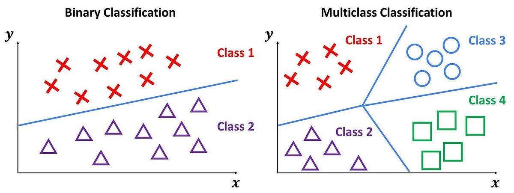

## Table of Contents

## What is Multi-Class Logistic Regression?

Multi-class logistic regression is a way to predict which class or category something belongs to when there are more than two options. Imagine you're trying to guess what type of fruit someone is thinking of, and the choices are apple, banana, or orange. Instead of just saying yes or no like in regular logistic regression, multi-class logistic regression helps you pick the right fruit from all the choices. It does this by figuring out how likely each fruit is to be the one someone is thinking of, and then choosing the fruit with the highest chance.

To make these predictions, multi-class logistic regression uses something called the softmax function. The softmax function takes the scores it calculates for each class and turns them into probabilities that add up to 1. If you have scores for apple, banana, and orange, the softmax function will make sure that the probabilities for these fruits add up to 100%. The class with the highest probability is then chosen as the prediction. The formula for the softmax function is $$ \text{softmax}(z_i) = \frac{e^{z_i}}{\sum_{j=1}^K e^{z_j}} $$, where \( z_i \) is the score for class \( i \), and \( K \) is the total number of classes. This way, multi-class logistic regression can handle more complex choices and still give clear predictions.

## How does Multi-Class Logistic Regression differ from binary logistic regression?

Multi-class logistic regression and binary logistic regression are both used for classification, but they handle different types of problems. Binary logistic regression is used when you're trying to decide between just two options, like yes or no, or true or false. It calculates the probability of one of these outcomes happening and uses the sigmoid function to turn the raw scores into probabilities that are between 0 and 1. If the probability is greater than 0.5, the prediction leans towards one class; if it's less than 0.5, it leans towards the other class.

On the other hand, multi-class logistic regression is used when you have more than two options to choose from. For example, if you're trying to classify different types of fruits like apples, bananas, and oranges, multi-class logistic regression can handle this. Instead of the sigmoid function, it uses the softmax function to calculate the probabilities for each class. The softmax function ensures that the probabilities for all the classes add up to 1, and the class with the highest probability is chosen as the prediction. The formula for the softmax function is $$ \text{softmax}(z_i) = \frac{e^{z_i}}{\sum_{j=1}^K e^{z_j}} $$, where \( z_i \) is the score for class \( i \), and \( K \) is the total number of classes.

## What are the common algorithms used for Multi-Class Logistic Regression?

One common algorithm for multi-class logistic regression is the one-vs-rest (OvR) approach, also known as one-vs-all. In this method, you create a separate binary logistic regression model for each class. For example, if you're classifying fruits into apples, bananas, and oranges, you'd have three models: one to distinguish apples from non-apples, one for bananas from non-bananas, and one for oranges from non-oranges. Each model calculates the probability of an instance belonging to its specific class. The class with the highest probability across all models is chosen as the final prediction. This approach is straightforward and works well when the classes are well-separated.

Another popular algorithm is the multinomial logistic regression, which directly models the probabilities of all classes at once using the softmax function. Instead of creating multiple binary classifiers, multinomial logistic regression calculates a score for each class and then uses the softmax function to convert these scores into probabilities. The formula for the softmax function is $$ \text{softmax}(z_i) = \frac{e^{z_i}}{\sum_{j=1}^K e^{z_j}} $$, where \( z_i \) is the score for class \( i \), and \( K \) is the total number of classes. This method can be more efficient and often provides better performance when the classes are not well-separated, as it considers all classes simultaneously.

Both OvR and multinomial logistic regression can be implemented using various [machine learning](/wiki/machine-learning) libraries. For example, in Python, you can use scikit-learn to implement these algorithms. Here's a simple example of how to use scikit-learn to perform multi-class logistic regression using the OvR approach:

```python
from sklearn.datasets import load_iris
from sklearn.model_selection import train_test_split
from sklearn.linear_model import LogisticRegression
from sklearn.metrics import accuracy_score

# Load the iris dataset
iris = load_iris()
X, y = iris.data, iris.target

# Split the data into training and testing sets
X_train, X_test, y_train, y_test = train_test_split(X, y, test_size=0.2, random_state=42)

# Create and train the model using OvR
model = LogisticRegression(multi_class='ovr')
model.fit(X_train, y_train)

# Make predictions on the test set
y_pred = model.predict(X_test)

# Calculate the accuracy
accuracy = accuracy_score(y_test, y_pred)
print(f"Accuracy: {accuracy}")
```

This code demonstrates how to load a dataset, split it into training and testing sets, train a multi-class logistic regression model using the OvR approach, and evaluate its performance.

## Can you explain the softmax function and its role in Multi-Class Logistic Regression?

The softmax function is a special tool used in multi-class logistic regression to turn raw scores into probabilities. Imagine you're trying to guess what type of fruit someone is thinking of, and you have scores for apples, bananas, and oranges. The softmax function takes these scores and makes sure that the probabilities for each fruit add up to 100%. It does this by using a formula that gives higher probabilities to higher scores and lower probabilities to lower scores. This way, the softmax function helps us decide which fruit is the most likely choice by comparing the probabilities.

The formula for the softmax function is $$ \text{softmax}(z_i) = \frac{e^{z_i}}{\sum_{j=1}^K e^{z_j}} $$, where \( z_i \) is the score for class \( i \), and \( K \) is the total number of classes. In this formula, \( e \) is a special number (about 2.718) that makes the scores positive and helps create a smooth curve. The denominator, \( \sum_{j=1}^K e^{z_j} \), is the sum of the exponentials of all the scores, which ensures that the probabilities add up to 1. So, if you have scores for apples, bananas, and oranges, the softmax function will calculate the probability for each fruit, and the one with the highest probability is chosen as the prediction.

## How do you prepare data for Multi-Class Logistic Regression?

To prepare data for multi-class logistic regression, you start by collecting and organizing your data. Make sure you have enough examples for each class you want to predict. For example, if you're classifying fruits into apples, bananas, and oranges, you need data on all three types. Clean your data by removing any mistakes or missing information, and make sure all your data is in the right format. Sometimes, you need to change text or categories into numbers that the computer can understand better. This process is called encoding, and one common way to do it is called one-hot encoding.

Next, split your data into two parts: one for training the model and one for testing it. Usually, you use about 70-80% of your data for training and the rest for testing. This helps you see how well your model works on new data it hasn't seen before. Before you feed the data into the model, it's a good idea to scale your features. This means making sure all your numbers are on a similar scale, which can help the model learn better. You can do this by subtracting the mean and dividing by the standard deviation for each feature. Once your data is clean, organized, and properly scaled, you're ready to use it for multi-class logistic regression.

## What are the key steps in implementing Multi-Class Logistic Regression?

To implement multi-class logistic regression, first, you need to prepare your data. Collect and organize your data so that you have enough examples for each class you want to predict. Clean your data by removing any errors or missing information, and make sure all your data is in the right format. Sometimes, you need to change text or categories into numbers, which is called encoding. One common way to do this is one-hot encoding. After that, split your data into two parts: one for training the model and one for testing it. Usually, you use about 70-80% of your data for training and the rest for testing. Before you feed the data into the model, scale your features to make sure all your numbers are on a similar scale. This can help the model learn better.

Once your data is ready, you can start building your model. There are two common ways to implement multi-class logistic regression: one-vs-rest (OvR) and multinomial logistic regression. In the OvR approach, you create a separate binary logistic regression model for each class. Each model calculates the probability of an instance belonging to its specific class, and the class with the highest probability across all models is chosen as the final prediction. In multinomial logistic regression, you directly model the probabilities of all classes at once using the softmax function. The formula for the softmax function is $$ \text{softmax}(z_i) = \frac{e^{z_i}}{\sum_{j=1}^K e^{z_j}} $$, where \( z_i \) is the score for class \( i \), and \( K \) is the total number of classes. After choosing your approach, train your model on the training data, then use the test data to see how well it performs. Adjust the model if needed to improve its accuracy.

## How do you evaluate the performance of a Multi-Class Logistic Regression model?

To evaluate the performance of a multi-class logistic regression model, you use different ways to see how well it can guess the right class. One common way is to check the accuracy, which is the percentage of correct guesses out of all the guesses. You can also use a confusion matrix to see where the model makes mistakes. The confusion matrix shows how many times the model guessed each class correctly and how many times it mixed up one class with another. Another useful measure is the F1-score, which is a balance between precision (how many of the model's positive guesses were right) and recall (how many of the actual positives the model found). The F1-score is especially helpful when the classes are not balanced, meaning some classes have more examples than others.

You can also use other measures like precision, recall, and the area under the ROC curve (AUC-ROC) to get a fuller picture of how well the model is doing. Precision tells you how many of the model's positive guesses were right, while recall tells you how many of the actual positives the model found. The AUC-ROC measures how well the model can tell the difference between classes. To calculate these measures, you can use tools like scikit-learn in Python. For example, you can use the `accuracy_score`, `confusion_matrix`, `f1_score`, `precision_score`, `recall_score`, and `roc_auc_score` functions from scikit-learn to evaluate your model's performance. By looking at all these measures together, you can understand where your model is doing well and where it might need some work.

## What are some common challenges faced when using Multi-Class Logistic Regression?

One common challenge when using multi-class logistic regression is dealing with imbalanced data. This means that some classes have a lot more examples than others. When this happens, the model might get really good at guessing the class with the most examples but not so good at guessing the others. To fix this, you can try to balance the data by adding more examples of the less common classes or by giving more importance to the less common classes when training the model.

Another challenge is choosing the right approach for multi-class classification. You can use the one-vs-rest (OvR) method, where you create a separate model for each class, or the multinomial logistic regression, which uses the softmax function $$ \text{softmax}(z_i) = \frac{e^{z_i}}{\sum_{j=1}^K e^{z_j}} $$ to model all classes at once. Each method has its pros and cons, and [picking](/wiki/asset-class-picking) the wrong one can affect how well your model works. Sometimes, you might need to try both to see which one gives better results for your specific problem.

## How can overfitting be prevented in Multi-Class Logistic Regression?

One way to prevent overfitting in multi-class logistic regression is by using regularization. Regularization adds a penalty to the model's complexity, which helps stop it from fitting too closely to the training data. There are two common types of regularization: L1 and L2. L1 regularization can make some of the model's weights zero, which is good for simplifying the model. L2 regularization, on the other hand, keeps the weights small but not zero. You can use a parameter called lambda to control how much regularization you want. A higher lambda means more regularization, which can help prevent overfitting but might also make the model less accurate if it's too high.

Another way to prevent overfitting is by using cross-validation. Cross-validation splits the training data into smaller parts, trains the model on some of these parts, and tests it on the others. This helps you see how well the model will work on new data it hasn't seen before. By using cross-validation, you can find the right balance of model complexity and accuracy. If the model performs much better on the training data than on the validation data, it might be overfitting. You can then adjust the model, maybe by using more regularization or by collecting more data, to make it better at guessing new examples.

## What are the advantages of using Multi-Class Logistic Regression over other classification methods?

One of the main advantages of using multi-class logistic regression is its simplicity and interpretability. Unlike more complex models like neural networks or decision trees, multi-class logistic regression is easy to understand and explain. It directly models the probabilities of each class using the softmax function, which is $$ \text{softmax}(z_i) = \frac{e^{z_i}}{\sum_{j=1}^K e^{z_j}} $$. This formula helps you see how the model makes its predictions by looking at the weights it gives to different features. Because of this, it's easier to explain why the model chose a certain class, which is important in fields like healthcare or finance where understanding the model's decisions is crucial.

Another advantage is that multi-class logistic regression works well with both small and large datasets. It doesn't need as much data to train as some other methods, making it a good choice when you don't have a lot of examples. Also, it's less likely to overfit compared to more complex models, especially if you use regularization. Regularization helps keep the model simple by adding a penalty to the weights, which can improve how well the model works on new data. This makes multi-class logistic regression a reliable choice for many classification tasks, especially when you want a model that's both effective and easy to understand.

## How does Multi-Class Logistic Regression handle imbalanced datasets?

Multi-class logistic regression can face challenges with imbalanced datasets, where some classes have a lot more examples than others. When this happens, the model might get really good at guessing the class with the most examples but not so good at guessing the others. To handle this, you can try to balance the data by adding more examples of the less common classes or by giving more importance to the less common classes when training the model. This technique is called oversampling the minority class or undersampling the majority class. Another way is to use class weights, where you tell the model to pay more attention to the classes with fewer examples.

One way to use class weights in multi-class logistic regression is by adjusting the model's parameters. For example, in Python's scikit-learn library, you can set the `class_weight` parameter to `'balanced'`, which automatically adjusts the weights inversely proportional to class frequencies in the input data. This means the model will try harder to correctly classify the less common classes. Here's how you might do it in code:

```python
from sklearn.datasets import make_classification
from sklearn.model_selection import train_test_split
from sklearn.linear_model import LogisticRegression
from sklearn.metrics import accuracy_score

# Create an imbalanced dataset
X, y = make_classification(n_samples=1000, n_classes=3, weights=[0.1, 0.3, 0.6], random_state=42)

# Split the data into training and testing sets
X_train, X_test, y_train, y_test = train_test_split(X, y, test_size=0.2, random_state=42)

# Create and train the model with class weights
model = LogisticRegression(multi_class='ovr', class_weight='balanced')
model.fit(X_train, y_train)

# Make predictions on the test set
y_pred = model.predict(X_test)

# Calculate the accuracy
accuracy = accuracy_score(y_test, y_pred)
print(f"Accuracy: {accuracy}")
```

By using these methods, multi-class logistic regression can better handle imbalanced datasets and make more accurate predictions for all classes, not just the most common ones.

## What are some advanced techniques or extensions of Multi-Class Logistic Regression?

One advanced technique for multi-class logistic regression is to use ensemble methods. Ensemble methods combine the predictions of multiple models to make better guesses. For example, you can use a technique called bagging, where you train many multi-class logistic regression models on different parts of the data and then average their predictions. Another popular ensemble method is boosting, where you train models one after the other, with each new model focusing on the examples that the previous models got wrong. By combining these models, you can often get better results than using just one multi-class logistic regression model.

Another extension is to use regularization more creatively. Regularization helps prevent overfitting by adding a penalty to the model's complexity. While L1 and L2 regularization are common, you can also use elastic net regularization, which combines both L1 and L2. The formula for elastic net regularization is $$ \text{ElasticNet} = \alpha \cdot \text{L1} + (1 - \alpha) \cdot \text{L2} $$, where \( \alpha \) is a parameter that you can adjust to balance between L1 and L2. This can help you find the right mix of feature selection and model simplification, leading to better performance on new data.

You can also try advanced feature engineering techniques to improve multi-class logistic regression. Feature engineering means creating new features or transforming existing ones to make the model work better. For example, you can use polynomial features to capture non-linear relationships between the original features. In Python, you can use the `PolynomialFeatures` class from scikit-learn to do this:

```python
from sklearn.preprocessing import PolynomialFeatures
from sklearn.linear_model import LogisticRegression
from sklearn.pipeline import make_pipeline

# Create polynomial features
poly_features = PolynomialFeatures(degree=2, include_bias=False)
logistic_regression = LogisticRegression(multi_class='multinomial', solver='lbfgs')

# Create a pipeline that first transforms the data and then fits the model
model = make_pipeline(poly_features, logistic_regression)

# Fit the model to your data
model.fit(X_train, y_train)
```

By using these advanced techniques, you can make multi-class logistic regression more powerful and better at handling complex classification tasks.