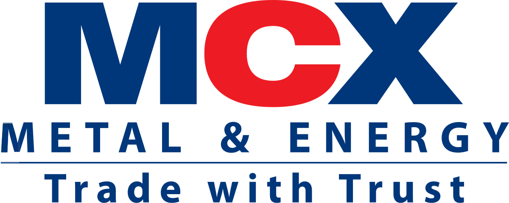

## Table of Contents

## What is the Multi Commodity Exchange of India Ltd. (MCX)?

The Multi Commodity Exchange of India Ltd. (MCX) is a popular place where people buy and sell different things like gold, silver, and oil. It started in 2003 and is based in Mumbai, India. People use MCX to trade these items without having to physically move them around. Instead, they trade contracts that represent these items.

MCX helps farmers, businesses, and investors manage the risks of price changes. For example, a farmer can use MCX to lock in a price for their crops before they even grow them. This way, they know how much money they will get, even if the market prices go up or down. Investors also use MCX to make money by guessing if prices will go up or down and trading accordingly.

## When was the MCX established?

The Multi Commodity Exchange of India Ltd., or MCX, was established in 2003. It is located in Mumbai, India. MCX is a place where people can trade different things like gold, silver, and oil without having to move them around physically. Instead, they trade contracts that represent these items.

MCX helps many people, like farmers, businesses, and investors. Farmers can use MCX to set a price for their crops before they grow them. This way, they know how much money they will get, even if the market prices change. Investors use MCX to try to make money by guessing if prices will go up or down and trading based on those guesses.

## What types of commodities are traded on the MCX?

The Multi Commodity Exchange of India Ltd., or MCX, is a place where people can trade many different things. These things are called commodities. Some of the main commodities traded on the MCX include metals like gold, silver, copper, and zinc. People also trade energy products like [crude oil](/wiki/crude-oil) and natural gas. These are important because they are used in many parts of our daily lives.

Besides metals and energy, the MCX also trades agricultural products. This includes things like cotton, spices, and different types of grains. Farmers and businesses use these trades to help plan for the future. By trading on the MCX, they can set prices for their products ahead of time, which helps them manage risks if prices go up or down. This way, everyone involved knows what to expect and can make better plans.

## How does trading on the MCX work?

Trading on the Multi Commodity Exchange of India Ltd., or MCX, is like a big marketplace where people buy and sell things without actually moving them around. Instead of trading real gold, oil, or crops, people trade contracts that represent these items. These contracts are called futures contracts. When someone buys a futures contract, they agree to buy the commodity at a set price on a specific date in the future. If the price of the commodity goes up, the buyer can make money. If it goes down, they might lose money.

People use the MCX to manage risks and make money. For example, a farmer might sell a futures contract for their crops before they even plant them. This way, they know how much money they will get, even if the market price changes later. Investors also use the MCX to guess if prices will go up or down. If they think prices will go up, they buy futures contracts. If they think prices will go down, they might sell them. This way, everyone can plan better and protect themselves from big price changes.

## What are the benefits of trading on the MCX for investors?

Trading on the Multi Commodity Exchange of India Ltd., or MCX, offers many benefits for investors. One big advantage is the chance to make money. Investors can buy and sell futures contracts, which are agreements to buy or sell commodities at a set price in the future. If they guess right about whether the price will go up or down, they can make a profit. This means investors can try to earn money without needing to buy and store the actual commodities, like gold or oil.

Another benefit is that trading on the MCX helps investors manage risks. The prices of commodities can change a lot because of things like weather, politics, or economic changes. By trading futures contracts, investors can protect themselves from these big price swings. For example, if an investor thinks the price of oil will go down, they can sell a futures contract now and buy it back later at a lower price. This way, they can make money even when prices fall. So, the MCX gives investors a way to plan better and be safer in their investments.

## What are the major indices associated with the MCX?

The Multi Commodity Exchange of India Ltd., or MCX, has a few important indices that help people understand how different commodities are doing. The main one is the MCX COMDEX, which is like a big scoreboard showing how all the commodities traded on the MCX are performing. It includes things like metals, energy, and agricultural products. This index helps investors see the overall health of the commodity market in India.

Another important index is the MCX Metal Index, which focuses only on metals like gold, silver, copper, and zinc. This index is useful for people who are interested in trading metals and want to see how these specific commodities are doing. It gives them a quick way to check the performance of the metal market.

Lastly, there's the MCX Energy Index, which tracks energy commodities like crude oil and natural gas. This index is important for investors who want to focus on energy products. It helps them understand how these commodities are performing and make better trading decisions.

## How is the MCX regulated?

The Multi Commodity Exchange of India Ltd., or MCX, is watched over by different groups to make sure everything is fair and safe for people who trade there. The main group is the Securities and Exchange Board of India, or SEBI. SEBI is like a big boss that makes rules and checks to see if everyone is following them. They make sure that the people who run the MCX are doing their job right and that traders are treated fairly.

Another important group is the Forward Markets Commission, or FMC. Before, the FMC used to be in charge of watching over commodity markets like the MCX. But in 2015, the FMC joined with SEBI, so now SEBI does both jobs. This means SEBI looks after everything to do with trading on the MCX, from making sure the prices are right to stopping people from cheating. They also work with other groups like the Reserve Bank of India to keep an eye on the bigger picture and make sure the economy stays healthy.

## What role does the MCX play in the Indian economy?

The Multi Commodity Exchange of India Ltd., or MCX, is really important for the Indian economy. It helps people buy and sell things like gold, silver, and oil without actually moving them around. This makes trading easier and helps businesses and farmers plan better. For example, a farmer can use the MCX to set a price for their crops before they even grow them. This way, they know how much money they will get, even if the market prices change. This helps keep the economy stable because people can plan ahead and manage risks better.

The MCX also helps investors make money and manage their risks. When investors trade on the MCX, they can guess if the prices of commodities will go up or down. If they guess right, they can make a profit. This brings more money into the economy and helps it grow. The MCX is watched over by groups like the Securities and Exchange Board of India, or SEBI, to make sure everything is fair and safe. This trust helps more people want to trade on the MCX, which makes the Indian economy stronger and more connected to the world.

## What are the technological platforms used by the MCX for trading?

The Multi Commodity Exchange of India Ltd., or MCX, uses a special computer system called the MCX trading platform to help people buy and sell things like gold, silver, and oil. This platform is like a big online marketplace where traders can see the prices of different commodities and make deals quickly. The platform is very fast and safe, which is important because trading happens very quickly. It also has tools that help traders keep track of their trades and see how the market is doing.

Another important part of the MCX's technology is the MCX mobile app. This app lets people trade on the go, so they don't need to be at a computer to buy or sell commodities. The app is easy to use and gives traders all the information they need right on their phones. It also has features like real-time price updates and alerts, so traders can make quick decisions no matter where they are. This makes trading more convenient and helps more people join in the market.

## How does the MCX compare to other commodity exchanges globally?

The Multi Commodity Exchange of India Ltd., or MCX, is one of the biggest commodity exchanges in the world. It is very important in India, where it helps people trade things like gold, silver, and oil. Compared to other global exchanges, like the Chicago Mercantile Exchange (CME) in the United States or the London Metal Exchange (LME) in the United Kingdom, the MCX is known for its focus on the Indian market. It has a lot of traders who are from India and it trades many commodities that are important in India, like spices and cotton. This makes it different from other exchanges that might focus on different commodities or have a more international audience.

The technology used by the MCX is also very good. It has a fast and safe trading platform that helps people trade quickly and easily. This is similar to other big exchanges around the world, like the CME and LME, which also use advanced technology to make trading smooth. But the MCX also has a mobile app that lets people trade on their phones, which is something that not all exchanges have. This makes it easier for more people to trade, especially in a country like India where many people use mobile phones. Overall, the MCX is a big player in the world of commodity trading, and it does a good job of serving the needs of the Indian market while also keeping up with global standards.

## What are the recent developments or expansions in the services offered by the MCX?

The Multi Commodity Exchange of India Ltd., or MCX, has been working on adding new things to help people trade better. One big change is that they started trading options on their platform. Options are like special contracts that give people the right to buy or sell a commodity at a set price before a certain time. This is helpful because it gives traders more ways to make money and manage risks. Another new thing is that they added more types of commodities to trade, like different kinds of steel and natural gas. This means traders can now buy and sell more things on the MCX, which can help them find new opportunities.

The MCX also made their technology better. They updated their trading platform to make it faster and easier to use. This is important because trading happens very quickly, and people need a system that can keep up. They also made their mobile app even better, adding new features like real-time price updates and alerts. This helps people trade on their phones, which is really handy in a country like India where many people use mobile phones. These changes show that the MCX is always trying to improve and offer more to its traders.

## What future trends are expected to impact the operations and growth of the MCX?

The future of the Multi Commodity Exchange of India Ltd., or MCX, is likely to be shaped by a few big trends. One important trend is the growth of technology. As more people use smartphones and the internet, the MCX might see more traders using their mobile app. They could also use new technologies like [artificial intelligence](/wiki/ai-artificial-intelligence) and blockchain to make trading faster and safer. This could help the MCX grow by making it easier for more people to trade.

Another trend that could affect the MCX is changes in the global economy. Things like trade policies, climate change, and new energy sources can change the prices of commodities. The MCX will need to keep up with these changes to help traders manage their risks better. For example, if there are new rules about trading certain commodities, the MCX might need to change its rules too. By staying flexible and adapting to these trends, the MCX can keep growing and helping more people in the Indian economy.

## References & Further Reading

[1]: Lopez de Prado, M. (2018). ["Advances in Financial Machine Learning."](https://books.google.com/books/about/Advances_in_Financial_Machine_Learning.html?id=oU9KDwAAQBAJ) Wiley.

[2]: Chan, E. (2009). ["Quantitative Trading: How to Build Your Own Algorithmic Trading Business."](https://github.com/ftvision/quant_trading_echan_book) Wiley.

[3]: Jansen, S. (2020). ["Machine Learning for Algorithmic Trading."](https://github.com/stefan-jansen/machine-learning-for-trading) Packt Publishing.

[4]: Aronson, D. R. (2006). ["Evidence-Based Technical Analysis: Applying the Scientific Method and Statistical Inference to Trading Signals."](https://onlinelibrary.wiley.com/doi/book/10.1002/9781118268315) Wiley.

[5]: Bergstra, J., Bardenet, R., Bengio, Y., & Kégl, B. (2011). ["Algorithms for Hyper-Parameter Optimization."](https://dl.acm.org/doi/10.5555/2986459.2986743) Advances in Neural Information Processing Systems 24.