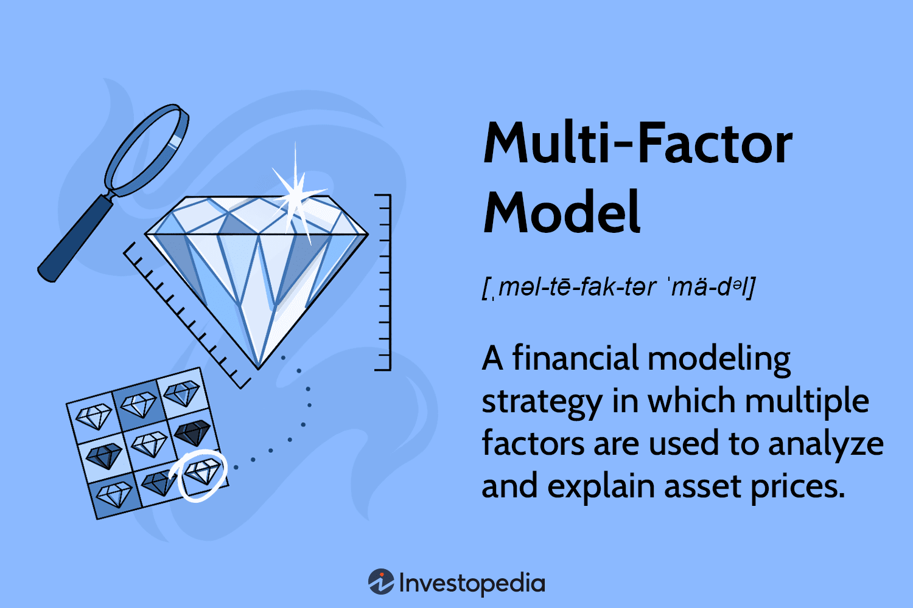

## Table of Contents

## What is a multi-factor model?

A multi-factor model is a way to understand how different things affect the price of investments like stocks. Instead of just looking at one thing, like how the whole market is doing, a multi-factor model looks at several different things at the same time. These things, called factors, could be stuff like how big a company is, how fast it's growing, or even how much risk it has. By considering many factors, the model can give a better idea of why a stock's price is going up or down.

These models are really useful for people who manage money, like investors and fund managers. They use multi-factor models to make smarter choices about which stocks to buy or sell. For example, if a model shows that stocks of smaller companies are likely to do well because of certain factors, an investor might decide to put more money into those stocks. By using these models, investors can try to get better returns and manage their risks better.

## Why are multi-factor models used for comparing factors?

Multi-factor models are used for comparing factors because they help us understand which things matter most when looking at investments. When we look at a stock, there are many things that can change its price. A multi-factor model lets us see all these things at once and figure out which ones have the biggest impact. For example, if we want to know if a company's size or its growth rate is more important for its stock price, a multi-factor model can help us compare these factors directly.

By comparing factors, we can make better decisions about where to put our money. If one factor, like a company's profitability, turns out to be more important than others, we might choose to invest more in companies that are doing well in that area. Multi-factor models give us a clearer picture of what's going on, so we're not just guessing. This way, we can try to pick investments that are more likely to do well in the future.

## What are the common factors included in multi-factor models?

Multi-factor models often include factors like the size of a company, its value, and how much it's growing. Size usually means how big or small a company is, measured by its market value. Value looks at whether a stock is priced low compared to its earnings or book value, which might mean it's a good deal. Growth focuses on how fast a company's earnings or sales are increasing, which can show how well it's doing and how much it might grow in the future.

Another common factor is momentum, which is about how a stock's price has been moving recently. If a stock's price has been going up, it might keep going up for a while, and that's what momentum is about. Risk, or how much a stock's price can go up and down, is also important. Some models look at a company's quality too, like how strong its finances are or how well it's managed.

These factors help investors understand what's driving a stock's price and make better choices. By looking at many factors together, investors can see which ones matter most and adjust their investments accordingly. This can help them find stocks that might do well and manage their risks better.

## How do you select factors for a multi-factor model?

When choosing factors for a multi-factor model, it's important to think about what really affects stock prices. You want to pick factors that have a strong and clear link to how stocks do over time. Some common factors that people often use are size, value, growth, momentum, and risk. Size looks at how big or small a company is, value checks if a stock is priced low compared to its earnings, growth shows how fast a company's earnings are increasing, momentum is about how a stock's price has been moving, and risk measures how much a stock's price can go up and down. These factors have been studied a lot and are known to have a big impact on stock prices.

Another thing to think about when selecting factors is making sure they work well together. You don't want factors that are too similar because that won't give you a good picture of what's going on. For example, if you use two factors that both measure growth in different ways, they might not add much new information. It's better to pick factors that look at different sides of a company, like its size and its value. This way, you can get a fuller view of what might affect a stock's price. By carefully choosing factors that are important and different from each other, you can build a strong multi-factor model that helps you make smarter investment choices.

## What is the difference between a single-factor and a multi-factor model?

A single-factor model looks at just one thing to explain why a stock's price goes up or down. Usually, this one thing is how the whole market is doing. For example, if the market goes up, the stock might go up too. This is simple and easy to understand, but it doesn't give a full picture of what's going on. It's like trying to understand a whole story by just reading the first page.

A multi-factor model, on the other hand, looks at many different things at the same time. It might look at how big a company is, how fast it's growing, how much risk it has, and more. By considering all these factors together, a multi-factor model can give a better and more detailed view of why a stock's price is changing. It's like reading the whole book to understand the story better. This makes it a more powerful tool for investors who want to make smart choices about where to put their money.

## How do you calculate factor sensitivity in a multi-factor model?

Factor sensitivity in a multi-factor model tells us how much a stock's price changes when a certain factor changes. To calculate it, you need to look at how the stock has moved in the past when the factor changed. You can do this by using a method called regression analysis. In regression analysis, you compare the stock's returns to the changes in the factor over time. The result of this comparison gives you a number called the factor sensitivity, or beta. This number shows how sensitive the stock is to that factor. If the beta is high, it means the stock's price moves a lot when the factor changes. If it's low, the stock's price doesn't move much.

Once you have the factor sensitivities for all the factors in your model, you can use them to predict how the stock might do in the future. For example, if you know the factor sensitivity for the size factor is high, and you think big companies will do well, you might expect the stock to go up if it's from a big company. By putting all the factor sensitivities together, you get a better idea of what might happen to the stock's price. This helps investors make smarter choices about which stocks to buy or sell.

## What statistical methods are used to validate a multi-factor model?

To make sure a multi-factor model is working well, people use different statistical methods. One common way is called regression analysis. This method helps see how well the factors in the model can explain changes in stock prices. By running a regression, you can find out if the factors you picked are really important or if they don't matter much. You can also check if the model fits the data well by looking at something called the R-squared value. A high R-squared means the model explains a lot of what's going on with the stock prices.

Another way to validate a multi-factor model is by using something called cross-validation. This means you split your data into different parts and test the model on each part to see if it works the same way every time. If the model does well on all parts of the data, it's a good sign that it's reliable. You can also use a method called backtesting, where you see how the model would have done in the past. If the model would have picked good stocks in the past, it's more likely to be useful in the future. These methods help make sure the multi-factor model is strong and can be trusted for making investment decisions.

## How do multi-factor models handle correlation between factors?

Multi-factor models need to deal with the fact that some factors might be related to each other. This is called correlation. If two factors are very similar, like both measuring how fast a company is growing but in slightly different ways, they might not add much new information to the model. To handle this, people use something called factor analysis. This helps them see which factors are really different from each other and which ones are just saying the same thing. By understanding these correlations, they can pick factors that give a better overall picture of what's going on with stock prices.

Another way to deal with correlation is by using a method called principal component analysis (PCA). This method looks at all the factors and finds new ones that are not related to each other. These new factors, called principal components, can help make the model simpler and more effective. By using PCA, people can make sure their multi-factor model is not just repeating the same information over and over. This way, the model can give clearer and more useful insights into what's driving stock prices.

## What are the limitations of multi-factor models in factor comparison?

Multi-factor models are great tools for understanding what makes stock prices go up or down, but they have some limits when it comes to comparing factors. One big problem is that factors can be related to each other. This means that if you're trying to see which factor is more important, it can be hard to tell because the factors might be moving together. For example, if you're looking at size and value, bigger companies might also be seen as having more value. This makes it tough to figure out if it's the size or the value that's really affecting the stock price.

Another limitation is that these models depend a lot on the past data they use. If the data is not good or if it doesn't cover a long enough time, the model might not work well. Also, what worked in the past might not work in the future. The world changes, and what drives stock prices can change too. So, even if a multi-factor model says one factor was important in the past, that might not be true anymore. This makes it risky to rely too much on these models for making decisions about the future.

## How can multi-factor models be applied in different industries?

Multi-factor models can be used in many different industries to help people make better decisions. In the finance industry, these models help investors and fund managers pick stocks that might do well. They look at things like how big a company is, how fast it's growing, and how risky it is. This helps them see which factors are most important for a stock's price. In the real estate industry, multi-factor models can help figure out what makes a property more valuable. They might look at things like the location, the size of the property, and how old it is. This helps real estate agents and investors understand what drives property prices and make better choices about buying or selling.

In the healthcare industry, multi-factor models can be used to predict how well patients might do with different treatments. Doctors can look at factors like a patient's age, their medical history, and the type of treatment they're getting. This helps them choose the best treatment for each patient. In the technology industry, these models can help companies decide which products to develop or which markets to enter. They might look at factors like how fast technology is changing, what customers want, and how much competition there is. By understanding these factors, tech companies can make smarter choices about where to invest their time and money.

## What advanced techniques can enhance the accuracy of multi-factor models?

To make multi-factor models more accurate, people use something called machine learning. Machine learning is like teaching a computer to learn from data and get better over time. It can look at a lot of information and find patterns that might be hard for people to see. For example, machine learning can help figure out which factors are most important and how they work together. This can make the model better at predicting what will happen to stock prices or other things you're trying to understand. By using machine learning, the model can keep learning and getting more accurate as it sees more data.

Another way to improve multi-factor models is by using something called time-series analysis. This technique looks at how things change over time. It can help the model understand if a factor's effect on stock prices changes from one month to the next or if it stays the same. Time-series analysis can also help the model see if there are patterns that happen over time, like how stock prices might go up in certain seasons. By understanding these patterns, the model can make better predictions about what might happen in the future. Using time-series analysis can make the model more accurate and helpful for making decisions.

## How do you interpret the results of a multi-factor model for decision-making?

When you look at the results of a multi-factor model, you're trying to understand what makes a stock's price go up or down. The model will show you numbers called factor sensitivities, or betas, which tell you how much each factor affects the stock. If a factor like growth has a high beta, it means the stock's price moves a lot when the company's growth changes. You can use these betas to see which factors are most important for the stock you're looking at. For example, if the size factor has a low beta, it might not matter as much as other factors like value or momentum. By looking at all the betas together, you can get a good idea of what's driving the stock's price and make smarter choices about buying or selling it.

Once you understand which factors matter most, you can use this information to make decisions. If the model shows that stocks with high growth are likely to do well, you might want to invest more in companies that are growing fast. On the other hand, if the model says that stocks with high risk are not doing well, you might want to stay away from those. The key is to use the model's results to see where the best opportunities are and where the biggest risks might be. By doing this, you can try to pick investments that are more likely to give you good returns and help you manage your risks better.

## What is the understanding of Multi-Factor Models?

A multi-factor model is a quantitative tool used in financial analysis to evaluate and predict asset prices by considering multiple influencing factors. Unlike single-factor models, which rely on a solitary variable, multi-factor models offer a multifaceted perspective, capturing the complexity of financial markets more effectively. Key components of these models include macroeconomic indicators, company fundamentals, and statistical data. 

Macroeconomic indicators encompass a broad range of economic factors such as gross domestic product (GDP) growth, inflation rates, and employment figures. These indicators provide a macro-level view of the economic landscape, helping analysts understand how external economic conditions might affect asset prices. Company fundamentals, on the other hand, focus on firm-specific details like earnings reports, return on equity, and market capitalization. These elements offer insights into the financial health and performance prospects of individual companies. Lastly, statistical data involves analyzing historical price patterns and trends using advanced statistical methods to uncover potential market movements.

The structure of a multi-factor model is built on factor sensitivities, known as beta coefficients. These coefficients are pivotal in the model as they quantify the degree to which each factor influences asset prices. Mathematically, for an asset $i$, the expected return $\mathrm{E}(R_i)$ can be represented as:

$$
\mathrm{E}(R_i) = R_f + \beta_1 F_1 + \beta_2 F_2 + \ldots + \beta_n F_n + \epsilon
$$

Here, $R_f$ denotes the risk-free rate, $\beta_1, \beta_2, \ldots, \beta_n$ are the beta coefficients for factors $F_1, F_2, \ldots, F_n$ respectively, and $\epsilon$ represents the error term.

In implementing a multi-[factor](/wiki/factor-investing) model, the effective estimation of beta coefficients is crucial as they help identify which factors exert the most significant influence on asset prices. By analyzing these coefficients, investors and analysts can make informed predictions about future price movements, enabling sound investment decisions.

## How is Factor Model Implementation used in Algorithmic Trading?

Multi-factor models are essential tools in [algorithmic trading](/wiki/algorithmic-trading), serving as the foundation for factor-based strategies. These models integrate multiple factors, allowing traders to make data-driven decisions and refine investment approaches. The implementation process begins with comprehensive data collection, securing historical prices, market indices, and an array of financial variables. This data forms the backbone of the model, offering insights into patterns and trends that drive asset price movements.

In developing these models, the choice and specification of factors are critical. The selection process prioritizes factors that have demonstrated historical relevance and predictive power, such as market capitalization, [momentum](/wiki/momentum), and value. The specification of the model involves defining the mathematical relationship between these chosen factors and asset returns. For example, the relationship might be represented as:

$$
R_i = \alpha + \beta_1 F_1 + \beta_2 F_2 + \ldots + \beta_n F_n + \epsilon_i
$$

where $R_i$ is the return on asset $i$, $\alpha$ is the intercept, $\beta_1, \beta_2, \ldots, \beta_n$ are the factor sensitivities, $F_1, F_2, \ldots, F_n$ are the factors, and $\epsilon_i$ represents the error term.

Once the factors are selected and the model is specified, the next step is estimation. This typically involves using statistical techniques, such as regression analysis, to derive the beta coefficients. These coefficients quantify the sensitivity of the asset price to each factor, providing insights into which factors are most influential.

To ensure these models perform effectively, they undergo rigorous [backtesting](/wiki/backtesting). This process involves using historical data to simulate how the model would have performed in past market environments. Backtesting is crucial as it helps to identify potential strengths and weaknesses of the model before it is applied in live trading scenarios. Proper backtesting can confirm the robustness of the strategy and offer confidence in its predictive capabilities.

Risk management is a pivotal component, allowing traders to mitigate unwanted market exposure and protect against adverse price movements. Techniques such as stop-loss orders, position sizing, and portfolio diversification are commonly employed to manage risk efficiently.

In practice, algorithmic traders use programming languages like Python to implement and automate these strategies. Python is favored for its extensive libraries and tools supporting financial analysis and model building. Below is a simple example of using Python to perform a backtest on a multi-factor model:

```python
import pandas as pd
import numpy as np
from sklearn.linear_model import LinearRegression

# Sample data: factors and asset returns
data = pd.DataFrame({
    'Factor1': np.random.normal(size=100),
    'Factor2': np.random.normal(size=100),
    'Returns': np.random.normal(size=100)
})

# Define features and target variable
X = data[['Factor1', 'Factor2']]
y = data['Returns']

# Fit the multi-factor model
model = LinearRegression().fit(X, y)

# Retrieve beta coefficients
beta_coefficients = model.coef_
print("Beta Coefficients:", beta_coefficients)

# Backtesting: Predict returns
data['Predicted_Returns'] = model.predict(X)

# Basic performance analysis
performance = data[['Returns', 'Predicted_Returns']].corr()
print("Performance Correlation:\n", performance)
```

This code exemplifies the linear regression approach for estimating factor sensitivities and demonstrates basic backtesting through correlation analysis. Continuous refinement and adaptation to changing market conditions are integral to maintaining the efficacy of algorithmic trading strategies built on multi-factor models.

## What are the popular multi-factor models in financial markets?

The Fama-French Three-Factor model is a fundamental framework in the world of asset pricing and portfolio management that expands upon the traditional Capital Asset Pricing Model (CAPM). Introduced by Eugene Fama and Kenneth French, this model incorporates three key factors: market risk, size, and value effects, which are statistically represented as follows:

1. **Market Risk Premium (MRP):** The excess return on the market over the risk-free rate.
2. **Size Premium (SMB, Small Minus Big):** Accounts for the performance difference between small-cap stocks and large-cap stocks.
3. **Value Premium (HML, High Minus Low):** Reflects the returns differential between high book-to-market and low book-to-market stocks.

The Fama-French model is represented mathematically by the following equation:

$$
R_i = R_f + \beta_{M} (R_m - R_f) + s_i \times SMB + h_i \times HML + \epsilon_i
$$

Where:
- $R_i$ represents the expected return of the portfolio or asset.
- $R_f$ is the risk-free rate.
- $R_m$ is the return of the market portfolio.
- $\beta_{M}$ is the sensitivity to the market risk factor.
- $s_i$ and $h_i$ are the sensitivities to the size and value factors, respectively.
- $\epsilon_i$ is the error term.

Building on this, Mark Carhart introduced the Four-Factor model, which integrates a momentum factor to capture anomalies not explained by the three-factor model. This fourth factor examines the tendency of stocks that have performed well in the past to continue performing well in the short term. Consequently, the model equation becomes:

$$
R_i = R_f + \beta_{M} (R_m - R_f) + s_i \times SMB + h_i \times HML + m_i \times MOM + \epsilon_i
$$

Where:
- $m_i$ represents the sensitivity to the momentum factor (MOM).

These models serve as essential tools for institutional investors and hedge funds, with firms like AQR Capital Management and MSCI Barra often deploying them to inform their investment strategies.

Implementation of these models in real-world trading necessitates the continuous assessment of factor performance. This involves regularly recalibrating the models based on historical financial data and current market conditions. For practical application, platforms such as Bloomberg Terminal offer comprehensive solutions, hosting integrated factor models that provide users with streamlined access to financial analytics and insights.

Through these advanced computing platforms, investors can analyze multiple factors efficiently, facilitating more informed and strategic trading decisions. As a result, multi-factor models remain integral components in constructing robust and adaptable investment portfolios in the ever-evolving landscape of financial markets.

## References & Further Reading

[1]: Bergstra, J., Bardenet, R., Bengio, Y., & Kégl, B. (2011). ["Algorithms for Hyper-Parameter Optimization."](https://dl.acm.org/doi/10.5555/2986459.2986743) Advances in Neural Information Processing Systems 24.

[2]: ["Advances in Financial Machine Learning"](https://www.amazon.com/Advances-Financial-Machine-Learning-Marcos/dp/1119482089) by Marcos Lopez de Prado

[3]: Fama, E.F., & French, K.R. (1993). [Common risk factors in the returns on stocks and bonds.](https://www.sciencedirect.com/science/article/pii/0304405X93900235) Journal of Financial Economics, 33(1), 3-56.

[4]: ["Quantitative Trading: How to Build Your Own Algorithmic Trading Business"](https://www.amazon.com/Quantitative-Trading-Build-Algorithmic-Business/dp/1119800064) by Ernest P. Chan

[5]: ["Machine Learning for Algorithmic Trading"](https://github.com/stefan-jansen/machine-learning-for-trading) by Stefan Jansen