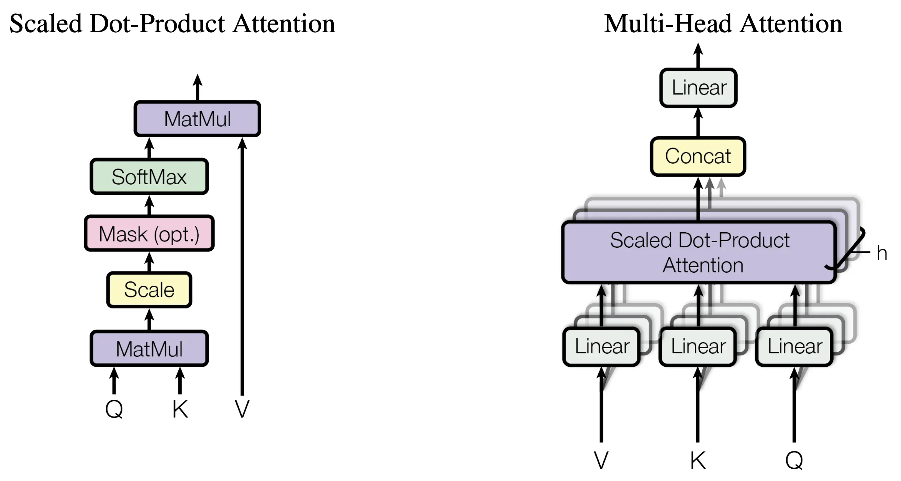

## Table of Contents

## What is Multi-Head Self-Attention in the context of machine learning?

Multi-Head Self-Attention is a mechanism used in machine learning, especially in models like transformers, to help the model understand and process data better. It's like giving the model multiple ways to look at the same information. Imagine you're reading a book and you want to understand a sentence better. You might read it again, focus on different words, or think about the context. Multi-Head Self-Attention does something similar but in a more structured way. It breaks down the input data into different parts and processes each part separately, allowing the model to capture different aspects of the data.

In more technical terms, Multi-Head Self-Attention works by transforming the input data into three different representations: queries, keys, and values. These are then used to compute attention scores, which tell the model which parts of the input to focus on. The formula for attention can be written as $$ \text{Attention}(Q, K, V) = \text{softmax}\left(\frac{QK^T}{\sqrt{d_k}}\right)V $$, where $Q$, $K$, and $V$ are the queries, keys, and values, and $d_k$ is the dimension of the keys. By using multiple "heads" or sets of these transformations, the model can look at the data from different perspectives simultaneously, which helps it understand complex patterns and relationships in the data more effectively.

## How does Multi-Head Self-Attention differ from single-head attention?

Multi-Head Self-Attention and single-head attention both help models focus on important parts of the data, but they do it differently. Single-head attention uses one set of transformations to look at the data. It turns the input into queries, keys, and values and then calculates how much attention to pay to different parts of the data. This is like reading a sentence once and trying to understand it from one perspective.

Multi-Head Self-Attention, on the other hand, uses multiple sets of transformations, or "heads," to look at the data from different angles at the same time. Each head has its own queries, keys, and values, and they all work together to give the model a richer understanding of the data. It's like reading a sentence multiple times, each time focusing on different words or aspects, to get a fuller picture. The formula for multi-head attention can be written as $$ \text{MultiHead}(Q, K, V) = \text{Concat}(\text{head}_1, \text{head}_2, ..., \text{head}_h)W^O $$, where each head is computed using the attention formula and then combined.

By using multiple heads, Multi-Head Self-Attention allows the model to capture different types of relationships and patterns in the data, making it more powerful than single-head attention. This is especially useful in tasks like language translation or text generation, where understanding context and nuances is important.

## What are the key components of a Multi-Head Self-Attention mechanism?

The key components of a Multi-Head Self-Attention mechanism are the queries, keys, and values. These are created by transforming the input data using different weight matrices. Queries help the model decide what to focus on, keys are what the queries are compared against, and values are the actual data that the model pays attention to. Each of these components is crucial for the attention mechanism to work properly, allowing the model to understand which parts of the input are most important.

In Multi-Head Self-Attention, the model uses multiple sets of these transformations, or "heads," to look at the data from different perspectives. Each head calculates its own attention scores using the formula $$ \text{Attention}(Q, K, V) = \text{softmax}\left(\frac{QK^T}{\sqrt{d_k}}\right)V $$, where $Q$, $K$, and $V$ are the queries, keys, and values, and $d_k$ is the dimension of the keys. The results from all the heads are then combined to give the model a more complete understanding of the data. This combination of multiple perspectives is what makes Multi-Head Self-Attention so effective in capturing complex patterns and relationships in the data.

## Can you explain the process of how Multi-Head Self-Attention works?

Multi-Head Self-Attention works by taking the input data and turning it into three different things: queries, keys, and values. Imagine you're trying to find a book in a library. The queries are like your search terms, the keys are the titles of the [books](/wiki/algo-trading-books), and the values are the actual books. The model uses the queries to look at the keys and figure out which parts of the input are most important. It does this by calculating attention scores, which tell the model how much to focus on each part of the input. The formula for this is $$ \text{Attention}(Q, K, V) = \text{softmax}\left(\frac{QK^T}{\sqrt{d_k}}\right)V $$, where $Q$, $K$, and $V$ are the queries, keys, and values, and $d_k$ is the dimension of the keys.

What makes Multi-Head Self-Attention special is that it does this process multiple times, using different sets of queries, keys, and values. Each set is called a "head," and each head looks at the data from a different angle. It's like having multiple friends help you search the library, each using their own method to find the book. After all the heads have done their work, the model combines their results to get a fuller picture of the data. This combination of different perspectives helps the model understand complex patterns and relationships in the data better than if it only used one set of queries, keys, and values.

## What are the benefits of using Multi-Head Self-Attention in neural networks?

Using Multi-Head Self-Attention in neural networks helps them understand data better. It's like having several friends look at the same problem from different angles. Each friend, or "head," looks at the data in a different way, using their own set of queries, keys, and values. This means the network can see different patterns and relationships in the data that it might miss if it only looked at it one way. By combining what all the heads see, the network gets a fuller picture of the data, which helps it make better predictions or understand complex tasks like translating languages or generating text.

The formula for attention in each head is $$ \text{Attention}(Q, K, V) = \text{softmax}\left(\frac{QK^T}{\sqrt{d_k}}\right)V $$, where $Q$, $K$, and $V$ are the queries, keys, and values, and $d_k$ is the dimension of the keys. This formula helps the network decide which parts of the input to focus on. When you use multiple heads, you get multiple sets of these attention scores, which are then combined to give the network a more complete understanding of the data. This makes Multi-Head Self-Attention very powerful, especially for tasks where understanding context and nuances is important.

## How does Multi-Head Self-Attention help in capturing different aspects of the input data?

Multi-Head Self-Attention helps in capturing different aspects of the input data by using multiple sets of transformations, or "heads." Each head looks at the data from a different angle, using its own set of queries, keys, and values. This is like having several friends look at the same problem, each using their own method to understand it. The formula for attention in each head is $$ \text{Attention}(Q, K, V) = \text{softmax}\left(\frac{QK^T}{\sqrt{d_k}}\right)V $$, where $Q$, $K$, and $V$ are the queries, keys, and values, and $d_k$ is the dimension of the keys. By using multiple heads, the model can see different patterns and relationships in the data that it might miss if it only looked at it one way.

When all the heads have done their work, the model combines their results to get a fuller picture of the data. This combination of different perspectives helps the model understand complex patterns and relationships in the data better than if it only used one set of queries, keys, and values. For example, in a language translation task, one head might focus on the grammar, another on the meaning of the words, and another on the context. By putting all these views together, the model can make better predictions and understand the nuances of the language more effectively.

## What are some common applications of Multi-Head Self-Attention in machine learning models?

Multi-Head Self-Attention is commonly used in [machine learning](/wiki/machine-learning) models like transformers, which are popular for tasks like language translation and text generation. Imagine you're translating a sentence from English to French. Multi-Head Self-Attention helps the model understand which words are important and how they relate to each other. It does this by looking at the sentence from different angles, using multiple sets of queries, keys, and values. Each set, or "head," focuses on different aspects of the sentence, like grammar, word meaning, or context. By combining these views, the model can translate the sentence more accurately and naturally.

Another common application is in natural language processing tasks, like text summarization or question answering. When you ask a model to summarize a long article, Multi-Head Self-Attention helps it figure out which parts of the text are most important. It's like the model is reading the article multiple times, each time focusing on different details. This helps the model create a summary that captures the main points without missing important information. The formula for attention in each head is $$ \text{Attention}(Q, K, V) = \text{softmax}\left(\frac{QK^T}{\sqrt{d_k}}\right)V $$, where $Q$, $K$, and $V$ are the queries, keys, and values, and $d_k$ is the dimension of the keys. By using multiple heads, the model can understand the text better and provide more accurate answers or summaries.

## How can Multi-Head Self-Attention be implemented in a practical machine learning project?

To implement Multi-Head Self-Attention in a practical machine learning project, you start by preparing your data and setting up your model architecture. Let's say you're working on a language translation task. You would first tokenize your text data into sequences of words or characters. Then, you'd use an embedding layer to convert these tokens into vectors that the model can understand. After that, you would create multiple sets of weight matrices for the queries, keys, and values, which are used to transform the input data. Each set of these transformations is called a "head," and you would typically use several heads to capture different aspects of the data.

Once you have your heads set up, you apply the attention mechanism to each head using the formula $$ \text{Attention}(Q, K, V) = \text{softmax}\left(\frac{QK^T}{\sqrt{d_k}}\right)V $$, where $Q$, $K$, and $V$ are the queries, keys, and values, and $d_k$ is the dimension of the keys. After computing the attention scores for each head, you concatenate the results and apply a final transformation to combine them. This process allows your model to focus on different parts of the input data from multiple perspectives, which is crucial for tasks like language translation where understanding context and nuances is important. You can implement this in a programming language like Python using libraries like PyTorch or TensorFlow, which provide built-in functions to help you set up and train your model.

## What are the computational complexities involved in Multi-Head Self-Attention?

The computational complexity of Multi-Head Self-Attention comes from the operations it needs to do. For each head, the model has to transform the input into queries, keys, and values, which takes time proportional to the size of the input. Then, it has to calculate the attention scores by multiplying the queries and keys and applying a softmax function. This part of the process has a complexity of $$ O(n^2 \cdot d) $$, where $n$ is the length of the input sequence and $d$ is the dimension of the vectors. After that, the model multiplies the attention scores with the values, which also takes time proportional to $$ n^2 \cdot d $$. Since the model uses multiple heads, you have to do these calculations for each head, so the total complexity for all heads is $$ O(h \cdot n^2 \cdot d) $$, where $h$ is the number of heads.

Putting everything together, the model then concatenates the results from all heads and applies a final transformation. This last step has a complexity of $$ O(n \cdot d \cdot d_o) $$, where $d_o$ is the output dimension. So, the overall complexity of Multi-Head Self-Attention is dominated by the attention calculation part, which is $$ O(h \cdot n^2 \cdot d) $$. This means that the time it takes to process the data grows quickly with the length of the input sequence, making it important to use efficient algorithms and hardware to handle large inputs.

## How does the number of heads in Multi-Head Self-Attention affect model performance?

The number of heads in Multi-Head Self-Attention can make a big difference in how well a model works. When you use more heads, the model can look at the data from more different angles. This can help it understand the data better, especially for tasks like language translation where understanding context and nuances is important. Each head focuses on different parts of the input, like grammar or word meaning, and by combining all these views, the model can make better predictions. However, using too many heads can also make the model slower and use more computer power, so you need to find a balance.

If you use too few heads, the model might miss important patterns in the data. For example, in a language translation task, one head might focus on the grammar, but if there's no other head to look at the meaning of the words, the model might make mistakes. The formula for attention in each head is $$ \text{Attention}(Q, K, V) = \text{softmax}\left(\frac{QK^T}{\sqrt{d_k}}\right)V $$, where $Q$, $K$, and $V$ are the queries, keys, and values, and $d_k$ is the dimension of the keys. So, choosing the right number of heads is important to make sure the model can capture all the different aspects of the data without becoming too slow or using too much power.

## What are some advanced techniques or variations of Multi-Head Self-Attention?

One advanced technique in Multi-Head Self-Attention is called "Sparse Attention." Instead of looking at every part of the input data, Sparse Attention only focuses on certain parts. This can make the model faster and use less computer power, especially when dealing with long sequences of data. Imagine you're reading a long book and you only need to pay attention to certain chapters to understand the story. Sparse Attention works in a similar way, allowing the model to zoom in on the most important parts of the data.

Another variation is "Relative Position Encoding." In regular Multi-Head Self-Attention, the model doesn't know how far apart different parts of the input are from each other. Relative Position Encoding adds information about the positions of the data, which can help the model understand the order and relationships between different parts better. For example, in a sentence, knowing how far apart two words are can help the model understand the grammar and meaning more accurately. The formula for attention with relative position encoding can be written as $$ \text{Attention}(Q, K, V) = \text{softmax}\left(\frac{QK^T + Qr^T}{\sqrt{d_k}}\right)V $$, where $r$ represents the relative positions.

## How can one evaluate and optimize the performance of a model using Multi-Head Self-Attention?

To evaluate and optimize the performance of a model using Multi-Head Self-Attention, you start by choosing the right metrics for your task. For language translation, you might use BLEU scores to see how well the model translates sentences. For text generation, you could look at how coherent and relevant the generated text is. Once you have your metrics, you can train the model and see how it performs. If the performance isn't good enough, you can try different things to make it better. One way is to change the number of heads in the Multi-Head Self-Attention mechanism. Using more heads can help the model see the data from more angles, but it might also make the model slower. You need to find a balance that works well for your task.

Another way to optimize the model is to adjust the learning rate or the size of the model. A higher learning rate can help the model learn faster, but if it's too high, the model might miss important patterns. You can also try using techniques like dropout, which randomly turns off some parts of the model during training to prevent overfitting. If you're using a programming language like Python, you can experiment with these changes using libraries like PyTorch or TensorFlow. For example, you might write code to adjust the number of heads and see how it affects the model's performance. By trying different settings and seeing how they affect your metrics, you can find the best way to use Multi-Head Self-Attention for your specific task.

## References & Further Reading

[1]: Vaswani, A., Shazeer, N., Parmar, N., Uszkoreit, J., Jones, L., Gomez, A. N., ... & Polosukhin, I. (2017). ["Attention is All You Need."](https://arxiv.org/abs/1706.03762) Advances in Neural Information Processing Systems.

[2]: Devlin, J., Chang, M. W., Lee, K., & Toutanova, K. (2019). ["BERT: Pre-training of Deep Bidirectional Transformers for Language Understanding."](https://aclanthology.org/N19-1423/) NAACL-HLT.

[3]: Brown, T. B., Mann, B., Ryder, N., Subbiah, M., Kaplan, J. D., Dhariwal, P., ... & Amodei, D. (2020). ["Language Models are Few-Shot Learners."](https://arxiv.org/abs/2005.14165) Advances in Neural Information Processing Systems.

[4]: Vaswani, A., Uszkoreit, J., & Kaiser, Ł. (2019). ["Transformer-XL: Attentive Language Models Beyond a Fixed-Length Context."](https://arxiv.org/abs/1901.02860) ACL.

[5]: Radford, A., Narasimhan, K., Salimans, T., & Sutskever, I. (2018). ["Improving Language Understanding by Generative Pre-Training."](https://cdn.openai.com/research-covers/language-unsupervised/language_understanding_paper.pdf) OpenAI.