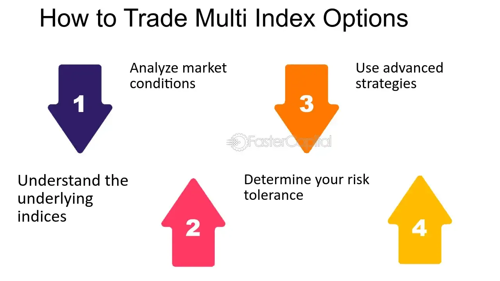

## Table of Contents

## What are multi-index options?

Multi-index options are financial tools that let you invest in more than one stock index at the same time. Instead of buying options for each index separately, you can use a multi-index option to spread your investment across several indexes. This can help you manage risk better because your investment isn't tied to just one index's performance.

These options can be useful for investors who want to diversify their portfolios without having to manage many different options contracts. By investing in a multi-index option, you can potentially reduce the impact of a downturn in any single index. However, like all investments, multi-index options come with their own risks, so it's important to understand them fully before you invest.

## How do multi-index options differ from single-index options?

Multi-index options let you invest in more than one stock index at the same time, while single-index options focus on just one index. With a multi-index option, you're spreading your investment across several indexes. This can help you manage risk better because your money isn't tied to the performance of just one index. On the other hand, a single-index option depends entirely on how well that one index does.

Using multi-index options can be a good way to diversify your investments without having to manage many different options contracts. For example, if you buy a multi-index option, you might be investing in the S&P 500, the Dow Jones, and the Nasdaq all at once. This can help cushion your investment if one of these indexes goes down. With a single-index option, you might only be invested in the S&P 500, so if it drops, your investment could be more affected.

## What are the benefits of trading multi-index options?

Trading multi-index options can help you spread your risk. When you invest in more than one index at the same time, your money isn't just tied to how one index does. If one index goes down, the others might still go up or stay the same, which can help protect your investment. This is called diversification, and it's like not putting all your eggs in one basket.

Another benefit is that multi-index options can save you time and effort. Instead of buying and managing options for each index separately, you can do it all with one multi-index option. This makes it easier to keep track of your investments and can be less stressful. Plus, it can be cheaper because you're only paying for one option instead of many.

## What are the common indices used in multi-index options?

Multi-index options often include well-known stock market indices like the S&P 500, the Dow Jones Industrial Average, and the Nasdaq Composite. The S&P 500 is a broad measure of the U.S. stock market, representing 500 of the largest companies. The Dow Jones Industrial Average tracks 30 large, publicly-owned companies in the U.S. The Nasdaq Composite includes all the stocks listed on the Nasdaq stock exchange, which is known for having many technology companies.

These indices are popular in multi-index options because they cover different parts of the market. The S&P 500 gives you a good overall picture of how the U.S. economy is doing. The Dow Jones focuses on big, established companies, while the Nasdaq is great if you're interested in tech and growth companies. By including these indices in a multi-index option, you can spread your investment across different sectors and potentially reduce your risk.

## How are multi-index options priced?

Multi-index options are priced based on several factors, just like other options. One big [factor](/wiki/factor-investing) is the price of the indices that the option covers. If the indices are doing well, the option might be more expensive. Another factor is how much time is left until the option expires. The more time there is, the more expensive the option might be because there's more time for the indices to go up or down. Also, the expected ups and downs of the indices, called [volatility](/wiki/volatility-trading-strategies), can affect the price. If the indices are expected to move a lot, the option might cost more because there's more chance for big changes.

Another thing that can affect the price of multi-index options is how the different indices move together, called correlation. If the indices usually move in the same direction, the option might be priced differently than if they move in opposite directions. This is because the option's value depends on how all the indices perform together. Overall, the pricing of multi-index options is a bit more complicated than single-index options because you have to consider how multiple indices might behave and interact with each other.

## What are the key factors to consider before trading multi-index options?

Before you start trading multi-index options, it's important to understand how they work and what you're getting into. Multi-index options let you invest in more than one stock index at the same time, which can help spread your risk. But they can also be more complicated than single-index options because you need to keep an eye on how all the different indices are doing. Make sure you know which indices are included in the option and how they usually move together. Also, think about how much money you're willing to risk. Multi-index options can be a good way to diversify, but they still come with risks, so don't invest more than you can afford to lose.

Another thing to consider is the cost of trading multi-index options. They might be more expensive than single-index options because they cover more indices. Look at the fees and commissions you'll have to pay, and compare them to what you'd pay for single-index options. Also, think about how long you want to hold the option. The time until the option expires can affect its price, so decide if you want a short-term or long-term investment. Lastly, make sure you understand how the option is priced. Things like the current prices of the indices, how much time is left until the option expires, and how much the indices might go up or down can all play a role in the price of the option.

## How does correlation between indices affect multi-index options?

The way different indices move together, called correlation, can really change how multi-index options work. If the indices usually go up and down together, this is called high correlation. When this happens, the multi-index option might be less risky because if one index goes down, the others might go down too, but the overall effect on your option might be smaller. On the other hand, if the indices don't move together much, this is called low correlation. In this case, the multi-index option could be riskier because one index might go up while another goes down, which can make the value of your option swing more.

Understanding correlation is important because it can affect how much you pay for the multi-index option. If the indices have a high correlation, the option might be cheaper because there's less chance of big swings in the option's value. But if the indices have a low correlation, the option might be more expensive because there's more risk that the indices will move in different directions, making the option's value harder to predict. So, before you buy a multi-index option, think about how the indices usually move together and how that might affect your investment.

## What are the strategies for hedging with multi-index options?

Hedging with multi-index options can help you protect your investments from big losses. One way to do this is by buying a multi-index put option. This gives you the right to sell the indices at a certain price, even if they drop a lot. If the indices go down, the put option can help you make up for some of the money you lose on your other investments. It's like having insurance for your portfolio. You might have to pay a bit for the option, but it can save you a lot if the market takes a big hit.

Another strategy is to use multi-index options to balance out your risk. If you have a lot of money invested in one type of index, you can buy a multi-index option that includes other indices. This way, if the index you're heavily invested in goes down, the other indices in the option might go up or stay the same, which can help reduce your losses. It's all about spreading your risk so that your whole investment doesn't depend on just one index. By using multi-index options smartly, you can make your portfolio more stable and protect it from big swings in the market.

## How do market conditions influence the performance of multi-index options?

Market conditions can really affect how well multi-index options do. If the stock market is doing well and the indices in the option are going up, then your multi-index option might make you more money. But if the market is going down and the indices are dropping, your option could lose value. It's all about how the different indices are doing together. If some indices are going up while others are going down, the overall performance of your option depends on how these changes balance out.

Another thing to think about is how much the market is moving around, called volatility. If the market is really up and down, this can make multi-index options more valuable because there's more chance for big changes in the indices. But it also means your option could be riskier because it's harder to predict what will happen. So, when you're looking at multi-index options, you need to keep an eye on what's happening in the market and how that might affect the indices you're invested in.

## What are the advanced trading techniques used with multi-index options?

One advanced trading technique with multi-index options is called spread trading. This means you buy and sell different multi-index options at the same time to try and make money from the difference in their prices. For example, you might buy a multi-index option that you think will go up in value and sell another one that you think will go down. This can help you make money no matter which way the market goes, as long as the difference between the two options works out in your favor. It's like betting on the spread between two teams in a sports game instead of [picking](/wiki/asset-class-picking) a winner.

Another technique is called delta hedging. This is a way to protect your investment from big swings in the market. When you use delta hedging with multi-index options, you adjust your position in the options based on how much the indices are moving. If the indices start to move a lot, you might buy or sell more options to keep your investment balanced. This can help you manage risk better because you're not just hoping the market goes one way; you're actively trying to keep your investment stable no matter what happens.

Lastly, you can use multi-index options for portfolio insurance. This means you buy multi-index put options to protect your other investments. If the market drops and the indices in your portfolio go down, the put options can help you make up for some of the losses. It's like buying insurance for your car or house; you pay a little bit now to protect yourself from big losses later. By using these advanced techniques, you can make your investments in multi-index options more flexible and less risky.

## How can one manage the risks associated with multi-index options?

Managing the risks of multi-index options starts with understanding how they work and what you're investing in. Multi-index options let you invest in more than one stock index at the same time, which can help spread your risk. But they can also be more complicated than single-index options because you need to keep an eye on how all the different indices are doing. Make sure you know which indices are included in the option and how they usually move together. Also, think about how much money you're willing to risk. Multi-index options can be a good way to diversify, but they still come with risks, so don't invest more than you can afford to lose.

Another way to manage risk is by using strategies like delta hedging and spread trading. Delta hedging means you adjust your position in the options based on how much the indices are moving. If the indices start to move a lot, you might buy or sell more options to keep your investment balanced. Spread trading involves buying and selling different multi-index options at the same time to make money from the difference in their prices. This can help you make money no matter which way the market goes, as long as the difference between the two options works out in your favor. By using these strategies, you can make your investments in multi-index options more flexible and less risky.

## What are the regulatory considerations for trading multi-index options?

When you trade multi-index options, you need to know about the rules that govern them. These options are usually overseen by financial regulators like the Securities and Exchange Commission (SEC) in the United States. The SEC makes sure that trading is fair and that everyone has the same information. They also set rules about how options can be traded, who can trade them, and how they need to be reported. So, before you start trading multi-index options, make sure you understand these rules to avoid any trouble.

Another thing to think about is the rules set by the options exchanges themselves. These exchanges have their own guidelines for trading multi-index options, like how much money you need to have in your account to trade them, called margin requirements. They also have rules about when you can trade and how you need to settle your trades. It's important to follow these rules to keep your trading account in good standing. By understanding both the regulatory and exchange-specific rules, you can trade multi-index options more safely and effectively.

## What is the Emergence of Multi-Index Options?

Multi-index options are innovative financial instruments categorized as exotic derivatives. Unlike traditional single-index options that focus on a single market index, multi-index options derive their value from the relative performance of two or more indices. This approach provides investors with the opportunity to engage in sophisticated trading strategies that capitalize on the comparative movements between multiple indices rather than absolute changes in value.

These options specifically measure the percentage change in the indices over the duration of the option, as opposed to focusing on the dollar value fluctuations of the indices themselves. By doing so, they offer a nuanced view of market dynamics that can be particularly useful for investors looking to hedge against relative performance risks or speculate on cross-market trends.

The structure of multi-index options is typically European-style. This means they can only be exercised at maturity, and the settlement is conducted in cash. Cash settlement, as opposed to physical delivery, is particularly advantageous for handling complex trades involving multiple indices, as it simplifies the settlement process and reduces transaction costs.

Investors utilize multi-index options to manage risks and seek opportunities in situations when no direct cross-rate is available. For instance, a trader may wish to hedge against or speculate on the performance differential between the S&P 500 and the Dow Jones Industrial Average. In this context, a multi-index option could provide payouts based on whether the S&P 500 outperforms the Dow Jones, or vice versa. Such contracts enable investors to manage their portfolios with precision, aligning their trading activities with their forecasts of market behavior over multiple indices.

An understanding of multi-index options requires a familiarity with the underlying math and statistical techniques used to model their behavior. For example, the payoff of a multi-index option can often be represented as a function of the performance ratios of the respective indices involved:

$$
\text{Payoff} = \max(0, \text{Ratio of Index A to Index B} - K)
$$

where $K$ represents the strike ratio set at the inception of the contract. Implementing algorithms to evaluate the potential payoffs of these options may involve financial modeling software or code written in languages such as Python to process vast arrays of historical data and generate predictive insights.

In summary, with the evolution of financial markets and the increasing complexity of investment strategies, multi-index options have emerged as crucial tools for investors looking to navigate the intricate landscape of global indices effectively.

## What are Multi-Index Options in Algorithmic Trading?

The integration of multi-index options into [algorithmic trading](/wiki/algorithmic-trading) offers a robust framework for diversified, risk-adjusted returns. Central to this integration is the ability of algorithms to efficiently track and analyze multiple indices simultaneously, allowing for the execution of trades based on comparative performance metrics. This real-time analysis involves the application of complex statistical models and [machine learning](/wiki/machine-learning) techniques to predict future movements and identify potential [arbitrage](/wiki/arbitrage) opportunities. 

Algorithmic systems in multi-index options trading typically employ measures such as correlation matrices to assess the relationship between indices. These matrices enable traders to understand the covariance structure, instrumental in designing strategies that exploit dissimilar movements between indices. Mathematically, this relationship is often represented as:

$$
\text{Cov}(X, Y) = \mathbb{E}[(X - \mathbb{E}[X])(Y - \mathbb{E}[Y])]
$$

where $X$ and $Y$ are different indices. Algorithms leverage this covariance to generate signals for trading when one index deviates from its expected performance relative to another.

Moreover, multi-index options trading benefits from dynamic portfolio management approaches, which are crucial for optimizing hedging strategies against market risks associated with multiple indices. Python, with libraries such as NumPy and pandas, can be effectively used to implement such strategies. For instance, a basic Python script to calculate rolling correlations between two indices may look like this:

```python
import numpy as np
import pandas as pd

# Sample data for two indices
data = {'Index1': np.random.randn(100), 'Index2': np.random.randn(100)}
df = pd.DataFrame(data)

# Calculate rolling correlation
rolling_corr = df['Index1'].rolling(window=20).corr(df['Index2'])

print(rolling_corr.tail())
```

Through algorithmic trading in multi-index options, traders can also exploit [statistical arbitrage](/wiki/statistical-arbitrage) strategies. These strategies involve taking positions based on the historical statistical relationships between index components, enabling them to profit from temporary dislocations when indices drift away from their historical correlations.

Effective risk-adjusted returns are achieved by continuously updating the statistical models with real-time data, adjusting trading positions dynamically to reflect current market conditions. This necessitates robust data infrastructure and rapid execution capabilities to minimize latency and maximize the potential for capturing profitable opportunities. The integration of multi-index options into algorithmic trading thereby enhances the strategic arsenal available to traders, allowing for more nuanced and calculated participation in financial markets.

## References & Further Reading

[1]: Bergstra, J., Bardenet, R., Bengio, Y., & Kégl, B. (2011). ["Algorithms for Hyper-Parameter Optimization."](https://dl.acm.org/doi/10.5555/2986459.2986743) Advances in Neural Information Processing Systems 24.

[2]: ["Advances in Financial Machine Learning"](https://www.amazon.com/Advances-Financial-Machine-Learning-Marcos/dp/1119482089) by Marcos Lopez de Prado

[3]: ["Evidence-Based Technical Analysis: Applying the Scientific Method and Statistical Inference to Trading Signals"](https://www.amazon.com/Evidence-Based-Technical-Analysis-Scientific-Statistical/dp/0470008741) by David Aronson

[4]: ["Machine Learning for Algorithmic Trading"](https://github.com/stefan-jansen/machine-learning-for-trading) by Stefan Jansen

[5]: ["Quantitative Trading: How to Build Your Own Algorithmic Trading Business"](https://www.amazon.com/Quantitative-Trading-Build-Algorithmic-Business-ebook/dp/B097QGPVND) by Ernest P. Chan