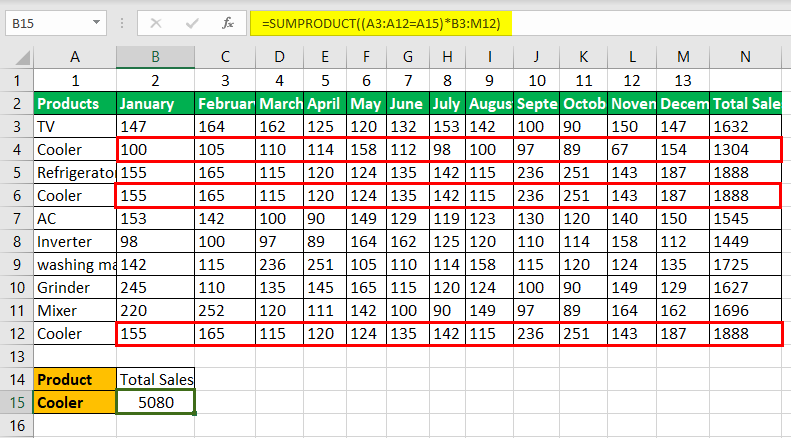

Financial derivatives have become a cornerstone of modern finance, enabling investors to hedge risks, speculate on market movements, and enhance portfolio returns. These financial instruments derive their value from underlying assets such as stocks, bonds, commodities, or indices, and are utilized in various forms to manage financial exposures effectively. Among these derivatives, options trading stands out due to its inherent flexibility and potential for profitable strategies. Options offer traders the right, but not the obligation, to buy or sell an underlying asset at a predetermined price before a specified expiration date, allowing for strategic positioning based on market predictions.

Recent innovations have introduced multi-index options, a sophisticated derivative that incorporates multiple indices into a single contract. Multi-index options are based on the relative performance of two or more indices, rather than the value of a single asset. This development expands the horizons of options trading by providing investors a refined tool to hedge risks and speculate on index movements collectively. For example, an investor might use a multi-index option to compare the performance of the S&P 500 and the Dow Jones Industrial Average, with payouts contingent on their relative performance.



In parallel, algorithmic trading has revolutionized financial markets by automating decision-making processes through computer programs. This approach allows traders to execute orders at speeds and frequencies that are impossible to achieve manually, capitalizing on fleeting market opportunities. Algorithmic trading's implementation of complex calculations and high-speed decision-making enhances the efficiency and accuracy of trading strategies, particularly in volatile markets where timing is crucial.

This article explores the intersection of multi-index options and algorithmic trading, examining how these innovations can work together to offer powerful solutions for investors. By combining the multi-faceted approach of multi-index options with the precision and speed of algorithmic trading, investors can optimize their strategies, manage risks across different indices, and potentially achieve enhanced returns. The synergies between these two financial tools present new opportunities and challenges in the contemporary financial landscape, necessitating a nuanced understanding of both their advantages and limitations.

## Table of Contents

## Understanding Financial Derivatives and Options Trading

Financial derivatives are sophisticated financial instruments that derive their value from underlying assets like stocks, bonds, indices, or interest rates. They play a critical role in the financial markets by enabling investors and institutions to manage risk, enhance returns, and gain exposure to various assets without the need to own them directly. The underlying assets serve as the benchmark that determines the derivative's value and are critical in the contract's pricing and settlement.

Options are a well-known category of financial derivatives that grant the holder the right, but not the obligation, to buy (call option) or sell (put option) an underlying asset at a predetermined price, known as the strike price, before or at the expiration date. This flexibility is a key feature of options, as it allows investors to manage potential losses while maximizing gains. Options can be traded on various assets, including equities, commodities, currencies, and indices.

The traditional options trading framework opens up a plethora of strategic opportunities for investors. It allows market participants to position themselves advantageously based on expected market movements and [volatility](/wiki/volatility-trading-strategies). For example, an investor anticipating a rise in the price of a particular stock might purchase a call option to benefit from upward movements without committing to buying the stock upfront. Conversely, if a decline is expected, an investor might buy a put option to profit from the decrease in the underlying asset's price.

Options trading also serves as a versatile tool for risk management. Investors can employ strategies like protective puts, where they hold a long position in an asset and buy a put option to guard against downside risk. They can also use covered calls, writing call options against stock holdings to generate additional income. These methods help protect investors from adverse market movements while allowing room for capital appreciation.

Furthermore, options enable speculation on market conditions, granting investors the ability to bet on not just price directions but also volatility. Volatility trading strategies, such as straddles or strangles, can be used to profit from significant price movements irrespective of direction. This attribute of options trading promotes market [liquidity](/wiki/liquidity-risk-premium) and efficiency.

Another advantage of options trading lies in exploiting market inefficiencies. Traders can identify price discrepancies in the market using advanced quantitative analysis and take strategic positions to harness these opportunities. For instance, an [arbitrage](/wiki/arbitrage) strategy might involve buying an underpriced option while simultaneously selling an overpriced equivalent, thus allowing traders to capitalize on pricing disequilibria.

In conclusion, financial derivatives, particularly options, provide a comprehensive set of tools that cater to various investment strategies and risk management principles. Their inherent flexibility and broad applicability make them essential instruments for both individual and institutional investors aiming to optimize portfolio performance and mitigate market risks.

## The Emergence of Multi-Index Options

Multi-index options are innovative financial instruments categorized as exotic derivatives. Unlike traditional single-index options that focus on a single market index, multi-index options derive their value from the relative performance of two or more indices. This approach provides investors with the opportunity to engage in sophisticated trading strategies that capitalize on the comparative movements between multiple indices rather than absolute changes in value.

These options specifically measure the percentage change in the indices over the duration of the option, as opposed to focusing on the dollar value fluctuations of the indices themselves. By doing so, they offer a nuanced view of market dynamics that can be particularly useful for investors looking to hedge against relative performance risks or speculate on cross-market trends.

The structure of multi-index options is typically European-style. This means they can only be exercised at maturity, and the settlement is conducted in cash. Cash settlement, as opposed to physical delivery, is particularly advantageous for handling complex trades involving multiple indices, as it simplifies the settlement process and reduces transaction costs.

Investors utilize multi-index options to manage risks and seek opportunities in situations when no direct cross-rate is available. For instance, a trader may wish to hedge against or speculate on the performance differential between the S&P 500 and the Dow Jones Industrial Average. In this context, a multi-index option could provide payouts based on whether the S&P 500 outperforms the Dow Jones, or vice versa. Such contracts enable investors to manage their portfolios with precision, aligning their trading activities with their forecasts of market behavior over multiple indices.

An understanding of multi-index options requires a familiarity with the underlying math and statistical techniques used to model their behavior. For example, the payoff of a multi-index option can often be represented as a function of the performance ratios of the respective indices involved:

$$
\text{Payoff} = \max(0, \text{Ratio of Index A to Index B} - K)
$$

where $K$ represents the strike ratio set at the inception of the contract. Implementing algorithms to evaluate the potential payoffs of these options may involve financial modeling software or code written in languages such as Python to process vast arrays of historical data and generate predictive insights.

In summary, with the evolution of financial markets and the increasing complexity of investment strategies, multi-index options have emerged as crucial tools for investors looking to navigate the intricate landscape of global indices effectively.

## Algorithmic Trading: A Game Changer in Financial Markets

Algorithmic trading, often referred to as algo trading, fundamentally transforms how financial markets operate by employing computer algorithms to execute trading strategies with minimal human intervention. This approach enhances trading efficiency and significantly reduces the likelihood of human error. At its core, [algorithmic trading](/wiki/algorithmic-trading) leverages high-speed data analysis and execution capabilities, making it particularly effective in capturing opportunities that arise and dissipate rapidly in financial markets.

The speed and precision of algorithmic trading are underpinned by advanced computing and telecommunications technology. These systems can execute trades in milliseconds or even microseconds, which is crucial in markets where price movements happen swiftly. By processing large volumes of market data in real-time, algorithmic trading programs can identify patterns, analyze trends, and make split-second decisions that would be impossible for human traders to achieve consistently.

Particularly in options markets, algorithmic trading offers distinct advantages. Options trading often requires precise timing and the ability to respond quickly to volatile market conditions. Algorithms can manage these complexities by implementing pre-defined criteria for trading decisions, ensuring that strategies are executed with the accuracy and speed beyond manual capabilities. For instance, algorithms can be programmed to execute volatility arbitrage strategies, which involve strategically buying and selling options to exploit discrepancies between the market’s implied volatility and the trader’s forecasted volatility.

Furthermore, [market making](/wiki/market-making)—a strategy that involves providing liquidity by simultaneously quoting buy and sell prices—benefits significantly from algorithmic trading. Algorithms can adjust quotes dynamically based on market conditions, helping maintain a balanced [order book](/wiki/order-book-trading-strategies) and optimize profit margins through the spread differential. These predefined criteria allow traders to continuously update pricing models and manage large volumes of trades without being affected by emotional biases or cognitive limitations.

Python, a popular language in finance due to its robustness and ease of use, is frequently employed in developing algorithms for trading. A simple example of an algorithmic strategy using Python could involve the implementation of a basic moving average crossover strategy:

```python
import pandas as pd
import numpy as np

# Load historical price data
prices = pd.read_csv('historical_prices.csv')
prices['Short_MA'] = prices['Close'].rolling(window=50).mean()
prices['Long_MA'] = prices['Close'].rolling(window=200).mean()

def moving_average_crossover(prices):
    buy_signals = []
    sell_signals = []
    for i in range(len(prices)):
        if prices['Short_MA'][i] > prices['Long_MA'][i]:
            buy_signals.append(i)
        elif prices['Short_MA'][i] < prices['Long_MA'][i]:
            sell_signals.append(i)
    return buy_signals, sell_signals

buy_signals, sell_signals = moving_average_crossover(prices)

# Output buy and sell signals
print("Buy Signals:", buy_signals)
print("Sell Signals:", sell_signals)
```

This code snippet showcases a strategy where buying signals are generated when the short-term moving average crosses above the long-term moving average, and selling signals are generated when the reverse occurs.

In conclusion, algorithmic trading streamlines the execution of complex trading strategies by leveraging sophisticated algorithms that can react swiftly to market changes. This capability is crucial in options markets, where the precision of execution can significantly influence overall performance. While algorithmic trading provides formidable tools for market engagement, a comprehensive understanding of both market dynamics and technological infrastructure remains essential for maximizing its potential benefits.

## Multi-Index Options in Algorithmic Trading

The integration of multi-index options into algorithmic trading offers a robust framework for diversified, risk-adjusted returns. Central to this integration is the ability of algorithms to efficiently track and analyze multiple indices simultaneously, allowing for the execution of trades based on comparative performance metrics. This real-time analysis involves the application of complex statistical models and [machine learning](/wiki/machine-learning) techniques to predict future movements and identify potential arbitrage opportunities. 

Algorithmic systems in multi-index options trading typically employ measures such as correlation matrices to assess the relationship between indices. These matrices enable traders to understand the covariance structure, instrumental in designing strategies that exploit dissimilar movements between indices. Mathematically, this relationship is often represented as:

$$
\text{Cov}(X, Y) = \mathbb{E}[(X - \mathbb{E}[X])(Y - \mathbb{E}[Y])]
$$

where $X$ and $Y$ are different indices. Algorithms leverage this covariance to generate signals for trading when one index deviates from its expected performance relative to another.

Moreover, multi-index options trading benefits from dynamic portfolio management approaches, which are crucial for optimizing hedging strategies against market risks associated with multiple indices. Python, with libraries such as NumPy and pandas, can be effectively used to implement such strategies. For instance, a basic Python script to calculate rolling correlations between two indices may look like this:

```python
import numpy as np
import pandas as pd

# Sample data for two indices
data = {'Index1': np.random.randn(100), 'Index2': np.random.randn(100)}
df = pd.DataFrame(data)

# Calculate rolling correlation
rolling_corr = df['Index1'].rolling(window=20).corr(df['Index2'])

print(rolling_corr.tail())
```

Through algorithmic trading in multi-index options, traders can also exploit [statistical arbitrage](/wiki/statistical-arbitrage) strategies. These strategies involve taking positions based on the historical statistical relationships between index components, enabling them to profit from temporary dislocations when indices drift away from their historical correlations.

Effective risk-adjusted returns are achieved by continuously updating the statistical models with real-time data, adjusting trading positions dynamically to reflect current market conditions. This necessitates robust data infrastructure and rapid execution capabilities to minimize latency and maximize the potential for capturing profitable opportunities. The integration of multi-index options into algorithmic trading thereby enhances the strategic arsenal available to traders, allowing for more nuanced and calculated participation in financial markets.

## Risk Management and Challenges

Algorithmic trading in multi-index options offers distinct advantages but is not without significant risks. Technical failures can result from software malfunctions, hardware breakdowns, or connectivity issues, potentially causing erroneous trades or market disruptions. Model errors are another critical risk [factor](/wiki/factor-investing); inaccuracies in the mathematical models underlying trading algorithms can lead to substantial mispricing and resultant financial losses. Moreover, unexpected market events, such as sudden economic shifts or geopolitical events, can induce volatility, impacting options pricing and increasing the likelihood of unfavorable outcomes.

To address these risks, traders must implement rigorous risk management protocols. Back-testing of trading algorithms is essential to evaluate their performance under various historical market conditions, helping identify potential weaknesses or deviations. Real-time monitoring allows for the continuous assessment of trading activities, enabling the prompt detection and correction of anomalies or errors. Dynamic adjustment strategies are vital to adapt algorithms to evolving market conditions, ensuring they remain effective and aligned with current market realities.

Regulatory compliance is another critical consideration. Algorithmic trading operations must adhere to the regulations set forth by financial authorities to prevent legal issues and ensure market integrity. This involves keeping abreast of evolving regulations and implementing necessary compliance measures, such as maintaining detailed logs of trading activities and ensuring transparency in algorithmic operations.

In conclusion, while algorithmic trading of multi-index options offers advanced tools for sophisticated trading strategies, it necessitates comprehensive risk management practices to safeguard against inherent risks and ensure regulatory adherence.

## Conclusion

Multi-index options and algorithmic trading have established themselves as influential instruments in the financial markets, reshaping how investors manage portfolios and execute trading strategies. By integrating the analysis and trading of multiple indices into single contracts, multi-index options provide investors with new avenues for diversification and risk management. Concurrently, algorithmic trading enhances market efficiency by enabling the execution of sophisticated strategies that require rapid data processing and decision-making.

The synergy between these two innovations allows for more effective handling of complex trading strategies. Multi-index options can be used to efficiently hedge risks across various market scenarios, while algorithmic trading systems can process large amounts of data to identify and act on opportunities that would be impractical to exploit manually. Algorithms are particularly adept at executing strategies based on statistical arbitrage and relative performance metrics, which are inherent in multi-index options trading.

However, investors must remain vigilant, as the constantly evolving market conditions necessitate continual refinement of strategies. This vigilance is essential not only for optimizing trades but also for managing the risks inherent in algorithmic systems. Market shifts, technological failures, and model inaccuracies can introduce significant challenges, underscoring the need for robust risk management frameworks and real-time monitoring systems.

Looking ahead, future advancements in technology, such as [artificial intelligence](/wiki/ai-artificial-intelligence) and machine learning, along with innovations in financial engineering, promise to further refine options trading and enhance algorithmic strategies. These developments may offer even more sophisticated tools for navigating the complexities of modern financial markets, ensuring that multi-index options and algorithmic trading continue to be vital components of an investor's toolkit.

## FAQs

### What distinguishes multi-index options from traditional options?

Multi-index options differ from traditional options primarily in their underlying assets and payoff structures. Traditional options derive their value from a single underlying asset, such as a stock or a single market index. Conversely, multi-index options derive their value from the relative performance of two or more indices over the contract's life. For instance, the payout in a multi-index option might depend on the percentage change between the S&P 500 and the Dow Jones indices, as opposed to merely the change in a single index. This comparative approach allows investors to focus on the relative performance of indices, offering a unique strategy for diversification and risk management that isn't available with traditional single-index options.

### How does algorithmic trading optimize options strategies?

Algorithmic trading optimizes options strategies by leveraging technology to execute trades at speeds and precision that are unattainable for human traders. Algorithms can process vast datasets in real-time, applying complex calculations to identify optimal trading opportunities. In options trading, where timing, speed, and precision are critical, algorithms can quickly analyze market conditions and execute a variety of strategies, from volatility arbitrage to market making. A significant advantage is the ability of algorithms to monitor multiple indices simultaneously, thereby efficiently implementing strategies like dynamic hedging in multi-index options.

```python
# Example of a basic Python script for calculating an arbitrage opportunity in multi-index options

# Import libraries
import numpy as np

# Hypothetical index performance
sp500_performance = 0.06  # 6% performance
dowjones_performance = 0.04  # 4% performance

# Calculate arbitrage opportunity
def calculate_arbitrage(sp500, dowjones):
    return sp500 - dowjones

# Output the relative performance
arbitrage_opportunity = calculate_arbitrage(sp500_performance, dowjones_performance)
print(f"Arbitrage Opportunity: {arbitrage_opportunity * 100:.2f}%")
```

### What are the primary risks associated with algorithmic options trading?

Algorithmic options trading, while offering many advantages, also incorporates several risks. Technical failures such as software bugs, hardware malfunctions, or connectivity issues can disrupt trading activities, potentially leading to substantial financial losses. Model errors pose another significant risk; incorrect assumptions or flawed models can generate misguided trading decisions. Furthermore, unexpected market events, which algorithms might not be capable of responding to in real-time, can result in losses. To mitigate these risks, it is essential to implement rigorous back-testing of algorithms, maintain real-time monitoring of trades, and design robust strategies that can dynamically adjust to market conditions. Additionally, adherence to regulatory compliance is necessary to avoid legal challenges.

### Can multi-index options be effectively utilized by individual investors, or are they suited to institutional traders?

Multi-index options are generally more suited to institutional traders due to their complexity and the resources required to effectively analyze and execute the strategies associated with them. Institutional investors possess the infrastructure, capital, and technical expertise necessary to benefit from the comparative performance assessments across multiple indices. However, individual investors can still participate in multi-index options through structured products offered by financial institutions, provided they have a good understanding of the risks involved and access to robust trading platforms. The inherent complexity and higher risk associated with these options necessitate advanced investment knowledge and strategic planning, often found at institutional levels.

## References & Further Reading

[1]: Bergstra, J., Bardenet, R., Bengio, Y., & Kégl, B. (2011). ["Algorithms for Hyper-Parameter Optimization."](https://dl.acm.org/doi/10.5555/2986459.2986743) Advances in Neural Information Processing Systems 24.

[2]: ["Advances in Financial Machine Learning"](https://www.amazon.com/Advances-Financial-Machine-Learning-Marcos/dp/1119482089) by Marcos Lopez de Prado

[3]: ["Evidence-Based Technical Analysis: Applying the Scientific Method and Statistical Inference to Trading Signals"](https://www.amazon.com/Evidence-Based-Technical-Analysis-Scientific-Statistical/dp/0470008741) by David Aronson

[4]: ["Machine Learning for Algorithmic Trading"](https://github.com/stefan-jansen/machine-learning-for-trading) by Stefan Jansen

[5]: ["Quantitative Trading: How to Build Your Own Algorithmic Trading Business"](https://www.amazon.com/Quantitative-Trading-Build-Algorithmic-Business-ebook/dp/B097QGPVND) by Ernest P. Chan