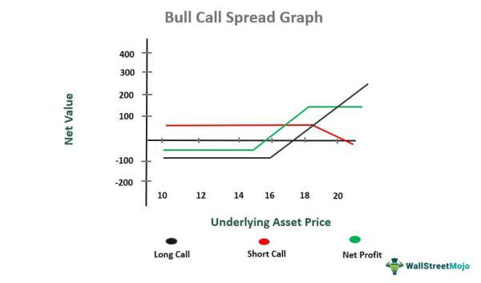

Derivatives are potent financial instruments widely utilized for purposes such as hedging, speculation, and accessing additional assets or markets. These contracts derive their value from underlying assets like stocks, bonds, commodities, or currencies. Among the various types of derivatives, options stand out for their versatility, allowing traders to construct strategies tailored to different market conditions and preferences. With options, traders have the right, not the obligation, to buy or sell assets at predetermined prices before a specified date, offering unique opportunities to capitalize on market movements.

This article examines the pivotal role of financial derivatives and introduces readers to the innovative strategies associated with options, such as multi-leg orders and algorithmic trading. These advanced techniques not only enhance traders' ability to navigate complex market landscapes but are also critical for optimizing efficiency and minimizing costs associated with executing trades. Understanding these elements is essential for participants in modern financial markets aiming to leverage derivatives effectively.



## Table of Contents

## Understanding Financial Derivatives

Financial derivatives are financial instruments whose value depends on the price movements of an underlying asset, which could be equities, bonds, commodities, currencies, interest rates, or even market indexes. These instruments are key components in financial markets, serving myriad functions, such as risk management, speculation, and arbitrage.

Derivatives derive their significance from the ability to hedge risks. For instance, a farmer may want to lock in the current price of a commodity, such as corn, to protect against the risk of falling prices at the time of harvest. In this scenario, by using futures contracts – a type of derivative – farmers can set a predetermined sale price, thus securing their future revenue. 

Derivative contracts can also be leveraged for speculative purposes. Traders and investors might use derivatives to speculate on the future price movements of an underlying asset without the need to purchase it outright. This speculative use contributes to significant trading volumes in financial markets and can lead to large profits, albeit with increased risk.

Options are a widely recognized type of derivative, providing the holder with the right, but not the obligation, to buy (call option) or sell (put option) an underlying asset at a predetermined strike price on or before a specified expiration date. This flexibility makes options versatile financial tools.

For example, consider the Black-Scholes model, a seminal model for pricing European options. The price of a call option $C$ in this model is given by:

$$
C = S_0 N(d_1) - X e^{-rT} N(d_2)
$$

where:
- $S_0$ is the current price of the stock
- $X$ is the strike price of the option
- $T$ is the time to expiration
- $r$ is the risk-free interest rate
- $N$ is the cumulative distribution function of the standard normal distribution
- $d_1$ and $d_2$ are calculated as:

$$
d_1 = \frac{\ln(S_0/X) + (r + \sigma^2/2)T}{\sigma \sqrt{T}}
$$
$$
d_2 = d_1 - \sigma \sqrt{T}
$$

Here, $\sigma$ represents the [volatility](/wiki/volatility-trading-strategies) of the underlying asset's returns. The ability to model and predict derivative prices with such mathematical frameworks underscores the sophisticated nature of these financial instruments.

Overall, financial derivatives, while complex, serve fundamental roles in enhancing market efficiency and providing mechanisms for risk transfer and management. Investors and traders alike utilize these instruments to align their strategies with their risk appetite and market insights.

## Option Strategies and Their Importance

Options strategies are versatile tools in financial trading, allowing investors to adopt positions that reflect their market outlook—whether bullish, bearish, or neutral. These strategies are centered around two primary types of options: calls and puts.

A call option provides the holder the right, but not the obligation, to purchase an asset at a specific strike price before the expiration date. Traders who anticipate a rise in the underlying asset's price typically employ call options. On the contrary, a put option grants the right to sell an asset, serving those expecting a decline in asset prices. 

For instance, buying a single call option can limit potential losses to the premium paid, while gains can be significant if market predictions hold true. Conversely, put options serve as insurance against downward movements, where losses are capped at the premium cost.

Besides these basic strategies, combinations of calls and puts can be structured to refine risk-reward profiles extensively. A covered call, for instance, involves holding a long position in a stock while selling a call option on the same asset, generating income while potentially capping upside gains if the option is exercised.

Multi-leg option strategies, such as spreads, straddles, and strangles, can offer more precise risk management and capitalize on market volatility. A spread strategy involves the simultaneous purchase and sale of options with different strike prices or expiration dates. This method can minimize upfront costs while limiting risk to predefined levels. 

For traders uncertain about market direction but expecting significant price movement, a straddle might be appropriate. By buying both a call and a put with the same strike price and expiration, traders can profit from large price swings in either direction. Similarly, a strangle employs the same approach with options featuring different strike prices, often at lower costs, albeit with a requirement for more pronounced market movements.

The allure of these strategies lies in their capacity to customize risk and reward characteristics, allowing traders to better align their positions with market expectations. However, executing these strategies effectively necessitates an understanding of each leg's implications and their interactions under varying market conditions. Carefully planned option strategies serve as a crucial component for traders endeavoring to maximize returns while mitigating risks associated with volatility.

## What is a Multi-Leg Options Order?

A multi-leg options order is a type of trading strategy that involves executing two or more different option contracts simultaneously within a single order. This approach is designed to create a comprehensive investment strategy comprising multiple components, often with varying characteristics such as strike prices, expiration dates, or types (calls and puts). This allows traders to construct complex options strategies aimed at maximizing returns or minimizing risks in various market conditions.

By placing all components of the strategy in a single order, traders can enhance efficiency in execution. Instead of submitting separate orders for each leg of an options strategy, multi-leg orders ensure that all parts of the strategy are executed concurrently. This reduces the risk associated with execution gaps—a scenario where only some portions of the strategy are successfully executed due to market fluctuations or [liquidity](/wiki/liquidity-risk-premium) issues. Such gaps can alter the intended risk profile and profitability of the strategy.

Additionally, multi-leg option orders can lead to cost savings with some brokers, as executing a strategy in one unified order can result in lower transaction fees compared to executing each leg separately. Moreover, certain platforms or brokers may offer reduced commissions for these bundled transactions, which can further enhance the cost-effectiveness of multi-leg strategies.

Common multi-leg options strategies include:

1. **Spreads**: These involve buying and selling options of the same class (either calls or puts) on the same underlying asset with different strike prices or expiration dates. An example is a vertical spread, which restricts potential losses and limits gains to a predefined range.

2. **Straddles**: This strategy entails buying a call and a put option with the same strike price and expiration date. It is advantageous in markets expected to exhibit significant price movement without a clear direction.

3. **Strangles**: Similar to straddles, but with differing strike prices for the call and put options. It offers a lower initial premium outlay compared to straddles and profits from volatility.

4. **Butterflies**: This strategy uses multiple legs to profit from minimal price movements with limited risk. It typically involves buying and selling options at different strike prices, equidistant from a central strike to form a symmetrical payoff diagram.

The introduction of multi-leg orders in trading platforms has simplified the process of executing these complex strategies, allowing traders to more effectively manage their risk and utilize opportunities in the options market.

## Examples of Multi-Leg Option Strategies

A popular multi-leg strategy is the 'straddle,' where a trader simultaneously purchases a call option and a put option with the same strike price and expiration date. This strategy is beneficial for investors expecting significant volatility in the underlying asset's price, as it allows them to profit from large price swings in either direction, regardless of whether the market moves up or down. The payoff for a straddle can be expressed as:

$$
\text{Payoff} = \max(S_t - K, 0) + \max(K - S_t, 0) - \text{Premium}_{\text{Call}} - \text{Premium}_{\text{Put}}
$$

where $S_t$ is the asset's price at expiration, $K$ is the strike price, and $\text{Premium}_{\text{Call}}$ and $\text{Premium}_{\text{Put}}$ are the costs of the call and put options, respectively.

The 'strangle' strategy is similar but involves purchasing a call and a put with different strike prices, while keeping the same expiration date. This setup is more cost-effective than the straddle because the options are typically priced lower due to the strikes being further from the current market price. However, it requires a more considerable move in the asset's price to become profitable. The payoff for a strangle can be defined as:

$$
\text{Payoff} = \max(S_t - K_1, 0) + \max(K_2 - S_t, 0) - \text{Premium}_{\text{Call}} - \text{Premium}_{\text{Put}}
$$

where $K_1$ and $K_2$ represent the call and put strike prices respectively.

The 'iron condor' strategy is a more complex, market-neutral strategy that involves selling both a call and a put option at one set of strike prices (which are close to the current market price) and buying another call and put at a further set of strike prices. This strategy profits from minimal price changes in the underlying asset by taking advantage of the premiums received from the sold options, as it limits both the maximum profit and loss potential. Typically, the payoff of an iron condor strategy is visualized rather than mathematically expressed, as it combines the characteristics of two vertical spreads.

Utilizing these strategies allows traders to benefit from various market conditions, whether they anticipate high volatility, specific price movements, or stability in the asset's price. These multi-leg options enable more precise risk management and can potentially enhance profitability when executed correctly.

## Algorithmic Trading in Derivatives

Algorithmic trading, commonly known as algo trading, utilizes computer algorithms to automate trading decisions based on predefined rules and criteria. In the derivatives market, particularly in options trading, this approach can significantly optimize trading strategies by swiftly analyzing large datasets to identify the best trading opportunities.

In options trading, the complexity of multi-leg strategies—which involve executing several option contracts simultaneously—can be efficiently managed using [algorithmic trading](/wiki/algorithmic-trading). A primary advantage of algorithms is their ability to swiftly process and analyze data, ensuring that trades are executed at optimal times based on market conditions. For instance, algorithms can monitor market trends, volatility, and liquidity in real-time, making decisions and executing trades within milliseconds, much faster than human capabilities.

One of the core aspects of algorithmic trading in options is the identification and execution of multi-leg orders. These orders, which could include various option contracts differing in strike prices and expiration dates, require precise timing to manage execution risks and costs effectively. Algorithms can rapidly evaluate thousands of potential combinations of option legs to determine the most promising strategies, thereby improving the overall efficiency and reducing the transaction costs.

Mathematically, algorithms may employ various computational models and methods such as Black-Scholes for option pricing, or even more advanced [machine learning](/wiki/machine-learning) techniques to predict market movements. Python, with its extensive libraries such as `numpy`, `pandas`, `scikit-learn`, and `TensorFlow`, is a preferred language for developing such algorithms due to its simplicity and robust data-handling capabilities.

Here is a basic Python example illustrating how an algorithm might be set up to monitor and execute a simple two-leg option strategy:

```python
import numpy as np

# Hypothetical function to determine trade signal
def calculate_signal(option_data):
    # Example logic to compute signal value based on option data
    signal = option_data['iv'] / option_data['delta']
    return signal

# Mock data
option_data = {'iv': np.array([0.2, 0.25]), 'delta': np.array([0.5, 0.55])}

# Determine execution time based on signal threshold
execution_signals = np.array([calculate_signal(option_data) > 1.0 for option_data in option_data])

# Execute trades for signals crossing threshold
for i, signal in enumerate(execution_signals):
    if signal:
        # Execute the corresponding multi-leg strategy
        print(f"Execute trade for option leg {i}")
```

In practice, the use of algorithmic trading requires careful design and rigorous testing of trading models to ensure they operate according to expected parameters. This includes [backtesting](/wiki/backtesting) strategies against historical market data to verify performance and resilience in diverse market conditions.

While algorithmic trading offers enhanced efficiency and lowered costs, it also poses new challenges, such as managing the risk of algorithm failure or reliance on high-quality data feeds. Therefore, traders must continuously monitor and refine their algorithms to maintain a competitive edge in the fast-paced derivatives markets.

## Benefits and Risks of Multi-Leg Option Strategies

Multi-leg options strategies are an essential component in the toolkit of sophisticated traders, offering a nuanced method to adjust risk-return profiles according to specific market forecasts. These strategies allow traders to dynamically manage and tailor their positions to maximize potential returns while simultaneously hedging against unfavorable market movements.

One of the primary benefits of multi-leg options strategies is their flexibility. Traders can construct these strategies to reflect various market expectations, including bullish, bearish, or neutral outlooks. By combining multiple options with different strike prices and expiration dates, traders can fine-tune their exposure to underlying assets, effectively customizing their risk-and-reward scenarios.

Cost efficiency is another notable advantage of multi-leg strategies. By executing multiple options in a single transaction, traders may incur lower transaction costs compared to executing each leg individually. Many brokers also offer package deals or reduced fees for multi-leg trades, further enhancing the cost-effectiveness of these strategies. For instance, initiating a straddle or strangle in one order may incur lower overall commissions, thereby improving net gains.

Despite their advantages, multi-leg options strategies come with significant risks that require careful attention. The complexity inherent in managing multiple legs requires a comprehensive understanding of how each leg interacts and impacts the overall position. Mismanagement can lead to unintended risk exposure and potential losses. For instance, hedging may become less effective if the volatility assumptions embedded in a strategy such as a butterfly spread are not realized.

Moreover, the dependency on precise execution timing introduces additional risk. Delays or partial execution of a strategy's legs can result in slippage, where the actual execution price deviates unfavorably from the expected price, potentially eroding profits. Automated trading systems, while helpful, also necessitate thorough validation to ensure that they execute strategies as intended.

In summary, while multi-leg options strategies provide traders with sophisticated tools to tailor their market positions and reduce costs, their complexity and execution requirements pose inherent risks. Traders must remain vigilant in their analysis and employ robust risk management practices to harness the full potential of these strategies effectively.

## Conclusion

Financial derivatives and option strategies are indispensable in today's financial markets, providing myriad opportunities to capitalize on market fluctuations. These instruments enable traders to craft a tailored approach to achieving their financial objectives, whether through hedging to protect against adverse movements or speculating to maximize potential gains. Options, in particular, present versatile strategies that can be adapted to various market conditions, which are essential for risk management and profit maximization.

Multi-leg options orders offer a streamlined approach to implementing complex strategies. By allowing traders to simultaneously execute multiple option contracts, these orders enhance operational efficiency and potentially reduce transaction costs. This capability is crucial in minimizing the risk of execution gaps, where partial fulfillment could lead to unfavorable positions. For instance, using a single multi-leg order for an iron condor strategy ensures all positions are executed simultaneously, preserving the intended risk/reward balance.

Algorithmic trading further augments the utility of financial derivatives by optimizing trade execution. Through the use of advanced algorithms, traders can identify and capitalize on market opportunities more effectively, ensuring trades are executed at the most favorable prices. The automation of complex strategies also allows for consistent application of trading logic, reducing human error and enhancing execution speed.

To fully exploit these financial tools, traders must possess a comprehensive understanding and exercise careful management of their strategies. This entails not only knowledge of each individual component but also insight into how they interact within a broader strategy. The intricate nature of multi-leg option strategies necessitates a strategic approach, where an appreciation of their complexity can mitigate potential risks and lead to informed decision-making.

In summary, financial derivatives and option strategies present significant opportunities for those with the acumen to harness them effectively. The integration of multi-leg options orders and algorithmic trading provides the flexibility and precision necessary to thrive in today’s dynamic markets.

## References & Further Reading

[1]: Black, F., & Scholes, M. (1973). ["The Pricing of Options and Corporate Liabilities."](https://www.cs.princeton.edu/courses/archive/fall09/cos323/papers/black_scholes73.pdf) Journal of Political Economy, 81(3), 637-654.

[2]: Hull, J. C. (2014). ["Options, Futures, and Other Derivatives."](https://www.amazon.com/Options-Futures-Other-Derivatives-9th/dp/0133456315) Pearson Education Limited.

[3]: Natenberg, S. (1994). ["Option Volatility and Pricing: Advanced Trading Strategies and Techniques."](https://www.amazon.com/Option-Volatility-Pricing-Strategies-Techniques/dp/0071818774) McGraw-Hill Companies.

[4]: Jarrow, R. (1998). ["Abstract Financial Derivatives Pricing, Security Design, and Investment Decisions."](https://scholar.google.com/citations?user=8-Nx8DcAAAAJ&hl=en) Journal of End User Computing, II.

[5]: Lopez de Prado, M. (2018). ["Advances in Financial Machine Learning."](https://www.amazon.com/Advances-Financial-Machine-Learning-Marcos/dp/1119482089) Wiley.

[6]: Chan, E. (2008). ["Quantitative Trading: How to Build Your Own Algorithmic Trading Business."](https://github.com/ftvision/quant_trading_echan_book) Wiley Trading.

[7]: Jansen, S. (2020). ["Machine Learning for Algorithmic Trading: Predictive Models to Extract Signals from Market and Alternative Data for Systematic Trading Strategies with Python."](https://www.amazon.com/Machine-Learning-Algorithmic-Trading-alternative/dp/1839217715) Packt Publishing.

[8]: Wilmott, P. (2006). ["Paul Wilmott Introduces Quantitative Finance."](https://www.amazon.com/Paul-Wilmott-Introduces-Quantitative-Finance/dp/0470319585) Wiley.