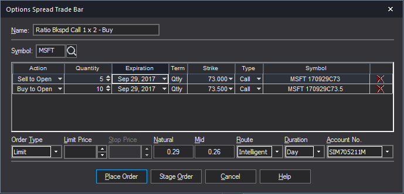

## Table of Contents

## What is a multi-leg options order?

A multi-leg options order is when you make a trade with more than one option at the same time. It's like buying or selling different pieces of a puzzle all at once, where each piece is an option with its own price and expiration date. This kind of order is used to create strategies that can help manage risk or increase potential profits.

For example, you might use a multi-leg order to do something called a "straddle," where you buy both a call option and a put option on the same stock with the same expiration date. This strategy can be useful if you think the stock price will move a lot but you're not sure which way it will go. By using a multi-leg order, you can set up this strategy in one go, making it easier and sometimes cheaper than placing separate orders.

## How does a multi-leg options order differ from a single-leg order?

A multi-leg options order involves trading more than one option at the same time, while a single-leg order is just one option trade. Think of it like this: a single-leg order is like buying one ticket to a movie, but a multi-leg order is like buying several tickets for different movies at the same time. With a single-leg order, you're focusing on one specific option, either buying or selling it based on your prediction of where the stock price is going.

In contrast, a multi-leg order lets you create a strategy by combining different options. For example, you might buy a call option and sell a put option on the same stock to create a strategy called a "straddle." This can help you manage risk or potentially increase your profits in ways that a single option trade can't. Multi-leg orders can be more complex and might require more planning, but they offer more flexibility in how you can approach the market.

## What are the common types of multi-leg options strategies?

Multi-leg options strategies are ways to trade options that involve more than one option at a time. Some common types include the straddle, the strangle, and the butterfly spread. A straddle is when you buy a call option and a put option on the same stock with the same expiration date and strike price. This is useful if you think the stock price will move a lot but you're not sure which way. A strangle is similar, but the call and put options have different strike prices. This can be a bit cheaper than a straddle but still lets you benefit from big price moves in either direction.

Another common strategy is the butterfly spread, which involves buying and selling options at three different strike prices. You buy one option at a low strike price, sell two options at a middle strike price, and buy one option at a high strike price. This can be used if you think the stock price won't move much. It limits your risk but also limits your potential profit. These strategies can help you manage risk and potentially increase your profits, but they require a good understanding of how options work and the risks involved.

## What are the benefits of using multi-leg options orders?

Using multi-leg options orders can help you manage risk better. When you trade more than one option at the same time, you can set up strategies that protect you from big losses. For example, if you think a stock might go up or down a lot but you're not sure which way, you can use a strategy like a straddle. This means you buy a call option and a put option on the same stock. If the stock price moves a lot in either direction, you can still make money. It's like having a safety net that catches you if things don't go as planned.

Multi-leg options orders can also help you make more money. By combining different options, you can create strategies that might give you bigger profits than trading just one option. For instance, a butterfly spread lets you make money if the stock price stays pretty much the same. You buy and sell options at different prices, and if the stock stays in a certain range, you can earn a profit. These strategies can be more complex, but they give you more ways to make money from the stock market.

## What are the risks associated with multi-leg options orders?

Multi-leg options orders can be trickier than single-leg orders because they involve more options at the same time. This means there's more to keep track of, and if you don't understand how all the pieces fit together, you could lose money. For example, if you set up a straddle but the stock price doesn't move as much as you thought it would, both your call and put options might lose value, leaving you with a bigger loss than if you had just traded one option.

Another risk is that multi-leg orders can be more expensive to set up. Each option you trade comes with its own cost, called a premium, and when you're trading multiple options, those costs can add up. If the stock doesn't move in the way you hoped, you might not make enough money to cover those costs, leading to a loss. It's important to think carefully about whether the potential rewards are worth the extra risk and cost.

## How do you set up a multi-leg options order?

To set up a multi-leg options order, you first need to decide on a strategy. Think about what you want to happen with the stock price and pick a strategy like a straddle or a butterfly spread that fits your goal. Once you've chosen your strategy, you'll need to find the right options to use. This means looking at different expiration dates and strike prices for the options you want to buy and sell. You can do this on your broker's trading platform, where you'll see a list of options for the stock you're interested in.

After you've picked your options, you'll enter them into your trading platform as one order. For example, if you're doing a straddle, you'll enter a buy order for a call option and a buy order for a put option at the same time. Make sure to double-check all the details like the number of options, the expiration dates, and the strike prices. Once everything looks right, you can submit the order. Your broker will then try to fill all parts of your multi-leg order at the same time. If it all goes through, you'll have your multi-leg options strategy set up and ready to go.

## What are the key considerations when choosing strike prices and expiration dates for multi-leg options?

When choosing strike prices for multi-leg options, think about where you expect the stock price to go. If you're doing a straddle or a strangle, you might pick strike prices close to the current stock price because you want to make money if the stock moves a lot in either direction. For a butterfly spread, you'll choose three different strike prices: one lower than the current price, one at the current price, and one higher. This setup works best if you think the stock won't move much. The key is to match your strike prices with your prediction for the stock's movement.

Choosing the right expiration dates is also important. Shorter expiration dates mean less time for the stock to move, which can be good if you're expecting a quick change. But if you think the stock will take longer to move, you might pick a longer expiration date. This gives the stock more time to reach your target price, but it also means you'll pay more for the options because they have more time value. Balancing the cost with the time you need for your strategy to work is crucial when [picking](/wiki/asset-class-picking) expiration dates.

## How does the pricing of multi-leg options orders work?

The pricing of multi-leg options orders involves adding up the costs of each individual option in the strategy. Each option has a price called a premium, which you pay when you buy the option or receive when you sell it. The total cost of your multi-leg order is the sum of all these premiums, plus any fees your broker might charge. If you're doing a strategy like a straddle, where you buy both a call and a put option, you'll add the premium of the call option to the premium of the put option to get your total cost. It's like buying several tickets for different movies at once; you have to pay for each ticket.

Sometimes, the pricing can get a bit more complicated because the options you're buying and selling can affect each other. For example, in a butterfly spread, you buy one option at a low strike price, sell two options at a middle strike price, and buy one option at a high strike price. The premiums for these options will be different, and they can change based on how the stock price moves and how much time is left until they expire. When you set up your multi-leg order, your broker's platform will show you the total cost, helping you see if the strategy fits your budget and goals.

## What impact does volatility have on multi-leg options strategies?

Volatility is how much a stock's price goes up and down. It's really important for multi-leg options strategies because it can change how much you might make or lose. If a stock is very volatile, meaning its price moves a lot, options on that stock will usually cost more. This is because there's a bigger chance the stock will hit the price you need for your strategy to work. So, if you're doing a strategy like a straddle, where you want the stock to move a lot, high volatility can be good because it makes your options more likely to be profitable. But it also means you have to pay more upfront.

On the other hand, if a stock isn't very volatile, its price doesn't change much. This can be good for strategies like a butterfly spread, where you want the stock to stay in a certain range. Lower volatility means the options will be cheaper, so your total cost for setting up the strategy will be less. But it also means there's less chance the stock will move enough to make your strategy work. So, when you're choosing a multi-leg options strategy, you need to think about how volatile the stock is and pick a strategy that matches that volatility.

## How can you manage and adjust multi-leg options positions?

Managing and adjusting multi-leg options positions means keeping an eye on how your strategy is doing and making changes if things aren't going as planned. If the stock price moves in a way you didn't expect, you might need to adjust your options to limit losses or lock in profits. For example, if you have a straddle and the stock price stays the same, you might sell one of your options to cut your losses. Or, if the stock moves a lot in one direction, you could close out the losing side of your straddle to save money.

Adjusting your positions can also mean adding new options to your strategy. If you started with a butterfly spread but the stock price starts moving outside the range you expected, you might buy or sell more options to create a new strategy that fits the current situation. This can help you manage risk and maybe even make more money. It's important to keep checking on your positions and be ready to make changes, but always think carefully about the costs and risks of any adjustments you make.

## What are some advanced techniques for optimizing multi-leg options orders?

One advanced technique for optimizing multi-leg options orders is called delta hedging. This means you adjust your options positions to balance out the risk of the stock price moving against you. For example, if you have a straddle and the stock starts moving up, you might sell some of the stock to offset the risk of the call option losing value. This can help you keep your strategy on track even if the stock price moves in unexpected ways. It's like adding weights to a scale to keep it balanced, making sure your options strategy stays profitable no matter which way the stock goes.

Another technique is to use options Greeks, which are measurements that help you understand how different factors affect your options. For example, you can look at the theta, which shows how much your options lose value as time passes. By keeping an eye on theta, you can decide when to adjust your positions to minimize time decay. You can also use vega to see how sensitive your options are to changes in volatility. If you expect volatility to increase, you might choose options with a higher vega to benefit from that change. Using these Greeks helps you fine-tune your multi-leg options strategy to make the most of market conditions.

## How do you evaluate the performance of multi-leg options strategies?

Evaluating the performance of multi-leg options strategies means looking at how well your options are doing compared to what you hoped for. You start by checking the total value of your options positions. This includes seeing how much each option is worth now and comparing it to what you paid for it. If the total value is higher than what you spent, you're making a profit. But if it's lower, you're losing money. You also need to think about any fees you paid to set up the strategy, because they can eat into your profits.

Another important part of evaluating your strategy is looking at how the stock price has moved compared to your predictions. If the stock moved in the way you expected, but your options still aren't doing well, you might need to adjust your strategy. For example, if you used a straddle because you thought the stock would move a lot, but it didn't, you might need to close out one of your options to cut your losses. Keeping an eye on how the stock is behaving and how your options are responding to those changes helps you decide if your strategy is working or if you need to make changes.

## What is the understanding of financial derivatives?

Financial derivatives are financial instruments whose value depends on the price movements of an underlying asset, which could be equities, bonds, commodities, currencies, interest rates, or even market indexes. These instruments are key components in financial markets, serving myriad functions, such as risk management, speculation, and [arbitrage](/wiki/arbitrage).

Derivatives derive their significance from the ability to hedge risks. For instance, a farmer may want to lock in the current price of a commodity, such as corn, to protect against the risk of falling prices at the time of harvest. In this scenario, by using futures contracts – a type of derivative – farmers can set a predetermined sale price, thus securing their future revenue. 

Derivative contracts can also be leveraged for speculative purposes. Traders and investors might use derivatives to speculate on the future price movements of an underlying asset without the need to purchase it outright. This speculative use contributes to significant trading volumes in financial markets and can lead to large profits, albeit with increased risk.

Options are a widely recognized type of derivative, providing the holder with the right, but not the obligation, to buy (call option) or sell (put option) an underlying asset at a predetermined strike price on or before a specified expiration date. This flexibility makes options versatile financial tools.

For example, consider the Black-Scholes model, a seminal model for pricing European options. The price of a call option $C$ in this model is given by:

$$
C = S_0 N(d_1) - X e^{-rT} N(d_2)
$$

where:
- $S_0$ is the current price of the stock
- $X$ is the strike price of the option
- $T$ is the time to expiration
- $r$ is the risk-free interest rate
- $N$ is the cumulative distribution function of the standard normal distribution
- $d_1$ and $d_2$ are calculated as:

$$
d_1 = \frac{\ln(S_0/X) + (r + \sigma^2/2)T}{\sigma \sqrt{T}}
$$
$$
d_2 = d_1 - \sigma \sqrt{T}
$$

Here, $\sigma$ represents the [volatility](/wiki/volatility-trading-strategies) of the underlying asset's returns. The ability to model and predict derivative prices with such mathematical frameworks underscores the sophisticated nature of these financial instruments.

Overall, financial derivatives, while complex, serve fundamental roles in enhancing market efficiency and providing mechanisms for risk transfer and management. Investors and traders alike utilize these instruments to align their strategies with their risk appetite and market insights.

## What are some examples of multi-leg option strategies?

A popular multi-leg strategy is the 'straddle,' where a trader simultaneously purchases a call option and a put option with the same strike price and expiration date. This strategy is beneficial for investors expecting significant volatility in the underlying asset's price, as it allows them to profit from large price swings in either direction, regardless of whether the market moves up or down. The payoff for a straddle can be expressed as:

$$
\text{Payoff} = \max(S_t - K, 0) + \max(K - S_t, 0) - \text{Premium}_{\text{Call}} - \text{Premium}_{\text{Put}}
$$

where $S_t$ is the asset's price at expiration, $K$ is the strike price, and $\text{Premium}_{\text{Call}}$ and $\text{Premium}_{\text{Put}}$ are the costs of the call and put options, respectively.

The 'strangle' strategy is similar but involves purchasing a call and a put with different strike prices, while keeping the same expiration date. This setup is more cost-effective than the straddle because the options are typically priced lower due to the strikes being further from the current market price. However, it requires a more considerable move in the asset's price to become profitable. The payoff for a strangle can be defined as:

$$
\text{Payoff} = \max(S_t - K_1, 0) + \max(K_2 - S_t, 0) - \text{Premium}_{\text{Call}} - \text{Premium}_{\text{Put}}
$$

where $K_1$ and $K_2$ represent the call and put strike prices respectively.

The 'iron condor' strategy is a more complex, market-neutral strategy that involves selling both a call and a put option at one set of strike prices (which are close to the current market price) and buying another call and put at a further set of strike prices. This strategy profits from minimal price changes in the underlying asset by taking advantage of the premiums received from the sold options, as it limits both the maximum profit and loss potential. Typically, the payoff of an iron condor strategy is visualized rather than mathematically expressed, as it combines the characteristics of two vertical spreads.

Utilizing these strategies allows traders to benefit from various market conditions, whether they anticipate high volatility, specific price movements, or stability in the asset's price. These multi-leg options enable more precise risk management and can potentially enhance profitability when executed correctly.

## References & Further Reading

[1]: Black, F., & Scholes, M. (1973). ["The Pricing of Options and Corporate Liabilities."](https://www.cs.princeton.edu/courses/archive/fall09/cos323/papers/black_scholes73.pdf) Journal of Political Economy, 81(3), 637-654.

[2]: Hull, J. C. (2014). ["Options, Futures, and Other Derivatives."](https://www.amazon.com/Options-Futures-Other-Derivatives-9th/dp/0133456315) Pearson Education Limited.

[3]: Natenberg, S. (1994). ["Option Volatility and Pricing: Advanced Trading Strategies and Techniques."](https://www.amazon.com/Option-Volatility-Pricing-Strategies-Techniques/dp/0071818774) McGraw-Hill Companies.

[4]: Jarrow, R. (1998). ["Abstract Financial Derivatives Pricing, Security Design, and Investment Decisions."](https://scholar.google.com/citations?user=8-Nx8DcAAAAJ&hl=en) Journal of End User Computing, II.

[5]: Lopez de Prado, M. (2018). ["Advances in Financial Machine Learning."](https://www.amazon.com/Advances-Financial-Machine-Learning-Marcos/dp/1119482089) Wiley.

[6]: Chan, E. (2008). ["Quantitative Trading: How to Build Your Own Algorithmic Trading Business."](https://github.com/ftvision/quant_trading_echan_book) Wiley Trading.

[7]: Jansen, S. (2020). ["Machine Learning for Algorithmic Trading: Predictive Models to Extract Signals from Market and Alternative Data for Systematic Trading Strategies with Python."](https://www.amazon.com/Machine-Learning-Algorithmic-Trading-alternative/dp/1839217715) Packt Publishing.

[8]: Wilmott, P. (2006). ["Paul Wilmott Introduces Quantitative Finance."](https://www.amazon.com/Paul-Wilmott-Introduces-Quantitative-Finance/dp/0470319585) Wiley.