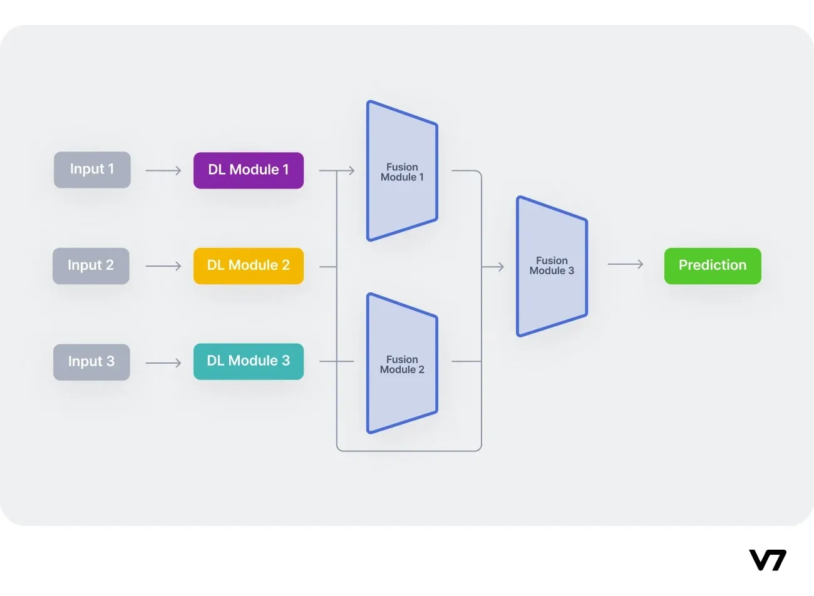

## Table of Contents

## What are multi-modal methods in machine learning?

Multi-modal methods in machine learning are techniques that combine different types of data, like text, images, and sounds, to improve how machines understand and process information. Instead of using just one type of data, multi-modal methods use several, which can make the machine's understanding more complete and accurate. For example, when you search for something online, using both the text you type and the images you look at can help the search engine give you better results.

These methods work by finding ways to connect and combine different data types. One common way is to turn each type of data into a shared format, like numbers, so the machine can understand them all together. This can be done using special algorithms that learn how to match up the different data types. For example, an algorithm might learn to connect the words in a caption to the objects in a picture. By doing this, multi-modal methods can be used in many areas, like helping self-driving cars understand both road signs and spoken directions, or helping doctors use both medical images and patient reports to make better diagnoses.

## How do multi-modal methods differ from single-modal methods?

Multi-modal methods use different types of data at the same time, like pictures, sounds, and words. This is different from single-modal methods, which only use one type of data. For example, a single-modal method might only look at text to understand what someone is saying, while a multi-modal method might also listen to their voice and watch their facial expressions. By using more than one type of data, multi-modal methods can get a fuller picture of what's going on and make better decisions or predictions.

Single-modal methods are simpler and easier to use because they only need to work with one kind of information. They are good for tasks where you only need to focus on one thing, like recognizing numbers in a picture. But they can miss out on important details that other types of data could provide. Multi-modal methods, on the other hand, can be more complex because they have to figure out how to combine different kinds of data. But this extra effort can lead to better results, especially in situations where understanding the whole context is important, like in medical diagnoses or self-driving cars.

## Can you explain the basic architecture of a multi-modal model?

The basic architecture of a multi-modal model involves taking in different types of data, like text, images, and sounds, and combining them to make better predictions or decisions. Each type of data goes through its own separate part of the model first. For example, if you have text and images, the text might go through a language model, and the images might go through a vision model. These parts turn the data into numbers that the computer can understand, called features. This step is important because it makes sure that all the different kinds of data can be compared and used together.

After the data is turned into features, the next step is to combine them. There are different ways to do this, but one common way is to use something called a fusion layer. This layer takes the features from each type of data and mixes them together. It might do this by adding them up, or by using a more complex method like a neural network to figure out how they should be combined. Once the features are combined, the model can use them to make a final prediction or decision. This whole process helps the model understand the data better and make more accurate results by using information from multiple sources.

## What are some common applications of multi-modal methods?

Multi-modal methods are used in many areas where understanding different types of information at the same time can help. One common use is in healthcare, where doctors can use both medical images and patient reports to make better diagnoses. For example, a doctor might look at an X-ray and read the patient's symptoms to figure out what's wrong. By using both types of data, the doctor can get a fuller picture of the patient's health and make more accurate decisions.

Another area where multi-modal methods are helpful is in self-driving cars. These cars need to understand road signs, spoken directions, and what they see around them to drive safely. By combining these different types of data, the car can make better decisions about where to go and how to avoid dangers. This makes the car safer and more reliable for the people inside.

Multi-modal methods are also used in technology like virtual assistants and search engines. A virtual assistant might use both your voice and the words you type to understand what you want. A search engine might use the text you search for and the images you look at to give you better results. By using different types of data, these technologies can understand what you need more accurately and help you faster.

## How does GLIDE use multi-modal learning for image generation?

GLIDE, which stands for "Guided Language to Image Diffusion for Generation and Editing," is a model that uses multi-modal learning to create images from text. It takes in text descriptions and turns them into pictures. GLIDE does this by first understanding the text, then figuring out how to draw the image that matches the text. This is different from models that only use one type of data because GLIDE combines both text and image information to make better pictures.

To create images, GLIDE uses a process called diffusion. It starts with a random image and slowly changes it to match the text description. This is done by breaking down the image creation into many small steps. Each step makes the image a little bit closer to what the text says. By using both the text and the image data together, GLIDE can make very detailed and accurate pictures that fit the descriptions given to it.

## What is the role of UNIMO in understanding and generating multi-modal content?

UNIMO, which stands for "UNIfied Multimodal pre-training framework," is a model that helps computers understand and create content using different types of data, like text and images. It works by learning from a lot of examples that include both text and images. This helps UNIMO understand how words and pictures are connected. For example, if you show UNIMO a picture of a dog and the word "dog," it learns that the word and the image go together. By doing this with many different examples, UNIMO gets better at understanding and creating content that uses both text and images.

UNIMO can be used for many things, like answering questions about pictures or creating new images from text descriptions. It does this by using a special way of combining the text and image data. When you ask UNIMO a question about a picture, it looks at both the picture and the words in the question to give you a good answer. If you want UNIMO to create an image from a text description, it uses what it has learned about how words and pictures connect to make a new image that matches the description. This makes UNIMO very useful for tasks that need to understand and create content using different types of data.

## How does EmbraceNet integrate different modalities for improved performance?

EmbraceNet is a way to combine different kinds of information, like pictures, sounds, and words, to make computers work better. It does this by using something called "multi-modal fusion." This means it takes each type of information and puts them together in a special way. Instead of just adding them up, EmbraceNet uses a method that looks at how each type of information can help the others. This helps the computer understand the whole situation better and make better decisions or predictions.

For example, if you want to recognize what's in a picture and you have both the picture and a description of it, EmbraceNet can use both to get a fuller understanding. It might look at the colors and shapes in the picture and connect them to the words in the description. By doing this, EmbraceNet can be more accurate than if it only used the picture or the words alone. This makes it useful for things like helping doctors understand medical images better when they also have the patient's written report.

## What is Vokenization and how does it contribute to multi-modal learning?

Vokenization is a way to connect words and pictures to help computers understand them better. It works by finding a picture, called a "voken," that matches each word in a sentence. For example, if the word is "dog," the voken might be a picture of a dog. By doing this for every word, vokenization creates a link between the words and the pictures. This helps the computer learn how words and pictures are related, which is important for multi-modal learning.

In multi-modal learning, computers use different kinds of information, like words and pictures, to understand things better. Vokenization helps by giving the computer a way to turn words into pictures. This makes it easier for the computer to use both words and pictures together. For example, if you want the computer to understand a story, it can use the words and the vokens to get a fuller picture of what's happening. This can make the computer's understanding more accurate and helpful.

## How does VATT leverage video and text for self-supervised learning?

VATT, which stands for "Video And Text Transformers," uses videos and the words that go with them to help computers learn on their own. It does this by watching a lot of videos and reading the words that describe what's happening in the videos. VATT then tries to match the words to the right parts of the video. This helps the computer understand how words and moving pictures are connected. By doing this over and over, VATT learns to predict what words go with what parts of a video without needing someone to tell it the answers.

This way of learning is called self-supervised learning because the computer figures things out by itself. VATT uses a special kind of computer program called a transformer to do this. The transformer looks at the videos and words and finds patterns in them. By finding these patterns, VATT gets better at understanding and predicting what words go with what parts of a video. This makes it really useful for things like helping computers understand videos better or even making new videos from words.

## Can you describe the CTAL approach to multi-modal learning and its advantages?

CTAL, which stands for "Cross-modal Transfer and Adaptation Learning," is a way to use different kinds of information, like pictures and words, to help computers learn better. It works by taking what the computer knows from one type of information and using it to understand another type. For example, if the computer is good at understanding pictures, CTAL can help it use that knowledge to get better at understanding words. This is done by finding ways to connect the information from pictures and words, so the computer can use them together to learn more.

One big advantage of CTAL is that it can make the computer's understanding more complete. By using both pictures and words, the computer can see the whole picture and not just one part. This can help it make better decisions or predictions. Another advantage is that CTAL can help the computer learn faster. If it already knows a lot about one type of information, it can use that knowledge to quickly get better at understanding another type. This makes CTAL a very useful tool for multi-modal learning.

## What are the key features of MAVL and how does it handle multi-modal data?

MAVL, which stands for "Multi-modal Adversarial Variational Learning," is a way to help computers learn from different types of information, like pictures and words, at the same time. It does this by using a special kind of learning called adversarial learning. This means that MAVL has two parts that work against each other to get better. One part tries to understand the pictures and words, and the other part tries to trick it. By doing this, MAVL learns to see how pictures and words are connected and can use both types of information together to understand things better.

MAVL handles multi-modal data by turning each type of information into numbers that the computer can understand. These numbers are called features. MAVL then mixes these features together using a method called variational learning. This helps MAVL find patterns in the data and use them to make better predictions or decisions. By using both pictures and words, MAVL can get a fuller picture of what's happening and make more accurate results.

## How does SyCoCa approach the challenge of synchronizing different modalities in real-time?

SyCoCa, which stands for "Synchronous Cross-modal Calibration," is a way to help computers use different types of information, like pictures and sounds, at the same time. It does this by making sure that the computer understands all the different types of information together, in real-time. This means that as soon as the computer gets new pictures and sounds, it can quickly figure out how they fit together. SyCoCa does this by using a special method that keeps the different types of information in sync. This helps the computer understand what's happening right now, without waiting for all the information to come in.

One way SyCoCa keeps things in sync is by using something called a "synchronization layer." This layer looks at the pictures and sounds as they come in and finds ways to connect them. For example, if you're watching a video and hearing the sound at the same time, SyCoCa can make sure the computer knows which sounds go with which parts of the video. By doing this, SyCoCa helps the computer understand the whole situation better and faster. This makes it really useful for things like helping self-driving cars understand what's happening around them in real-time.