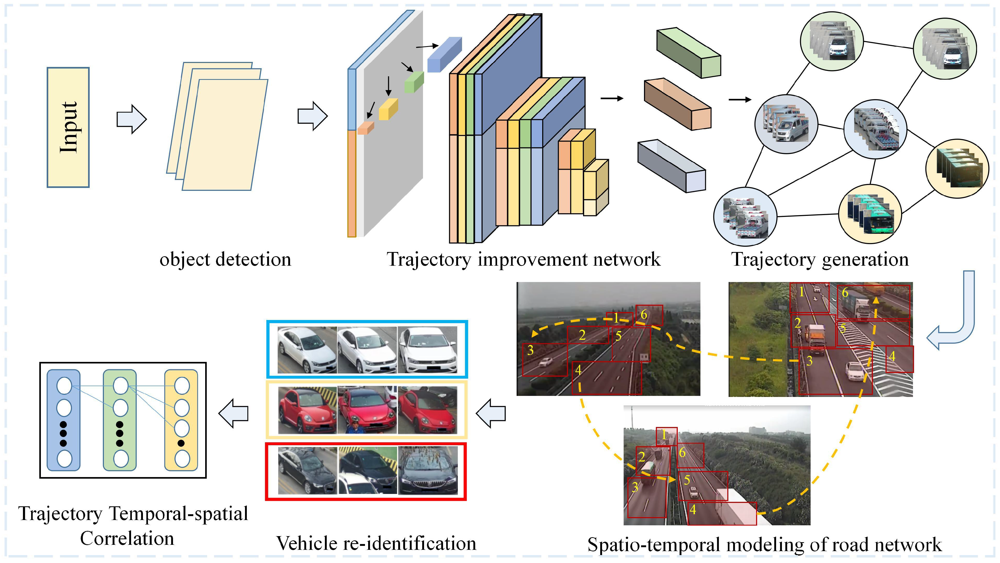

## Table of Contents

## What is multi-object tracking in machine learning?

Multi-object tracking in machine learning is a technique used to follow multiple objects over time in videos or images. It's like playing a game where you need to keep your eyes on many moving targets at once. The goal is to figure out where each object is, how it's moving, and keep track of it as it moves around. This is important for things like self-driving cars, where the car needs to watch other cars, people, and bikes to drive safely.

To do multi-object tracking, computers use special algorithms. These algorithms first detect where the objects are in each frame of a video. Then, they try to match these detections across different frames to see how the objects are moving. This can be tricky because objects can look different from one frame to the next, or they might get blocked by other things. So, the algorithms need to be smart to keep track of everything correctly.

## How do multi-object tracking models differ from single-object tracking models?

Multi-object tracking models are designed to follow more than one object at the same time, while single-object tracking models focus on tracking just one object. Think of it like watching a group of kids playing in a park versus keeping an eye on just one kid. Multi-object tracking is harder because the model has to keep track of many things at once, making sure it doesn't mix them up. On the other hand, single-object tracking is simpler because the model only needs to focus on one target, which can make it more accurate for that one object.

The way these models work is also different. In multi-object tracking, the model has to detect all the objects in each frame of a video and then figure out which detection belongs to which object from the previous frame. This can be challenging because objects might look different or get blocked. Single-object tracking, however, usually starts with knowing where the object is in the first frame and then tries to follow it from frame to frame. Because it's only tracking one thing, the model can use more specific information about that object to keep following it accurately.

## What are some common applications of multi-object tracking?

Multi-object tracking is really useful in many areas. One big use is in self-driving cars. These cars need to watch other cars, bikes, and people to drive safely. The tracking system helps the car know where everything is and how it's moving, so it can decide the best way to go without hitting anything. It's like having eyes all around the car, keeping track of everything at once.

Another place where multi-object tracking is important is in sports. Imagine watching a soccer game on TV. The tracking system can follow all the players and the ball, showing where they move during the game. This helps coaches and fans understand the game better, and it can even help with things like player stats and game analysis. It's like having a super-smart camera that never loses sight of anyone on the field.

Multi-object tracking is also used in security and surveillance. In busy places like airports or train stations, cameras can track many people at once. This helps security teams watch for anything unusual or keep an eye on crowds to make sure everyone is safe. It's like having a bunch of security guards who can watch everyone without getting tired or missing anything.

## Can you explain the basic components of a multi-object tracking system?

The first part of a multi-object tracking system is object detection. This is where the system looks at each frame of a video and finds all the objects it needs to track. It's like playing a game of "I Spy" where you have to spot all the cars, people, or balls in a picture. Once the system spots these objects, it needs to figure out what they are and where they are in the frame. This part is important because if the system misses an object, it won't be able to track it later.

The second part is tracking the objects over time. After detecting the objects, the system has to match them from one frame to the next. This can be tricky because objects might move around, change how they look, or even get blocked by other things. The system uses special math to predict where an object will be in the next frame and then checks if it's right. If it matches the object correctly, it keeps following it. If not, it has to start over and try again. It's like playing a game of connect-the-dots, but the dots are moving and sometimes hiding.

The last part is managing the tracks. As the system keeps tracking the objects, it needs to keep a record of where each object has been. This is like keeping a diary for each object, noting down where it started, where it went, and where it is now. If an object disappears from view, the system has to decide if it's gone for good or if it might come back. It's important to keep these records straight so the system doesn't mix up different objects or lose track of them.

## What is the role of detection in multi-object tracking models?

Detection is a key part of multi-object tracking models. It's the step where the model looks at each frame of a video and finds all the objects it needs to keep an eye on. Think of it like playing a game where you have to spot all the cars, people, or balls in a picture. The model uses special algorithms to find these objects and figure out where they are in the frame. If the model misses an object during detection, it won't be able to track it later, so this step is really important.

Once the model has detected the objects, it needs this information to start tracking them over time. The detection results help the model match objects from one frame to the next. This can be tricky because objects might move around, change how they look, or get blocked by other things. The model uses the detection data to predict where an object will be in the next frame and then checks if it's right. Accurate detection is crucial because it sets the foundation for the rest of the tracking process.

## How does data association work in multi-object tracking?

Data association in multi-object tracking is like playing a matching game. After the model detects objects in each frame of a video, it needs to figure out which detection in the new frame belongs to which object from the last frame. This is important because it helps the model keep track of where each object is going over time. The model uses different ways to match these detections, like looking at how close they are or how similar they look. If the model gets the matching right, it can follow the objects correctly. If it makes a mistake, it might mix up different objects or lose track of them.

One common way to do data association is by using something called the Hungarian algorithm. This method tries to find the best way to match detections to tracks by minimizing the total "cost" of the matches. The cost could be things like the distance between the old and new positions of an object or how different the object looks from one frame to the next. The Hungarian algorithm helps the model make smart guesses about which detections go with which tracks, making sure it keeps following the right objects. This is like solving a puzzle where you need to connect the pieces in the best way possible.

## What are the key challenges faced in multi-object tracking?

One of the biggest challenges in multi-object tracking is dealing with occlusions. This happens when one object blocks another, making it hard for the model to see the blocked object. Imagine trying to follow a friend in a crowded place but losing sight of them when someone steps in front. The model has to guess where the hidden object might be and then check if it's right when the object comes back into view. This can lead to mistakes, like mixing up different objects or losing track of them completely.

Another challenge is handling changes in how objects look. Objects can change appearance from one frame to the next because of different lighting, angles, or movements. For example, a car might look different when it turns or when the sun goes behind a cloud. The model has to be smart enough to recognize that it's the same object even though it looks different. This requires the model to use lots of information and make good guesses about which detection belongs to which object.

Keeping track of many objects at once is also tough. The model has to manage lots of information and make sure it doesn't mix up different objects. This is like trying to follow many different stories at the same time without getting confused. The model uses special algorithms to help with this, but it's still a big challenge. If the model makes a mistake, it might lose track of an object or start following the wrong one, which can mess up the whole tracking process.

## Can you describe the architecture of the Wizard multi-object tracking model?

The Wizard multi-object tracking model is designed to keep an eye on many objects at once in videos. It starts by using a special part called a detector to find all the objects in each frame of the video. Once it spots these objects, it uses another part called a tracker to follow them over time. The tracker tries to match the objects from one frame to the next, even if they move around or get blocked by other things. This is like playing a game where you need to keep track of many moving targets without losing sight of any of them.

The Wizard model also uses something called data association to help with tracking. This part tries to figure out which object in the new frame is the same as an object from the last frame. It's like solving a puzzle where you need to connect the pieces in the best way possible. The model uses the Hungarian algorithm to do this, which helps it make smart guesses about which detections go with which tracks. By doing this, the Wizard model can follow many objects accurately, even in busy scenes where things are moving around a lot.

## How does CenterTrack improve upon traditional multi-object tracking methods?

CenterTrack improves upon traditional multi-object tracking methods by combining object detection, tracking, and even estimating how far away objects are all in one step. In traditional methods, these tasks are usually done separately, which can make things more complicated and less accurate. CenterTrack, on the other hand, uses a single network to do all of this at the same time. This means it can keep a better eye on objects and make fewer mistakes, especially when objects move around a lot or get blocked by other things. By doing everything together, CenterTrack can be faster and more reliable.

Another way CenterTrack improves is by using something called "center-based tracking." Instead of trying to match the whole shape of an object from one frame to the next, CenterTrack just focuses on the center point of each object. This makes it easier to follow objects, even if they turn or change how they look. By keeping an eye on the centers, CenterTrack can handle tricky situations better than traditional methods, making it a smarter way to track multiple objects at once.

## What makes FairMOT unique among other multi-object tracking models?

FairMOT is unique because it combines object detection and tracking into one step, making it simpler and more accurate than many other models. In traditional models, these tasks are often done separately, which can lead to mistakes, especially when objects move around a lot or get blocked. FairMOT uses a single network to do both jobs at the same time, which helps it keep a better eye on objects and make fewer errors. This approach also makes FairMOT faster and more reliable because it doesn't have to switch between different steps.

Another thing that makes FairMOT stand out is its focus on fairness between detection and tracking. Some models might be good at spotting objects but not as good at following them over time. FairMOT tries to be good at both by using a special method to balance the two tasks. This means it can handle tricky situations better and keep track of many objects accurately, even in busy scenes where things are moving around a lot. By doing this, FairMOT becomes a smarter and more balanced way to track multiple objects at once.

## How do SMOT and LMOT handle occlusions and long-term dependencies in tracking?

SMOT and LMOT are two multi-object tracking models that deal with occlusions and long-term dependencies in different ways. SMOT, or Simple MOT, uses a straightforward approach to handle occlusions. When an object gets blocked, SMOT predicts where it might be based on its last known position and motion. This is like guessing where a friend might be in a crowded room if you lose sight of them for a moment. SMOT keeps track of these guesses and checks them against new detections when the object comes back into view. This helps SMOT keep following objects even when they are temporarily hidden.

LMOT, or Long-term MOT, focuses more on handling long-term dependencies. It remembers the history of each object's movement over a longer period, which helps it make better guesses about where an object might be even if it's been out of sight for a while. Imagine you're following a car that drives behind a building; LMOT would use the car's past movements to predict where it will reappear. By keeping a longer memory of each object's path, LMOT can handle situations where objects are blocked for longer times or when they come back into view after being gone for a bit. This makes LMOT good at keeping track of objects over extended periods, even with occlusions.

## What advanced techniques are used in TraDeS, CTracker, JLA, GSR-Baseline, and CRTracker to enhance tracking performance?

TraDeS, or Tracking and Detection in a Single Shot, improves tracking by combining detection and tracking into one step. This makes it faster and more accurate because it doesn't have to switch between different tasks. TraDeS uses a special method called "center-based tracking" to follow objects. Instead of looking at the whole shape of an object, it just focuses on the center point. This helps TraDeS keep track of objects even when they turn or change how they look. By doing everything at once, TraDeS can handle tricky situations better and make fewer mistakes.

CTracker, JLA, GSR-Baseline, and CRTracker each use different advanced techniques to enhance tracking performance. CTracker uses a method called "correlation-based tracking" to follow objects. It looks at how similar an object looks from one frame to the next, which helps it keep track of objects even if they move around a lot. JLA, or Joint Learning for Association, improves tracking by learning how to match detections to tracks better. It uses a special algorithm to make smart guesses about which detection belongs to which object, even when things get complicated. GSR-Baseline, or Graph-based Similarity Reasoning, uses a graph to connect detections and tracks over time. This helps it understand the relationships between objects and follow them more accurately. CRTracker, or Cascade Regression Tracker, uses a step-by-step approach to refine its tracking. It starts with a rough guess and then makes it more and more accurate, which helps it handle difficult situations like occlusions and changes in appearance.

## References & Further Reading

[1]: Bewley, A., Ge, Z., Ott, L., Ramos, F., & Upcroft, B. (2016). ["Simple online and real-time tracking."](https://arxiv.org/abs/1602.00763) 2016 IEEE International Conference on Image Processing (ICIP).

[2]: Bochinski, E., Senst, T., & Sikora, T. (2017). ["High-Speed Tracking-by-Detection Without Using Image Information."](https://ieeexplore.ieee.org/abstract/document/8078516) International Workshop on Traffic and Street Surveillance for Safety and Security at CVPR.

[3]: Wojke, N., Bewley, A., & Paulus, D. (2017). ["Simple online and realtime tracking with a deep association metric."](https://ieeexplore.ieee.org/document/8296962) 2017 IEEE International Conference on Image Processing (ICIP).

[4]: Zhang, Y., Wang, C., Wang, X., Zeng, W., & Liu, W. (2021). ["FairMOT: On the Fairness of Detection and Re-Identification in Multi-Object Tracking."](https://arxiv.org/abs/2004.01888) International Journal of Computer Vision.

[5]: Bergmann, P., Meinhardt, T., & Leal-Taixé, L. (2019). ["Tracking without bells and whistles."](https://arxiv.org/abs/1903.05625) Proceedings of the IEEE International Conference on Computer Vision.

[6]: Zhou, X., Wang, D., & Krähenbühl, P. (2020). ["Tracking Objects as Points."](https://arxiv.org/abs/2004.01177) Proceedings of the European Conference on Computer Vision.

[7]: Chu, P., & Ling, H. (2019). ["FAMNet: Joint learning of feature, affinity and multi-dimensional assignment for online multi-object tracking."](https://alzres.biomedcentral.com/counter/pdf/10.1186/s13195-025-01717-7.pdf) Proceedings of the IEEE International Conference on Computer Vision.