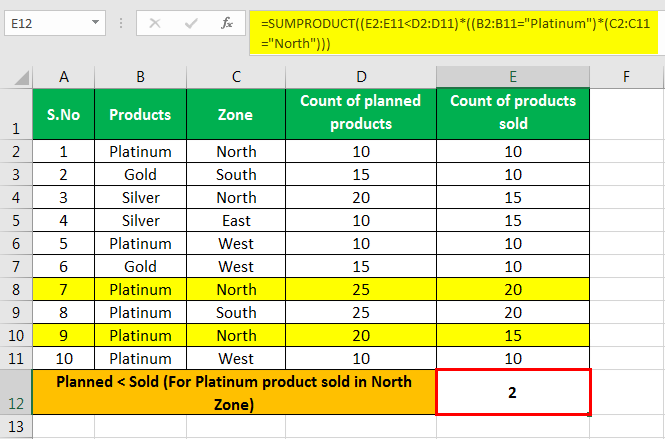

Algorithmic trading has transformed the dynamics of financial markets by utilizing technology to execute trades with remarkable speed and precision. This advancement allows traders to capitalize on market opportunities that might otherwise be missed with traditional manual trading methods. One innovative approach within this high-tech trading ecosystem is the concept of multi-product series strategy, which is garnering increasing attention.

The multi-product series concept arises from the need to handle various financial instruments concurrently using algorithmic strategies. These instruments range widely, encompassing equities, futures, options, forex, and cryptocurrencies. By leveraging the capabilities of sophisticated programming and simulation, traders can develop strategies that optimize trading activities across these diverse products. This approach not only aids in diversifying risk but also allows traders to exploit different market dynamics effectively.

The scope of this article is to provide a thorough exploration of what multi-product series in algorithmic trading entails. We will discuss its benefits, such as improved portfolio management and enhanced liquidity, and highlight its applications across various asset classes. Additionally, potential challenges—such as data accuracy management and synchronization across varied time zones—will be addressed, along with methods to overcome these hurdles.

Understanding multi-product series strategies is crucial for both seasoned traders and beginners alike, as it enhances trading strategies by offering resilient solutions capable of adjusting dynamically to market conditions. Whether you aim to diversify your investments or seek broader market exposure, mastering this concept can significantly enhance the robustness and profitability of your trading endeavors.

## Table of Contents

## Understanding Multi-Product Series in Algorithmic Trading

In [algorithmic trading](/wiki/algorithmic-trading), a multi-product series refers to strategies that handle multiple financial instruments simultaneously. These instruments can include equities, futures, options, [forex](/wiki/forex-system), and cryptocurrencies. The primary goal of such strategies is to optimize trading activities across these varied products. This optimization requires sophisticated programming and simulations to ensure that the strategies are effective and profitable.

One key aspect of multi-product strategies is their ability to diversify risk. By engaging with multiple types of financial instruments, traders can spread their exposure. This diversification allows them to mitigate potential losses from any single asset class. Furthermore, multi-product strategies can tap into different market dynamics, maximizing opportunities for asset appreciation.

Developing these strategies involves a comprehensive understanding of market behavior and the interrelationships among different financial products. For instance, a change in interest rates might affect currencies and stocks simultaneously, necessitating a well-coordinated strategy across these instruments. 

Algorithmic strategies for multi-product series rely heavily on advanced analytical techniques. For example, let’s consider the Black-Scholes model, which is a mathematical model for pricing an options contract. Its application to options can be expressed as: 

$$
C = S_0 \cdot N(d_1) - X \cdot e^{-rT} \cdot N(d_2)
$$

where:
- $C$ is the call option price
- $S_0$ is the current price of the stock
- $X$ is the strike price
- $r$ is the risk-free interest rate
- $T$ is the time to maturity
- $N(d)$ represents the cumulative distribution function of the standard normal distribution

This model helps traders understand the influence of various market factors on options prices and forms a part of the algorithmic strategy toolkit for handling options within a multi-product series.

Additionally, simulations play a crucial role in strategy development. Strategies are typically tested using historical data in simulated environments to evaluate their performance under various market conditions. This ensures that they are robust and can adapt to real-world scenarios.

Python has emerged as a popular programming language for developing such strategies due to its extensive libraries like Pandas and NumPy, which are essential for data manipulation and analysis. Moreover, strategies often utilize [machine learning](/wiki/machine-learning) and [artificial intelligence](/wiki/ai-artificial-intelligence) to predict market movements and improve decision-making processes.

In conclusion, multi-product series strategies in algorithmic trading represent a sophisticated approach that requires a harmonious blend of programming, market knowledge, and analytical skills. Through careful construction and testing, these strategies provide traders with a means to manage diverse portfolios effectively, capitalize on multiple market dynamics, and ultimately achieve enhanced trading outcomes.

## Applications and Advantages

One significant application of multi-product series in algorithmic trading is portfolio management. By employing this approach, traders can manage risks effectively through diversification across multiple assets. This diversification means that the impact of adverse price movements in any single asset is mitigated by the presence of other investments that may perform better under the same conditions. The ability to spread risk across different asset classes, such as equities, futures, options, or forex, reduces the likelihood of substantial portfolio losses.

Algorithmic strategies that incorporate multiple products can dynamically adjust to changing market conditions, offering increased robustness. These strategies benefit from the ability to process vast amounts of data across different financial instruments and markets simultaneously. As a result, they can execute trades efficiently and in real-time, adapting promptly to any shifts in the market landscape. This adaptability is crucial for maintaining a competitive edge in the fast-paced trading environment.

The multi-product series approach also enhances [liquidity](/wiki/liquidity-risk-premium). Because traders are not dependent on a single asset class, they can access a broader range of markets, thus benefiting from greater liquidity. This increased liquidity is advantageous as it allows for the smooth execution of trades without significant price impacts, ensuring that trading activities can be conducted at optimal prices.

Monte Carlo simulations play a vital role in further validating and optimizing multi-product strategies. By simulating thousands of possible market scenarios, these simulations help traders understand the potential performance of their strategies under various conditions. The Monte Carlo method allows for the exploration of the statistical properties of strategies, providing insights into risk measures such as Value at Risk (VaR) or Conditional Value at Risk (CVaR). This quantitative analysis enhances the confidence of traders in the resilience and effectiveness of their multi-product strategies, contributing to the development of robust trading systems that are capable of thriving in diverse and volatile market conditions.

## Challenges in Implementing Multi-Product Series

Developing a multi-product algorithmic trading strategy involves notable complexities that necessitate advanced technical skills and knowledge. The first major challenge is ensuring data accuracy and managing vast datasets across a variety of financial instruments. Each instrument, whether equities, futures, or cryptocurrencies, may come with unique data structures and attributes. As such, traders need to integrate and sanitize these datasets to prevent discrepancies that could negatively impact trading outcomes. The challenge is further compounded when data comes from different sources, necessitating efficient data cleaning and normalization processes.

Synchronization of trades across different markets is another formidable challenge, especially considering the variations in trading hours and time zones. Different markets operate on varied schedules, making it imperative for traders to adjust their algorithms to accommodate these differences. This requires precise timing mechanisms within algorithms to ensure that trades are executed promptly and optimally across all relevant markets. Such synchronization demands a robust understanding of market operations and the ability to program flexibility and adaptability into trading algorithms.

Another significant challenge is the requirement for powerful computational resources. Handling multiple simulations and backtests for various financial instruments can be resource-intensive. Performing these processes simultaneously necessitates computers with high processing power and memory capacity. Without such resources, simulations could suffer from delays, or worse, inaccuracies that compromise the strategy’s effectiveness. Traders often need to invest in high-performance computing environments or cloud-based solutions that offer scalable resources.

Despite these challenges, the pursuit of a multi-product series strategy is driven by the compelling benefits of diversification and enhanced risk management. Properly implemented, such strategies allow traders to spread risk across multiple asset classes and potentially improve returns. By not relying on a single asset class, traders can mitigate the impact of asset-specific [volatility](/wiki/volatility-trading-strategies) and enjoy a more balanced portfolio performance.

## Tools and Resources For Multi-Product Trading Strategies

Python has become a leading programming language for developing multi-product trading strategies, primarily due to its extensive libraries and strong community support. Key tools within Python include Pandas, NumPy, and Matplotlib, which are essential for data analysis and visualization. Pandas is utilized for data manipulation and handling time series data, critical in analyzing trading patterns across multiple products. NumPy aids in performing numerical calculations efficiently, while Matplotlib is used to create comprehensive visualizations representing trading data and patterns.

Platforms such as QuantConnect and TradingView are commonly employed for [backtesting](/wiki/backtesting) and simulations. These platforms allow traders to evaluate the effectiveness of their strategies by testing them on historical data. They offer robust environments for simulating real-world trading conditions, enabling adjustments to optimize strategy performance before execution in live markets.

Monte Carlo simulations play a vital role in these strategies, particularly for stress testing under different market scenarios. By running numerous random simulations, traders can assess the potential risks and outcomes of their strategies, helping to ensure robustness across various market conditions. These simulations contribute to a more comprehensive understanding of possible futures, aiding in risk management and decision-making.

The integration of artificial intelligence (AI) and machine learning techniques into multi-product trading strategies can significantly enhance predictive accuracy and decision-making. Machine learning algorithms can identify complex patterns within vast datasets that may not be evident through traditional analysis. Tools like scikit-learn and TensorFlow allow the development of predictive models that adapt to new data, potentially improving the performance of trading strategies.

In summary, leveraging the right tools and platforms, including Python libraries, backtesting platforms, and AI methodologies, allows traders to develop sophisticated multi-product trading strategies. These resources are essential for managing risk, optimizing trading performance, and maintaining a competitive edge in the financial markets.

## Conclusion

Multi-product series in algorithmic trading represent a sophisticated approach to managing and optimizing a diverse range of assets. By simultaneously incorporating multiple financial instruments such as equities, futures, options, forex, and cryptocurrencies, this strategy aims to harness the unique market dynamics of each asset class to optimize trading outcomes. Despite the inherent challenges in implementing such a strategy, notably the complexity, data management, and need for robust computational resources, the potential benefits are compelling.

The ability to diversify risk is one of the primary advantages of a multi-product approach. By distributing investments across different asset classes, traders can mitigate the impacts of market volatility on their portfolios. For instance, during a downturn in one market, the performance of other uncorrelated or negatively correlated markets can provide a stabilizing effect on overall portfolio returns. Additionally, with enhanced risk management comes the opportunity for increased profitability, as traders position themselves to take advantage of varied market conditions.

Leveraging the right tools and technologies is crucial for the successful implementation of multi-product strategies. The use of programming languages like Python, with libraries such as Pandas and NumPy for data manipulation, and platforms like QuantConnect or TradingView for backtesting, is integral to developing resilient strategies. Monte Carlo simulations further aid in testing how strategies perform under different market scenarios, ensuring robustness and adaptability. Moreover, the integration of AI and machine learning can enhance the predictive capabilities of trading algorithms, allowing for improved decision-making.

The trend towards multi-product algorithms is expected to grow as more traders and financial institutions seek comprehensive solutions that address the complexities of modern markets. These strategies not only offer enhanced risk management but also allow traders to be more responsive to rapid changes in market conditions. By understanding and embracing this approach, traders can gain a competitive edge, positioning themselves for success in today's fast-paced financial landscape.

## References & Further Reading

[1]: Bergstra, J., Bardenet, R., Bengio, Y., & Kégl, B. (2011). ["Algorithms for Hyper-Parameter Optimization."](https://dl.acm.org/doi/10.5555/2986459.2986743) Advances in Neural Information Processing Systems 24.

[2]: ["Advances in Financial Machine Learning"](https://www.amazon.com/Advances-Financial-Machine-Learning-Marcos/dp/1119482089) by Marcos Lopez de Prado

[3]: ["Evidence-Based Technical Analysis: Applying the Scientific Method and Statistical Inference to Trading Signals"](https://www.amazon.com/Evidence-Based-Technical-Analysis-Scientific-Statistical/dp/0470008741) by David Aronson

[4]: ["Machine Learning for Algorithmic Trading"](https://github.com/stefan-jansen/machine-learning-for-trading) by Stefan Jansen

[5]: ["Quantitative Trading: How to Build Your Own Algorithmic Trading Business"](https://books.google.com/books/about/Quantitative_Trading.html?id=j70yEAAAQBAJ) by Ernest P. Chan