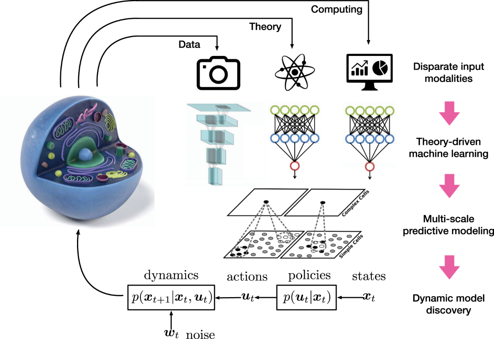

## Table of Contents

## What is multi-scale analysis in the context of machine learning?

Multi-scale analysis in machine learning is a technique used to understand and process data at different levels of detail or scales. Imagine looking at a picture: you can see the overall scene from far away, but as you get closer, you start noticing finer details like textures and patterns. In machine learning, this approach helps algorithms to capture both the big picture and the small details in data, which can be crucial for tasks like image recognition, where understanding both the general shape and the specific features of an object is important.

For example, in image processing, multi-scale analysis might involve using different sizes of filters or windows to analyze an image. At a larger scale, the algorithm might identify broad features like the outline of a car, while at a smaller scale, it might pick up on details like the car's license plate. This method can improve the performance of models by allowing them to learn from various levels of abstraction, making them more robust and accurate in their predictions.

## Why is multi-scale analysis important in machine learning?

Multi-scale analysis is important in machine learning because it helps models understand data in different ways. Think of it like looking at a map: you can zoom out to see the whole city or zoom in to see the streets and buildings. By doing this, machine learning models can learn from both the big picture and the small details. This is especially useful in tasks like recognizing objects in pictures. For example, a model can learn to recognize a dog not just by its overall shape but also by the texture of its fur and the shape of its ears.

This approach makes models more accurate and reliable. When a model looks at data on multiple scales, it can catch important features that it might miss if it only looked at one level. This is like how a doctor might use both a stethoscope and an x-ray to diagnose a patient: each tool gives different information that together paints a fuller picture. In [machine learning](/wiki/machine-learning), using multi-scale analysis can lead to better performance in tasks like predicting weather patterns or analyzing financial markets, where understanding different levels of detail is key to making good predictions.

## How does multi-scale analysis differ from traditional single-scale analysis?

Multi-scale analysis and traditional single-scale analysis are two different ways of looking at data in machine learning. Single-scale analysis focuses on one level of detail. Imagine looking at a picture from one distance. You see the picture in one way, either zoomed out to see the whole scene or zoomed in to see small details. This method can be simpler and faster but might miss important information if the level of detail chosen is not right for the task.

On the other hand, multi-scale analysis looks at data from many different levels of detail at the same time. It's like taking several pictures of the same scene from different distances and then using all of them to understand the scene better. This approach can help a machine learning model understand both the big picture and the small details. For example, in recognizing a car, the model can learn about its overall shape from a larger scale and the details like the license plate from a smaller scale. This makes the model more accurate and useful for tasks where understanding different levels of detail is important.

## What are some common techniques used in multi-scale analysis?

One common technique in multi-scale analysis is the use of multi-resolution analysis. This involves looking at data at different levels of detail using tools like wavelets. Wavelets are like special magnifying glasses that can zoom in and out on different parts of the data. For example, in image processing, wavelets can help a model see both the overall shape of an object and the fine details like textures. This is useful in tasks like medical imaging, where doctors need to see both the big picture and the small details to make a diagnosis.

Another technique is the use of scale-space theory. This method creates multiple versions of the same image, each blurred to a different degree. By comparing these versions, the model can understand how features change across different scales. Imagine taking a picture and making several copies, each with a different amount of blur. The model can then look at these copies to see how objects appear at different levels of detail. This helps the model to be more accurate in recognizing objects because it can learn from both the general shapes and the specific details.

A third technique involves using hierarchical models, like convolutional neural networks (CNNs) with different layers. Each layer in a CNN can be thought of as looking at the data at a different scale. The early layers might focus on small details, while the later layers look at bigger features. For example, in a CNN designed to recognize faces, the first layers might detect edges and simple patterns, while the deeper layers might identify eyes, noses, and mouths. This way, the model can learn from different levels of detail and become better at its task.

## Can you explain the concept of time-causal limits in multi-scale analysis?

Time-causal limits in multi-scale analysis are about understanding how data changes over time and making sure that the analysis respects the order of events. Imagine you're watching a movie and trying to predict what will happen next. You can only use what you've seen so far to make your guess, not what happens later. In multi-scale analysis, time-causal limits mean that when we look at data on different scales, we have to make sure we're not using future information to understand the past or present. This is important in fields like finance or weather forecasting, where predicting the future based on the past is key.

For example, if you're using multi-scale analysis to predict stock prices, you need to ensure that your model doesn't use tomorrow's data to predict today's prices. This can be tricky because multi-scale analysis often involves looking at data in different ways, and it's easy to accidentally mix up the order of events. By respecting time-causal limits, we make sure our predictions and analyses are fair and accurate, helping us to better understand how things change over time without cheating by looking ahead.

## How do time-causal scale-space (time-caus-scsp) methods contribute to multi-scale analysis?

Time-causal scale-space methods, or time-caus-scsp, help in multi-scale analysis by making sure that we look at data in a way that respects the order of time. Imagine you're watching a video and trying to understand what's happening. You can only use what you've seen so far to make sense of it, not what happens later. Time-caus-scsp methods make sure that when we analyze data at different scales, we don't use information from the future to understand the past or present. This is important for tasks like predicting stock prices or weather patterns, where using future data would be cheating.

These methods work by creating a scale-space where each level of detail respects the time order. For example, if we're analyzing a video, time-caus-scsp methods will create different versions of the video, each blurred to a different degree, but all of them will only use information up to the current time. This way, we can look at both the big picture and the small details without mixing up the order of events. By doing this, time-caus-scsp methods help us make better predictions and understand how things change over time in a fair and accurate way.

## What role do time-causal Gabor filters (timecausgabor) play in multi-scale analysis?

Time-causal Gabor filters, or timecausgabor, are special tools used in multi-scale analysis to help understand data over time without using future information. Imagine you're trying to predict the weather. You can only use the information you have up to now, not what happens tomorrow. Timecausgabor filters work like special magnifying glasses that zoom in and out on different parts of your data, but they make sure to only look at the past and present, not the future. This is really important for making good predictions in things like stock prices or weather forecasts, where looking ahead would be cheating.

These filters are designed to analyze data at different scales while respecting the order of time. For example, if you're looking at a video, timecausgabor filters will create different versions of the video, each focusing on different levels of detail, but all of them will only use information up to the current moment. This way, you can see both the big picture and the small details without mixing up the order of events. By using timecausgabor filters, you can make better predictions and understand how things change over time in a fair and accurate way.

## How are integrated Gaussian functions (intgauss) utilized in multi-scale analysis?

Integrated Gaussian functions, or intgauss, are used in multi-scale analysis to help understand data at different levels of detail. Imagine you're looking at a picture and trying to see both the big picture and the small details. Intgauss functions are like special tools that help you do this by smoothing out the data in different ways. They work by creating different versions of the data, each with a different amount of blur. This blur is controlled by a Gaussian function, which is a mathematical way to spread out the data smoothly. By looking at these different versions, you can see how features in the data change as you zoom in and out.

For example, in image processing, intgauss functions can help you see both the overall shape of an object and the fine details like textures. The Gaussian function used in intgauss is often written as $$ G(x, \sigma) = \frac{1}{\sqrt{2\pi\sigma^2}} e^{-\frac{x^2}{2\sigma^2}} $$, where $$ \sigma $$ controls how much the data is blurred. By changing $$ \sigma $$, you can create different scales of the image. This helps the machine learning model understand the data better because it can learn from both the general shapes and the specific details. This way, intgauss functions make the model more accurate and useful for tasks where understanding different levels of detail is important.

## What is the significance of integrated Gaussian derivatives (intgaussder) in multi-scale analysis?

Integrated Gaussian derivatives, or intgaussder, play a crucial role in multi-scale analysis by helping to understand how data changes at different levels of detail. Imagine you're looking at a picture and trying to see both the big picture and the small details. Intgaussder functions are like special tools that not only smooth out the data but also help you see how the details change as you zoom in and out. They do this by using the derivatives of Gaussian functions, which tell you how quickly the data is changing at different points. By looking at these changes, you can understand the structure of the data better, which is really important for tasks like recognizing objects in images.

In practice, intgaussder functions are used to create different versions of the data, each with a different level of detail. The Gaussian function used in intgaussder is often written as $$ G(x, \sigma) = \frac{1}{\sqrt{2\pi\sigma^2}} e^{-\frac{x^2}{2\sigma^2}} $$, and its derivatives help to highlight edges and other important features in the data. For example, in image processing, these derivatives can help you see the edges of objects at different scales, making it easier for a machine learning model to recognize and understand what it's looking at. This way, intgaussder functions make the model more accurate and useful for tasks where understanding different levels of detail is important.

## How can multi-scale analysis be applied to improve the performance of machine learning models?

Multi-scale analysis can help machine learning models become better at understanding data by looking at it in different ways. Imagine you're trying to recognize a dog in a picture. By using multi-scale analysis, the model can look at the picture from far away to see the dog's overall shape, and then zoom in to see details like the texture of its fur or the shape of its ears. This helps the model learn from both the big picture and the small details, making it more accurate. For example, in image processing, multi-scale analysis might use different sizes of filters or windows to analyze the image. At a larger scale, the model might identify the outline of the dog, while at a smaller scale, it might pick up on the dog's eyes or nose.

In practice, multi-scale analysis can be applied using techniques like multi-resolution analysis with wavelets or scale-space theory. Wavelets are like special magnifying glasses that can zoom in and out on different parts of the data. For example, in medical imaging, wavelets can help a model see both the overall shape of an organ and the fine details like tumors. Scale-space theory creates multiple versions of the same image, each blurred to a different degree. By comparing these versions, the model can understand how features change across different scales. This helps the model to be more accurate in recognizing objects because it can learn from both the general shapes and the specific details. By using these techniques, multi-scale analysis can make machine learning models more robust and reliable in tasks like predicting weather patterns or analyzing financial markets.

## What are the challenges and limitations of implementing multi-scale analysis in machine learning?

One challenge of implementing multi-scale analysis in machine learning is that it can be computationally expensive. Looking at data from many different levels of detail means the model has to do a lot more work. This can make the model slower and use up more computer power. For example, if you're using wavelets to analyze an image, the model has to create and compare many different versions of that image. This can be a problem if you're working with big datasets or if you need quick results.

Another limitation is that multi-scale analysis can be tricky to set up right. You need to choose the right scales to look at, and this can be hard because different tasks might need different levels of detail. If you choose the wrong scales, the model might miss important information or get confused by too much detail. For example, if you're trying to predict stock prices, you need to make sure your model doesn't use future data to understand the past or present, which can be tricky when you're looking at data on many scales.

Despite these challenges, multi-scale analysis can still be very helpful. It helps models understand data better by looking at both the big picture and the small details. This can make the model more accurate and useful for tasks like recognizing objects in pictures or predicting weather patterns. By using techniques like wavelets or scale-space theory, multi-scale analysis can help machine learning models become more reliable and effective.

## Can you provide examples of successful applications of multi-scale analysis in advanced machine learning tasks?

One successful application of multi-scale analysis in machine learning is in medical imaging. Imagine a doctor trying to understand a patient's brain scan. Multi-scale analysis helps the model see both the overall shape of the brain and the tiny details like tumors or lesions. For example, wavelets can be used to create different versions of the brain scan, each showing the image at a different level of detail. By looking at these different versions, the model can learn to recognize both the big picture and the small details. This makes the model more accurate at identifying health issues, which can help doctors make better diagnoses.

Another example is in the field of autonomous driving. When a self-driving car needs to recognize objects on the road, multi-scale analysis is crucial. The car's model needs to understand both the general shape of objects like cars and pedestrians and the specific details like traffic signs or road markings. Using scale-space theory, the model can create multiple versions of the road scene, each blurred to a different degree. By comparing these versions, the model can see how objects appear at different levels of detail. This helps the car make better decisions and drive more safely, because it can understand the road environment more thoroughly.

## References & Further Reading

[1]: Mallat, S. (1999). ["A Wavelet Tour of Signal Processing."](https://www.sciencedirect.com/book/9780123743701/a-wavelet-tour-of-signal-processing) Academic Press.

[2]: Lindeberg, T. (1994). ["Scale-Space Theory in Computer Vision."](https://link.springer.com/book/10.1007/978-1-4757-6465-9) Springer Science & Business Media.

[3]: Shapiro, L. G., & Stockman, G. C. (2001). ["Computer Vision."](https://www.amazon.com/Computer-Vision-Linda-G-Shapiro/dp/0130307963) Prentice Hall.

[4]: Gonzalez, R. C., & Woods, R. E. (2008). ["Digital Image Processing."](https://archive.org/details/digitalimageproc0003gonz) Pearson.

[5]: Forsyth, D. A., & Ponce, J. (2011). ["Computer Vision: A Modern Approach."](https://www.amazon.com/Computer-Vision-Modern-Approach-2nd/dp/013608592X) Pearson. 

[6]: Mallat, S. (1998). ["A Theory for Multiresolution Signal Decomposition: The Wavelet Representation."](https://ieeexplore.ieee.org/document/192463) Proceedings of the IEEE.

[7]: Daubechies, I. (1992). ["Ten Lectures on Wavelets."](https://epubs.siam.org/doi/book/10.1137/1.9781611970104) Society for Industrial and Applied Mathematics.