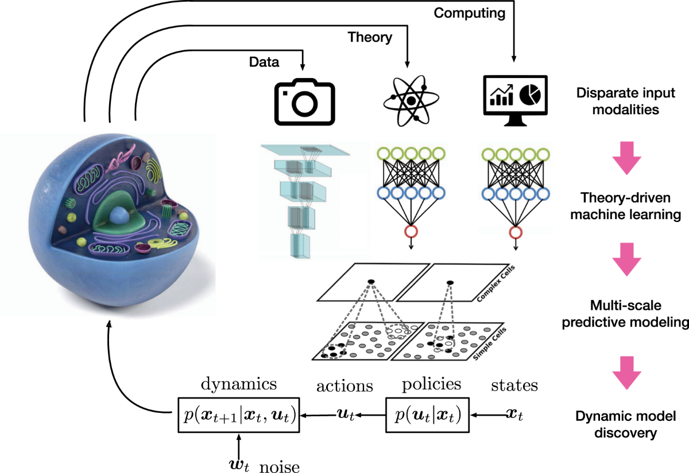

## Table of Contents

## What is Multi-Scale Training in the context of machine learning?

Multi-Scale Training is a technique used in machine learning, especially in tasks like image recognition and object detection, to improve the performance of models. The idea behind it is to train the model using images of different sizes or scales. By doing this, the model learns to recognize objects at various sizes and distances, which makes it more robust and better at handling real-world scenarios where objects can appear at different scales.

In practice, during multi-scale training, the training dataset is augmented by resizing images to different scales. For example, an image might be resized to smaller or larger versions of itself, and these versions are then used as additional training examples. This helps the model to learn features that are invariant to scale, meaning it can recognize an object whether it's close up or far away. This technique is particularly useful in fields like autonomous driving, where the system needs to detect objects at varying distances.

## Why is Multi-Scale Training important for object detection tasks?

Multi-Scale Training is important for object detection tasks because it helps the model learn to recognize objects no matter how big or small they are in an image. In real life, the same object can look very different depending on how far away it is. For example, a car might look tiny if it's far away, but big if it's close. By training with images of different sizes, the model gets better at finding and identifying objects at all these different scales.

This technique makes the model more flexible and accurate. When a model is only trained on images of one size, it might struggle to detect objects that are much smaller or larger than what it's used to. Multi-Scale Training solves this problem by showing the model many different versions of the same object. This way, the model learns to look for key features of the object, not just its size. This is especially useful in tasks like self-driving cars, where the system needs to spot objects like pedestrians or other vehicles at various distances.

## How does Multi-Scale Training differ from traditional training methods?

Multi-Scale Training is different from traditional training methods because it uses images of different sizes to teach the model. In traditional training, you usually show the model images that are all the same size. This can make the model good at recognizing objects at that specific size, but it might struggle with objects that are much smaller or bigger. Multi-Scale Training solves this by showing the model many versions of the same image, resized to be bigger or smaller. This helps the model learn to recognize objects no matter their size.

This approach is especially helpful for tasks like object detection, where the same object can appear at different distances in the real world. For example, a car might look tiny if it's far away, but big if it's close. Traditional training might not prepare the model for these changes in size, but Multi-Scale Training makes the model more flexible and better at finding objects at all scales. By learning from images of different sizes, the model becomes more robust and can handle real-life situations better.

## What are the key challenges in implementing Multi-Scale Training?

One of the main challenges in implementing Multi-Scale Training is the increased computational cost. When you train a model with images of different sizes, you need more processing power and time. Each image at a different scale needs to go through the model, which means more calculations. This can make training slower and more expensive, especially if you're working with a large dataset.

Another challenge is choosing the right scales to use. You need to decide how many different sizes to train with and what those sizes should be. If you choose too few scales, the model might not learn well enough to handle all the different sizes it might see in the real world. But if you choose too many scales, it can make the training process even slower and more complicated. Finding the right balance is tricky and often needs a lot of testing and tweaking.

Lastly, there's the issue of [data augmentation](/wiki/data-augmentation) and how to handle it effectively. When resizing images, you might accidentally distort important features or lose details that are crucial for the model to learn. This can affect how well the model performs. You need to make sure that the resized images still accurately represent the objects you're trying to detect, which can be hard to get right.

## Can you explain the SNIP method for Multi-Scale Training?

The SNIP method, which stands for Scale Normalization for Image Pyramids, is a way to make Multi-Scale Training more efficient. In regular Multi-Scale Training, you train the model with images of different sizes, which can be slow and use a lot of computer power. SNIP tries to fix this by only training on the parts of the image where the objects are the right size for the model to learn from. This means the model doesn't waste time looking at parts of the image where the objects are too small or too big to be useful.

SNIP works by creating a "chip" from the image, which is a smaller part of the image that has objects at the right size. The model then only trains on these chips, not the whole image. This makes training faster because the model doesn't have to process the whole image every time. By focusing on the right parts of the image, SNIP helps the model learn better and faster, making Multi-Scale Training more effective without using as much computer power.

## How does the SNIPER method improve upon the SNIP approach?

The SNIPER method, which stands for SNIP with Enhanced Resolution, improves upon the SNIP approach by addressing some of its limitations. SNIPER not only focuses on training with chips of the image where objects are at the right size, but it also uses higher resolution images. This means that SNIPER can capture more detailed features of the objects, which can lead to better performance in object detection tasks. By using higher resolution images, SNIPER helps the model learn from finer details that might be lost in lower resolution images used by SNIP.

One key advantage of SNIPER over SNIP is its ability to handle objects at a wider range of scales more effectively. While SNIP focuses on a specific range of object sizes within each image, SNIPER can adapt to a broader range of sizes by using higher resolution images. This makes SNIPER more versatile and better at detecting objects that might be very small or very large in the image. Overall, SNIPER enhances the efficiency and accuracy of Multi-Scale Training by combining the scale normalization benefits of SNIP with the added detail from higher resolution images.

## What are the typical architectures used in Multi-Scale Training?

In Multi-Scale Training, one common architecture used is the Feature Pyramid Network (FPN). FPN is designed to handle objects at different scales by creating a pyramid of feature maps. These feature maps are generated at different levels of the network, allowing the model to detect objects whether they are small, medium, or large. FPN is often used in object detection tasks because it helps the model understand the scale of objects in the image. By combining features from different levels of the pyramid, FPN can improve the accuracy of object detection across various sizes.

Another popular architecture for Multi-Scale Training is the Single Shot Detector (SSD). SSD uses a single deep [neural network](/wiki/neural-network) to detect objects at multiple scales. It does this by applying different sized default boxes to feature maps at different layers of the network. This way, SSD can capture objects of different sizes in one pass through the network, making it faster than some other methods. SSD is efficient and works well for real-time object detection tasks because it balances speed and accuracy.

A third architecture that is often used is the Region-based Convolutional Neural Network (R-CNN) and its variations like Faster R-CNN. R-CNN approaches work by first proposing regions in the image that might contain objects, then classifying those regions. In Multi-Scale Training, R-CNN can be trained on images of different sizes to detect objects at various scales. Faster R-CNN improves on this by using a Region Proposal Network (RPN) to generate region proposals more efficiently, which helps in handling multi-scale objects more effectively.

## How do you select appropriate scales for training in Multi-Scale Training?

Choosing the right scales for Multi-Scale Training is important to make sure your model can recognize objects no matter their size. You want to pick a range of scales that match the sizes of objects in your real-world data. For example, if you're training a model to detect cars, you might need to include scales that represent cars at different distances, like very close up, medium distance, and far away. A common way to do this is to start with the original image size and then create smaller and larger versions of it. You might resize the image to 50%, 75%, 100%, 125%, and 150% of its original size. This way, the model sees the same objects at different sizes and learns to recognize them better.

Finding the best scales can take some trial and error. You might start with a few scales and then test how well your model works. If it struggles with certain sizes, you can add more scales around those sizes to help the model learn better. It's also important to think about how much computer power you have. Using too many scales can make training very slow, so you need to balance the number of scales with how long you can afford to train your model. By carefully selecting the right scales, you can make your model more accurate and ready for real-world use.

## What performance improvements can be expected from using Multi-Scale Training?

Multi-Scale Training can make a big difference in how well a model works, especially for tasks like finding objects in pictures. When you train a model with pictures of different sizes, it gets better at spotting objects no matter how big or small they are. This is really helpful in real life because things can look different depending on how far away they are. For example, a model trained this way can find a car whether it's close up or far away in the picture. Studies have shown that models using Multi-Scale Training can be more accurate at detecting objects, sometimes improving by a few percentage points, which can be a big deal in things like self-driving cars or security cameras.

The downside is that Multi-Scale Training can take more time and computer power. You have to process more pictures, and that can slow things down. But the extra work can be worth it if it means your model is better at its job. You might see the model's accuracy go up by around 2-5% on average, depending on the task and the data. This improvement can make a big difference in how well the model works in the real world, where objects can appear at all sorts of sizes.

## How can Multi-Scale Training be integrated with other training techniques?

Multi-Scale Training can be combined with other training techniques to make models even better. One common way to do this is by using data augmentation along with Multi-Scale Training. Data augmentation means changing the training pictures a bit, like flipping them or rotating them, to give the model more examples to learn from. When you use Multi-Scale Training with data augmentation, you can show the model pictures of different sizes that have also been flipped or rotated. This helps the model learn to recognize objects no matter their size or how they're turned.

Another way to mix Multi-Scale Training with other techniques is by using transfer learning. Transfer learning is when you take a model that's already been trained on one task and use it as a starting point for a new task. For example, you might start with a model that's good at recognizing objects in normal pictures, then use Multi-Scale Training to make it even better at spotting objects at different sizes. This can save time because the model already knows a lot about objects, and Multi-Scale Training helps it get even better at handling different scales.

## What are some practical examples of Multi-Scale Training in real-world applications?

Multi-Scale Training is used in self-driving cars to help them spot things like other cars, people, and road signs no matter how far away they are. The car's computer needs to see a car whether it's right in front of it or way down the road. By training the model with pictures of different sizes, the car can learn to find these things at all distances. This makes the car safer because it can react to things on the road better, no matter how big or small they look in the camera.

Another example is in security cameras, where Multi-Scale Training helps the system find people or objects even if they're far away or up close. A security camera might need to spot someone walking near the camera or someone far away in the background. By using pictures of different sizes during training, the system gets better at recognizing people at all distances. This means the security system can keep an eye on a bigger area and be more useful in keeping places safe.

## What are the future research directions for Multi-Scale Training in machine learning?

One future direction for Multi-Scale Training in [machine learning](/wiki/machine-learning) is to make it more efficient. Right now, using Multi-Scale Training can take a lot of time and computer power because you have to process many pictures of different sizes. Researchers are looking for ways to do this faster, maybe by using smarter ways to pick which sizes to train with or by using special computer chips that are better at handling these tasks. They also want to make Multi-Scale Training work well with other methods, like data augmentation and transfer learning, to make models even better without taking too much time.

Another area of interest is to use Multi-Scale Training for new kinds of tasks. So far, it's been used a lot for things like spotting objects in pictures, but researchers are thinking about using it for other things too. For example, they might use Multi-Scale Training to help models understand videos better, where things can move in and out of view at different sizes. They're also looking at using it for tasks in other areas like medical imaging, where it could help find tiny problems in big pictures of the body. By exploring these new uses, Multi-Scale Training could help make many different kinds of technology work better.