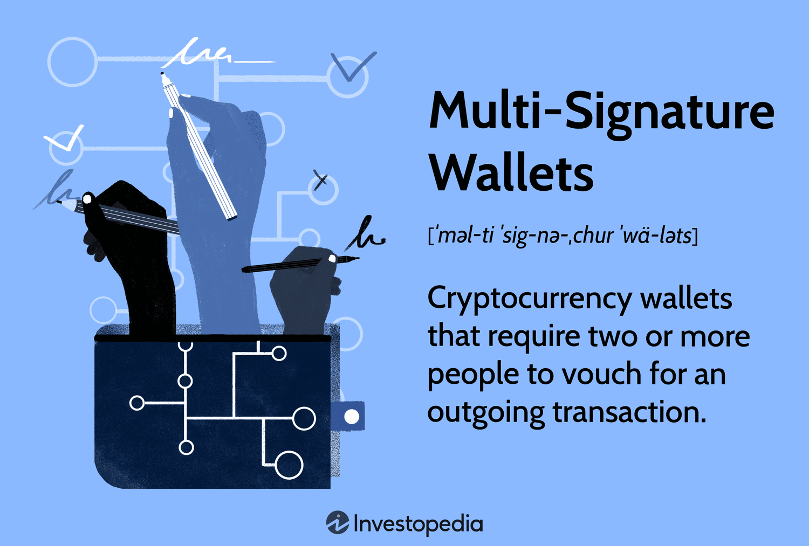

## Table of Contents

## What is a multi-signature wallet?

A multi-signature wallet, often called a multi-sig wallet, is a type of digital wallet that requires more than one private key to authorize a transaction. This means that instead of just one person being able to move money, several people need to agree and sign off on it. It's like having a bank account that needs multiple signatures before any money can be taken out.

This type of wallet is very useful for keeping money safe. For example, a business might use a multi-sig wallet so that no single employee can spend the company's money without others knowing and agreeing. It helps prevent fraud and mistakes because it adds an extra layer of security. Multi-sig wallets are popular in the world of cryptocurrencies like Bitcoin and Ethereum, where security is a big concern.

## How does a multi-signature wallet work?

A multi-signature wallet works by requiring more than one private key to approve a transaction. Imagine you and your friends want to spend money from a shared wallet. In a regular wallet, just one of you could take out money. But with a multi-sig wallet, you set it up so that, say, at least two out of three of you need to agree before any money can be moved. Each of you has your own private key, kind of like a special password, and when you want to spend money, you use your key to sign the transaction.

Once the required number of people sign the transaction with their private keys, the wallet checks to make sure enough signatures are there. If everything matches up, the wallet goes ahead and sends the money. This setup makes it much harder for someone to steal money, because they would need to get multiple keys, not just one. It's like having a safe that needs several different keys to open, making it much more secure.

## What are the benefits of using a multi-signature wallet?

Using a multi-signature wallet has many benefits. One big benefit is that it makes your money safer. Because you need more than one person to agree before spending money, it's much harder for someone to steal it. If someone gets one key, they can't do anything without the others. This is great for businesses or groups where you want to make sure everyone agrees on spending.

Another benefit is that it helps prevent mistakes. If you're working with others, a multi-sig wallet means you can double-check each other's work. No one person can make a big mistake or spend money without others knowing. This can save a lot of trouble and keep everyone on the same page. It's like having a safety net for your money.

## What are the common use cases for multi-signature wallets?

Multi-signature wallets are often used by businesses. A company might use one so that no single person can spend money without others knowing. For example, a business might set up a wallet where at least two out of three managers need to agree before any money is spent. This helps keep the company's money safe and makes sure everyone is on the same page about spending.

Another common use is for groups or organizations that want to manage money together. For instance, a club or a charity might use a multi-sig wallet to make sure that decisions about spending are made together. This way, everyone in the group has a say, and it's harder for one person to misuse the money.

Multi-signature wallets are also popular for personal use, especially for people who want to add an extra layer of security to their savings. Someone might set up a wallet where they need to sign off on a transaction with another trusted person, like a family member or a friend. This can help protect against theft or fraud, making it a smart choice for keeping personal funds secure.

## How do you set up a multi-signature wallet?

Setting up a multi-signature wallet is not too hard, but you need to follow some steps carefully. First, you pick a platform or service that supports multi-sig wallets. There are many options, like software wallets you can download on your computer or online services you can use on the internet. Once you choose a platform, you create the wallet. You decide how many keys you want and how many signatures are needed to spend money. For example, you might set it up so that 2 out of 3 keys are needed. Then, you generate the keys. Each person who will have a key needs to keep it safe, like a secret password.

After setting up the keys, you need to make sure everyone knows how to use the wallet. You might need to show them how to sign transactions and what to do if something goes wrong. It's important to keep the keys safe and to have a plan for what to do if someone loses their key. Some platforms let you set up a backup plan, like having a special key that can be used in emergencies. Once everything is set up and everyone understands how it works, you can start using the wallet to send and receive money, knowing it's extra secure because of the multi-signature setup.

## What are the different types of multi-signature wallets?

There are a few different types of multi-signature wallets. One type is the software wallet, which you can download and use on your computer or phone. These wallets are easy to use because you can manage them right on your device. Another type is the online or web wallet, which you can use through a website. These are handy because you can access them from anywhere, but you need to be careful because they might not be as secure as a software wallet. There are also hardware wallets, which are physical devices that store your keys offline, making them very secure. You plug them into your computer when you need to sign a transaction.

Each type of multi-signature wallet has its own benefits and things to think about. Software wallets are good for everyday use because they're easy to set up and use. Online wallets are great for people who need to access their money from different places, but you have to trust the service to keep your money safe. Hardware wallets are the most secure because they keep your keys offline, but they can be more expensive and a bit harder to use. Choosing the right type depends on what you need and how much security you want.

## How does the security of a multi-signature wallet compare to a single-signature wallet?

A multi-signature wallet is much more secure than a single-signature wallet. In a single-signature wallet, only one private key is needed to spend money. This means if someone steals that key, they can take all the money. But in a multi-signature wallet, you need more than one key to spend money. For example, you might need two out of three keys to agree. This makes it much harder for someone to steal money because they would need to get multiple keys, not just one.

The extra security of a multi-signature wallet is great for businesses or groups where you want to make sure everyone agrees on spending. It also helps prevent mistakes because no one person can spend money without others knowing. While a single-signature wallet is easier to use and set up, it's like having a safe with just one key. A multi-signature wallet is like having a safe that needs several different keys to open, making it much more secure.

## What are the potential risks and vulnerabilities of multi-signature wallets?

Multi-signature wallets are very secure, but they can still have some risks. One big risk is that if you lose one of your keys, you might not be able to spend your money. Imagine you set up a wallet where you need two out of three keys to spend money. If you lose one key, you can still use the wallet, but if you lose two keys, you're stuck. It's important to keep your keys safe and have a backup plan, like a special key for emergencies.

Another risk is that if someone gets enough keys, they can steal your money. Even though it's harder to steal from a multi-sig wallet than a regular one, it's not impossible. If someone tricks or steals keys from the people who have them, they could spend your money. That's why it's important to only give keys to people you trust and to keep them very safe.

There can also be problems with the software or service you use for your multi-sig wallet. If the platform has a bug or gets hacked, your money could be at risk. That's why it's a good idea to choose a trusted and secure platform for your multi-signature wallet. Always do your homework and make sure the service you pick has a good track record of keeping money safe.

## How can multi-signature wallets be integrated into business operations?

Multi-signature wallets can be a big help for businesses by making money management safer and more organized. A business can set up a multi-sig wallet where more than one person needs to agree before spending money. For example, a company might need two out of three managers to sign off on any big purchase. This way, no single person can spend money without others knowing, which helps prevent fraud and mistakes. It's like having a bank account that needs multiple signatures before any money can be taken out, making it much harder for someone to steal or misuse the company's money.

Using a multi-signature wallet also helps businesses keep track of spending and make sure everyone is on the same page. When a company needs to spend money, the people with the keys can talk about it and make sure it's a good idea before they sign off on it. This can save a lot of trouble and keep the business running smoothly. Plus, it's easy to set up a multi-sig wallet on a computer or online, so businesses of all sizes can use them to keep their money safe and secure.

## What are the advanced features of multi-signature wallets for expert users?

Multi-signature wallets have some cool advanced features that expert users can use to make their money even safer and easier to manage. One feature is called "time-locks," which lets you set a time when money can't be spent. For example, you can say that money can't be moved until next month, which gives everyone more time to think about big decisions. Another feature is the ability to change how many keys are needed to spend money. You might start with needing two out of three keys, but if you want to make it safer, you can change it to needing three out of four keys without having to set up a whole new wallet.

Another advanced feature is the use of "recovery keys." If someone loses their key, you can use a special recovery key to get back into the wallet. This is really helpful because it means you don't lose all your money if one key goes missing. Some multi-sig wallets also let you set up different levels of access. For example, one person might be able to spend small amounts of money by themselves, but bigger spends need more people to agree. These features make multi-signature wallets a powerful tool for expert users who want to keep their money safe and in control.

## How do multi-signature wallets support decentralized governance?

Multi-signature wallets help with decentralized governance by making sure that big decisions need more than one person to agree. In a group or organization, you can set up a wallet where spending money or making changes needs several people to sign off on it. This means that no one person can make a big decision without others knowing and agreeing. It's like having a rule that says everyone has to talk and agree before doing something important. This helps keep things fair and makes sure everyone's voice is heard.

Using multi-signature wallets for decentralized governance also helps keep things safe and organized. Because you need more than one key to do anything, it's harder for someone to cheat or make a mistake. If a group is working on a project together, they can use a multi-sig wallet to manage money and make sure everyone is on the same page. This way, the group can work together better and make sure that decisions are made in a way that everyone agrees with.

## What future developments can we expect in multi-signature wallet technology?

In the future, multi-signature wallets might get even easier to use and more secure. Right now, you need to be careful with your keys and make sure you have a backup plan. But soon, we might see wallets that can do more of the work for you. They might be able to warn you if something seems fishy or if one of your keys is at risk. Plus, they could let you use your phone or other devices to sign off on spending money, making it simpler and quicker to use.

Another thing we might see is multi-signature wallets working better with other technologies. For example, they could be used with smart contracts, which are like special agreements that happen automatically. This could make it easier for groups to manage money and make decisions without needing to meet in person. As more people use cryptocurrencies and need safe ways to manage money, multi-signature wallets will keep getting better and more useful for everyone.

## References & Further Reading

[1]: Nakamoto, S. (2008). ["Bitcoin: A Peer-to-Peer Electronic Cash System."](https://nakamotoinstitute.org/library/bitcoin/)

[2]: Antonopoulos, A. M. (2014). ["Mastering Bitcoin: Unlocking Digital Cryptocurrencies."](https://books.google.com/books/about/Mastering_Bitcoin.html?id=IXmrBQAAQBAJ) O'Reilly Media.

[3]: Crosby, M., Pattanayak, P., Verma, S., & Kalyanaraman, V. (2016). ["BlockChain Technology: Beyond Bitcoin."](https://scet.berkeley.edu/reports/blockchain/) Applied Innovation Review, 2, 6-19.

[4]: Tschorsch, F., & Scheuermann, B. (2016). ["Bitcoin and Beyond: A Technical Survey on Decentralized Digital Currencies."](https://ieeexplore.ieee.org/document/7423672) IEEE Communications Surveys & Tutorials, 18(3), 2084-2123.

[5]: Bonneau, J., Miller, A., Clark, J., Narayanan, A., Kroll, J. A., & Felten, E. W. (2015). ["SoK: Research Perspectives and Challenges for Bitcoin and Cryptocurrencies."](https://www.ieee-security.org/TC/SP2015/papers-archived/6949a104.pdf) IEEE Symposium on Security and Privacy.

[6]: Lopez de Prado, M. (2018). ["Advances in Financial Machine Learning."](https://www.amazon.com/Advances-Financial-Machine-Learning-Marcos/dp/1119482089) Wiley.

[7]: Szabo, N. (1997). ["Smart Contracts: Formalizing and Securing Relationships on Public Networks."](https://firstmonday.org/ojs/index.php/fm/article/view/548)

[8]: Buterin, V. (2014). ["A Next-Generation Smart Contract and Decentralized Application Platform."](https://www.blockchainlab.com/pdf/Ethereum_white_paper-a_next_generation_smart_contract_and_decentralized_application_platform-vitalik-buterin.pdf) Ethereum White Paper.

[9]: Lewis, A. (2018). ["The Basics of Bitcoins and Blockchains: An Introduction to Cryptocurrencies and the Technology that Powers Them."](https://www.amazon.com/Basics-Bitcoins-Blockchains-Introduction-Cryptocurrencies/dp/1633538001) Mango Media Inc.