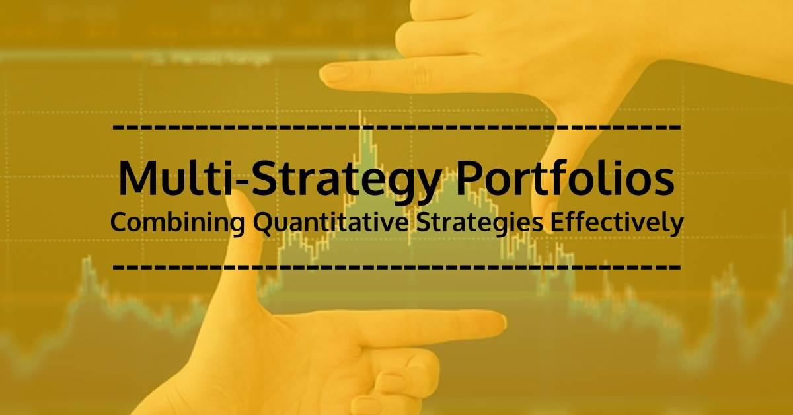

## Table of Contents

## What is multi-strategy management in the context of a portfolio?

Multi-strategy management in the context of a portfolio means using different investment strategies at the same time to spread out risk and potentially increase returns. Instead of putting all your money into one type of investment, like stocks or bonds, you divide it among various strategies. This can include investing in different asset classes, such as equities, fixed income, commodities, and real estate, or using different approaches like value investing, growth investing, or even arbitrage.

By using multi-strategy management, investors aim to balance their portfolio to achieve better overall performance. If one strategy doesn't do well, others might perform better and help offset any losses. This approach can be particularly useful in uncertain markets because it allows investors to adapt to changing conditions. For example, if the stock market is doing poorly, a portfolio might benefit from having investments in bonds or commodities that might be doing better.

## Why is it important to diversify strategies within a portfolio?

Diversifying strategies within a portfolio is important because it helps reduce risk. If you put all your money into one type of investment and it does poorly, you could lose a lot. But if you spread your money across different strategies, some might do well even if others don't. This way, your overall losses might be smaller, and you might even make money overall.

It also gives you a chance to take advantage of different opportunities in the market. Different strategies can work better at different times. For example, when the stock market is going up, a growth strategy might do well. But if the market goes down, having some money in bonds or other safer investments can help protect your portfolio. By using multiple strategies, you can adapt to changes and potentially increase your returns over time.

## How can a beginner start implementing multi-strategy management?

A beginner can start implementing multi-strategy management by first understanding their own investment goals and risk tolerance. This means figuring out how much risk they are willing to take and what they want to achieve with their investments. Once they have a clear idea of their goals, they can start by dividing their money into different types of investments. For example, they might put some money into stocks, some into bonds, and some into a savings account. This way, they are not putting all their eggs in one basket.

Next, they can learn about different investment strategies and choose a few that fit their goals. For instance, they might decide to use a value investing strategy for part of their stock investments, where they look for companies that seem underpriced. For another part, they might use a growth strategy, focusing on companies that are expected to grow quickly. By spreading their money across these different strategies, they can reduce the risk of losing money if one strategy doesn't work out. Over time, as they learn more, they can adjust their strategies to better fit the market conditions and their changing goals.

## What are some common strategies used in multi-strategy portfolio management?

In multi-strategy portfolio management, one common strategy is value investing. This means looking for companies that the investor thinks are underpriced. The idea is to buy these stocks at a low price and then sell them later when their price goes up. Another popular strategy is growth investing, where investors look for companies that are expected to grow quickly. They hope that as the company grows, the value of their stocks will also grow.

Another strategy often used is income investing, where the focus is on investments that pay regular dividends or interest, like bonds or dividend-paying stocks. This can provide a steady stream of income. Additionally, some investors use a strategy called [arbitrage](/wiki/arbitrage), where they try to make money from price differences in different markets. For example, they might buy a stock in one market where it's cheaper and sell it in another market where it's more expensive.

Finally, some investors use a strategy known as market-neutral investing, where they try to make money no matter what the market is doing. They do this by balancing their investments so that if one part goes down, another part goes up. This can help protect their portfolio from big swings in the market. By using a mix of these strategies, investors can spread out their risk and aim for better overall returns.

## How do you assess the risk associated with different strategies?

To assess the risk associated with different strategies, you need to look at how likely it is that you could lose money and how much you might lose. Each strategy has its own risks. For example, value investing can be risky because it's hard to know if a stock is really underpriced or if it's cheap for a reason. If the company doesn't do well, you could lose a lot of money. On the other hand, growth investing can also be risky because fast-growing companies can be expensive, and if they don't keep growing, their stock price can drop a lot.

Income investing might seem less risky because it focuses on steady income from dividends or interest, but there's still risk. If the company or bond issuer runs into trouble, they might not be able to keep paying dividends or interest, and the value of your investment could go down. Arbitrage can seem less risky because it's based on price differences, but it requires quick action and can be risky if the market moves against you before you can complete the trade. Market-neutral investing aims to reduce risk by balancing investments, but it's not risk-free because it depends on how well the balancing is done.

In the end, assessing risk means looking at how each strategy could be affected by different things like market changes, company performance, and economic conditions. By understanding these risks, you can decide how much of your money to put into each strategy and how to balance your portfolio to manage risk while trying to get good returns.

## What tools and resources are available for tracking multiple strategies?

There are many tools and resources that can help you track multiple investment strategies. One popular option is investment tracking software like Morningstar or Bloomberg Terminal. These platforms let you see how each part of your portfolio is doing, and they often have tools for analyzing different strategies. You can also use online brokerage accounts from places like Fidelity or Vanguard, which let you see all your investments in one place and track how they're doing over time. These tools can show you charts and graphs that make it easier to understand how each strategy is working.

Another helpful resource is financial news websites and apps, such as Yahoo Finance or CNBC. These can give you up-to-date information about the market and specific investments, which can help you keep an eye on how your strategies are doing. You might also want to use a simple spreadsheet program like Microsoft Excel or Google Sheets. With these, you can make your own tracking system, where you write down your investments and update them regularly. This way, you can see at a glance how each strategy is performing and make adjustments if you need to.

## How can you balance short-term and long-term strategies in your portfolio?

Balancing short-term and long-term strategies in your portfolio means thinking about what you want to achieve now and what you're planning for the future. Short-term strategies might focus on making quick profits or taking advantage of current market trends. For example, you might buy and sell stocks quickly to make money from small changes in price. On the other hand, long-term strategies are about holding onto investments for a long time, like buying stocks in solid companies and waiting for them to grow over years. By having both types of strategies, you can try to make money now while also building wealth for the future.

To balance these strategies, you need to decide how much of your money you want to put into each. A common approach is to put a larger part of your money into long-term strategies because they can be less risky over time. But you might also want to keep some money in short-term strategies to take advantage of opportunities that come up. As you keep an eye on how your investments are doing, you can move money around between your short-term and long-term strategies. This way, you can adjust to what's happening in the market and make sure your portfolio stays balanced between making money now and growing over time.

## What are the potential pitfalls of multi-strategy management and how can they be avoided?

One big problem with multi-strategy management is that it can be hard to keep track of everything. When you have a lot of different strategies, it can be confusing to know how each one is doing and when to make changes. This can lead to mistakes, like not selling an investment when you should or not buying something at the right time. Another problem is that some strategies might not work well together. If you're not careful, you might end up with a portfolio where the different strategies cancel each other out, so you don't make as much money as you could.

To avoid these problems, it's important to keep things simple and organized. You can use tools like investment tracking software or spreadsheets to help you see how each strategy is doing. This way, you can make better decisions about when to buy or sell. It's also a good idea to make sure your strategies work well together. Think about how each strategy fits with your overall goals and how they might affect each other. By taking the time to plan and keep an eye on your portfolio, you can make multi-strategy management work better for you.

## How do you measure the performance of different strategies within your portfolio?

To measure the performance of different strategies within your portfolio, you need to look at how much money each strategy is making or losing. One way to do this is by calculating the return on investment (ROI) for each strategy. This means figuring out how much you've made or lost compared to how much you put in. You can also use other measures like the Sharpe ratio, which tells you how much extra return you're getting for the risk you're taking. By comparing these numbers, you can see which strategies are doing well and which ones aren't.

It's also important to look at how each strategy is doing over time. You might want to check the performance over different periods, like monthly, quarterly, or yearly. This helps you see if a strategy is consistently making money or if it's just having a good or bad month. By keeping track of these numbers and comparing them, you can make better decisions about which strategies to keep, which to change, and how to balance your portfolio to get the best results.

## Can you explain how to adjust your strategies based on market conditions?

Adjusting your strategies based on market conditions means changing what you're doing with your investments when the market changes. If the market is doing well, you might want to put more money into strategies that work best when things are good, like growth investing. But if the market starts to go down, you might want to move some of your money into safer strategies, like income investing or bonds. By watching what's happening in the market and understanding how different strategies work in different situations, you can make smart changes to your portfolio.

For example, if you see that the stock market is going up a lot, you might decide to put more money into stocks that are growing quickly. But if you hear that the economy might be slowing down, you might want to move some money into bonds or other investments that are less risky. It's important to keep an eye on the news and market trends so you can make these changes at the right time. By doing this, you can try to make more money when the market is good and protect your investments when things get tough.

## What advanced techniques can be used to optimize a multi-strategy portfolio?

One advanced technique to optimize a multi-strategy portfolio is using quantitative analysis. This means using math and data to make better decisions about your investments. You can use computer programs to look at a lot of information quickly and find patterns that might be hard to see otherwise. For example, you could use a computer to see which stocks are likely to go up based on past data. By doing this, you can make smarter choices about which strategies to use and when to change them.

Another technique is called risk parity. This means balancing your portfolio so that each part of it has the same amount of risk. Instead of just putting more money into things that seem safer, you think about how risky each strategy is and adjust your investments to make sure the risk is spread out evenly. This can help protect your portfolio from big losses if one part doesn't do well. By using risk parity, you can make your portfolio more stable and possibly get better returns over time.

## How do experts integrate macroeconomic analysis into their multi-strategy approach?

Experts use macroeconomic analysis to understand what's happening in the big picture of the economy. They look at things like how fast the economy is growing, what the unemployment rate is, and what the government is doing with interest rates. By understanding these big trends, experts can guess what might happen next in the market. For example, if they see that the economy is growing quickly, they might think that stocks will do well and put more money into growth strategies. On the other hand, if they see that the economy is slowing down, they might move money into safer investments like bonds to protect their portfolio.

Integrating this analysis into a multi-strategy approach means adjusting the different strategies based on what the macroeconomic analysis shows. If experts think the economy will be strong, they might increase their exposure to stocks and use strategies like growth investing or value investing more. But if they think the economy might be heading for trouble, they might shift more money into strategies that are less risky, like income investing or even holding more cash. By keeping an eye on the big economic trends and making changes to their strategies, experts can try to make the most of good times and protect their investments when things get tough.

## What are Cross Asset Strategies with Volatility Targeting?

Incorporating [volatility](/wiki/volatility-trading-strategies) targeting within cross-asset strategies in a multi-strategy framework serves as an essential mechanism to standardize risk exposure and enhance performance evaluation. Volatility targeting involves adjusting the position sizes in a portfolio to achieve a desired level of volatility, thereby equalizing the impact of diverse strategies. By aligning the volatility levels across different strategies, traders can more accurately compare performance and manage systemic risk.

The fundamental approach to volatility targeting involves calculating the current volatility of a given strategy and adjusting the exposure to reach a target volatility. This can be mathematically represented as:

$$

\text{Target Position Size} = \frac{\text{Target Volatility}}{\text{Current Volatility}} \times \text{Current Position Size}
$$

Here, the target position size is adjusted in response to the fluctuations in the current volatility. This adjustment ensures that more volatile assets are assigned smaller position sizes, while less volatile assets might take on larger positions, maintaining the overall portfolio risk at a constant level. Such standardization allows for balanced performance analysis and fair strategy comparison.

Volatility targeting's integration into cross-asset strategies impacts both performance and risk management significantly. Firstly, it mitigates the risk of overexposure to highly volatile assets, which could skew the portfolio's return distribution unfavorably. By stabilizing volatility, these strategies can achieve more consistent returns across varying market conditions. Secondly, it enhances risk-adjusted performance metrics. Traditional metrics such as the Sharpe ratio become more meaningful when volatility is controlled, as they reflect the true risk-return profile of each strategy within the portfolio.

Moreover, volatility targeting helps in dynamic risk allocation across asset classes. By continually adjusting positions relative to the observed volatility, portfolio managers can respond agilely to market changes. This responsiveness is crucial in managing cross-asset strategies, where market conditions can vary significantly across asset classes like equities, commodities, and currencies.

In summary, the inclusion of volatility targeting in cross-asset strategies ensures equitable performance analysis by normalizing strategy volatilities. It positively influences overall portfolio performance by curbing excessive risk-taking and maintaining a steady risk profile, thus aiding in effective risk management and enhancing performance consistency.

## References & Further Reading

[1]: Bergstra, J., Bardenet, R., Bengio, Y., & Kégl, B. (2011). ["Algorithms for Hyper-Parameter Optimization."](https://papers.nips.cc/paper/4443-algorithms-for-hyper-parameter-optimization) Advances in Neural Information Processing Systems 24.

[2]: ["Advances in Financial Machine Learning"](https://www.amazon.com/Advances-Financial-Machine-Learning-Marcos/dp/1119482089) by Marcos Lopez de Prado

[3]: ["Evidence-Based Technical Analysis: Applying the Scientific Method and Statistical Inference to Trading Signals"](https://www.amazon.com/Evidence-Based-Technical-Analysis-Scientific-Statistical/dp/0470008741) by David Aronson

[4]: ["Machine Learning for Algorithmic Trading"](https://github.com/stefan-jansen/machine-learning-for-trading) by Stefan Jansen

[5]: ["Quantitative Trading: How to Build Your Own Algorithmic Trading Business"](https://books.google.com/books/about/Quantitative_Trading.html?id=j70yEAAAQBAJ) by Ernest P. Chan

[6]: Andrews, R. C., Cristancho, C., McDonald, R., & Palmer, I. (2022). ["Cross-Asset Trend Following with Volatility Targeting."](https://onlinelibrary.wiley.com/doi/10.1111/iej.13740) The Journal of Portfolio Management, 48(5), 135-145.

[7]: Moskowitz, T. J., Ooi, Y. H., & Pedersen, L. H. (2012). ["Time Series Momentum."](https://papers.ssrn.com/sol3/papers.cfm?abstract_id=2089463) The Review of Financial Studies, 26(4), 1041-1081.