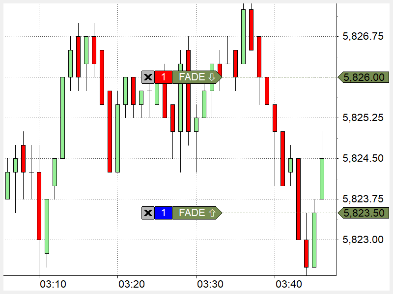

## Table of Contents

## What is MultiCharts and how does it help in trading?

MultiCharts is a software platform that helps people trade in financial markets. It is designed for traders who want to use computers to make trading decisions. The software lets you see charts of different financial products like stocks, futures, and forex. You can also use it to create and test trading strategies without risking real money. This is helpful because it allows you to practice and improve your trading skills before you start trading with real money.

MultiCharts also helps traders by letting them automate their trading. This means you can set up rules for buying and selling, and the software will do it for you automatically. This can save time and help you stick to your trading plan. The platform connects to different brokers, so you can trade through the software without needing to switch between different programs. Overall, MultiCharts makes trading easier by providing tools to analyze markets, test strategies, and execute trades automatically.

## What are the basic components of a trading strategy in MultiCharts?

A trading strategy in MultiCharts has a few basic parts. First, you need to decide what to trade, like stocks, futures, or forex. Then, you set up rules for when to buy and when to sell. These rules can be based on things like price movements, chart patterns, or other indicators. For example, you might decide to buy when a stock's price goes above a certain level and sell when it drops below another level.

Another important part is managing your risk. This means setting limits on how much money you're willing to lose on each trade. You can use stop-loss orders to automatically sell if the price goes against you too much. Also, you need to decide how much money to put into each trade, which is called position sizing. MultiCharts lets you test your strategy with past data to see how it would have worked, which helps you improve it before using real money.

## How do you set up a simple moving average crossover strategy in MultiCharts?

To set up a simple moving average crossover strategy in MultiCharts, you first need to decide on two moving averages: a short-term one and a long-term one. The short-term moving average reacts quicker to price changes, while the long-term one is slower. For example, you might choose a 10-day short-term moving average and a 30-day long-term moving average. In MultiCharts, you can add these moving averages to your chart by selecting them from the indicators menu. Once added, you'll see two lines on your chart: one for the short-term average and one for the long-term average.

Next, you set up the rules for when to buy and sell. In this strategy, you buy when the short-term moving average crosses above the long-term moving average. This is called a "golden cross" and signals that the price might go up. On the other hand, you sell when the short-term moving average crosses below the long-term moving average, known as a "death cross," signaling that the price might go down. In MultiCharts, you can program these rules using the PowerLanguage editor. You'll write a script that says "buy when the short-term average is above the long-term average" and "sell when the short-term average is below the long-term average." After setting up these rules, you can test your strategy using historical data to see how it would have performed in the past.

## What are the key indicators used in MultiCharts for developing trading strategies?

In MultiCharts, traders often use different indicators to help them make trading decisions. Some common ones are moving averages, which help smooth out price data to see trends more clearly. Traders might use a short-term moving average to react quickly to price changes and a long-term one to understand the bigger picture. Another popular indicator is the Relative Strength Index (RSI), which measures how fast prices are changing to see if a stock is overbought or oversold. This can help traders decide when to buy or sell.

Other useful indicators include the Bollinger Bands, which show how much prices are moving around their average. When prices get close to the upper band, it might mean the price is too high and could go down soon. When prices are near the lower band, it might mean the price is too low and could go up. The Moving Average Convergence Divergence (MACD) is also important. It helps traders see when trends might be changing by comparing two moving averages. By using these indicators, traders can build strategies that help them decide when to buy and sell in the market.

## How can you backtest a trading strategy in MultiCharts?

To backtest a trading strategy in MultiCharts, you first need to set up your strategy using the PowerLanguage editor. This means writing rules for when to buy and sell based on indicators like moving averages or RSI. Once your strategy is ready, you go to the [backtesting](/wiki/backtesting) section in MultiCharts. Here, you choose the time period you want to test, like the last year or the last five years. You also pick the financial product you want to test, like stocks or futures. Then, you run the backtest, and MultiCharts will use past data to see how your strategy would have worked.

After running the backtest, MultiCharts gives you a report that shows how well your strategy did. The report includes things like how much money you would have made or lost, how often you would have traded, and how big your wins and losses would have been. You can look at this report to see if your strategy needs to be changed. If it didn't work well, you might adjust your rules or try different indicators. Backtesting helps you improve your strategy before you start trading with real money, so you can feel more confident in your plan.

## What are the common pitfalls to avoid when creating trading strategies in MultiCharts?

When creating trading strategies in MultiCharts, one common pitfall is overfitting. This happens when you make your strategy too specific to past data, so it works well in backtests but not in real trading. You might be tempted to add lots of rules and indicators to make your strategy look perfect, but this can make it too complicated and less likely to work in the future. It's better to keep things simple and focus on a few key indicators that really matter.

Another pitfall is not considering transaction costs and slippage. In backtests, MultiCharts might not always account for the costs of buying and selling, like commissions and the difference between the price you want and the price you get. These costs can add up and make a big difference in how well your strategy actually performs. It's important to include these costs in your backtests to get a more realistic picture of how your strategy will do in real trading.

## How do you optimize trading strategies in MultiCharts?

To optimize trading strategies in MultiCharts, you start by running a backtest to see how your strategy has done in the past. You look at the results to find out what works well and what doesn't. Maybe you see that your strategy makes too many trades and loses money on fees, or maybe it misses good opportunities because it's too slow to react. You can then tweak your strategy by changing the rules for buying and selling, like using different moving averages or adjusting the settings on indicators like RSI. You keep testing and adjusting until you find a version of your strategy that does better in backtests.

Another important part of optimizing in MultiCharts is using the platform's built-in optimization tools. These tools let you test many different versions of your strategy at once. For example, you might want to try different lengths for your moving averages or different levels for your RSI. MultiCharts will run all these tests and show you which version of your strategy worked the best. This helps you find the best settings for your strategy without having to do all the testing by hand. By using these tools and making smart changes based on your backtest results, you can make your trading strategy better and more likely to succeed in real trading.

## What advanced features does MultiCharts offer for strategy development?

MultiCharts has some advanced tools that help traders make better strategies. One of these tools is the Portfolio Backtesting feature, which lets you test how a whole group of trading strategies would work together. This is useful because it shows you how different strategies can balance each other out, making your overall trading plan more stable. Another advanced feature is the Monte Carlo Simulation, which runs your strategy many times with different random changes to see how it might do in different situations. This helps you understand the risks better and see if your strategy can handle unexpected changes in the market.

There's also the Genetic Optimization tool, which is like a smart way to find the best settings for your strategy. It tries different combinations of settings and keeps the ones that work best, kind of like how nature evolves over time. This can save you a lot of time because you don't have to test every single setting by hand. MultiCharts also lets you use different programming languages like C# and EasyLanguage, giving you more ways to write and test your strategies. These advanced features make MultiCharts a powerful tool for traders who want to create and improve their trading strategies.

## How can you integrate external data feeds into MultiCharts strategies?

To integrate external data feeds into MultiCharts strategies, you first need to connect to the data source. MultiCharts supports many different data providers, so you can choose one that has the information you need. Once you've chosen a provider, you set up the connection in MultiCharts by adding the data feed to your chart or strategy. This might mean entering some codes or settings to tell MultiCharts where to get the data from. After setting it up, the data will show up on your charts, and you can use it just like you use the built-in data in MultiCharts.

Using external data can help you make better trading decisions because it gives you more information to work with. For example, you might want to use economic reports, news events, or other market data that isn't available in the standard feeds. Once the external data is in MultiCharts, you can write rules in your strategy to buy or sell based on this new information. This way, your strategy can react to things happening outside the normal price data, which can make it more powerful and flexible.

## What are some examples of complex trading strategies that can be implemented in MultiCharts?

One example of a complex trading strategy you can make in MultiCharts is a mean reversion strategy that uses multiple time frames. This strategy looks for times when a stock's price moves away from its average price over a short period, like a day, but stays close to its average price over a longer period, like a month. When this happens, the strategy buys the stock, expecting the price to come back to its longer-term average. To make this work, you can use different moving averages and indicators like the RSI to find the best times to buy and sell. MultiCharts lets you test this strategy with past data to see if it would have worked well.

Another complex strategy you can build in MultiCharts is a [breakout](/wiki/breakout-trading) strategy that uses [volume](/wiki/volume-trading-strategy) and [volatility](/wiki/volatility-trading-strategies). This strategy looks for times when a stock's price breaks out of its normal range, and there's a lot of trading happening at the same time. The idea is that if the price breaks out with high volume, it's more likely to keep going in that direction. You can use indicators like the Average True Range (ATR) to measure volatility and volume bars to see when trading is high. MultiCharts can help you set up rules to buy when these conditions are met and sell when the price moves too far or the volume drops. By testing this strategy in MultiCharts, you can see if it would have made money in the past and adjust it to work better in the future.

## How do you manage risk and position sizing within MultiCharts strategies?

Managing risk in MultiCharts strategies means setting rules to protect your money. One way to do this is by using stop-loss orders, which automatically sell your stock if the price drops too much. This helps you limit how much you can lose on each trade. You can also use a rule called "maximum drawdown" to stop trading if your losses get too big. This keeps you from losing too much money overall. Another important part of managing risk is diversifying, which means not putting all your money into one stock or one type of investment. MultiCharts lets you test these risk management rules with past data to see if they work well.

Position sizing in MultiCharts is about deciding how much money to put into each trade. A common way to do this is by using a fixed percentage of your total money for each trade. For example, you might decide to risk only 2% of your money on any single trade. This helps you keep your losses small if the trade doesn't go well. MultiCharts lets you set up rules for position sizing based on things like how much money you have, how risky the trade is, or how much the stock's price moves around. By testing different position sizing rules in MultiCharts, you can find the best way to manage your money and make your trading strategy more successful.

## What are the best practices for monitoring and adjusting live trading strategies in MultiCharts?

When you're using MultiCharts for live trading, it's important to keep an eye on your strategies to make sure they're working well. You should check your trades often to see if they're making money or losing money. If something isn't working, you need to figure out why. Maybe the market has changed, or maybe your strategy needs to be tweaked. MultiCharts has tools that can help you see how your strategy is doing in real time. You can use these tools to look at things like how much money you're making or losing, how often you're trading, and how big your wins and losses are. This helps you know if you need to make changes to your strategy.

Adjusting your live trading strategies in MultiCharts means making small changes based on what you see. If your strategy is losing money, you might need to change the rules for buying and selling, like using different moving averages or adjusting the settings on your indicators. It's also a good idea to keep testing your strategy with new data to see if it's still working well. MultiCharts lets you do this without stopping your live trading. By making small adjustments and testing often, you can keep your strategy working well even as the market changes.

## References & Further Reading

[1]: Bergstra, J., Bardenet, R., Bengio, Y., & Kégl, B. (2011). ["Algorithms for Hyper-Parameter Optimization."](https://papers.nips.cc/paper/4443-algorithms-for-hyper-parameter-optimization) Advances in Neural Information Processing Systems 24.

[2]: ["Advances in Financial Machine Learning"](https://www.amazon.com/Advances-Financial-Machine-Learning-Marcos/dp/1119482089) by Marcos Lopez de Prado

[3]: ["Evidence-Based Technical Analysis: Applying the Scientific Method and Statistical Inference to Trading Signals"](https://www.amazon.com/Evidence-Based-Technical-Analysis-Scientific-Statistical/dp/0470008741) by David Aronson

[4]: ["Machine Learning for Algorithmic Trading"](https://github.com/stefan-jansen/machine-learning-for-trading) by Stefan Jansen

[5]: ["Quantitative Trading: How to Build Your Own Algorithmic Trading Business"](https://books.google.com/books/about/Quantitative_Trading.html?id=j70yEAAAQBAJ) by Ernest P. Chan