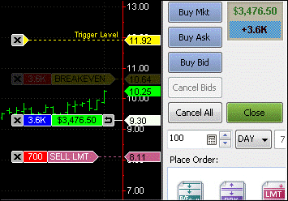

MultiCharts is a sophisticated trading platform designed to facilitate algorithmic trading, offering a host of features that cater to the needs of both beginner and experienced traders. As algorithmic trading continues to grow, MultiCharts provides an environment where trading strategies can be developed, tested, and deployed with high precision and efficiency. Algorithmic trading involves using automated pre-programmed trading instructions accounting for variables such as time, price, and volume, minimizing emotions in trading and providing speed and accuracy to exploit market opportunities.

A distinctive feature of MultiCharts is its robust backtesting capability, allowing traders to simulate trading strategies against historical data before executing them in real markets. This comprehensive testing environment is crucial for confirming the viability of a strategy, ensuring that it can withstand various market conditions and deliver consistent results. Additionally, MultiCharts offers extensive portfolio management tools, enabling traders to manage multiple strategies and assets seamlessly within a unified platform.



What sets MultiCharts apart as a formidable tool for traders is its integration with popular data feeds and brokerage platforms, ensuring smooth data flow and order execution. Additionally, it provides advanced charting capabilities, featuring an extensive collection of indicators and drawing tools that assist traders in technical analysis. The platform supports both manual and automated trading, allowing users to execute trades directly from charts or let algorithms take control.

This article will explore the core features and benefits of MultiCharts that enhance its suitability for algorithmic trading. We will begin by understanding the unique components of the MultiCharts platform and its differentiating factors from its counterpart, MultiCharts .NET. Following this, we will examine the myriad advantages of using MultiCharts, including its powerful backtesting and portfolio management functionalities. The article will further delve into the tools available for creating and testing trading strategies, alongside the efficiencies of automation and execution. Lastly, we will compare MultiCharts with other trading platforms, underscoring its competitive edge in the market.

## Table of Contents

## Understanding MultiCharts

MultiCharts is a professional trading software platform renowned for its capabilities in algorithmic trading. It is specifically designed for traders who require advanced charting, backtesting, and automation features. At its core, MultiCharts offers an environment where traders can design and implement complex trading strategies with high precision. 

One of the features that make MultiCharts particularly suitable for algorithmic trading is its robust charting capabilities. MultiCharts supports a wide array of chart types and offers detailed customization options, enabling traders to analyze market trends effectively. The platform also provides extensive historical data analysis and a broad selection of technical indicators, which are essential for developing and testing trading algorithms.

The advantage of MultiCharts in [algorithmic trading](/wiki/algorithmic-trading) also lies in its powerful [backtesting](/wiki/backtesting) engine. This feature allows traders to simulate trades using historical data to evaluate the performance of trading strategies before risking real capital. The platform's ability to handle multi-core processing allows for faster and more efficient backtesting operations, which is crucial for developing strategies that can respond to rapid market changes.

MultiCharts distinguishes itself from MultiCharts .NET primarily in terms of programming flexibility and language options. MultiCharts uses PowerLanguage, a language specifically developed for traders to create scripts and indicators efficiently. PowerLanguage is designed to be intuitive for those familiar with trading terminology and procedures. Conversely, MultiCharts .NET introduces flexibility by leveraging the .NET framework, enabling traders and developers to use C# or Visual Basic to build custom trading solutions. This integration with the .NET framework makes MultiCharts .NET more suitable for developers who prefer creating algorithms with general programming languages.

In summary, the MultiCharts platform is tailored for creating and executing sophisticated trading strategies with its extensive charting options, robust backtesting tools, and flexibility in programming through PowerLanguage or the .NET framework. These features cater to both traders seeking a comprehensive trading solution and developers looking for advanced customization capabilities.

## Benefits of Using MultiCharts in Algo Trading

MultiCharts offers a range of benefits that cater specifically to the needs of algorithmic traders, facilitating their ability to develop, test, and deploy trading strategies efficiently.

### Comprehensive Suite of Backtesting Tools

One of the standout features of MultiCharts is its robust backtesting capabilities, crucial for evaluating the viability of trading strategies before live deployment. The platform supports historical data analysis, allowing traders to simulate trades over extended timeframes to gauge potential performance. This process is vital for identifying profitable strategies and avoiding those that incur high risks. MultiCharts offers both single-strategy and portfolio backtesting, providing insights into how strategies would have performed historically under various market conditions, thus enabling traders to refine their approaches with greater precision.

### Advanced Portfolio Management Capabilities

MultiCharts excels in portfolio management, a necessary component for traders managing multiple strategies and diverse asset holdings. Its Portfolio Trader tool is particularly valuable, allowing users to execute strategies across a broad range of assets and instruments within a single interface. This feature streamlines the process of monitoring and adjusting positions, enhancing the trader’s ability to manage risk effectively and optimize performance. Furthermore, MultiCharts supports custom weightings and dynamic portfolio rebalancing, facilitating sophisticated investment strategies such as mean-variance optimization and value-at-risk assessments.

### Seamless Integration with Various Brokers and Data Feeds

Integration with numerous brokers and data feeds is an essential requirement for algo traders who need real-time access to accurate market data and fast execution speeds. MultiCharts offers seamless connectivity with a wide array of brokers and data providers, ensuring that users are not restricted by their platform in choosing where to trade or which data services to utilize. This flexibility is vital for traders who capitalize on [arbitrage](/wiki/arbitrage) opportunities or require immediate market data to execute high-frequency trading strategies.

### Robust Automated Trading Features

Automation in trading reduces the emotional component associated with manual trading, allowing traders to implement strategies systematically and consistently. MultiCharts provides robust automated trading features, including script-based strategy execution using PowerLanguage or C#. It supports automation of both market orders and more complex order types such as stop-loss and take-profit orders. Furthermore, the platform offers advanced features like the auto-resending of unfilled orders and order synchronization across multiple brokers, enhancing the reliability of trade execution and ensuring continuity in strategy deployment. These automated capabilities are complemented by rapid order execution, which is crucial in fast-moving markets where delays can lead to significant opportunity costs.

In summary, MultiCharts equips algorithmic traders with comprehensive tools and integrations necessary to develop and execute sophisticated trading strategies, manage multiple assets, and automate trading processes efficiently.

## Portfolio Management with MultiCharts

The Portfolio Trader tool within MultiCharts offers a robust solution for managing and optimizing trading portfolios effectively. This tool is designed to facilitate both novice and experienced traders in developing, testing, and executing diverse trading strategies across multiple instruments simultaneously.

Backtesting portfolios with dynamic currency conversion is a pivotal feature of MultiCharts' Portfolio Trader. This functionality enables traders to simulate trading strategies on historical data while accounting for currency fluctuations, providing a more realistic and comprehensive evaluation of a strategy's potential performance. The dynamic currency conversion ensures that results are accurately reflected in the trader's base currency, thus eliminating exchange rate discrepancies that can impact overall portfolio performance.

MultiCharts also provides an array of tools for optimizing trading portfolios. The platform facilitates the fine-tuning of strategies through the use of advanced optimization algorithms. Traders can evaluate multiple scenarios and identify the optimal parameters that maximize returns or minimize risks. The optimization process is supported by powerful computational resources that analyze numerous combinations of strategy inputs, ensuring that traders have the best possible information for decision-making.

MultiCharts' Portfolio Trader tool integrates seamlessly with various data sources, allowing traders to access accurate, real-time data for better analysis. With its comprehensive and user-friendly interface, Portfolio Trader supports the efficient management of complex trading portfolios, making it easier for traders to implement and monitor multiple strategies in one platform.

The combination of dynamic currency conversion and advanced optimization tools makes MultiCharts a formidable platform for algorithmic traders looking to enhance their portfolio management capabilities. The platform's emphasis on precision and flexibility empowers traders to develop sound strategies that are well-suited for diverse market conditions, ultimately contributing to informed trading decisions and improved financial outcomes.

## Creating and Testing Trading Strategies

Creating and testing trading strategies in MultiCharts involves a systematic approach that combines robust tools and flexible programming options. MultiCharts provides traders with the capability to develop, customize, and evaluate trading strategies effectively using its proprietary scripting language, PowerLanguage.

### Step-by-step Guide to Developing Trading Strategies

1. **Defining the Strategy**:
   The first step in creating a trading strategy in MultiCharts is to clearly define the rules and objectives. This involves determining the market conditions under which buy or sell signals will be generated. Traders can apply different technical indicators, candlestick patterns, or statistical methodologies as part of their decision-making process.

2. **Coding with PowerLanguage**:
   MultiCharts utilizes PowerLanguage, a versatile scripting language similar to EasyLanguage, allowing traders to code their strategies. It supports various programming constructs, enabling traders to implement complex logic efficiently.

   ```plaintext
   Inputs: FastLength(14), SlowLength(28);
   Vars: FastAvg(0), SlowAvg(0);

   FastAvg = Average(Close, FastLength);
   SlowAvg = Average(Close, SlowLength);

   If CrossOver(FastAvg, SlowAvg) Then 
      Buy ("BuySignal") Next Bar At Market;
   If CrossUnder(FastAvg, SlowAvg) Then 
      Sell Short ("SellSignal") Next Bar At Market;
   ```

3. **Backtesting**:
   MultiCharts offers comprehensive backtesting features that allow traders to evaluate the historical performance of their strategies. This process involves applying the strategy code to historical price data to assess its profitability and robustness. Key metrics analyzed include net profit, maximum drawdown, and profit [factor](/wiki/factor-investing).

   Backtesting supports multiple types of orders and simulates real-life trading conditions, providing an accurate representation of strategy performance.

4. **Walk-Forward Analysis**:
   To enhance the robustness of the strategy, traders can perform walk-forward analysis. This involves dividing historical data into multiple segments and testing the strategy on these out-of-sample periods. Walk-forward analysis helps in optimizing parameters and understanding how a strategy might perform in different market environments.

   ```plaintext
   // Pseudo-code illustrating walk-forward setup
   StartDate = "2000-01-01";
   EndDate = "2020-12-31";
   WalkForward(OptimizationPeriod, WalkForwardPeriod) {
       Optimize Strategy Parameters;
       Test Out-of-Sample Data;
   }
   ```

### Using PowerLanguage for Customization

PowerLanguage provides extensive capability for traders to tailor their strategies to their specific needs. It supports loops, conditional statements, and a wide array of built-in functions for calculating technical indicators and handling data series. This level of customization allows traders to model virtually any trading approach, from simple moving averages to advanced [statistical arbitrage](/wiki/statistical-arbitrage).

### Comprehensive Backtesting with Walk-Forward Analysis

The robustness of a trading strategy is essential for its success, and MultiCharts' backtesting features help achieve that. The platform’s walk-forward analysis serves as an additional layer, assisting in validating strategies through iterative testing periods. This ensures that optimized parameters are not just results of overfitting but are truly predictive of market movements.

By adhering to these methods, traders can systematically develop, analyze, and fine-tune their trading strategies, leveraging MultiCharts' advanced tools to maintain a competitive edge in algorithmic trading.

## Automation and Execution

MultiCharts provides a sophisticated environment for automated trading, enabling traders to execute strategies with efficiency and precision. The platform allows users to automate trades by utilizing advanced scripting and programming capabilities. Users can develop custom trading strategies and deploy them for automatic trade execution, streamlining the trading process and reducing the potential for human error.

One notable feature of MultiCharts is its capability to handle unfilled orders through auto-resending. This ensures that should an order not fill due to market conditions, it will be automatically resent in an attempt to execute the trade as intended. This feature helps maintain strategy integrity and ensures that trading strategies continue to operate smoothly even during periods of market turbulence.

Order synchronization is another critical component of MultiCharts' automated trading functionality. It ensures that the trading platform's order status is always in sync with the broker’s servers, minimizing discrepancies and potential mismatches between intended and executed trades. This synchronization facilitates more accurate tracking and prevents double orders or missed executions, crucial for maintaining coherent trading operations.

Rapid order execution is essential in algorithmic trading where milliseconds can make a difference in the profitability of trades. MultiCharts is designed to deliver swift execution of orders, leveraging technology that minimizes latency and allows traders to capitalize on market opportunities as they arise. The platform employs optimized algorithms and infrastructure to facilitate the quick sending and receipt of trade orders, enhancing overall trading performance.

These features collectively allow traders using MultiCharts to automate their trading systems effectively, ensuring that strategies are executed with high precision and minimal delay. By providing tools that address common challenges in automated trading, such as unfilled orders and synchronization errors, MultiCharts offers a robust solution for traders looking to implement and manage complex trading strategies.

## Comparing MultiCharts with Other Platforms

MultiCharts and TradeStation are two prominent platforms in algorithmic trading, each offering unique features that cater to traders' diverse needs. While both platforms provide robust tools for developing and executing trading strategies, several key differences set them apart.

### Key Differences

**Multicharts' Emphasis on Flexibility and Customization**

MultiCharts is notably recognized for its emphasis on flexibility and customization. The platform supports trading in multiple languages such as PowerLanguage and MultiCharts .NET, offering traders the ability to develop custom strategies in environments they are comfortable with. TradeStation, on the other hand, primarily focuses on EasyLanguage, which, while powerful, may not offer the same level of versatility for programmers wishing to leverage C# or VB.NET.

**Backtesting and Optimization Features**

In terms of backtesting capabilities, MultiCharts is renowned for its comprehensive suite of tools. The platform provides advanced portfolio backtesting with features like walk-forward analysis and genetic optimization, allowing traders to rigorously evaluate the robustness of their strategies over extensive market conditions. Although TradeStation offers backtesting, MultiCharts' broad array of testing tools provides a more in-depth analysis, crucial for serious algorithmic traders.

**Broker and Data Feed Integration**

MultiCharts excels with its seamless integration with various brokers and data feeds. The platform supports an extensive range of connectivity options, facilitating smooth data flow and execution across different markets. TradeStation, while integrated with its brokerage services, may not provide the same level of third-party connectivity, potentially limiting traders looking for diverse brokerage connections.

### Advantages in Portfolio Trading and Automation

One of MultiCharts' standout features is its advanced portfolio trading and automation capabilities. The platform's Portfolio Trader tool enables traders to manage multiple strategies across various markets efficiently, providing dynamic currency conversion and comprehensive portfolio optimization tools. Automated trading features, such as auto-resending unfilled orders and precise order synchronization, enhance trading efficiency and reduce execution errors.

TradeStation offers robust automation features as well, but MultiCharts' extensive customization options and integration capabilities provide traders with a more tailored and efficient trading experience, particularly in handling complex portfolios.

### User Feedback and Testimonials

User testimonials often highlight the flexibility and the depth of analytical tools as significant advantages of MultiCharts. Traders appreciate the platform's responsiveness, ease of integration, and the powerful scripting language that allows for significant customization. In contrast, TradeStation is frequently praised for its user-friendly design and all-in-one brokerage and trading platform solution, which can be particularly appealing to less technical traders.

Overall, while both platforms have their respective strengths, MultiCharts offers distinct advantages in terms of flexibility, comprehensive analytical tools, and connectivity, which can be particularly beneficial for algorithmic traders managing diverse and complex portfolios.

## Conclusion

MultiCharts has established itself as a formidable platform in the field of algorithmic trading by offering a plethora of features designed to enhance trading efficiency and performance. One of the key advantages of using MultiCharts is its comprehensive suite of backtesting tools, which allows traders to meticulously test their strategies against historical data before deploying them in live markets. This is crucial for optimizing trading strategies and minimizing risks.

Another significant benefit is its advanced portfolio management capabilities. MultiCharts enables traders to manage and optimize their portfolios with ease, integrating dynamic currency conversion and offering tools that simplify the complex task of balancing and hedging diverse assets.

Seamless integration with various brokers and data feeds is another strong point of the MultiCharts platform. This flexibility not only broadens the horizon for traders but also ensures that they have access to real-time data and execute trades efficiently. Furthermore, MultiCharts’ robust automated trading features, such as auto-resending unfilled orders and order synchronization, offer reliable solutions for executing strategies with minimal human intervention.

When it comes to integrating MultiCharts into trading workflows, it is important to consider the ease with which its tools and features fit into both novice and seasoned traders’ existing systems. Its user-friendly interface, combined with powerful customization options through PowerLanguage, make it adaptable and suitable for a wide range of trading styles and strategies.

To explore the full potential of MultiCharts, traders are encouraged to take advantage of the free trials or tutorials offered by the platform. These opportunities provide a risk-free environment to understand and leverage the tools available, tailor strategies to specific needs, and ultimately enhance trading performance.

Integrating MultiCharts into one's trading arsenal could prove to be a game-changer, offering the technological edge required to navigate the complexities of modern financial markets.

## References & Further Reading

[1]: Bergstra, J., Bardenet, R., Bengio, Y., & Kégl, B. (2011). ["Algorithms for Hyper-Parameter Optimization."](https://papers.nips.cc/paper/4443-algorithms-for-hyper-parameter-optimization) Advances in Neural Information Processing Systems 24.

[2]: ["Advances in Financial Machine Learning"](https://www.amazon.com/Advances-Financial-Machine-Learning-Marcos/dp/1119482089) by Marcos Lopez de Prado

[3]: ["Evidence-Based Technical Analysis: Applying the Scientific Method and Statistical Inference to Trading Signals"](https://www.amazon.com/Evidence-Based-Technical-Analysis-Scientific-Statistical/dp/0470008741) by David Aronson

[4]: ["Machine Learning for Algorithmic Trading"](https://github.com/stefan-jansen/machine-learning-for-trading) by Stefan Jansen

[5]: ["Quantitative Trading: How to Build Your Own Algorithmic Trading Business"](https://books.google.com/books/about/Quantitative_Trading.html?id=j70yEAAAQBAJ) by Ernest P. Chan