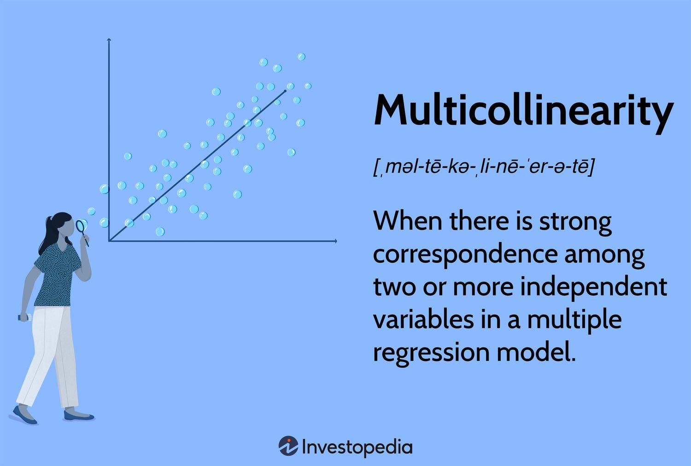

## Table of Contents

## What is multicollinearity in the context of statistical models?

Multicollinearity happens in statistical models when two or more variables are closely related to each other. Imagine you're trying to predict how much ice cream people will buy. You have data on both the temperature and the number of people wearing shorts. These two variables might be closely linked because on hot days, more people wear shorts. If you use both in your model, it becomes hard to tell which one is really affecting ice cream sales.

This situation can cause problems. It can make your model's predictions less accurate and make it hard to understand which variables are important. For example, if you're trying to see if temperature or shorts-wearing affects ice cream sales more, multicollinearity might make it seem like neither matters much. To fix this, you might need to remove one of the related variables or combine them into one new variable. This helps make your model clearer and more reliable.

## How can multicollinearity affect the results of a regression analysis?

Multicollinearity can mess up your regression analysis in a few ways. When variables are closely related, it becomes tough for the model to figure out which one is really doing the work. This can lead to unstable estimates of the coefficients, meaning they might change a lot if you add or remove just a few data points. It's like trying to separate the effects of temperature and humidity on ice cream sales when they often change together. If they're too similar, your model might not know which one to trust, leading to unreliable results.

Another problem is that multicollinearity can make it seem like none of your variables are important. When variables are highly correlated, the model might give them very small coefficients, even if they really do matter. This can make you think that none of your variables are good predictors when they actually are. It's like trying to see through a foggy window – everything looks blurry and unclear. To fix this, you might need to remove some variables or combine them into a single variable, which can help make your model's results more trustworthy and easier to understand.

## What are the common signs that indicate the presence of multicollinearity in a dataset?

One common sign of multicollinearity is when you see very high correlation between two or more variables in your dataset. For example, if you're looking at temperature and humidity, and they always seem to go up and down together, that's a clue. You can check this by calculating the correlation coefficient between your variables. If it's close to 1 or -1, it means they're strongly related, and multicollinearity might be an issue.

Another sign is when the coefficients in your regression model change a lot when you add or remove variables. Imagine you're trying to predict ice cream sales with temperature and humidity. If you take out humidity, the coefficient for temperature might jump up a lot. This instability shows that the variables are fighting for the same spot in your model, which is a classic sign of multicollinearity.

Lastly, if your model's R-squared value is high, but none of your variables seem to be significant, that's another red flag. It's like your model is saying, "I can predict well, but I can't tell you why." This happens because the variables are too similar, and the model can't figure out which one is really important. So, if you see a high R-squared but low t-stats for your variables, it's time to check for multicollinearity.

## What is the difference between perfect and imperfect multicollinearity?

Perfect multicollinearity happens when one variable in your dataset can be exactly predicted from the others. Imagine you're looking at the total cost of a pizza, the cost per slice, and the number of slices. If you know the cost per slice and the number of slices, you can figure out the total cost perfectly. In this case, your regression model won't work because it can't tell the variables apart. It's like trying to solve a puzzle where two pieces are exactly the same – you can't fit them both in.

Imperfect multicollinearity is more common and less extreme. It happens when variables are related but not perfectly. For example, if you're looking at temperature and humidity, they often go up and down together, but not always in the same way. This can still cause problems in your regression model, making it hard to figure out which variable is more important. But unlike perfect multicollinearity, your model can still run; it just might give you unreliable results. It's like trying to solve a puzzle where two pieces are very similar but not identical – it's tricky, but you can still make it work with some effort.

## How can one detect multicollinearity using Variance Inflation Factor (VIF)?

The Variance Inflation Factor (VIF) is a tool that helps you spot multicollinearity in your data. It works by looking at how much the variance of a regression coefficient is increased because of the correlation between the variables. You calculate the VIF for each variable in your model. If the VIF is high, it means that variable is closely related to others in your dataset, which can cause problems in your regression analysis.

To use VIF, you run a regression for each variable against all the other variables in your model. The VIF is then calculated as 1 divided by (1 minus the R-squared from this regression). If the VIF is above 5 or 10 (different people have different cutoffs), it's a sign that you have multicollinearity. For example, if temperature and humidity both have high VIFs, it means they're too similar and might be causing issues in your model. By checking the VIF, you can figure out which variables are causing trouble and decide whether to remove or combine them to make your model better.

## What are some graphical methods to detect multicollinearity?

One way to spot multicollinearity is by using scatter plots. You can make a scatter plot for each pair of variables in your dataset. If you see the points forming a straight line or a clear pattern, it means the variables are closely related. For example, if you plot temperature against humidity and see a line going up, it shows they often change together. This can help you see which variables might be causing multicollinearity in your model.

Another useful method is the correlation matrix heatmap. This is a colorful grid where each square shows how closely two variables are related. If you see bright colors, especially red or blue, it means those variables have a strong correlation. For instance, if the square for temperature and humidity is very red, it's a sign they might be causing multicollinearity. This visual tool makes it easy to spot which variables you should look at more closely.

You can also use a dendrogram from hierarchical clustering. This looks like a tree where branches show how variables group together based on their similarity. If you see branches that join early and are close together, it means those variables are very similar and might cause multicollinearity. For example, if temperature and humidity join early in the tree, it's a clue they're too closely related. This method helps you understand the structure of your data and find potential problems with multicollinearity.

## Can you explain how correlation matrices help in identifying multicollinearity?

A correlation matrix is like a big table that shows how much each pair of variables in your dataset are related to each other. Each number in the table, called a correlation coefficient, tells you if the variables move together or in opposite directions. If the number is close to 1, it means the variables go up and down together a lot. If it's close to -1, they move in opposite ways. And if it's close to 0, they don't really move together at all. When you look at this table, you're looking for numbers that are far away from 0, because those show strong relationships between variables, which can cause multicollinearity in your model.

For example, imagine you're studying how temperature and humidity affect ice cream sales. If you make a correlation matrix and see that the number for temperature and humidity is close to 1, it means they often change together. This strong relationship can make it hard for your model to tell which one is really affecting ice cream sales. By looking at the correlation matrix, you can see which variables are too similar and might need to be removed or combined to make your model work better. It's like using a map to find the best route – the correlation matrix helps you navigate your data and avoid problems with multicollinearity.

## What are the consequences of ignoring multicollinearity in model building?

Ignoring multicollinearity in model building can make your model's predictions less reliable. When variables are too similar, the model has a hard time figuring out which one is really important. This can lead to big changes in the model's results if you add or remove just a few data points. It's like trying to guess the weather when you can't tell if it's the temperature or the humidity that's making it hot. If you don't fix multicollinearity, your model might give you wrong answers, and you won't know which variables are really affecting what you're trying to predict.

Another problem is that multicollinearity can make it seem like none of your variables are important. When variables are closely related, the model might give them very small coefficients, even if they really do matter. This can make you think that your model isn't working well, when actually, it's just confused by the similar variables. It's like trying to see through a foggy window – everything looks blurry. If you ignore multicollinearity, you might miss out on understanding which factors are truly important in your data, and your model won't be as useful as it could be.

## What strategies can be used to address multicollinearity in a dataset?

One way to deal with multicollinearity is to remove one of the variables that are too similar. Imagine you're trying to predict ice cream sales using both temperature and humidity. If they're closely related, you can just use one of them in your model. This makes things simpler and helps your model figure out what's really important. Another way is to combine the related variables into one new variable. For example, you could create a "heat index" that uses both temperature and humidity. This new variable can capture the important information from both without causing confusion in your model.

Another strategy is to collect more data. Sometimes, multicollinearity happens because you don't have enough information. If you can get more data, it might help your model see the differences between the variables more clearly. For example, if you collect ice cream sales data from different places or times of year, it might show that temperature and humidity don't always change together. This can make your model more reliable. Also, using regularization techniques like Ridge or Lasso regression can help. These methods add a little penalty to the model, which can reduce the impact of multicollinearity by shrinking the coefficients of the related variables.

## How does regularization (like Lasso or Ridge regression) help mitigate the effects of multicollinearity?

Regularization, like Lasso or Ridge regression, helps with multicollinearity by adding a little penalty to the model. This penalty makes the model less likely to rely too much on any one variable, which can be a problem when variables are too similar. Imagine you're trying to predict ice cream sales using both temperature and humidity. If they're closely related, your model might get confused. But with regularization, the model gets a gentle push to use both variables more evenly, which can make its predictions more reliable.

Lasso regression does this by shrinking some coefficients all the way to zero, which means it can even remove variables that are too similar. This is like cleaning up your model by getting rid of the extra variables that aren't helping much. Ridge regression, on the other hand, shrinks all the coefficients a little bit but doesn't remove any. It's like smoothing out the model so it doesn't get too focused on any one variable. Both methods help your model work better when variables are too closely related.

## What are the advanced techniques for dealing with multicollinearity in time series data?

When dealing with time series data, one advanced technique to handle multicollinearity is using principal component analysis (PCA). PCA helps by turning your related variables into new ones that aren't as closely connected. Imagine you're looking at temperature and humidity over time. PCA can mix these together to create new variables that capture the important information without being too similar. This makes your model clearer and more reliable because it can use these new variables without getting confused.

Another method is using vector autoregression (VAR) models. VAR models look at how different time series variables affect each other over time. If temperature and humidity are closely related, a VAR model can help you see how they influence each other and ice cream sales, for example. This approach can make your predictions better by considering the relationships between variables more carefully. It's like understanding a story better when you know how all the characters interact with each other.

## How does multicollinearity impact the interpretability and reliability of machine learning models?

Multicollinearity makes it hard to understand and trust [machine learning](/wiki/machine-learning) models. When variables in your data are too similar, the model can't tell which one is really important. This is like trying to figure out if it's the temperature or the humidity that makes people buy more ice cream on a hot day. If both are closely related, the model might give you wrong answers or say that neither matters much. This confusion can make it tough to explain why the model makes certain predictions, which is a big problem if you need to understand and explain the model's decisions.

Ignoring multicollinearity can also make your model less reliable. If you add or remove just a few data points, the model's results might change a lot. It's like trying to balance on a seesaw that tips easily. This instability means you can't trust the model to give you consistent answers. To make your model better, you might need to remove some variables or combine them into new ones. This can help the model work more smoothly and give you results you can rely on.

## What is Understanding Regression Analysis in Algorithmic Trading?

Regression analysis is a vital statistical method in understanding the relationships between dependent and independent variables, making it an essential tool in algorithmic trading. In this domain, regression models are primarily used to predict future price movements based on historical data, providing traders with a quantitative basis for decision-making.

### Prediction and Strategy Development

The predictive capacity of regression analysis allows traders to anticipate market trends by examining past data. By quantifying the effect of various factors, such as market indicators or economic variables, on trading outcomes, traders can develop more informed strategies. This ability is particularly valuable in constructing models that can adapt to changing market conditions and optimize trading performance.

### Types of Regression in Algorithmic Trading

Various types of regression analyses serve different purposes in trading algorithms:

1. **Linear Regression**: Perhaps the most commonly used, linear regression assesses the straight-line relationship between a dependent variable and one or more independent variables. The simplicity and efficiency of linear regression make it a staple in predicting future prices and returns.

   The basic formula for linear regression is:
$$
   y = \beta_0 + \beta_1x_1 + \beta_2x_2 + ... + \beta_nx_n + \epsilon

$$

   Here, $y$ represents the dependent variable (e.g., stock price), $x_1, x_2, ..., x_n$ are independent variables (e.g., trading [volume](/wiki/volume-trading-strategy), market indices), $\beta_0$ is the y-intercept, $\beta_1, \beta_2, ..., \beta_n$ are coefficients, and $\epsilon$ is the error term.

2. **Logistic Regression**: Unlike linear regression, logistic regression is used when the dependent variable is binary. It is often utilized to predict outcomes like whether a stock will rise or fall.

   The logistic regression model is given by:
$$
   P(Y = 1) = \frac{1}{1 + e^{-(\beta_0 + \beta_1x_1 + \beta_2x_2 + ... + \beta_nx_n)}}

$$

3. **Polynomial Regression**: This type of regression allows for the modeling of non-linear relationships by incorporating polynomial terms of the independent variables, thus providing a more flexible fit for complex market dynamics.

   An example formula is:
$$
   y = \beta_0 + \beta_1x + \beta_2x^2 + ... + \beta_mx^m + \epsilon

$$

### Optimizing Algorithm Parameters

Beyond prediction, traders employ regression models to optimize and calibrate algorithm parameters dynamically. By analysing the relationships between different market variables, regression can help fine-tune trading algorithms, enhancing performance in diverse market environments. Optimization involves adjusting algorithm parameters to maximize returns or minimize risk, leveraging statistical insights drawn from regression analysis.

Overall, the application of regression analysis in [algorithmic trading](/wiki/algorithmic-trading) offers significant benefits, including improved decision-making processes and competitive strategy development.

## References & Further Reading

[1]: Bergstra, J., Bardenet, R., Bengio, Y., & Kégl, B. (2011). ["Algorithms for Hyper-Parameter Optimization."](https://papers.nips.cc/paper/4443-algorithms-for-hyper-parameter-optimization) Advances in Neural Information Processing Systems 24.

[2]: ["Advances in Financial Machine Learning"](https://www.amazon.com/Advances-Financial-Machine-Learning-Marcos/dp/1119482089) by Marcos Lopez de Prado

[3]: ["Evidence-Based Technical Analysis: Applying the Scientific Method and Statistical Inference to Trading Signals"](https://www.amazon.com/Evidence-Based-Technical-Analysis-Scientific-Statistical/dp/0470008741) by David Aronson

[4]: ["Machine Learning for Algorithmic Trading"](https://github.com/stefan-jansen/machine-learning-for-trading) by Stefan Jansen

[5]: ["Quantitative Trading: How to Build Your Own Algorithmic Trading Business"](https://www.amazon.com/Quantitative-Trading-Build-Algorithmic-Business/dp/1119800064) by Ernest P. Chan

[6]: Wooldridge, J. M. (2010). ["Econometric Analysis of Cross Section and Panel Data"](https://ipcig.org/evaluation/apoio/Wooldridge%20-%20Cross-section%20and%20Panel%20Data.pdf). MIT Press.

[7]: Montgomery, D. C., Peck, E. A., & Vining, G. G. (2012). ["Introduction to Linear Regression Analysis"](https://books.google.com/books/about/Introduction_to_Linear_Regression_Analys.html?id=tCIgEAAAQBAJ). Wiley. 

[8]: ["The Econometrics of Financial Markets"](https://archive.org/details/econometricsoffi0000camp) by John Y. Campbell, Andrew W. Lo, A. Craig MacKinlay

