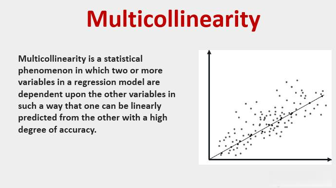

In today's fast-paced financial markets, algorithmic trading has emerged as a dominant force, underpinned by the rapid processing of vast amounts of data and the application of sophisticated statistical models. Among these models, regression analysis plays a crucial role by enabling traders to discern patterns within historical data, making informed decisions on future market movements. 

The fundamental purpose of regression analysis is to examine the relationship between a dependent variable—such as the price of a security—and one or more independent variables, which might include economic indicators, trading volumes, or other market factors. The predictive capabilities of regression models allow traders to gauge the impact of various factors on asset prices, optimizing their trading strategies accordingly. 



However, this powerful tool is not without its challenges. One notable issue is multicollinearity, a condition where two or more independent variables in a regression model are highly correlated. This can cause problems, such as inflating the standard errors of the estimates of the coefficients, which may lead to unreliable predictions. Addressing these challenges is essential for maintaining the integrity and accuracy of the models used in trading.

This article explores the significance of regression analysis in algorithmic trading and confronts the issue of multicollinearity. By leveraging these statistical tools, traders can enhance their decision-making processes and develop more robust trading strategies. Whether you are a seasoned quantitative analyst or new to the field, understanding these concepts is crucial for achieving success in the competitive landscape of financial markets.

## Table of Contents

## Understanding Regression Analysis in Algorithmic Trading

Regression analysis is a vital statistical method in understanding the relationships between dependent and independent variables, making it an essential tool in algorithmic trading. In this domain, regression models are primarily used to predict future price movements based on historical data, providing traders with a quantitative basis for decision-making.

### Prediction and Strategy Development

The predictive capacity of regression analysis allows traders to anticipate market trends by examining past data. By quantifying the effect of various factors, such as market indicators or economic variables, on trading outcomes, traders can develop more informed strategies. This ability is particularly valuable in constructing models that can adapt to changing market conditions and optimize trading performance.

### Types of Regression in Algorithmic Trading

Various types of regression analyses serve different purposes in trading algorithms:

1. **Linear Regression**: Perhaps the most commonly used, linear regression assesses the straight-line relationship between a dependent variable and one or more independent variables. The simplicity and efficiency of linear regression make it a staple in predicting future prices and returns.

   The basic formula for linear regression is:
$$
   y = \beta_0 + \beta_1x_1 + \beta_2x_2 + ... + \beta_nx_n + \epsilon

$$

   Here, $y$ represents the dependent variable (e.g., stock price), $x_1, x_2, ..., x_n$ are independent variables (e.g., trading [volume](/wiki/volume-trading-strategy), market indices), $\beta_0$ is the y-intercept, $\beta_1, \beta_2, ..., \beta_n$ are coefficients, and $\epsilon$ is the error term.

2. **Logistic Regression**: Unlike linear regression, logistic regression is used when the dependent variable is binary. It is often utilized to predict outcomes like whether a stock will rise or fall.

   The logistic regression model is given by:
$$
   P(Y = 1) = \frac{1}{1 + e^{-(\beta_0 + \beta_1x_1 + \beta_2x_2 + ... + \beta_nx_n)}}

$$

3. **Polynomial Regression**: This type of regression allows for the modeling of non-linear relationships by incorporating polynomial terms of the independent variables, thus providing a more flexible fit for complex market dynamics.

   An example formula is:
$$
   y = \beta_0 + \beta_1x + \beta_2x^2 + ... + \beta_mx^m + \epsilon

$$

### Optimizing Algorithm Parameters

Beyond prediction, traders employ regression models to optimize and calibrate algorithm parameters dynamically. By analysing the relationships between different market variables, regression can help fine-tune trading algorithms, enhancing performance in diverse market environments. Optimization involves adjusting algorithm parameters to maximize returns or minimize risk, leveraging statistical insights drawn from regression analysis.

Overall, the application of regression analysis in [algorithmic trading](/wiki/algorithmic-trading) offers significant benefits, including improved decision-making processes and competitive strategy development.

## The Significance of Multicollinearity in Regression Models

Multicollinearity arises in a regression model when two or more independent variables are highly correlated, creating significant analytical challenges. This phenomenon can obscure the interpretation of regression coefficients, as the interdependence between variables makes it difficult to discern the individual effect of each predictor on the dependent variable. As a result, the estimates of the coefficients can become unreliable, reducing the model's predictive power.

In the context of algorithmic trading, the presence of multicollinearity is particularly concerning. It can lead to inflated standard errors of the coefficient estimates, complicating the identification of reliable predictors of financial outcomes. For traders relying on regression models to make decisions, such inaccuracies can translate into suboptimal trading strategies and potential financial losses. Therefore, recognizing and addressing multicollinearity is imperative for maintaining the integrity and accuracy of trading models.

Detection and remediation strategies are available to tackle multicollinearity. The Variance Inflation Factor (VIF) is one such diagnostic tool that quantifies how much the variance of an estimated regression coefficient increases due to multicollinearity. In practice, a common threshold for VIF values is 10; values exceeding this suggest a detrimental level of multicollinearity. For example, if a model has a VIF of 12 for a variable, it indicates that the standard error of the coefficient for this variable is 12 times higher than it would be if there was no multicollinearity. The following Python code demonstrates how to compute VIFs using the `statsmodels` library:

```python
import pandas as pd
import statsmodels.api as sm
from statsmodels.stats.outliers_influence import variance_inflation_factor

# Assuming 'data' is a pandas DataFrame with your independent variables
X = data[['variable1', 'variable2', 'variable3']]
X = sm.add_constant(X)  # Adds a constant term to the model

# Calculate VIF for each variable
vif_data = pd.DataFrame()
vif_data["feature"] = X.columns
vif_data["VIF"] = [variance_inflation_factor(X.values, i) for i in range(X.shape[1])]

print(vif_data)
```

Another effective strategy is Principal Component Analysis (PCA), which reduces the dimensionality of the data set and decorrelates the predictors. By transforming the original correlated variables into a new set of uncorrelated variables (principal components), PCA can help stabilize model estimates and enhance predictive reliability.

Implementing these techniques enables traders to refine their models, thus preserving the accuracy of forecasts and mitigating potential risks associated with multicollinearity. As a consequence, the application of these strategies not only addresses the pitfalls posed by interdependencies among variables but also facilitates more robust trading decisions.

## Applications of Regression Analysis in Algorithmic Trading Strategies

Algorithmic trading strategies frequently rely on regression analysis to forecast price movements and asset returns with precision. Regression models allow traders to incorporate a variety of variables such as interest rates, economic indicators, and [momentum](/wiki/momentum) factors, enhancing the robustness of trading strategies.

One common application of regression analysis in algorithmic trading is pairs trading. This strategy involves identifying two stocks with historically correlated price movements and executing simultaneous long and short positions when they diverge, anticipating a reversion to the mean. Regression models are employed to establish the relationship between these securities and to identify trading signals when deviations from the expected relationship occur.

Statistical [arbitrage](/wiki/arbitrage) is another strategy that benefits from regression analysis. It involves exploiting statistical mispricings between related financial instruments. Regression models help identify these pricing anomalies by analyzing the historical price relationships among assets. Traders can then execute trades to capitalize on temporary deviations from these historical norms, expecting a correction.

Mean reversion is a widely used strategy that assumes asset prices will revert to their historical mean over time. Traders apply regression models to estimate the mean and identify outliers, triggering buy or sell signals when prices deviate significantly from predicted levels. The simplicity and statistical foundation of regression models make them particularly suited for developing and implementing mean reversion strategies.

Moreover, regression-based models are instrumental in adjusting and calibrating trading algorithms in response to real-time market data. This adaptability ensures trading strategies remain effective under changing conditions. For instance, regression models can dynamically update the parameters of algorithms based on the continuous inflow of new data, capturing evolving market trends and shifts.

Incorporating regression analysis into algorithmic trading underscores the development of strategies that can withstand various market conditions. By leveraging statistical insights, traders are better equipped to navigate the complexities of financial markets, enhancing their ability to optimize returns while managing risk effectively.

## Overcoming the Challenges of Multicollinearity in Trading Models

Identifying multicollinearity early is crucial for maintaining the effectiveness of trading models. Multicollinearity, which arises when independent variables in a regression model are highly correlated, can lead to unstable estimates and reduced predictive power. Detecting and addressing multicollinearity helps ensure that trading models remain reliable and effective. 

Regularly revisiting and validating models against fresh data helps in catching and correcting multicollinearity. As market conditions evolve, the relationships between variables may change, potentially leading to increased multicollinearity. By continuously updating models with new data, traders can identify these shifts early and adjust their models accordingly. This proactive approach helps maintain the accuracy of predictions and enhances the model's adaptability to emerging patterns.

Traders can also use additional statistical tests to assess model stability and the impact of multicollinear variables. One common method is the Variance Inflation Factor (VIF), which quantifies how much the variance of an estimated regression coefficient increases due to multicollinearity. A VIF value exceeding 10 often indicates significant multicollinearity, suggesting that some variables may need to be removed or combined. Principal Component Analysis (PCA) is another technique, which reduces dimensionality by transforming the original set of variables into a new set of uncorrelated components. This transformation helps mitigate multicollinearity and can simplify the model without significant loss of information.

Factoring in multicollinearity mitigation strategies enables traders to refine their models, improve accuracy, and reduce risk. By identifying and addressing multicollinear relationships, traders can isolate the true effects of independent variables, leading to more precise estimates and robust trading decisions. This refinement process may involve the exclusion of redundant variables or the incorporation of [factor](/wiki/factor-investing)-based approaches that minimize correlations among predictors.

Continuous education and model refinement are key to effectively navigating the challenges posed by multicollinearity. Traders must stay informed about the latest developments in statistical analysis and model-building techniques to keep their strategies competitive. Regularly updating skills and knowledge allows traders to leverage new tools and methodologies, ensuring their models remain resilient in ever-changing market conditions. Furthermore, embracing a culture of ongoing model assessment and adjustment helps maintain a competitive edge, fostering trading strategies that are both adaptive and robust.

## Conclusion

Regression analysis stands as a crucial tool for algorithmic traders, providing essential insights and predictions that support the development of effective trading strategies. By allowing traders to deduce patterns and evaluate the impact of numerous variables, regression models serve as the foundation upon which robust trading strategies are built. However, the presence of multicollinearity remains a significant challenge within these models. When independent variables are highly correlated, it can lead to less reliable coefficient estimates, consequently diminishing the predictive power of the models.

Understanding multicollinearity and applying appropriate remedial measures can markedly enhance model accuracy. Techniques such as calculating the Variance Inflation Factor (VIF) or employing Principal Component Analysis (PCA) are pivotal in mitigating multicollinearity's effects. Traders who master these statistical tools can transform data analysis into more reliable, data-driven, and optimized trading approaches.

Given the inherently dynamic nature of financial markets, traders must consistently adapt and refine their models to maintain a competitive edge. Continuous validation against new data sets and recalibrating models are essential practices for coping with the ever-changing market environment. This iterative process ensures the robustness of trading strategies and mitigates risks associated with outdated models.

The ongoing convergence of statistical analysis and technology is reshaping the landscape of algorithmic trading. Skills in statistical analysis become increasingly crucial as technology advances, offering traders the ability to process vast amounts of data with precision and speed. This integration empowers traders to not only react to market changes swiftly but also anticipate movements, thus maintaining their competitive advantage in a landscape that rewards foresight and adaptability.

## References & Further Reading

[1]: Bergstra, J., Bardenet, R., Bengio, Y., & Kégl, B. (2011). ["Algorithms for Hyper-Parameter Optimization."](https://papers.nips.cc/paper/4443-algorithms-for-hyper-parameter-optimization) Advances in Neural Information Processing Systems 24.

[2]: ["Advances in Financial Machine Learning"](https://www.amazon.com/Advances-Financial-Machine-Learning-Marcos/dp/1119482089) by Marcos Lopez de Prado

[3]: ["Evidence-Based Technical Analysis: Applying the Scientific Method and Statistical Inference to Trading Signals"](https://www.amazon.com/Evidence-Based-Technical-Analysis-Scientific-Statistical/dp/0470008741) by David Aronson

[4]: ["Machine Learning for Algorithmic Trading"](https://github.com/stefan-jansen/machine-learning-for-trading) by Stefan Jansen

[5]: ["Quantitative Trading: How to Build Your Own Algorithmic Trading Business"](https://www.amazon.com/Quantitative-Trading-Build-Algorithmic-Business/dp/1119800064) by Ernest P. Chan

[6]: Wooldridge, J. M. (2010). ["Econometric Analysis of Cross Section and Panel Data"](https://ipcig.org/evaluation/apoio/Wooldridge%20-%20Cross-section%20and%20Panel%20Data.pdf). MIT Press.

[7]: Montgomery, D. C., Peck, E. A., & Vining, G. G. (2012). ["Introduction to Linear Regression Analysis"](https://books.google.com/books/about/Introduction_to_Linear_Regression_Analys.html?id=tCIgEAAAQBAJ). Wiley. 

[8]: ["The Econometrics of Financial Markets"](https://archive.org/details/econometricsoffi0000camp) by John Y. Campbell, Andrew W. Lo, A. Craig MacKinlay

