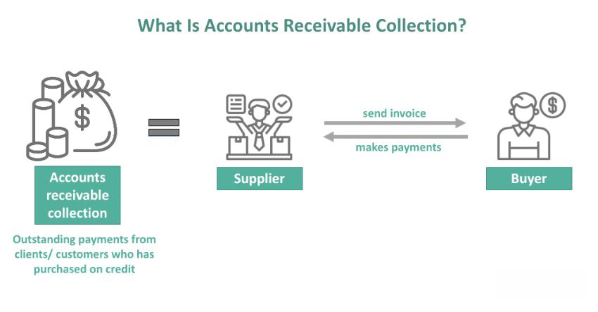

The intersection of accounting, interdisciplinary and multidisciplinary approaches, and algorithmic trading is reshaping the financial landscape. As financial markets grow in complexity, these domains increasingly overlap, providing a comprehensive view and robust management solutions for algorithmic trading operations. Accounting contributes through its principles of systematic financial record-keeping, performance analysis, and regulatory compliance, ensuring the stability and reliability of trading operations. These principles are vital for tracking transaction costs, operational expenses, and maintaining a holistic view of financial activities, thus supporting efficient trading practices.

Interdisciplinary and multidisciplinary approaches involve integrating insights from fields such as mathematics, economics, and computer science, enhancing the strategic depth and effectiveness of algorithmic trading. Through these integrations, complex market behaviors are better understood, fostering the development of sophisticated algorithms that are adaptive and responsive to real-time data. Algorithms designed with this multidisciplinary insight not only optimize performance but also improve risk management by anticipating market shifts and leveraging predictive analytics.



In this article, we explore how these disciplines integrate to elevate the effectiveness and efficiency of algorithmic trading. We will discuss the roles, benefits, and challenges of applying accounting principles while incorporating interdisciplinary and multidisciplinary vantage points. By aligning these fields, firms can construct more agile and comprehensive trading strategies, ultimately leading to more sustainable growth and compliance in modern financial markets.

## Table of Contents

## The Role of Accounting in Algorithmic Trading

Accounting in algorithmic trading is a cornerstone for maintaining the integrity and efficiency of trading operations. By ensuring accurate financial records, it supports a comprehensive understanding of transaction flows and financial status. Financial record-keeping is essential for documenting every transaction within algorithmic trading systems. This precise documentation facilitates transparency and accountability, which are vital for both strategic decision-making and regulatory compliance.

Cost accounting within algorithmic trading is another critical component. It involves the tracking of transaction costs, including brokerage fees, exchange fees, taxes, and any indirect costs. Accurate cost accounting helps in identifying the actual cost per trade and gauging profitability. Given the high-frequency nature of algorithmic trading, where numerous trades happen in milliseconds, understanding cost structures can significantly impact strategy effectiveness.

Performance measurement is integral to accounting in this context. It assists traders in evaluating the success of their trading algorithms by assessing key performance indicators (KPIs) such as return on investment (ROI), Sharpe ratio, and alpha. By systematically analyzing these metrics, traders can identify patterns, optimize strategies, and enhance risk management practices. Python libraries, such as NumPy and Pandas, can aid in efficiently analyzing these financial data sets:

```python
import pandas as pd

# Example: Calculate the Sharpe ratio
returns = pd.Series([0.01, 0.02, -0.005, 0.03, 0.01])  # hypothetical daily returns
rf = 0.0001  # risk-free rate
sharpe_ratio = (returns.mean() - rf) / returns.std()
print(f'Sharpe Ratio: {sharpe_ratio}')
```

Ensuring regulatory compliance is another pivotal role of accounting in [algorithmic trading](/wiki/algorithmic-trading). Algorithms must operate within the regulatory frameworks set by financial authorities to prevent illicit activities and market manipulation. Keeping detailed records and maintaining accurate reporting systems are essential parts of compliance, thereby helping firms avoid legal penalties and maintain reputational integrity.

Overall, accounting facilitates a holistic view of financial operations within a trading ecosystem. It provides the tools necessary to analyze costs and performance, ensuring both the strategic deployment of trading algorithms and adherence to legal standards. This robust framework is crucial in navigating the intricate financial landscape of algorithmic trading.

## Interdisciplinary and Multidisciplinary Approaches

Interdisciplinary and multidisciplinary approaches play a vital role in algorithmic trading, as they integrate diverse fields of expertise to solve complex computational and financial problems. By bringing together insights from disciplines such as mathematics, economics, and computer science, these approaches enhance the development of more efficient algorithmic trading strategies.

Mathematics contributes to algorithmic trading through quantitative models that predict market trends and price movements. For instance, stochastic calculus and time series analysis are widely used to model and forecast financial data. A fundamental mathematical model employed in this context is the Black-Scholes formula, which aids in options pricing and risk management. The formula is given by:

$$
C = S_0 \cdot N(d_1) - X \cdot e^{-rT} \cdot N(d_2)
$$

where $C$ is the call option price, $S_0$ is the current stock price, $X$ is the exercise price, $T$ is the time to expiration, $r$ is the risk-free rate, and $N$ is the cumulative distribution function of the standard normal distribution. $d_1$ and $d_2$ are calculated as follows:

$$
d_1 = \frac{\ln(\frac{S_0}{X}) + (r + \frac{\sigma^2}{2})T}{\sigma\sqrt{T}}
$$
$$
d_2 = d_1 - \sigma\sqrt{T}
$$

Economics provides insights into market behavior and macroeconomic indicators that impact trading decisions. Understanding the equilibrium price theory and behavioral finance allows traders to anticipate market reactions to economic events and policy changes, further refining their trading algorithms. This theoretical framework enhances risk management by accounting for potential market disruptions caused by external economic factors.

Incorporating computer science, particularly programming and software engineering, enables the automation of trading strategies and the development of robust trading platforms. Programmers use languages like Python to implement algorithms that can execute trades at high speeds and volumes. A sample Python code snippet that places a trade based on moving averages might look like:

```python
import pandas as pd

def moving_average_strategy(prices, short_window, long_window):
    signals = pd.DataFrame(index=prices.index)
    signals['price'] = prices
    signals['short_mavg'] = prices.rolling(window=short_window, min_periods=1).mean()
    signals['long_mavg'] = prices.rolling(window=long_window, min_periods=1).mean()
    signals['signal'] = 0.0
    signals['signal'][short_window:] = np.where(signals['short_mavg'][short_window:] > 
                                                signals['long_mavg'][short_window:], 1.0, 0.0)
    signals['positions'] = signals['signal'].diff()
    return signals

# Assuming 'data' is a DataFrame with stock prices
signals = moving_average_strategy(data['price'], short_window=40, long_window=100)
```

Finally, interdisciplinary and multidisciplinary approaches significantly enhance strategic decision-making and risk management. By fostering collaboration across diverse fields, organizations can develop trading systems that are more adaptable to market changes and technological advancements. The integration of these diverse perspectives results in a robust framework for navigating the complexities of financial markets and achieving a competitive edge in algorithmic trading.

## Benefits of a Holistic Approach

Combining accounting with interdisciplinary methods in algorithmic trading provides significant advantages by enhancing analytical depth and operational agility. This approach leverages accounting principles to manage and interpret financial data effectively while integrating insights from various fields such as computer science, mathematics, and economics to optimize trading strategies.

One of the key benefits of this holistic approach is the improvement in performance measurement tools. By utilizing accounting methods to track financial metrics, traders can develop more accurate models for evaluating the success of different trading strategies. These models can incorporate real-time data analysis to adjust strategies dynamically in response to market conditions. For example, [machine learning](/wiki/machine-learning) algorithms can be employed to predict market trends based on historical accounting data, enabling traders to make informed decisions quickly. A basic Python script to illustrate this could look like:

```python
import pandas as pd
from sklearn.linear_model import LinearRegression

# Load historical accounting data
data = pd.read_csv('historical_data.csv')
X = data[['historical_price', '[volume](/wiki/volume-trading-strategy)', '[volatility](/wiki/volatility-trading-strategies)']]
y = data['future_price']

# Train a linear regression model
model = LinearRegression().fit(X, y)

# Predict future price
future_price_prediction = model.predict([[100, 15000, 0.5]])
print(f"Predicted future price: {future_price_prediction[0]}")
```

Furthermore, a holistic approach enhances compliance by ensuring that all financial activities are recorded and analyzed in a comprehensive manner. This is crucial in the context of algorithmic trading, where regulatory requirements are stringent. Accounting systems integrated with trading algorithms can automatically generate reports that adhere to compliance standards, reducing the risk of legal issues and ensuring transparent operations.

An interdisciplinary strategy also facilitates more agile adjustments to trading strategies. By incorporating expertise from diverse fields, traders can rapidly adapt to changes in the financial environment. This adaptability is essential for maintaining a competitive edge in fast-paced markets. For instance, economists can interpret macroeconomic indicators that influence market movements, while computer scientists can refine algorithmic models to respond to these indicators effectively.

Finally, integrated strategies can lead to successful algorithmic trading outcomes by reducing the complexity associated with managing multiple disciplines. This synchronization minimizes data silos and improves communication between teams, thus enabling more cohesive decision-making processes. A practical example is a collaborative platform that combines trading algorithms with real-time accounting data, allowing traders to visualize the impact of their strategies on financial statements instantly.

In summary, the interplay between accounting and interdisciplinary methods within a holistic framework empowers traders with enhanced analytical tools, ensures rigorous compliance, and promotes agility. These capabilities are conducive to developing robust algorithmic trading strategies that can successfully navigate the complexities of modern financial markets.

## Challenges and Solutions

Adopting a multidisciplinary approach in algorithmic trading involves challenges that need careful navigation to ensure efficient operations and strategic success. One major challenge is data integration, where diverse data sources need to be harmonized to provide clear and actionable insights. This requires robust database management systems that can efficiently process large volumes of data. Employing automated systems that use machine learning algorithms can significantly enhance data processing efficiency. For example, using Python libraries such as Pandas for data manipulation and TensorFlow for machine learning can aid in cleaning, organizing, and analyzing data effectively.

Communication across diverse teams stands as another significant challenge due to varying expertise and terminologies across fields like mathematics, economics, and computer science. Establishing a coherent communication framework is essential. This can be achieved by implementing collaborative platforms such as Slack for real-time communication and using project management tools like Asana or Jira to keep track of progress and responsibilities. Cross-training programs can also be instrumental, enabling team members to gain a basic understanding of each other's domains and fostering a more integrated team culture.

Balancing short-term and long-term objectives in a multidisciplinary environment is also crucial. Short-term goals often focus on immediate performance improvements, while long-term objectives may involve strategic investments in technology and skills development. Advanced data analytics techniques, such as predictive analytics and scenario modeling, can aid in balancing these objectives. For instance, employing algorithms that simulate various market scenarios can provide insights into potential long-term outcomes while still addressing short-term performance needs.

By integrating automated systems, facilitating inter-team communication, and leveraging advanced analytics, firms can effectively overcome these challenges. This alignment not only ensures improved synergy between different disciplines but also enhances overall operational efficiency and strategic decision-making in algorithmic trading.

## Future Trends

The future of algorithmic trading is increasingly intertwined with developments in [artificial intelligence](/wiki/ai-artificial-intelligence) (AI) and big data analytics, promising to reshape the landscape of financial markets. With the advancements in AI, particularly in machine learning and [deep learning](/wiki/deep-learning) techniques, algorithmic trading systems are becoming more adaptive and intelligent. These systems are now capable of processing vast amounts of data in real-time, enabling more informed and quicker trading decisions.

AI technologies such as natural language processing (NLP) enhance the capability of trading algorithms to analyze unstructured data, such as news articles and social media posts, to gauge market sentiment. This facet of AI allows for a more comprehensive understanding of market conditions, potentially increasing the accuracy of trading signals.

Big data analytics further augments algorithmic trading by providing the tools to handle and analyze massive datasets efficiently. This capability is crucial, as trading algorithms rely on both historical and real-time data to identify patterns and trends. Tools such as Apache Spark and Hadoop improve the scalability and speed of data processing, enabling algorithms to make faster decisions based on current market conditions.

The integration of AI and big data in algorithmic trading is exemplified through quantitative strategies where statistical models are applied to vast datasets. Below is a simplified Python example demonstrating how a trading algorithm might incorporate AI for decision-making based on moving average crossovers:

```python
import pandas as pd
import numpy as np

# Load historical trading data
data = pd.read_csv('historical_data.csv')

# Calculate moving averages
data['SMA'] = data['Close'].rolling(window=20).mean()
data['LMA'] = data['Close'].rolling(window=50).mean()

# Define trading signal
data['Signal'] = np.where(data['SMA'] > data['LMA'], 1, 0)

# Calculate position
data['Position'] = data['Signal'].diff()

print(data.head())
```

Automated trading systems are evolving with the inclusion of predictive analytics, allowing them to anticipate market movements based on identified patterns. These predictive capabilities are crucial for managing risks and optimizing returns, addressing one of the central goals of algorithmic trading.

Furthermore, cloud computing is transforming trading environments by offering scalable computational resources. It enables traders to test multiple algorithmic models simultaneously and integrate real-time data streams without the constraints of traditional computing infrastructure. This trend is likely to reduce costs and increase the accessibility of sophisticated trading strategies to smaller firms.

In conclusion, the future of algorithmic trading is characterized by the convergence of AI, big data, and cloud computing, promising enhanced efficiency, accuracy, and scalability. These developments necessitate a continued interdisciplinary approach, integrating expertise from computer science, finance, and data science to harness the full potential of these innovations in financial markets.

## Conclusion

The integration of accounting, interdisciplinary, and multidisciplinary approaches in algorithmic trading represents a significant advancement in enhancing financial operations. By aligning these fields, firms can develop more efficient and effective trading strategies that capitalize on diverse insights and expertise. Accounting provides a detailed understanding of financial metrics, imperative for maintaining transparency and ensuring regulatory compliance within trading systems. This financial oversight is complemented by interdisciplinary methodologies that merge principles from fields like economics, computer science, and mathematics, leading to improved decision-making and strategic risk management.

Algorithmic trading thrives on the capability to process large volumes of data quickly and accurately, a task made more feasible through the combined efforts of varied disciplines. For instance, mathematical models can optimize trading algorithms, while data science techniques can uncover patterns within market data that might remain hidden when analyzed through a single-discipline lens. These integrations enable a dynamic response to market fluctuations, allowing firms to adjust strategies with agility.

As financial markets continue to evolve, with technological advancements such as artificial intelligence and big data reshaping the landscape, the significance of a multifaceted approach becomes even more pronounced. Firms that successfully integrate accounting with interdisciplinary and multidisciplinary strategies can realize substantial gains in performance measurement, compliance, and strategic flexibility. Embracing this holistic framework is thus essential not only for competitive advantage but also for ensuring sustained compliance amidst the continually shifting regulatory requirements. Through these synergies, firms can not only streamline operations but also unlock new potentials for innovation and growth in the fast-paced world of algorithmic trading.

## References & Further Reading

[1]: Bergstra, J., Bardenet, R., Bengio, Y., & Kégl, B. (2011). ["Algorithms for Hyper-Parameter Optimization."](https://dl.acm.org/doi/10.5555/2986459.2986743) Advances in Neural Information Processing Systems 24.

[2]: ["Advances in Financial Machine Learning"](https://www.amazon.com/Advances-Financial-Machine-Learning-Marcos/dp/1119482089) by Marcos Lopez de Prado

[3]: ["Evidence-Based Technical Analysis: Applying the Scientific Method and Statistical Inference to Trading Signals"](https://www.amazon.com/Evidence-Based-Technical-Analysis-Scientific-Statistical/dp/0470008741) by David Aronson

[4]: ["Machine Learning for Algorithmic Trading"](https://github.com/stefan-jansen/machine-learning-for-trading) by Stefan Jansen

[5]: ["Quantitative Trading: How to Build Your Own Algorithmic Trading Business"](https://github.com/LucindaYa/quant-resources/blob/master/Quantitative%20Trading%20How%20to%20Build%20Your%20Own%20Algorithmic%20Trading%20Business.pdf) by Ernest P. Chan