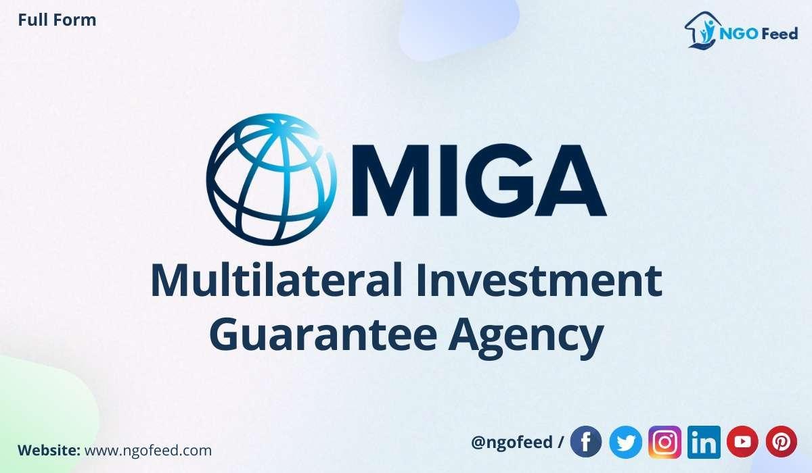

The modern investment landscape is continuously evolving, with emerging markets playing a critical role in shaping global financial dynamics. These markets present unique opportunities and challenges, requiring investors to adopt strategies that balance potential returns with inherent risks. This article examines the intricate relationships between investment guarantees, the Multilateral Investment Guarantee Agency (MIGA), multilateral agencies, and algorithmic trading—each of which is vital for informed and strategic investment decision-making.

Investment guarantees act as a safety net for investors, providing protection against political and economic uncertainties. The Multilateral Investment Guarantee Agency (MIGA), part of the World Bank Group, plays a significant role by offering such guarantees. These assurances are designed to foster confidence and encourage foreign direct investment in nations with volatile political landscapes. Through MIGA's initiatives, investments are safeguarded against risks like expropriation and currency inconvertibility, thus creating a more stable investment environment.



Multilateral agencies, including MIGA, contribute significantly to global financial systems by uniting industrialized and developing nations under common goals of inclusive and sustained growth. These agencies extend financial and technical assistance, which facilitates investments in member countries. Multilateral cooperation is imperative for tackling complex global challenges, ensuring that economic development is both equitable and sustainable.

Simultaneously, algorithmic trading has emerged as a cornerstone of modern investment strategies. This technology leverages sophisticated computer algorithms to automate trading decisions, offering benefits such as increased market liquidity and reduced transaction costs. For investors, algorithmic trading provides a means to efficiently manage risks and optimize trading performance, especially within the dynamic environments of emerging markets.

The intersection of investment guarantees, multilateral agency support, and algorithmic trading represents a synergetic approach to navigating the complexities of global investments. MIGA’s guarantees, when combined with algorithmic trading’s precision and efficiency, present a robust framework for managing risks and enhancing portfolio performance. As investors continue to explore emerging markets, understanding and leveraging these components will be essential for achieving sustainable growth and managing potential risks effectively.

## Table of Contents

## Understanding Investment Guarantees

Investment guarantees serve as essential safeguards for investors, particularly in politically and economically volatile regions. These guarantees are instrumental in mitigating risks related to political instability, enabling investors to engage in foreign direct investment (FDI) with greater confidence. The Multilateral Investment Guarantee Agency (MIGA), a member of the World Bank Group, plays a pivotal role in this context by providing political risk insurance, thereby encouraging and facilitating FDI in developing countries.

MIGA's guarantees cover various forms of political risk, which can typically deter investment in emerging markets. Some of the critical risks covered include expropriation, war and civil disturbance, breach of contract, and currency inconvertibility and transfer restrictions. By offering insurance against these risks, MIGA enhances the attractiveness of investment projects, ensuring that investors can operate in unpredictable environments without the fear of losing their capital due to political actions or instability.

Political risk insurance provided by MIGA is vital for bolstering investor confidence. By mitigating the perceived and actual risks associated with investments in volatile markets, these guarantees promote the inflow of capital necessary for economic development. The presence of investment guarantees can thus act as a catalyst for economic growth by securing foreign investments that might otherwise be deemed too risky.

The types of guarantees MIGA offers are contracted to protect against specific threats. For instance, protection against expropriation guarantees compensation to investors should their investments be nationalized or confiscated without adequate compensation by the host government. Similarly, coverage for currency inconvertibility and transfer restrictions ensures that investors can repatriate funds smoothly, even if the host country's government imposes financial controls that could otherwise block such transfers.

MIGA's initiatives contribute significantly to stabilizing the investment environment by mitigating these risks, promoting sustainable economic growth, and enabling investors to pursue opportunities that align with their strategic goals. By reducing the uncertainties associated with foreign investments, MIGA's political risk insurance helps to create a receptive and secure climate for investments in developing regions, thus fostering broader economic progress and development.

## The Role of MIGA in Global Investment

The Multilateral Investment Guarantee Agency (MIGA) plays a vital role in fostering economic growth in developing countries by attracting foreign investment through its unique offering of political risk insurance. As a member of the World Bank Group, MIGA was established in 1988 to address challenges that deter foreign direct investment (FDI) in less stable regions, aiming to promote confidence and assist in reducing poverty.

Political risk insurance is key to MIGA’s services, providing investors with protection against non-commercial risks, such as expropriation, currency inconvertibility, and political violence. This insurance is crucial for encouraging foreign investors to participate in markets that are otherwise perceived as too risky. By mitigating these risks, MIGA helps improve living standards in host countries through enhanced infrastructure, job creation, and technology transfer, contributing to poverty reduction and stronger local economies.

MIGA's influence extends across the globe, with 182 member states contributing to its comprehensive reach and impact on global financial stability. By facilitating international investments, MIGA supports economic development while fostering cooperation between industrialized and developing nations. This collaboration enlarges the global economic pie, promoting inclusive growth and stability.

Since its inception, MIGA has established a robust portfolio, encompassing a diverse array of projects. Among its notable initiatives is the improvement of Kazakhstan's railway system, exemplifying MIGA’s capacity to enhance critical infrastructure. Such infrastructure developments are essential for boosting economic potential, enabling efficient trade routes, and promoting regional integration, thus demonstrating MIGA's pivotal role in addressing infrastructural challenges in emerging markets.

In summary, MIGA's dedication to providing political risk insurance is not only instrumental in attracting foreign investments but also crucial for driving sustainable economic growth in developing nations, enhancing living standards, and contributing to global financial stability through strategic collaborations and impactful projects.

## Multilateral Agencies and Their Impact

Multilateral agencies, such as the Multilateral Investment Guarantee Agency (MIGA), serve as vital components of the global financial architecture, promoting economic cooperation and stability. These agencies are instrumental in bridging the gap between industrialized and developing nations. By facilitating dialogues and partnerships, they ensure that investments in developing regions are both sustainable and growth-oriented.

These organizations primarily facilitate investment by offering financial and technical assistance to their member countries. Financial assistance often comes in the form of loans, grants, and guarantees which help nations undertake significant economic projects without bearing the entire risk alone. For example, MIGA provides political risk insurance, a form of guarantee that protects investors against losses stemming from political turmoil such as expropriation or currency inconvertibility. Such assurances not only foster investor confidence but also enable member countries to attract much-needed foreign direct investment (FDI).

The significance of multilateral cooperation lies in its ability to address complex global challenges that no single nation can tackle alone. Challenges such as climate change, poverty reduction, and infrastructure development require coordinated actions across borders. Multilateral entities act as platforms for collective action, fostering an environment where countries can collaborate to devise and implement comprehensive solutions to these issues.

Several case studies highlight the success of multilateral agency-backed projects. For instance, MIGA's support for the Kenya Power and Lighting Company (KPLC) involved guarantees that facilitated the enhancement of the nation's electricity transmission capacity. This project significantly improved Kenya's energy infrastructure, contributing to economic development and improved standards of living. Similarly, MIGA's backing of a large-scale solar power project in Egypt helped catalyze the country's transition towards renewable energy sources, showcasing the critical role of such agencies in promoting sustainable development.

In conclusion, multilateral agencies are indispensable in steering global economic growth towards inclusivity and sustainability. By providing robust frameworks for international cooperation, these agencies empower nations to overcome developmental hurdles, undertake transformative projects, and achieve shared prosperity.

## Algorithmic Trading: A Modern Investment Tool

Algorithmic trading is a method of executing trades in financial markets using computer algorithms, which automate the decision-making process. These algorithms determine the timing, price, and quantity of trades, often executing them at speeds and frequencies impossible for human traders. The core advantage of [algorithmic trading](/wiki/algorithmic-trading) lies in its ability to process vast amounts of data far more efficiently than humanly possible, facilitating faster and more precise trading. 

This technology has significantly altered traditional trading practices by minimizing human intervention. By leveraging sophisticated mathematical models and algorithms, traders can optimize their strategies to exploit market inefficiencies effectively. One of the primary benefits of algorithmic trading is the enhancement of market [liquidity](/wiki/liquidity-risk-premium). Automated systems can execute high volumes of trades without significant delays, improving the ease of buying and selling in the market. Consequently, this increased liquidity helps in narrowing bid-ask spreads and contributes to more stable pricing.

Another important advantage is the reduced transaction costs associated with algorithmic trading. By automating trading processes, firms can lower operational costs through decreased manpower and enhanced execution efficiency. The precision of algorithms also reduces slippage and trading errors, contributing to cost savings.

Algorithmic trading is instrumental in managing risks and optimizing performance in financial markets. Strategies like statistical [arbitrage](/wiki/arbitrage), mean reversion, and [momentum](/wiki/momentum) trading are commonly used to predict and capitalize on price movements while minimizing exposure to adverse market risks. For instance, [statistical arbitrage](/wiki/statistical-arbitrage) involves exploiting pricing inefficiencies between related financial instruments, using historical correlations to identify profitable opportunities.

Developing markets, characterized by [volatility](/wiki/volatility-trading-strategies) and unique trading opportunities, present an ideal landscape for employing algorithmic trading. The speed and efficiency of automated systems allow investors to quickly respond to fluctuations, capitalizing on short-lived arbitrage opportunities that arise from market inefficiencies. Furthermore, algorithms can be adapted to comply with specific regulatory environments and market conditions, providing tailored solutions for each emerging market.

In conclusion, algorithmic trading represents a transformative tool in modern finance. It enhances liquidity, reduces costs, and provides sophisticated strategies for risk management and optimization in trading performance. As developing markets continue to evolve, the utilization of algorithmic trading will likely play an integral role in capturing volatility and driving investment success.

## Synergies Between MIGA and Algorithmic Trading

The integration of MIGA’s investment guarantees with algorithmic trading strategies presents a unique opportunity for enhancing portfolio performance, particularly in emerging markets. MIGA, the Multilateral Investment Guarantee Agency, offers political risk insurance that acts as a safety net, reducing the exposure to geopolitical risks. This risk mitigation is crucial in the dynamic environments where high-frequency trading ([HFT](/wiki/high-frequency-trading-strategies)) operates, ensuring that investments remain secure against unpredictable events such as expropriation and currency inconvertibility.

Algorithmic trading, characterized by the use of complex algorithms to execute orders at optimal times and prices, inherently relies on data-driven decision-making and speed. This form of trading can greatly benefit from the stability provided by MIGA's guarantees, as it allows algorithms to function optimally without the overhanging concern of geopolitical disruptions. This is particularly relevant in emerging markets, where MIGA is actively involved, as these markets often present higher risks but also significant opportunities for profit due to their volatility and growth potential.

By combining MIGA’s guarantees with algorithmic trading, investors can create a more balanced investment strategy. The role of MIGA’s insurance is to cushion against adverse political events, while algorithms can help manage and capitalize on market volatility. This synergy allows for a risk-adjusted investment approach that optimizes returns without sacrificing safety. For example, a Python-based trading strategy could incorporate MIGA’s risk metrics as part of its algorithm to automatically adjust the trading model in response to changes in political stability indicators.

```python
import numpy as np

def adjust_strategy(risk_factor, market_data):
    # Simulate adjusting trading strategy based on risk factor
    # Higher risk_factor decreases the position sizes to manage risk
    position_size = (1 - risk_factor) * market_data['liquidity'] * market_data['volatility']
    return np.clip(position_size, 0, 1)  # Ensure position size is between 0 and 1

# Example market data and a hypothetical risk factor from MIGA's assessment
market_data = {'liquidity': 0.8, 'volatility': 0.5}
risk_factor = 0.2  # 20% risk from political factors

adjusted_position = adjust_strategy(risk_factor, market_data)
print("Adjusted Position Size:", adjusted_position)
```

Moreover, the use of automated trading platforms that integrate MIGA's offerings enables a seamless experience for traders who can incorporate geopolitical risk assessments into their trading strategies. By using APIs that deliver real-time risk assessments from MIGA, these platforms can dynamically adjust trading algorithms to optimize trades in response to shifts in global market conditions. This tech-driven approach promotes a sophisticated investment strategy that balances risk and return effectively, exploiting the benefits of both MIGA’s risk mitigation and the precision of algorithmic trading.

## Conclusion

Investment in developing countries often presents a landscape filled with both opportunities and challenges. With the right strategies, tools, and support mechanisms, these investments can yield high rewards. MIGA's commitment to providing investment guarantees is essential for mitigating geopolitical risks that often accompany investments in less stable regions. By offering political risk insurance, MIGA enhances the confidence of investors, shielding them from potential adversities such as expropriation, currency inconvertibility, and civil disturbances. This assurance serves as a foundation upon which robust investment decisions can be made.

Simultaneously, algorithmic trading plays a pivotal role in navigating the complexities of modern financial markets. By employing sophisticated algorithms, investors gain the ability to execute trades at unprecedented speeds and efficiencies. This technology is particularly advantageous in volatile markets, where rapid decision-making is crucial. Algorithmic trading not only enhances market liquidity but also reduces transaction costs, making it an indispensable tool for contemporary investors.

The intersection of MIGA's guarantees and algorithmic trading represents a paradigm shift in global investing. By integrating these components, investors can adopt a more informed and balanced approach, optimizing both risk management and returns. Leveraging MIGA's offerings provides a safety net, while algorithmic trading delivers precision and agility in market operations.

Embracing the future of investing necessitates a harmonious blend of multilateral agency support and cutting-edge trading technologies. As the global financial landscape continues to evolve, investors equipped with these advanced tools are better positioned to capitalize on emerging market potentials. By understanding and utilizing these synergies, stakeholders can drive more strategic and informed investment decisions, fostering sustainable growth in developing economies.

## References & Further Reading

[1]: World Bank Group. (n.d.). [Multilateral Investment Guarantee Agency (MIGA).](https://www.miga.org/) 

[2]: Schulze, G. G., & Ursprung, H. W. (Eds.). (2001). ["International Environmental Economics: A Survey."](https://www.jstor.org/stable/41795078) Oxford University Press.

[3]: Gerding, E. F., Rogers, A., & Jennings, N. R. (n.d.). ["Trading Agents."](https://econcs.seas.harvard.edu/files/econcs/files/robu_amma2011.pdf) Encyclopedia of Complexity and Systems Science.

[4]: Sartzetakis, E. S., and I'ves, W. (2019). ["The Influence of Multilateral Environmental Agreements on FDI Inflows to Signatory Countries."](https://www.researchgate.net/publication/386446175_Green_bonds_and_the_Sustainable_Development_Index_in_Asian_countries_Panel_data_evidence) Sustainable Development.

[5]: Narang, R. (2009). ["Inside the Black Box: The Simple Truth About Quantitative Trading."](https://onlinelibrary.wiley.com/doi/book/10.1002/9781118267738) Wiley Trading.