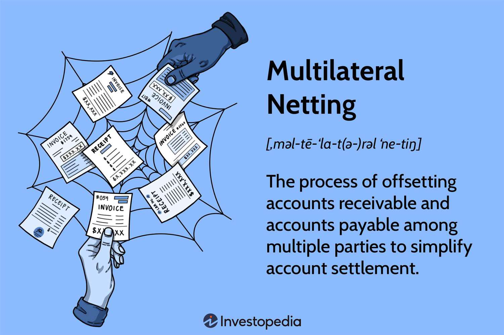

## Table of Contents

## What is multilateral netting?

Multilateral netting is a way for companies to simplify their financial transactions with multiple parties. Instead of making many separate payments, they combine all the amounts they owe and are owed into one single payment. This makes it easier to manage money and reduces the number of transactions.

For example, if Company A owes money to Company B and Company C, and Company B also owes money to Company C, they can use multilateral netting to figure out the net amount each company needs to pay. This method saves time and money by cutting down on bank fees and reducing the risk of errors in payments. It's often used in industries like banking and international trade where there are many transactions happening between different parties.

## How does multilateral netting differ from bilateral netting?

Multilateral netting involves more than two parties coming together to settle their financial obligations. Imagine a group of friends who all owe each other different amounts of money. Instead of each friend paying every other friend separately, they sit down and figure out who owes what to whom in total. They then make just a few payments to settle everything. This is helpful for businesses that deal with many partners, as it reduces the number of transactions and makes managing money easier.

Bilateral netting, on the other hand, is simpler because it only involves two parties. If you and your friend owe each other money, you can net out what you owe against what your friend owes you, and only one of you needs to pay the difference. This method is straightforward and commonly used in financial markets where two parties have multiple transactions between them. While bilateral netting is easier to manage with just two parties, multilateral netting becomes more beneficial as the number of parties increases.

## What are the basic steps involved in the multilateral netting process?

The first step in multilateral netting is for all the companies involved to gather information about all the transactions they have with each other. This means they need to know who owes what to whom. Once they have all this information, they put it into a system that can handle the netting process. This system looks at all the amounts and figures out the net position of each company.

Next, the system calculates the final amounts that each company needs to pay or receive. It does this by adding up all the money each company owes and subtracting all the money it is owed. This way, the system can tell each company the one single payment they need to make or receive. After the calculations are done, the companies make the necessary payments, and the whole process is complete. This makes it much simpler and cheaper than making many separate payments.

## Can you explain the role of a netting center in multilateral netting?

A netting center is like a big calculator for companies that use multilateral netting. It helps them figure out who owes what to whom and then works out the final amounts that each company needs to pay or receive. The netting center collects all the information about the transactions between the companies and puts it into a system that can do the math. This system looks at all the money each company owes and subtracts all the money it is owed, coming up with a net position for each company.

Once the netting center has done all the calculations, it tells each company the one single payment they need to make or receive. This makes it much easier for the companies because they don't have to make lots of separate payments. The netting center helps save time and money by reducing the number of transactions and making sure everything is settled correctly. It's like having a helpful friend who does all the math for you and makes sure everyone pays what they owe.

## What are the benefits of using multilateral netting for businesses?

Using multilateral netting helps businesses save money and time. Instead of making many separate payments to different companies, a business can figure out the total amount it needs to pay or receive. This cuts down on bank fees because there are fewer transactions. It also reduces the risk of mistakes, like sending money to the wrong place or paying the wrong amount. By using multilateral netting, businesses can keep their money management simple and efficient.

Another big benefit is that it makes it easier to handle money with lots of different partners. Imagine a business that buys and sells things from many other companies. Instead of keeping track of all those payments separately, multilateral netting lets them combine everything into one easy payment. This is especially helpful for big companies or those that work in industries like banking or international trade, where they deal with many transactions every day. It helps them keep their finances organized and reduces the work needed to manage all those payments.

## What industries commonly use multilateral netting and why?

Multilateral netting is often used in the banking and financial services industry. Banks and financial institutions have many transactions with each other every day. Instead of making lots of separate payments, they use multilateral netting to combine all these transactions into one payment. This saves them time and money because they don't have to pay as many bank fees, and it's easier to keep track of everything. It's like having a big calculator that helps them figure out who owes what to whom and then settle it all at once.

Another industry that uses multilateral netting a lot is international trade. Companies that buy and sell things across different countries have to deal with many different partners. Multilateral netting helps them simplify their payments by figuring out the total amount they need to pay or receive. This is very helpful because it reduces the risk of making mistakes with payments in different currencies and makes it easier to manage their money across borders. It's like having a helpful tool that makes international business smoother and less complicated.

## How does multilateral netting affect cash flow management?

Multilateral netting helps businesses manage their cash flow better. Instead of making lots of separate payments, a business can use multilateral netting to combine all the money it owes and is owed into one payment. This means they don't have to keep as much money on hand to cover all those separate payments, which helps them use their cash more efficiently. It's like having a big piggy bank where you can put in and take out money in one go, instead of juggling many small transactions.

By reducing the number of transactions, multilateral netting also cuts down on bank fees and the risk of making mistakes with payments. This saves money that businesses can use for other things, like growing their company or investing in new projects. It's like having a helper that makes sure you're spending your money wisely and not losing any to unnecessary fees or errors. Overall, multilateral netting makes cash flow management simpler and more effective for businesses.

## What are the potential risks and challenges associated with multilateral netting?

One challenge with multilateral netting is that it can be hard to set up and manage. It needs a good system to keep track of all the transactions between different companies. If the system makes a mistake, it could lead to wrong payments or disagreements between the companies. Also, all the companies need to agree on how to do the netting, which can take time and effort. It's like trying to organize a big group project where everyone has to follow the same rules.

Another risk is that if one company in the netting group can't pay what they owe, it can cause problems for everyone else. This is called counterparty risk. If one company goes bankrupt or has money troubles, it might not be able to make its payment, which can mess up the whole netting process. It's like playing a game where one player not following the rules can ruin it for everyone. Businesses need to be careful and make sure they trust the other companies they are netting with.

## How is technology used to facilitate multilateral netting?

Technology plays a big role in making multilateral netting easier for businesses. Special software and systems are used to gather all the information about the transactions between different companies. This software can quickly add up all the money each company owes and subtract all the money it is owed, figuring out the net position for everyone. It's like having a super smart calculator that does all the math for you, making sure everything is correct and no mistakes are made.

These technology systems also help by automating the whole process. Instead of people having to manually figure out who owes what to whom, the system does it all automatically. This saves a lot of time and reduces the chance of errors. Plus, these systems can handle transactions in different currencies, which is very helpful for companies that do business all over the world. It's like having a helpful tool that makes managing money across borders much simpler and less complicated.

## What legal and regulatory considerations must be taken into account when implementing multilateral netting?

When businesses want to use multilateral netting, they need to think about the laws and rules that apply. Different countries have different rules about how companies can net their payments. For example, some places might need special agreements or contracts between the companies involved. It's important for businesses to check these rules to make sure they are following the law. If they don't, they could get into trouble or face fines. It's like making sure you know the rules of a game before you start playing, so you don't get disqualified.

Another thing to consider is how netting affects taxes and accounting. Some countries have specific rules about how to report netted transactions on financial statements. Companies need to make sure they are doing their taxes and accounting correctly, or they might have to pay extra taxes or face penalties. It's also important to have clear agreements with all the companies involved in the netting process. These agreements should spell out who is responsible for what and how disputes will be handled. It's like having a clear set of instructions that everyone agrees to follow, so there are no surprises later on.

## Can you discuss a real-world example of multilateral netting in action?

Imagine a big company called GlobalTrade that buys and sells things all over the world. They work with many other companies in different countries. Instead of making lots of separate payments to each company, GlobalTrade uses multilateral netting to make things easier. They gather all the information about what they owe and what they are owed from all their partners. Then, they use a special system to figure out the total amount they need to pay or receive. This way, GlobalTrade only has to make a few big payments instead of many small ones, which saves them time and money.

For example, GlobalTrade might owe money to Company A in the United States, Company B in Japan, and Company C in Germany. At the same time, Company A might owe money to Company B, and Company B might owe money to Company C. Instead of each company paying the others separately, they all use multilateral netting to settle their payments. The system calculates that GlobalTrade needs to pay Company B a certain amount, and Company A needs to pay GlobalTrade another amount. By doing this, they reduce the number of transactions and make sure everyone gets paid correctly. It's like a big group of friends figuring out who owes what to whom and then settling it all at once.

## What advanced strategies can be employed to optimize the efficiency of multilateral netting systems?

To make multilateral netting even better, companies can use something called real-time netting. This means they update their netting calculations all the time, instead of waiting until the end of the day or week. By doing this, they can see who owes what to whom right away and make payments faster. This helps them use their money more efficiently because they don't have to keep as much cash on hand. It's like checking your piggy bank every few minutes to see if you can spend some of the money you've saved up.

Another strategy is to use smart algorithms and [artificial intelligence](/wiki/ai-artificial-intelligence) in their netting systems. These tools can look at past transactions and predict future ones, helping companies plan their payments better. They can also find patterns and suggest ways to save money, like grouping certain payments together or choosing the best times to make payments. By using these smart tools, companies can make their netting process smoother and more efficient. It's like having a clever friend who helps you figure out the best way to manage your money.

## References & Further Reading

[1]: Dwyer, G. P. (2006). ["The Economics of Bitcoin and Similar Private Digital Currencies."](https://www.sciencedirect.com/science/article/pii/S1572308914001259)

[2]: Gregory, J. (2014). ["Central Counterparties: Mandatory clearing and bilateral margin requirements for OTC derivatives."](https://www.wiley.com/en-us/Central+Counterparties%3A+Mandatory+Central+Clearing+and+Initial+Margin+Requirements+for+OTC+Derivatives-p-9781118891513) John Wiley & Sons.

[3]: Bank for International Settlements. (2011). ["Basel III: A global regulatory framework for more resilient banks and banking systems."](https://www.bis.org/publ/bcbs189.htm)

[4]: Dodd-Frank Wall Street Reform and Consumer Protection Act. (2010). ["Public Law 111-203."](https://www.congress.gov/bill/111th-congress/house-bill/4173/text)

[5]: Hasbrouck, J. (2006). ["Empirical Market Microstructure."](https://academic.oup.com/book/52241) Oxford University Press.

[6]: Pinedo, M., & Parzen, E. (2016). ["Derivatives Markets and Analysis."](https://doc.lagout.org/science/0_Computer%20Science/2_Algorithms/Scheduling_%20Theory%2C%20Algorithms%2C%20and%20Systems%20%285th%20ed.%29%20%5BPinedo%202016-02-11%5D.pdf) Oxford University Press.

[7]: Philips, P. (2018). ["Algorithmic and High-Frequency Trading."](https://assets.cambridge.org/97811070/91146/frontmatter/9781107091146_frontmatter.pdf) Springer.

[8]: Capgemini & RBC Wealth Management. (2014). ["World Wealth Report 2014."](https://kritisches-netzwerk.de/sites/default/files/world_wealth_report_2014_-_capgemini_and_rbc_wealth_management_-_52_pages.pdf)

[9]: Armstrong, J., & Gach, H. (2005). ["Multilateral Netting: An Overview."](https://www.semanticscholar.org/paper/Demand-Forecasting%3A-Evidence-Based-Methods-Green-Armstrong/0abb51e8923bd8c546794007475e21d4ec02106b)

[10]: Treleaven, P., Galas, M., & Lalchand, V. (2013). ["Algorithmic Trading and High-Frequency Trading."](https://dl.acm.org/doi/10.1145/2500117) 

