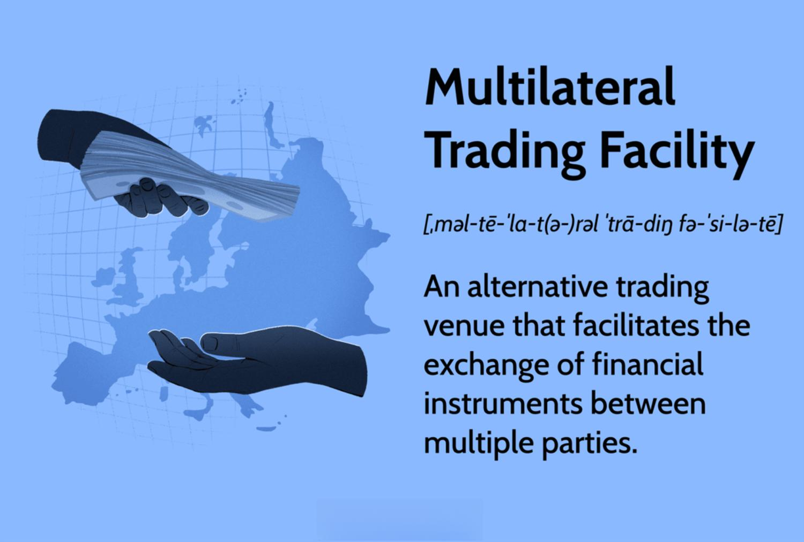

The financial markets have undergone significant transformation over the years, providing traders with a multitude of opportunities across diverse platforms. With the advent of advanced technology and the globalization of financial markets, new trading modalities have emerged, presenting both opportunities and challenges to market participants. This article examines the interplay between financial markets trading facilities, multilateral trading, and algorithmic trading, highlighting how these elements collaborate to enhance trading efficiency and accessibility.

Financial markets trading facilities are essential components of the trading ecosystem, offering the infrastructure and platforms necessary for executing trades across various asset classes, including equities, foreign exchange, and commodities. These facilities range from traditional exchanges to innovative digital platforms, each characterized by unique operational models and features. Their critical role in supporting market activities is evident through their promotion of liquidity and transparency, which are vital for efficient market functioning.



Multilateral Trading Facilities (MTFs) provide an alternative to conventional stock exchanges, typically offering more flexible and versatile operational structures. They have redefined market access by enabling the trading of assets that may not be available on established exchanges, such as specific derivatives and over-the-counter products. MTFs and their international counterparts, like Alternative Trading Systems (ATS) in the United States, have been instrumental in fostering competition, reducing trading costs, and enhancing market transparency.

Furthermore, the introduction of algorithmic trading has revolutionized the financial trading landscape by leveraging complex algorithms to automate trade execution. This technological advancement offers significant efficiency and speed, facilitating high-frequency trading and the implementation of intricate trading strategies. Algorithmic trading has transformed trading volume dynamics and price discovery processes, underscoring its impact on modern finance.

This article will evaluate the benefits and risks associated with multilateral and algorithmic trading, providing comprehensive insights into their implications for traders. By understanding these components, both novice and seasoned traders can optimize their strategies in the ever-evolving world of financial trading.

## Table of Contents

## Understanding Financial Markets Trading Facilities

Financial trading facilities are crucial to the functioning of modern financial markets, serving as the foundation for executing trades across various asset classes such as stocks, foreign exchange ([forex](/wiki/forex-system)), commodities, and other derivatives. These facilities have evolved from traditional physical exchanges to sophisticated digital platforms, each characterized by distinct features and operational models that cater to specific trading needs and preferences.

Traditional exchanges, like the New York Stock Exchange (NYSE) and the London Stock Exchange (LSE), are centralized venues where buyers and sellers meet to execute trades under a structured and regulated environment. These exchanges play a significant role in ensuring market [liquidity](/wiki/liquidity-risk-premium) and transparency by providing continuous pricing information and maintaining an [order book](/wiki/order-book-trading-strategies) that captures the interests of market participants. The organized nature of these exchanges offers a sense of security to investors, as trades are often monitored and settled through trusted clearinghouses.

In contrast, modern digital platforms, such as electronic communication networks (ECNs) and over-the-counter (OTC) marketplaces, offer a more flexible and decentralized approach to trading. ECNs facilitate electronic trading by matching buy and sell orders, allowing transactions to occur outside traditional exchange hours and enabling access to global markets. OTC marketplaces, on the other hand, enable trades directly between parties without the need for a centralized exchange, making them ideal for trading instruments that might not be standardized enough for exchange listing, such as certain derivatives and customized financial products.

One of the key innovations in trading facilities is Direct Market Access (DMA), which provides traders with improved access to real-time market data and execution capabilities. DMA allows traders to interact directly with the order book of an exchange, bypassing intermediaries such as brokers. This access not only accelerates the trade execution process but also empowers traders with more control over their trades, enhancing their ability to capitalize on short-term opportunities and implement complex trading strategies. Moreover, DMA often results in lower transaction costs as it removes the need for broker intervention.

The infrastructure provided by these trading facilities supports market activities by promoting liquidity, reducing market friction, and ensuring transparency. Liquidity is enhanced by the sheer [volume](/wiki/volume-trading-strategy) and variety of participants that these platforms attract, creating a dynamic environment where assets can be quickly bought and sold. Transparency is achieved through the continuous dissemination of market information, such as pricing data and trade volumes, which helps in market efficiency and aids participants in making informed decisions.

In summary, financial markets trading facilities, ranging from traditional exchanges to cutting-edge digital platforms, play a vital role in the execution and facilitation of trades across multiple asset classes. Their evolution towards offering advanced services like Direct Market Access underscores the importance of these facilities in adapting to modern trading needs, thereby supporting robust and transparent market activities.

## Multilateral Trading: Redefining Market Access

Multilateral Trading Facilities (MTFs) have emerged as a vital component of the financial markets, offering an alternative to traditional stock exchanges. Their flexible operational structures distinguish them and provide access to trading various asset classes, including certain derivatives and over-the-counter (OTC) products that might not be available on typical exchanges.

### Functioning of MTFs

MTFs operate by matching the buy and sell orders of financial instruments from multiple parties, akin to exchanges, but generally with more flexibility in terms of the types of securities traded. They leverage advanced electronic trading platforms that use cutting-edge technology to efficiently pair orders. This functionality results in improved access for a diverse range of trading participants, from institutional investors to retail traders.

### Regulatory Environment

Regulatory frameworks play a crucial role in the functioning of MTFs. In the European Union, the Markets in Financial Instruments Directive II (MiFID II) governs MTF operations. MiFID II emphasizes transparency and investor protection, ensuring that MTFs are subject to stringent reporting and operational requirements designed to promote fair trading environments.

In the United States, a similar role is carried out by Alternative Trading Systems (ATS), which are regulated by the Securities and Exchange Commission (SEC). ATS are framed to serve niche markets and can provide quotations for securities not listed on national exchanges. Their flexibility allows for trading in varied asset categories, thus expanding market access.

### Benefits of MTFs

1. **Increased Competition**: MTFs introduce additional participants into the financial market ecosystem, which stimulates competition among trading venues. This competition often leads to better pricing of securities and more choices for investors.

2. **Reduced Trading Costs**: Operational efficiencies and the use of advanced technology allow MTFs to offer lower transaction costs compared to traditional exchanges. Lower fees attract more traders and contribute to higher trading volumes.

3. **Enhanced Market Transparency**: Through robust regulatory oversight, MTFs are required to provide transparency in their trading activities. This transparency facilitates better price discovery and confidence in the financial markets. Investors can make more informed trading decisions, thus enhancing market integrity.

In conclusion, MTFs play a critical role in contemporary financial markets by expanding trading possibilities beyond the confines of traditional exchanges. They offer numerous advantages, including increased market competition, cost efficiency, and enhanced transparency, which collectively redefine market access and democratize trading opportunities for a wider range of participants. As regulatory frameworks continue to evolve, MTFs are likely to expand their influence within the global trading landscape.

## Algorithmic Trading: The Technological Revolution

Algorithmic trading has revolutionized financial markets by automating trade execution using advanced algorithms. This technological evolution has introduced remarkable efficiency and speed to trading operations. By employing pre-programmed instructions, [algorithmic trading](/wiki/algorithmic-trading) systems can execute orders to buy or sell financial instruments at predetermined times and prices, often considering a multitude of market variables. This systematized approach allows traders to capitalize on market conditions at speeds human traders simply cannot match.

At the core of algorithmic trading lies the ability to execute high-frequency trading ([HFT](/wiki/high-frequency-trading-strategies)), where thousands of orders can be placed within milliseconds. This rapid execution has been made possible by advances in computing power and connectivity, allowing traders to take advantage of small price imbalances across markets. HFT strategies often include [market making](/wiki/market-making), [arbitrage](/wiki/arbitrage), and [statistical arbitrage](/wiki/statistical-arbitrage). For example, in arbitrage, the algorithm detects and exploits price disparities of the same asset across different markets, bridging the gap almost instantaneously to lock in profits.

Algorithmic trading also supports more complex strategies, such as trend-following and mean reversion. Trend-following strategies, for instance, aim to capitalize on the continuation of existing market trends. The algorithms analyze historical data to forecast future price movements, adjusting their trading actions accordingly. On the other hand, mean-reversion strategies identify securities trading outside their normal range, expecting prices to revert to their mean. The algorithm anticipates the reversal and takes positions to benefit from this reversion.

The impact of algorithmic trading on trading volume is profound. It contributes significantly to market liquidity, allowing for tighter spreads and deeper markets. However, this increased activity can also lead to excessive market [volatility](/wiki/volatility-trading-strategies), as demonstrated during events like the 2010 Flash Crash. During such events, erroneous data inputs or misconfigured algorithms can cause rapid market movements, underscoring the need for robust risk management practices and regulatory oversight.

Regulatory bodies worldwide have established frameworks to govern algorithmic trading. In the European Union, the Markets in Financial Instruments Directive II (MiFID II) imposes strict rules for algorithmic trading, mandating systems to include pre-trade risk controls and ensuring they do not amplify systemic risk. Similarly, in the United States, the Securities and Exchange Commission (SEC) and the Commodity Futures Trading Commission (CFTC) have formulated guidelines requiring sufficient safeguards against market manipulation and systemic disruptions.

Despite the benefits, algorithmic trading introduces challenges related to market fairness and stability. The dependency on sophisticated technology can lead to unequal access, favoring those with advanced infrastructure and algorithms over retail investors. Moreover, the intricacy of these systems requires continuous monitoring and adjustment to adapt to changing market conditions.

In conclusion, algorithmic trading is a testament to the technological transformations within financial markets, presenting both opportunities and complexities. It requires continuous innovation and regulation to ensure it contributes positively to market efficiency, liquidity, and integrity. As technology advances, the continuous evolution of algorithms will play a critical role in shaping the next generation of financial trading practices.

## Benefits and Risks of Multilateral and Algo Trading

Multilateral and algorithmic trading methods have significantly reshaped the financial markets, offering substantial advantages but also posing certain risks.

**Advantages of Multilateral and Algorithmic Trading**

One of the primary benefits is increased liquidity. With more participants and automated systems engaged in trading, assets can be bought and sold more readily, reducing the bid-ask spread and lowering transaction costs. This ease of trading helps in price discovery and enhances market depth. Additionally, transparency is another critical advantage, particularly in multilateral trading facilities (MTFs). These platforms offer more visible and accessible trading processes compared to traditional over-the-counter (OTC) trades, resulting in fairer pricing for all participants.

Algorithmic trading aids in executing trades at swift speeds that human traders are incapable of achieving. This speed facilitates high-frequency trading (HFT), where positions can be opened and closed in milliseconds, capturing profits from minute price discrepancies. For example:

```python
# Python example for calculating simple moving average (SMA)
prices = [100, 102, 101, 105, 107] # hypothetical price data
window_size = 3

def calculate_sma(prices, window_size):
    return [sum(prices[i:i+window_size]) / window_size for i in range(len(prices) - window_size + 1)]

sma = calculate_sma(prices, window_size)
print(sma)  # Outputs: [101.0, 102.66666666666667, 104.33333333333333]
```

**Risks and Challenges**

Despite these advantages, there are inherent risks. Multilateral trading can lead to market fragmentation, meaning the liquidity is spread across various platforms rather than being concentrated, which could potentially harm price discovery. Technological dependencies, a trait of algorithmic trading, can lead to substantial systemic risks. Failures or errors in the algorithms (e.g., the infamous Flash Crash of 2010) can create severe market disruptions.

Increased volatility is another concern, largely attributed to HFTs and their rapid execution based on market signals that traditional trading doesn't capture. This may result in unstable markets, primarily when automated trades amplify trends rather than mitigate them.

**Regulatory Measures and Risk Management**

Given these risks, stringent regulations are imperative. Regulatory frameworks like the European Union's MiFID II and similar policies in other jurisdictions aim to impose transparency and prevent market manipulation. Oversight mechanisms can deter fraud and ensure stability, protecting investors and maintaining market integrity.

To manage risks, traders can employ diversified strategies and robust risk management protocols. The implementation of circuit breakers can mitigate the harm caused by rapid price fluctuations. Moreover, institutional and individual investors need a thorough understanding of algorithmic models to prevent reliance on black-box systems that lack transparency.

In summary, while multilateral and algorithmic trading offer distinct advantages in modern financial markets, they require careful management and regulation to ensure continued stability and fairness.

## Conclusion

Multilateral trading facilities (MTFs) and algorithmic trading are transforming the financial markets by providing new opportunities and challenges. These innovations are not just expanding the scope of market operations but also reshaping traditional trading practices. Understanding the dynamics of these trading modalities is crucial for traders and investors, as it equips them with the insights necessary to optimize their strategies. 

The integration of MTFs into the financial ecosystem has introduced competitive benefits such as enhanced liquidity, reduced trading costs, and increased transparency. However, these advantages come alongside challenges, including regulatory complexities and potential market fragmentation. On the other hand, algorithmic trading has revolutionized trade execution through increased speed and efficiency. Yet, it also brings risks related to algorithm errors and regulatory concerns.

As technology advances, the complexity of financial trading systems will continue to increase. This evolution necessitates informed decision-making and effective risk management. Traders and investors must adapt to these changes by acquiring a deeper understanding of technological tools and market regulations.

By grasping the intricacies of MTFs and algorithmic trading systems, market participants can devise robust strategies and better position themselves in the rapidly changing financial environment. The ability to analyze and respond to market dynamics will be a significant asset in harnessing the full potential of these trading innovations, ensuring competitive advantages and sustainable success.

## References & Further Reading

[1]: "Algorithmic Trading and DMA: An introduction to direct access trading strategies" by Barry Johnson

[2]: "MiFID II: Markets in Financial Instruments Directive II" - European Securities and Markets Authority (ESMA) Overview Document

[3]: "Flash Crash: Lessons Learned" - Commodity Futures Trading Commission and Securities and Exchange Commission, Joint Report on the 2010 Flash Crash

[4]: "In Pursuit of the Perfect Portfolio: The Stories, Voices, and Key Insights of the Pioneers Who Shaped the Way We Invest" by Andrew W. Lo and Stephen R. Foerster

[5]: "Trading and Exchanges: Market Microstructure for Practitioners" by Larry Harris