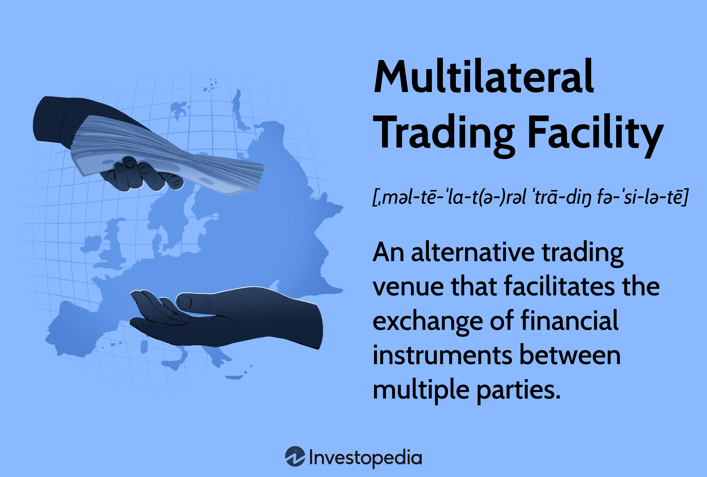

The financial world is constantly evolving, and among its recent innovations is the Multilateral Trading Facility (MTF). MTFs represent a significant advancement in the trading landscape, offering investors a modernized platform for the exchange of financial instruments. These facilities serve as an alternative to traditional trading venues, providing increased flexibility and a broader range of trading opportunities. MTFs have emerged as a key component in the financial ecosystem, meeting the needs of investors seeking diverse options beyond conventional exchanges.

This article aims to provide a comprehensive understanding of MTFs, highlighting their differences from traditional trading venues and examining the integral role of algorithmic trading within these platforms. As the financial markets continue to diversify, MTFs offer notable advantages including enhanced liquidity, faster transaction speeds, and lower operational costs.



Understanding MTFs is essential for investors who are keen to leverage alternative trading platforms and maximize their returns in an increasingly competitive market environment. By exploring MTFs, investors can gain insights into new trading dynamics, positioning themselves strategically for future opportunities in the financial sector.

## Table of Contents

## What is a Multilateral Trading Facility (MTF)?

A Multilateral Trading Facility (MTF) is a secondary trading venue that provides an alternative to traditional exchanges for the buying and selling of financial instruments. Established as part of the financial markets directive in Europe, MTFs are integral components under the Markets in Financial Instruments Directive II (MiFID II), designed to enhance competition and innovation within the financial sector. Unlike traditional exchanges, which are often subject to stringent regulatory standards, MTFs offer a more flexible framework for various trading activities.

MTFs facilitate the exchange of financial instruments between multiple parties, typically through a fully electronic trading platform. Unlike traditional stock exchanges, which may involve longer processing times and higher transaction fees, MTFs offer competitive advantages by providing more efficient and cost-effective trading solutions. These platforms accommodate a broad range of financial products, including stocks, bonds, derivatives, and especially exotic and over-the-counter (OTC) products, broadening investment opportunities for traders and institutional participants alike.

The operation of MTFs is commonly undertaken by investment banks, brokerage firms, or specialized market operators. These entities manage and regulate the trading processes, adhering to MiFID II standards, which emphasize transparency, investor protection, and market efficiency. The MiFID II framework requires MTFs to have clear guidelines and rules regarding pricing, ensuring that all participants are informed about the trading mechanisms and costs associated with them. This regulatory structure enhances the attractiveness of MTFs by providing reliable and transparent trading environments.

In the United States, platforms analogous to MTFs are referred to as Alternative Trading Systems (ATS). While these systems share similarities in fostering alternative trading avenues, each operates under distinct regulatory regimes that reflect the financial legislative environment of their respective regions. MTFs and ATSs both seek to introduce greater [liquidity](/wiki/liquidity-risk-premium), innovative trading models, and competitive pricing by reducing the monopolistic characteristics traditionally associated with primary exchanges.

The emergence of MTFs represents a significant shift in the trading landscape, providing market participants with diversified access and new strategies for engaging with financial markets. These facilities contribute to the evolving dynamic of global trading infrastructures, influencing traditional modes of operation and introducing more versatile options for investors seeking to expand their portfolios beyond conventional exchanges.

## How MTFs Work

Multilateral Trading Facilities (MTFs) function as pivotal electronic platforms in the modern financial ecosystem, enabling the trading of various financial instruments through sophisticated electronic systems. These platforms are predicated on the submission and matching of orders via advanced algorithms, ensuring efficient and streamlined trading processes. 

Orders on MTFs are typically executed through a continuous auction process or a quote-driven system. The use of algorithms allows these systems to process vast amounts of data at high speeds, significantly enhancing transaction capabilities. Consequently, MTFs provide faster transaction speeds and reduced trading costs compared to traditional exchanges, which often involve more manual trading processes.

The integration of such technology has catalyzed increased fragmentation in financial markets. Fragmentation refers to the [dispersion](/wiki/dispersion-trading) of trading across multiple platforms, which can lead to liquidity being split among different venues. As a response to this phenomenon, brokers have developed smart order routing strategies. These strategies are algorithm-driven and aim to find the best possible prices for trades across various trading venues. Smart order routers evaluate multiple factors—price, speed of execution, and trading costs—ensuring that transactions are executed in the most efficient manner possible.

Python, due to its extensive libraries and ease of use, is often employed to develop these algorithms. A simple example of an order matching algorithm in Python might look like this:

```python
def match_orders(buy_orders, sell_orders):
    matched_trades = []
    buy_orders.sort(key=lambda x: x['price'], reverse=True)
    sell_orders.sort(key=lambda x: x['price'])

    while buy_orders and sell_orders:
        buy_order = buy_orders[0]
        sell_order = sell_orders[0]

        if buy_order['price'] >= sell_order['price']:
            trade_price = (buy_order['price'] + sell_order['price']) / 2
            trade_volume = min(buy_order['volume'], sell_order['volume'])

            matched_trades.append({
                'buy_order': buy_order['id'],
                'sell_order': sell_order['id'],
                'price': trade_price,
                'volume': trade_volume
            })

            buy_order['volume'] -= trade_volume
            sell_order['volume'] -= trade_volume

            if buy_order['volume'] == 0:
                buy_orders.pop(0)
            if sell_order['volume'] == 0:
                sell_orders.pop(0)
        else:
            break

    return matched_trades

# Example usage:
buy_orders = [{'id': 1, 'price': 10.5, 'volume': 50}, ...]
sell_orders = [{'id': 2, 'price': 10.3, 'volume': 70}, ...]

matches = match_orders(buy_orders, sell_orders)
```

This code snippet exemplifies the simplicity and power of using high-level programming for trading algorithms, which are crucial for the operation of MTFs. By efficiently matching buy and sell orders, such algorithms help maintain the liquidity and competitive pricing that MTFs are known for, thereby enhancing their attractiveness as an alternative to traditional trading venues.

## Benefits of MTFs

Multilateral Trading Facilities (MTFs) offer several significant benefits that enhance the trading experience for investors and market participants. A key advantage is the provision of enhanced liquidity, which is critical for efficient market operations. By aggregating orders from various participants, MTFs facilitate more trading opportunities, effectively increasing the pool of available liquidity. This increased liquidity often results in tighter bid-ask spreads, which are beneficial for traders as they can execute trades closer to the current market price, reducing transaction costs.

Another important advantage of MTFs is improved price discovery. MTFs typically provide a transparent environment for trade execution, allowing market participants to access real-time information about buy and sell orders. This transparency helps in establishing a more accurate market price for financial instruments. The presence of standardized and clear operating rules ensures that all trades are conducted openly, fostering a competitive marketplace where the true value of assets can be swiftly determined.

Moreover, MTFs are structured to operate without conflicts of interest. Unlike some traditional exchanges or trading venues, MTFs usually charge commission-based fees rather than participating as market makers. This means that MTFs act solely as facilitators of trades rather than stakeholders with interests in the trading outcomes. This structure minimizes the risk of biased decisions that could disadvantage certain market participants in favor of others.

In conclusion, the advantages offered by MTFs, such as enhanced liquidity, reduced transaction costs through lower bid-ask spreads, improved price discovery due to transparency, and the absence of conflicts of interest, highlight their pivotal role in modern financial markets. These benefits make MTFs an attractive option for investors seeking efficient and fair trading venues.

## MTFs vs Traditional Exchanges

Multilateral Trading Facilities (MTFs) and traditional exchanges are both integral components of the financial trading ecosystem, yet they exhibit fundamental differences in structure, regulation, and operation. One of the primary distinctions lies in their regulatory frameworks. MTFs are typically less regulated than traditional exchanges, allowing them to offer a more extensive variety of financial instruments, including many exotic and over-the-counter (OTC) products. This flexibility appeals to investors seeking diverse trading opportunities beyond the conventional offerings of traditional exchanges.

Furthermore, the execution processes within these trading venues differ markedly. Traditional exchanges often involve more intricate mechanisms for trade execution, usually due to their stringent regulatory requirements and established market practices. These processes can slow down trade execution, potentially impacting the effectiveness of trading strategies that rely on speed.

In contrast, MTFs leverage cutting-edge electronic trading systems, which are designed to facilitate rapid execution of trades. This focus on speed and efficiency is particularly advantageous in high-frequency trading scenarios where milliseconds can determine the profitability of a transaction. The architecture of MTFs often employs advanced algorithms for order matching, thereby providing faster transaction processing capabilities compared to the more conventional mechanisms utilized by traditional exchanges.

Additionally, the trading environment in MTFs is often characterized by lower operational costs. Since MTFs generally have fewer compliance obligations and reduced overhead compared to their traditional counterparts, they can pass these savings on to market participants in the form of lower fees. This cost-effectiveness is a significant driver for the increasing popularity of MTFs among institutional investors.

In summary, while both MTFs and traditional exchanges serve the purpose of facilitating financial trades, the former offers less stringent regulation, more diverse trading products, and quicker execution processes. Conversely, traditional exchanges are typically more regulated, leading to complex and slower trading processes. Understanding these differences can provide investors with strategic insights when selecting a trading venue to meet their specific investment needs.

## Algorithmic Trading in MTFs

Algorithmic trading is integral to the functionality of Multilateral Trading Facilities (MTFs), wherein it automates the trade matching process, ensuring quicker and more efficient execution of transactions. Through [algorithmic trading](/wiki/algorithmic-trading), MTFs facilitate the rapid exchange of financial instruments, thereby enabling higher trade volumes and lowering transaction costs. This automation is achieved via sophisticated algorithms that execute trades at optimal prices based on pre-defined criteria, market data, and quantitative models.

The advantage of high-speed trading lies in its ability to process large amounts of data in milliseconds, which is essential in today’s fast-paced financial markets. This speed not only increases market liquidity by allowing more trades to occur within a given timeframe but also enhances the price discovery process. By quickly matching buy and sell orders, algorithms contribute to tighter bid-ask spreads, making trading more cost-effective for market participants.

Algorithms used in MTFs often incorporate strategies such as statistical [arbitrage](/wiki/arbitrage), [market making](/wiki/market-making), and [trend following](/wiki/trend-following). For instance, a common algorithmic trading strategy might involve [statistical arbitrage](/wiki/statistical-arbitrage), where algorithms identify pricing inefficiencies between related securities and execute trades to capitalize on these discrepancies. Here's a simple illustrative Python snippet of a basic mean-reversion strategy often used in statistical arbitrage:

```python
import numpy as np
import pandas as pd

# Simulated price data
prices = pd.Series([100 + np.random.randn() for _ in range(100)])

# Calculate moving average and standard deviation
moving_avg = prices.rolling(window=20).mean()
moving_std = prices.rolling(window=20).std()

# Generate trade signals
signal = (prices - moving_avg) / moving_std

# A basic mean reversion strategy
long_position_signals = signal < -1
short_position_signals = signal > 1

# Placeholder for trade logic implementation
```

This script simulates price data, computes the moving average and standard deviation, and generates signals indicating potential trade opportunities when prices deviate significantly from the mean. Such algorithmic strategies are key to realizing efficient transactions in MTFs. 

Furthermore, the deployment of algorithmic trading reduces the reliance on manual intervention, minimizing human error and allowing for market activities to continue seamlessly even in volatile conditions. As a result, MTFs benefit from enhanced operational efficiency and the ability to provide investors with competitive trading opportunities. 

In conclusion, algorithmic trading is vital for the efficacy of MTFs, ensuring optimal trading conditions by leveraging speed, precision, and sophisticated strategies to manage trades in an automated environment.

## Real-World Examples and Key Players

Prominent Multilateral Trading Facilities (MTFs) play a pivotal role in modern financial markets by providing robust and competitive trading environments. Among these, Chi-X Europe, Liquidnet Europe, and UBS MTF stand out as key players offering diverse and innovative trading services.

Chi-X Europe, launched in 2007, quickly became one of the leading pan-European equities exchanges. It offered an efficient and cost-effective trading platform that attracted a wide array of market participants. Chi-X Europe is renowned for its ability to handle significant trading volumes, providing liquidity across multiple markets while implementing sophisticated order types and advanced trading algorithms. The facility's success is attributed to its competitive pricing structure and commitment to transparency, which aligns well with the objectives of the MiFID II regulatory framework. Its acquisition by BATS Global Markets in 2011 further strengthened its position in the European market.

Liquidnet Europe operates a unique MTF model designed to meet the needs of asset managers by offering large block trading opportunities. Founded in 2001, Liquidnet facilitates trades between institutional investors, allowing them to execute substantial orders without revealing their positions on public order [books](/wiki/algo-trading-books). This capability minimizes market impact and transaction costs, making Liquidnet a favored venue for firms seeking to execute significant trades discreetly. The organization's innovative technology supports complex order processing and enhances liquidity by connecting institutional investors across the globe.

UBS MTF is another significant player, offering a dark pool trading environment that adheres to stringent regulatory standards within the MiFID II framework. As an off-exchange trading venue, UBS MTF focuses on providing price improvement and lower market impact for its clients. It leverages the extensive resources and technological infrastructure of UBS, one of the world's major financial institutions, to offer efficient order matching and execution services. The facility's operations emphasize transparency and compliance, ensuring that investors engage in secure and efficient trading.

These MTFs are essential components of the financial ecosystem, integrated within large investment banks or financial institutions. By leveraging economies of scale, they enhance their trading services to meet the demands of diverse market participants. The competitive edge provided by these MTFs stems from their capacity to adopt cutting-edge technology, optimize trading costs, and offer a broad range of financial instruments, making them attractive alternatives to traditional exchanges.

## Regulation and Challenges

Multilateral Trading Facilities (MTFs) operate under the regulatory framework of the Markets in Financial Instruments Directive II (MiFID II) within Europe. MiFID II, which came into effect in January 2018, aims to enhance financial market transparency and improve investor protection. Under MiFID II, MTFs are required to adhere to stringent rules relating to transparency, reporting, and operational integrity. These regulations necessitate that trading activities on MTFs are conducted with clear rules and are subject to thorough reporting requirements to regulatory authorities. Furthermore, MTFs must ensure that their operations allow for fair and orderly trading and are resilient against disruptions.

Despite these regulatory measures, several challenges persist within the MTF landscape. Market fragmentation is a significant concern, as the proliferation of MTFs has led to a more dispersed trading environment. This fragmentation can make it more difficult for investors to obtain the best possible prices, as liquidity is spread across multiple platforms. To mitigate these effects, market participants have increasingly employed smart order routing and liquidity aggregation technologies to optimize trade execution across various venues.

Technological risks also pose a considerable challenge. With the reliance on sophisticated electronic systems, including those utilized for algorithmic trading, MTFs are vulnerable to system failures, cyber-attacks, and other technological disruptions. These risks necessitate robust cybersecurity protocols and contingency plans to ensure the resilience and integrity of trading operations.

The growing prominence of algorithmic trading within MTFs amplifies the need for comprehensive regulatory frameworks. Algorithmic trading, while beneficial for enhancing market liquidity and reducing transaction costs, introduces potential risks such as market manipulation and rapid price fluctuations. MiFID II addresses some of these concerns by imposing requirements for algorithmic trading systems to be adequately tested and monitored to prevent errant behaviors. Moreover, firms engaging in high-frequency trading must register with regulatory bodies and maintain detailed logs of their trading activities.

Ensuring robust technological safeguards is critical in managing the risks associated with algorithmic trading. This involves implementing real-time monitoring systems, establishing safeguards against erroneous trades, and continuously updating software systems to meet evolving market conditions. As the financial markets continue to innovate, ongoing regulatory developments will be essential to balance market efficiency with the need for stability and investor protection.

## Conclusion

Multilateral Trading Facilities (MTFs) have emerged as pivotal components in the evolution of financial trading systems, offering significant opportunities while presenting distinct challenges. These platforms provide a unique alternative to traditional exchanges, characterized by their emphasis on speed, cost-efficiency, and diversified financial instruments. The incorporation of algorithmic trading within MTFs highlights the crucial role of technology in shaping contemporary financial markets. 

Algorithmic trading, with its ability to automate and execute trades at high speeds, enhances the operational efficiency of MTFs. This technology-driven approach not only boosts market liquidity but also reduces transaction costs by leveraging sophisticated algorithms to match orders. The symbiotic relationship between MTFs and algorithmic trading underscores a paradigm shift towards more technologically advanced trading environments.

For investors, comprehending the intricacies and operational dynamics of MTFs can offer strategic advantages. These facilities allow access to a broader spectrum of financial instruments, along with improved liquidity and transparency. Moreover, as financial markets become increasingly competitive, a thorough understanding of MTFs equips investors to craft more informed and opportunistic trading strategies.

Ultimately, as MTFs continue to evolve, they are likely to play an increasingly critical role in global financial markets. Their unique blend of technology and innovation offers a glimpse into the future of trading, emphasizing the importance of staying abreast of technological advancements and regulatory changes.

## References & Further Reading

[1]: "Advances in Financial Machine Learning" by Marcos Lopez de Prado. Available at: [Amazon](https://www.amazon.com/Advances-Financial-Machine-Learning-Marcos/dp/1119482089).

[2]: "Quantitative Trading: How to Build Your Own Algorithmic Trading Business" by Ernest P. Chan. Available at: [Amazon](https://www.amazon.com/Quantitative-Trading-Build-Algorithmic-Business/dp/1119800064).

[3]: "Machine Learning for Algorithmic Trading" by Stefan Jansen. Available at: [Amazon](https://www.amazon.com/Machine-Learning-Algorithmic-Trading-alternative/dp/1839217715).

[4]: "MiFID II/MiFIR" European Securities and Markets Authority (ESMA). Available at: [ESMA](https://www.esma.europa.eu/publications-and-data/interactive-single-rulebook/mifid-ii).

[5]: "Evidence-Based Technical Analysis: Applying the Scientific Method and Statistical Inference to Trading Signals" by David Aronson. Available at: [Wiley](https://www.amazon.com/Evidence-Based-Technical-Analysis-Scientific-Statistical/dp/0470008741).

[6]: Bergstra, J., Bardenet, R., Bengio, Y., & Kégl, B. "Algorithms for Hyper-Parameter Optimization." Advances in Neural Information Processing Systems 24, 2011. Available at: [NeurIPS](https://dl.acm.org/doi/10.5555/2986459.2986743).