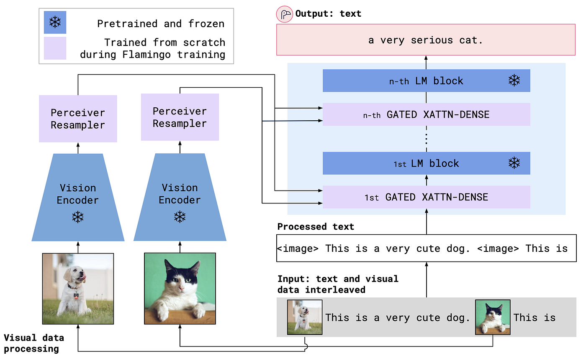

## Table of Contents

## What is multimodal instruction-tuned machine learning?

Multimodal instruction-tuned machine learning is a type of artificial intelligence training where the model learns from different types of data, like text, images, and sounds, all at the same time. This method helps the machine understand and respond to a variety of inputs more accurately, making it more useful in real-life situations. For example, if you show a picture and ask a question about it, the model can use both the image and the text to give a better answer.

The process of instruction tuning involves giving the model specific instructions on how to handle these different types of data. This is done by showing the model many examples of inputs and the correct outputs, so it learns to follow the instructions more effectively. By doing this, the model becomes better at understanding and generating responses that are more relevant and helpful, whether it's answering a question, describing an image, or translating speech.

## How does multimodal learning differ from traditional machine learning?

Multimodal learning is different from traditional machine learning because it uses more than one type of data at the same time. Traditional machine learning usually focuses on one type of data, like text or numbers. For example, a traditional model might only work with text to predict what people will say next. On the other hand, a multimodal model can use text, images, and even sounds together. This means it can understand and respond to a situation better because it has more information to work with.

For instance, if you ask a traditional model a question about a picture, it might not understand the question well because it can't see the picture. But a multimodal model can look at the picture and listen to your question at the same time. This helps it give a more accurate answer. By learning from different types of data, multimodal models can be more useful in real life, where we often use different senses together to understand the world around us.

## What are the key components of a multimodal instruction-tuned model?

The key components of a multimodal instruction-tuned model include the data sources, the model architecture, and the instruction tuning process. Data sources are the different types of information the model learns from, like text, images, and sounds. The model architecture is the design of the machine learning system that allows it to process and understand these different types of data at the same time. This often involves using neural networks that can handle multiple inputs and combine them effectively.

The instruction tuning process is crucial because it teaches the model how to use the data it receives. During this process, the model is given many examples of inputs along with the correct outputs, and it learns to follow specific instructions on how to handle these inputs. For example, if the model is shown a picture and asked a question about it, the instruction tuning helps it understand how to look at the picture and answer the question correctly. This makes the model more useful and accurate in real-life situations where it needs to respond to different types of information.

## Can you explain the process of instruction tuning in multimodal models?

Instruction tuning in multimodal models is a way to teach the machine how to use different types of information, like text, images, and sounds, to give better answers. It starts by showing the model many examples of inputs and the correct outputs. For instance, if you show the model a picture of a dog and ask, "What is this?", the model learns that it should look at the picture and say, "It's a dog." By seeing lots of these examples, the model gets better at understanding what to do with the information it receives.

The process involves giving the model specific instructions on how to handle the different types of data. These instructions help the model know what to focus on and how to combine the information to give the right answer. For example, if you show the model a picture and ask a question about it, the instructions might tell the model to first look at the picture, then read the question, and finally use both to come up with an answer. This way, the model learns to follow the instructions more effectively, making it more useful in real-life situations where it needs to understand and respond to different types of information at the same time.

## What types of data are typically used in multimodal learning?

Multimodal learning uses different types of data like text, images, and sounds all at the same time. Text data can include words from books, websites, or conversations. Images can be pictures or videos, and sounds can be music, speech, or other noises. By using all these types of data together, the machine can understand and respond to things better than if it only used one type of data.

For example, if you show a picture of a cat and ask, "What is this?", the machine can use the image to see the cat and the text to understand the question. This helps it give a better answer, like "It's a cat." Using different types of data helps the machine learn more about the world and respond in ways that are more helpful and accurate.

## What are the benefits of using multimodal instruction-tuned models over unimodal models?

Multimodal instruction-tuned models have a big advantage over unimodal models because they can use different types of information at the same time. For example, they can look at pictures, listen to sounds, and read text all together. This helps them understand things better and give more accurate answers. If you ask a question about a picture, a multimodal model can see the picture and read the question, which helps it give a better answer than a unimodal model that can only read the question.

Another benefit is that multimodal models can be more helpful in real-life situations. People often use different senses together to understand the world, like looking at something and talking about it at the same time. Multimodal models can do the same thing, making them more useful for tasks like helping with homework, translating languages, or describing what's happening in a video. By learning from different types of data and following specific instructions, these models can give answers that are more relevant and useful.

## How do you evaluate the performance of a multimodal instruction-tuned model?

Evaluating the performance of a multimodal instruction-tuned model involves checking how well it can handle different types of data like text, images, and sounds at the same time. You can do this by giving the model specific tasks and seeing how accurately it completes them. For example, you might show the model a picture and ask a question about it. If the model can look at the picture and answer the question correctly, it shows that it's doing a good job with multimodal data. You can also use special tests called benchmarks that are designed to measure how well the model performs on different tasks.

Another way to evaluate the model is by looking at how well it follows the instructions it was given during training. This means checking if the model can do what it was told to do with the different types of data. For instance, if the instructions told the model to first look at a picture and then answer a question about it, you would see if the model does this correctly. By using these methods, you can get a good idea of how well the multimodal instruction-tuned model is working and if it's ready to be used in real-life situations.

## What are some common challenges faced when implementing multimodal instruction-tuned models?

One common challenge when implementing multimodal instruction-tuned models is the need for large amounts of high-quality data. These models need to learn from different types of information like text, images, and sounds all at the same time. This means you need a lot of examples that show how these different types of data work together. Collecting and labeling this data can be expensive and time-consuming. If the data is not good enough, the model might not learn properly and could give wrong answers.

Another challenge is making sure the model can understand and combine different types of data correctly. For example, if you show the model a picture and ask a question about it, the model needs to look at the picture and read the question at the same time. This can be hard because the model has to learn how to pay attention to the right parts of the data and use them together to give a good answer. If the model does not do this well, it might miss important information and not respond accurately.

## Can you provide examples of successful applications of multimodal instruction-tuned models?

One successful application of multimodal instruction-tuned models is in virtual assistants like smart home devices. These devices can understand both voice commands and visual cues from cameras. For example, if you ask your smart home device to "turn on the lights" while showing it a picture of a specific lamp, the model can use both the voice command and the image to figure out exactly which light to turn on. This makes the device more useful and responsive to real-life situations where people often use different types of information together.

Another example is in education, where multimodal models help students learn better. Imagine a learning app that shows pictures and asks questions about them. The model can understand the picture and the question at the same time, giving accurate answers and helping students understand the material. For instance, if a student uploads a picture of a plant and asks, "What is this plant?", the model can identify the plant from the image and provide information about it, making learning more interactive and engaging.

## How does transfer learning play a role in multimodal instruction-tuned models?

Transfer learning is a big help when training multimodal instruction-tuned models. It's like giving the model a head start by using what it already knows from one task to help it learn a new one. For example, if a model has learned to recognize objects in pictures, it can use that knowledge to help it understand pictures and answer questions about them at the same time. This saves time and makes the model better at learning new things because it doesn't have to start from scratch.

In multimodal models, transfer learning can be used to combine different types of data more effectively. If the model has already learned how to process text and images separately, transfer learning helps it figure out how to use both together. This means the model can quickly get better at understanding and responding to questions about pictures, sounds, and text all at once. By using what it already knows, the model can become more accurate and useful in real-life situations where people use different types of information together.

## What are the latest advancements in the field of multimodal instruction-tuned machine learning?

One of the latest advancements in multimodal instruction-tuned machine learning is the development of models that can handle even more types of data at the same time. Researchers are working on models that can understand text, images, sounds, and even videos together. This makes the models more useful in real-life situations where people use different senses together. For example, a new model might be able to watch a video, listen to the sounds, and read the subtitles all at once, helping it give better answers about what's happening in the video.

Another advancement is the use of more advanced techniques for instruction tuning. These techniques help the model learn from examples more effectively, so it can follow instructions better. Researchers are using methods like reinforcement learning and fine-tuning on specific tasks to make the models more accurate and helpful. By doing this, the models can understand and respond to different types of information in a way that feels more natural and useful to people.

## How can one start building their own multimodal instruction-tuned model?

To start building your own multimodal instruction-tuned model, you first need to gather a diverse dataset that includes different types of information like text, images, and sounds. You can find these datasets online or create your own by collecting and labeling examples that show how these different types of data work together. Once you have your data, you'll need to choose a model architecture that can handle multiple inputs at the same time. Popular choices include transformer-based models that have been adapted for multimodal learning. You can use existing models as a starting point and modify them to fit your needs.

Next, you'll need to train your model using the instruction tuning process. This means showing the model many examples of inputs along with the correct outputs and giving it specific instructions on how to handle these inputs. You can use transfer learning to help your model learn faster by starting with a model that already knows how to process some types of data. During training, you'll need to evaluate your model's performance using tasks that test its ability to understand and combine different types of information. Once your model is trained and performing well, you can start using it in real-life situations where it can help people by understanding and responding to different types of data at the same time.