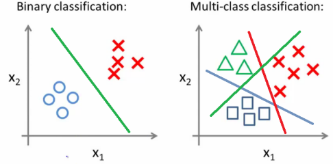

## Table of Contents

## What is multinomial classification in machine learning?

Multinomial classification is a type of machine learning problem where the goal is to classify instances into one of several possible categories. Unlike binary classification, which only has two possible outcomes, multinomial classification deals with three or more classes. For example, if you're trying to classify different types of fruits like apples, oranges, and bananas, you would use multinomial classification because there are more than two categories.

In machine learning, algorithms like logistic regression can be extended to handle multinomial classification. This is often done using the softmax function, which converts a vector of numbers into a probability distribution over multiple classes. The softmax function is defined as $$ \text{softmax}(z_i) = \frac{e^{z_i}}{\sum_{j=1}^K e^{z_j}} $$ where $z_i$ is the input to the function and $K$ is the number of classes. This function ensures that the output probabilities sum to one, making it suitable for classification tasks with multiple categories.

To implement multinomial classification, you would typically use a machine learning library like scikit-learn in Python. Here's a simple example of how you might use logistic regression for multinomial classification:

```python
from sklearn.datasets import load_iris
from sklearn.model_selection import train_test_split
from sklearn.linear_model import LogisticRegression
from sklearn.metrics import accuracy_score

# Load the Iris dataset
iris = load_iris()
X, y = iris.data, iris.target

# Split the data into training and testing sets
X_train, X_test, y_train, y_test = train_test_split(X, y, test_size=0.2, random_state=42)

# Create and train the model
model = LogisticRegression(multi_class='multinomial', solver='lbfgs')
model.fit(X_train, y_train)

# Make predictions on the test set
y_pred = model.predict(X_test)

# Calculate the accuracy of the model
accuracy = accuracy_score(y_test, y_pred)
print(f"Accuracy: {accuracy}")
```

This code demonstrates how to load a dataset, split it into training and testing sets, train a logistic regression model for multinomial classification, and evaluate its performance.

## How does multinomial classification differ from binary classification?

Multinomial classification and binary classification are both types of classification problems in [machine learning](/wiki/machine-learning), but they differ in the number of classes they handle. Binary classification deals with situations where there are only two possible outcomes, like deciding if an email is spam or not spam. On the other hand, multinomial classification is used when there are three or more classes to choose from, such as classifying different types of fruits like apples, oranges, and bananas.

In terms of how these classifications are implemented, binary classification often uses a sigmoid function to output a probability between 0 and 1, which is then used to make a decision. For example, if the output is greater than 0.5, the instance might be classified as one class, and if it's less than or equal to 0.5, it's classified as the other class. Multinomial classification, however, typically uses the softmax function to convert a vector of numbers into a probability distribution over multiple classes. The softmax function is defined as $$ \text{softmax}(z_i) = \frac{e^{z_i}}{\sum_{j=1}^K e^{z_j}} $$, where $z_i$ is the input to the function and $K$ is the number of classes. This ensures that the output probabilities sum to one, making it suitable for classification tasks with multiple categories.

## What are some common algorithms used for multinomial classification?

Multinomial classification can be approached with several common algorithms, each with its own strengths and applications. One popular method is logistic regression, which can be extended to handle multiple classes using the softmax function. The softmax function converts a vector of numbers into a probability distribution over multiple classes, defined as $$ \text{softmax}(z_i) = \frac{e^{z_i}}{\sum_{j=1}^K e^{z_j}} $$, where $z_i$ is the input to the function and $K$ is the number of classes. This makes logistic regression suitable for classifying instances into one of several categories. Another widely used algorithm is the k-nearest neighbors (k-NN) classifier, which works by finding the k closest training examples in the feature space and using their labels to predict the class of a new instance. k-NN is simple to implement and can be effective, especially when the decision boundary between classes is not linear.

Decision trees and their ensemble methods, like random forests and gradient boosting machines, are also commonly used for multinomial classification. Decision trees work by recursively splitting the dataset into subsets based on feature values, aiming to maximize the separation between classes at each split. Random forests and gradient boosting machines build multiple decision trees and combine their predictions to improve accuracy and reduce overfitting. These methods are versatile and can handle complex relationships between features and classes. Lastly, support vector machines (SVMs) can be adapted for multinomial classification using techniques like one-vs-rest or one-vs-one. SVMs find the hyperplane that best separates the classes in the feature space, and when extended to multiple classes, they can effectively handle classification tasks with more than two categories.

## Can you explain how the softmax function is used in multinomial classification?

The softmax function plays a crucial role in multinomial classification by converting the raw output of a model into a probability distribution over multiple classes. In simple terms, it takes a set of numbers and turns them into a set of probabilities that add up to one. This is useful because it helps us decide which class an instance belongs to by looking at which class has the highest probability. The formula for the softmax function is $$ \text{softmax}(z_i) = \frac{e^{z_i}}{\sum_{j=1}^K e^{z_j}} $$, where $z_i$ is the raw output for class $i$ and $K$ is the total number of classes. By using this function, we can compare the probabilities and assign the instance to the class with the highest probability.

In practice, the softmax function is often used at the end of a [neural network](/wiki/neural-network) or other machine learning models designed for multinomial classification. For example, if a model outputs raw scores for different classes, the softmax function can transform these scores into a clear probability distribution. This makes it easier to interpret the model's predictions and to train the model using techniques like cross-entropy loss, which measures how well the predicted probabilities match the true class labels. By using the softmax function, we can effectively handle the complexities of classifying instances into one of several possible categories, making it a fundamental tool in multinomial classification.

## What metrics are typically used to evaluate the performance of a multinomial classifier?

When evaluating a multinomial classifier, several common metrics are used to measure its performance. One of the simplest metrics is accuracy, which calculates the percentage of correct predictions out of all predictions made. Accuracy is calculated as the number of correct predictions divided by the total number of predictions. While accuracy is easy to understand, it can be misleading if the classes are imbalanced, meaning some classes have many more instances than others. In such cases, other metrics like precision, recall, and F1-score are more informative.

Precision, recall, and F1-score are calculated for each class and then often averaged across all classes. Precision measures the proportion of true positive predictions out of all positive predictions, helping to understand how many of the instances classified as a certain class actually belong to that class. Recall, on the other hand, measures the proportion of true positives out of all instances that actually belong to the class, indicating how well the classifier finds all instances of a class. The F1-score is the harmonic mean of precision and recall, providing a single score that balances both metrics. For a more comprehensive evaluation, a confusion matrix can be used to show the number of correct and incorrect predictions for each class, helping to identify where the classifier might be making mistakes.

## How does one handle imbalanced datasets in multinomial classification?

Handling imbalanced datasets in multinomial classification can be tricky because the model might be biased towards the majority class. One common approach is to use resampling techniques. This means either oversampling the minority classes by creating more copies of their instances or undersampling the majority class by removing some of its instances. For example, if you have a dataset with classes A, B, and C, and class A has many more instances than B and C, you could either add more instances of B and C or remove some instances of A to balance the dataset. Another technique is to use synthetic data generation methods like SMOTE (Synthetic Minority Over-sampling Technique), which creates new instances of the minority class by interpolating between existing instances.

Another way to handle imbalanced datasets is to adjust the model itself. This can be done by using class weights, where you assign higher weights to the minority classes during training. This tells the model to pay more attention to the minority classes, helping to balance its predictions. For example, in a logistic regression model, you could use the `class_weight` parameter to give more importance to the underrepresented classes. Additionally, choosing the right evaluation metric is crucial. Instead of relying solely on accuracy, which can be misleading in imbalanced datasets, you should use metrics like precision, recall, and F1-score, which provide a more balanced view of the model's performance across all classes.

## What are the challenges of using multinomial classification in high-dimensional spaces?

Using multinomial classification in high-dimensional spaces can be challenging because the data becomes harder to manage and analyze. When you have many features, it's easy for the model to become confused by noise and irrelevant information, making it harder to find the important patterns that separate the different classes. This is called the curse of dimensionality, where the more dimensions you add, the more data you need to get reliable results. For example, if you're trying to classify types of animals using many different features like size, color, habitat, and diet, the model might struggle to figure out which features really matter for telling the animals apart.

Another challenge is that high-dimensional spaces can make the model overfit, which means it does very well on the training data but poorly on new, unseen data. This happens because the model can start to memorize the training data instead of learning the general patterns. To avoid overfitting, you might need to use techniques like regularization, which adds a penalty to the model to keep it from getting too complex. For example, in logistic regression for multinomial classification, you could use the L2 regularization term $$ \lambda \sum_{i=1}^n \theta_i^2 $$ to keep the model's weights from growing too large. By understanding and addressing these challenges, you can improve the performance of multinomial classification in high-dimensional spaces.

## How can feature selection improve the performance of a multinomial classifier?

Feature selection can help a multinomial classifier work better by [picking](/wiki/asset-class-picking) out the most important features and leaving out the ones that don't matter much. When you have a lot of features, some of them might just add noise and make it harder for the model to see the real patterns. By choosing only the best features, the model can focus on what's really important for telling the different classes apart. This can make the model simpler and faster, and it can also help the model do a better job at classifying new data.

One way to do feature selection is by using methods like mutual information or chi-squared tests to see which features are most related to the classes. For example, if you're trying to classify different types of fruits, you might find that color and size are more important than the time of day the fruit was picked. By using these methods, you can pick the features that give the most information about the classes. Another way is to use techniques like L1 regularization, which can automatically shrink some feature weights to zero, effectively removing those features from the model. This can be done in logistic regression for multinomial classification using the L1 regularization term $$ \lambda \sum_{i=1}^n |\theta_i| $$. By doing feature selection, you can make your multinomial classifier more accurate and easier to understand.

## What is the impact of regularization on multinomial classification models?

Regularization helps multinomial classification models by making them simpler and better at predicting new data. When you have a lot of features, the model can start to memorize the training data instead of learning the general patterns. This is called overfitting. Regularization adds a penalty to the model to keep it from getting too complex. For example, in logistic regression for multinomial classification, you can use L2 regularization, which adds a term like $$ \lambda \sum_{i=1}^n \theta_i^2 $$ to the model's objective function. This term makes the model's weights smaller, helping it focus on the most important features and ignore the noise.

Using regularization can make your multinomial classifier more accurate and easier to understand. It helps the model work better on new, unseen data because it's not just memorizing the training examples. For instance, if you're classifying different types of fruits, regularization can help the model focus on key features like color and size, rather than getting distracted by less important details. By balancing the model's complexity, regularization improves its ability to generalize, making it a valuable tool in multinomial classification.

## How do you implement multinomial logistic regression, and what are its key assumptions?

Multinomial logistic regression is a way to classify things into more than two groups. You can use it when you want to predict which class something belongs to, like different types of fruits. To implement it, you can use a tool like scikit-learn in Python. You start by loading your data, splitting it into training and testing sets, and then creating a logistic regression model with the `multi_class='multinomial'` and `solver='lbfgs'` settings. After training the model on your data, you can use it to make predictions and see how well it works by checking its accuracy. Here's a simple example of how you might do this:

```python
from sklearn.datasets import load_iris
from sklearn.model_selection import train_test_split
from sklearn.linear_model import LogisticRegression
from sklearn.metrics import accuracy_score

# Load the Iris dataset
iris = load_iris()
X, y = iris.data, iris.target

# Split the data into training and testing sets
X_train, X_test, y_train, y_test = train_test_split(X, y, test_size=0.2, random_state=42)

# Create and train the model
model = LogisticRegression(multi_class='multinomial', solver='lbfgs')
model.fit(X_train, y_train)

# Make predictions on the test set
y_pred = model.predict(X_test)

# Calculate the accuracy of the model
accuracy = accuracy_score(y_test, y_pred)
print(f"Accuracy: {accuracy}")
```

The key assumptions of multinomial logistic regression are that the relationship between the features and the log-odds of the classes is linear, and that the observations are independent of each other. The model uses the softmax function to turn the raw scores into probabilities for each class. The softmax function is defined as $$ \text{softmax}(z_i) = \frac{e^{z_i}}{\sum_{j=1}^K e^{z_j}} $$, where $z_i$ is the raw score for class $i$ and $K$ is the number of classes. This helps the model decide which class an instance belongs to by looking at which class has the highest probability. By understanding these assumptions and using the right tools, you can effectively use multinomial logistic regression for classification tasks with multiple categories.

## Can you discuss the use of neural networks for multinomial classification, including any specific architectures?

Neural networks can be really helpful for multinomial classification, which is when you want to sort things into more than two groups. A common type of neural network for this job is the feedforward neural network, also called a multilayer perceptron (MLP). In an MLP, you have layers of connected nodes, and the last layer uses the softmax function to turn the network's output into probabilities for each class. The softmax function is defined as $$ \text{softmax}(z_i) = \frac{e^{z_i}}{\sum_{j=1}^K e^{z_j}} $$, where $z_i$ is the output for class $i$ and $K$ is the number of classes. This helps the network decide which class an instance belongs to by looking at which class has the highest probability. You can train the network using a method called backpropagation, which adjusts the weights of the connections to make the network's predictions better.

Another useful architecture for multinomial classification is the [convolutional neural network](/wiki/convolutional-neural-network) (CNN), which is especially good for classifying images. CNNs have layers that can recognize patterns in the data, like edges or shapes in pictures. After these layers, the network might use a few fully connected layers and then a softmax layer to make the final classification. CNNs are great because they can learn to recognize complex features in the data, which can help them sort things into different classes more accurately. For example, if you're trying to classify different types of animals in photos, a CNN can learn to recognize the unique features of each animal, like the shape of their ears or the pattern of their fur. By using these architectures, neural networks can effectively handle the challenges of multinomial classification.

## What advanced techniques can be used to enhance the robustness and accuracy of multinomial classification models?

To make multinomial classification models more robust and accurate, you can use a technique called ensemble methods. This means combining the predictions of several different models to get a better overall prediction. For example, you could use a random forest, which is a bunch of decision trees working together. Each tree might make a different prediction, but when you combine them, you get a more reliable result. Another ensemble method is gradient boosting, where you build trees one after the other, and each new tree tries to fix the mistakes of the previous ones. By using these methods, you can make your model less likely to overfit and more likely to work well on new data.

Another advanced technique is to use [deep learning](/wiki/deep-learning), like neural networks with many layers. These networks can learn very complex patterns in the data, which can help them classify things more accurately. For example, a convolutional neural network (CNN) is great for classifying images because it can recognize patterns like edges and shapes. After the CNN layers, you might use a softmax layer to turn the network's output into probabilities for each class. The softmax function is defined as $$ \text{softmax}(z_i) = \frac{e^{z_i}}{\sum_{j=1}^K e^{z_j}} $$, where $z_i$ is the output for class $i$ and $K$ is the number of classes. By using deep learning, you can make your multinomial classification model more powerful and accurate.

## References & Further Reading

[1]: Bishop, C. M. (2006). ["Pattern Recognition and Machine Learning."](https://www.cs.uoi.gr/~arly/courses/ml/tmp/Bishop_book.pdf) Springer.

[2]: Murphy, K. P. (2012). ["Machine Learning: A Probabilistic Perspective."](https://www.cs.ubc.ca/~murphyk/MLbook/pml-toc-1may12.pdf) MIT Press.

[3]: Pedregosa, F., Varoquaux, G., Gramfort, A., Michel, V., Thirion, B., Grisel, O., ... & Duchesnay, E. (2011). ["Scikit-learn: Machine Learning in Python."](https://dl.acm.org/doi/10.5555/1953048.2078195) Journal of Machine Learning Research, 12, 2825-2830.

[4]: Hastie, T., Tibshirani, R., & Friedman, J. (2009). ["The Elements of Statistical Learning: Data Mining, Inference, and Prediction."](https://link.springer.com/book/10.1007/978-0-387-84858-7) Springer.

[5]: Goodfellow, I., Bengio, Y., & Courville, A. (2016). ["Deep Learning."](https://link.springer.com/article/10.1007/s10710-017-9314-z) MIT Press. 

[6]: Ng, A. Y., & Jordan, M. I. (2002). ["On Discriminative vs. Generative classifiers: A comparison of logistic regression and naive Bayes."](https://papers.nips.cc/paper/2001/file/7b7a53e239400a13bd6be6c91c4f6c4e-Paper.pdf) Advances in Neural Information Processing Systems.

[7]: Smola, A. J., & Vishwanathan, S. V. N. (2008). ["Introduction to Machine Learning."](https://www.kth.se/social/upload/53a14887f276540ebc81aec3/online.pdf) Cambridge University Press.