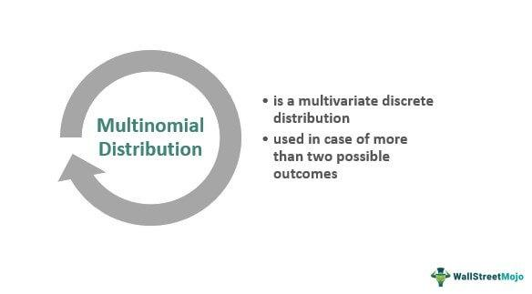

## Table of Contents

## What is the Multinomial Distribution?

The Multinomial Distribution is a type of probability distribution that deals with experiments where you have more than two possible outcomes. Imagine you're rolling a die; it can land on 1, 2, 3, 4, 5, or 6. The Multinomial Distribution helps us figure out the probability of getting a certain combination of these outcomes over many rolls.

For example, if you roll a die 10 times, the Multinomial Distribution can tell you the chances of getting three 1's, two 2's, and five 3's. It's like the binomial distribution, which is for experiments with just two outcomes (like flipping a coin), but it's used when there are more than two possible results. The key is that each roll or trial is independent, meaning the result of one roll doesn't affect the next.

In practical terms, the Multinomial Distribution is used in many fields, like market research to predict consumer choices, or in genetics to study the distribution of different traits in a population. It's a powerful tool because it allows us to model and understand complex situations where multiple outcomes are possible, and it helps us make better predictions based on data.

## How does the Multinomial Distribution differ from the Binomial Distribution?

The Multinomial Distribution and the Binomial Distribution are both used to figure out the chances of different outcomes happening in experiments, but they work a bit differently. The Binomial Distribution is used when there are only two possible outcomes, like when you flip a coin and it can land on heads or tails. It tells you the probability of getting a certain number of one outcome (like heads) in a set number of tries. For example, it can tell you the chance of getting 3 heads out of 5 coin flips.

On the other hand, the Multinomial Distribution comes into play when there are more than two possible outcomes. Think of rolling a die, where you can get a 1, 2, 3, 4, 5, or 6. This distribution helps you calculate the probability of getting a specific combination of these outcomes over several rolls. For instance, it can tell you the chance of rolling two 1's, three 2's, and one 6 in six rolls of a die.

In simple terms, if you're dealing with a situation where things can only go one of two ways, you use the Binomial Distribution. But if you're looking at a situation with more than two possible results, like choosing from several different flavors of ice cream, the Multinomial Distribution is what you need. Both are important tools in statistics, but they apply to different types of problems.

## What are the parameters of the Multinomial Distribution?

The Multinomial Distribution has two main parameters: the number of trials and the probabilities of each outcome. The number of trials is how many times you do the experiment, like rolling a die 10 times. The probabilities of each outcome tell you how likely each result is, like the chance of rolling a 1, a 2, a 3, and so on. These probabilities have to add up to 1 because they cover all possible outcomes.

For example, if you're rolling a fair six-sided die, the probability of each number (1 through 6) is 1/6. If you roll the die 10 times, the Multinomial Distribution can help you figure out the chances of getting a certain mix of numbers, like two 1's, three 2's, and five 3's. The key thing is that these parameters help you model and predict the outcomes of experiments with multiple possible results.

## Can you explain the formula for the Multinomial Distribution?

The formula for the Multinomial Distribution helps us figure out the chance of getting a certain mix of outcomes in a bunch of trials. It looks a bit complicated, but it's really just a way to combine a few simple ideas. The formula is: P(X1 = x1, X2 = x2, ..., Xk = xk) = (n! / (x1! * x2! * ... * xk!)) * (p1^x1 * p2^x2 * ... * pk^xk). Here, 'n' is the total number of trials, 'x1, x2, ..., xk' are the counts of each outcome, and 'p1, p2, ..., pk' are the probabilities of each outcome. The '!' means factorial, which is just a way to multiply numbers down from the given number to 1.

Let's break it down a bit. The first part of the formula, (n! / (x1! * x2! * ... * xk!)), is about counting the different ways you can get your mix of outcomes. It's like figuring out how many ways you can arrange your results. The second part, (p1^x1 * p2^x2 * ... * pk^xk), is about the chance of each specific outcome happening the right number of times. When you put these together, you get the total probability of getting exactly the mix of outcomes you're looking for. So, even though the formula looks tricky, it's really just a way to combine counting and probability to predict what might happen in your experiment.

## What types of problems can be solved using the Multinomial Distribution?

The Multinomial Distribution helps solve problems where you need to predict the chances of getting different results in experiments with more than two possible outcomes. Imagine you're a teacher and you want to know the likelihood of students choosing different colors for a project. If they can pick from red, blue, or green, the Multinomial Distribution can tell you the probability of getting a certain mix of these colors, like 10 students choosing red, 5 choosing blue, and 3 choosing green. It's useful in situations where you're dealing with choices or outcomes that aren't just yes or no, but can be one of several options.

Another type of problem where the Multinomial Distribution is helpful is in market research. Companies often want to understand how people might choose between different products or services. For example, if a store sells three types of cereal, the Multinomial Distribution can help predict how many customers might buy each type over a month. This information can guide decisions about how much of each cereal to stock or how to market them. It's all about understanding and predicting patterns in choices when there are multiple options on the table.

## How do you calculate the expected value and variance of a Multinomial Distribution?

The expected value of a Multinomial Distribution tells us what we can expect to happen on average over many trials. For each possible outcome, the expected value is simply the total number of trials multiplied by the probability of that outcome. So, if you roll a die 10 times, the expected number of times you'll roll a 1 is 10 times the probability of rolling a 1, which is 10 * (1/6) = about 1.67 times. You do this for each outcome, and that gives you the expected counts for each result. It's like predicting what you'll see if you repeat the experiment a lot.

The variance of a Multinomial Distribution measures how spread out the results can be from the expected value. For each outcome, the variance is the total number of trials times the probability of that outcome times the probability of not getting that outcome. For example, if you roll a die 10 times, the variance for rolling a 1 is 10 * (1/6) * (5/6) = about 1.39. This tells you how much the actual number of 1's you roll might differ from the expected 1.67. The variance helps you understand the uncertainty or variability in your results, which is important for making good predictions and decisions.

## What is the relationship between the Multinomial Distribution and the Multivariate Hypergeometric Distribution?

The Multinomial Distribution and the Multivariate Hypergeometric Distribution are both used to figure out the chances of getting different results in experiments, but they work a bit differently. The Multinomial Distribution is like rolling a die many times. Each roll is independent, meaning what happens on one roll doesn't affect the next. You use it when you want to know the probability of getting a certain mix of outcomes, like rolling two 1's, three 2's, and one 6 in six rolls of a die. It's all about predicting what might happen over many tries when each try is separate from the others.

The Multivariate Hypergeometric Distribution is different because it's like drawing balls from a bag without putting them back. If you have a bag with different colored balls and you draw several balls at once, the chance of getting a certain mix of colors changes with each draw because you're not replacing the balls. This distribution helps you figure out the probability of getting a specific combination of outcomes when the trials are not independent, like drawing three red balls, two blue balls, and one green ball from a bag without replacing them. So, while the Multinomial Distribution is for independent trials, the Multivariate Hypergeometric Distribution is for dependent trials where the outcomes affect each other.

## How can the Multinomial Distribution be applied in real-world scenarios?

Imagine you're a teacher and you want to understand how your students will vote for their favorite class project. They can choose from three options: building a model, doing a science experiment, or making a presentation. With the Multinomial Distribution, you can predict how many students might choose each option. Let's say you have 30 students, and you know from past experience that about 40% like building models, 30% prefer experiments, and 30% enjoy presentations. The Multinomial Distribution can help you figure out the likelihood of getting, say, 12 students choosing models, 9 choosing experiments, and 9 choosing presentations. This can guide you in preparing materials and planning class time.

Another real-world use is in market research. A company might want to know how customers will choose between different flavors of a new ice cream product. If they have four flavors - chocolate, vanilla, strawberry, and mint - they can use the Multinomial Distribution to predict sales. Suppose they plan to sell 1,000 units, and market research shows that 35% of people prefer chocolate, 25% like vanilla, 20% go for strawberry, and 20% choose mint. The Multinomial Distribution can tell them the probability of selling, for example, 350 chocolate, 250 vanilla, 200 strawberry, and 200 mint units. This helps the company decide how much of each flavor to produce and how to market them effectively.

## What are some common pitfalls when using the Multinomial Distribution?

One common pitfall when using the Multinomial Distribution is assuming that the trials are independent when they're not. For example, if you're studying voting patterns and people's choices influence each other, using the Multinomial Distribution might give you the wrong results because it assumes each choice is made separately. Another issue is getting the probabilities wrong. If you don't have good data on how likely each outcome is, your predictions will be off. It's like guessing the chance of rolling a 1 on a die without knowing it's a fair die.

Another mistake is not understanding the total number of trials correctly. If you're trying to predict how many people will choose different flavors of ice cream, you need to know exactly how many people you're talking about. Guessing or using the wrong number can mess up your calculations. Also, people often forget that the probabilities of all outcomes must add up to 1. If they don't, the Multinomial Distribution won't work right. It's important to double-check your numbers and make sure everything fits together properly.

## How does the size of the sample affect the Multinomial Distribution?

The size of the sample, or the number of trials, really matters when you're using the Multinomial Distribution. Think of it like rolling a die. If you roll it just a few times, the results can be all over the place. You might get a lot of 1's or none at all. But if you roll it many, many times, the results start to even out. The more times you roll, the closer your results will be to what you expect based on the probabilities. So, a bigger sample size makes your predictions more reliable because it smooths out the randomness.

When you have a small sample size, the Multinomial Distribution can be less accurate. It's harder to predict what will happen because there's more room for chance to mess things up. For example, if you're trying to guess how many people will choose different ice cream flavors and you only ask a few people, your guess might be way off. But if you ask a lot of people, your guess will be closer to the truth. So, the bigger your sample size, the better your predictions will be with the Multinomial Distribution.

## Can you provide examples of how to implement the Multinomial Distribution in statistical software?

In R, you can use the Multinomial Distribution to figure out the chances of getting different results in your experiment. Let's say you're rolling a fair six-sided die 10 times and you want to know the probability of getting two 1's, three 2's, and five 3's. You can use the `dmultinom` function to calculate this. First, you need to set up your probabilities for each outcome, which for a fair die are all 1/6. Then, you can write the code like this: `dmultinom(c(2, 3, 5, 0, 0, 0), prob = c(1/6, 1/6, 1/6, 1/6, 1/6, 1/6))`. This will give you the probability of getting exactly that mix of numbers.

In Python, you can use the `scipy.stats` module to work with the Multinomial Distribution. If you're doing the same die-rolling experiment, you can use the `multinomial` function to calculate the probability. You'll need to import the module first with `from scipy.stats import multinomial`. Then, you can set up your probabilities and the number of trials, and use the `pmf` method to find the probability. The code would look like this: `multinomial.pmf([2, 3, 5, 0, 0, 0], n=10, p=[1/6, 1/6, 1/6, 1/6, 1/6, 1/6])`. This will tell you the chance of rolling two 1's, three 2's, and five 3's in 10 rolls of a fair die.

## What advanced techniques exist for extending or modifying the Multinomial Distribution for specific applications?

One advanced technique for extending the Multinomial Distribution is to use it in a Bayesian framework. This means you can update the probabilities of each outcome as you get more data. Imagine you're a teacher predicting how students will choose between different class projects. At first, you might guess the probabilities based on past experience. But as students start choosing, you can use their choices to update those probabilities and make better predictions. This is helpful in situations where the probabilities might change over time, like in marketing where customer preferences can shift.

Another way to modify the Multinomial Distribution is by using it in mixture models. This is useful when you think there might be different groups within your data, each with their own set of probabilities. For example, if you're studying voting patterns, you might believe there are different voter groups with different preferences. By using a mixture of Multinomial Distributions, you can model these groups separately and figure out the overall voting pattern more accurately. This technique helps in understanding complex data where there might be hidden subgroups with different behaviors.

## What is the Multinomial Distribution?

The multinomial distribution is an extension of the binomial distribution applicable to events with more than two possible outcomes. In contrast to the binomial distribution, which models scenarios with binary outcomes (such as success or failure), the multinomial distribution is suited for experiments where each trial can result in one of several possible categories. This distribution evaluates the likelihood of obtaining a particular combination of outcomes in a series of experiments, making it a versatile tool in probability and statistics.

To define a multinomial distribution, consider an experiment consisting of $n$ independent trials, each trial resulting in exactly one of $k$ possible outcomes. Let $p_1, p_2, \ldots, p_k$ represent the probabilities of these outcomes, where the sum of all probabilities equals 1, $\sum_{i=1}^{k} p_i = 1$. The multinomial distribution then provides the probability of observing certain counts $n_1, n_2, \ldots, n_k$ for each outcome category. These counts must satisfy the condition $n_1 + n_2 + \cdots + n_k = n$.

The probability of a specific outcome configuration in a multinomial experiment can be calculated using the multinomial probability mass function (PMF):

$$

P(X_1 = n_1, X_2 = n_2, \ldots, X_k = n_k) = \frac{n!}{n_1! \, n_2! \, \cdots \, n_k!} \cdot p_1^{n_1} \cdot p_2^{n_2} \cdot \cdots \cdot p_k^{n_k}
$$

Here, $n!$ (factorial of $n$) represents the number of ways to arrange $n$ trials, and the product of the probabilities $p_i^{n_i}$ accounts for the contribution of each outcome to the overall probability.

Key properties of the multinomial distribution include:

- **Repeated Trials**: Each trial is identical and independent, ensuring consistency across trials.
- **Independence**: The outcome of any single trial does not affect the outcomes of others.
- **Constant Probabilities**: The probabilities $p_1, p_2, \ldots, p_k$ remain constant across all trials.
- **Specific Outcomes**: The distribution is concerned with specific counts of outcomes across the trials.

The multinomial distribution is instrumental in scenarios involving categorical data where each observation can fall into one of several categories, and it is extensively used in various domains such as linguistics, genetics, and [machine learning](/wiki/machine-learning) for tasks like classification and clustering.

## What is the Mathematical Framework of the Multinomial Distribution?

The multinomial distribution extends the concept of the binomial distribution to scenarios with more than two possible outcomes per trial. At the core of its mathematical framework is a formula that expresses the probability of a specific outcome given multiple repeated trials, each with several potential results.

The probability mass function for the multinomial distribution is a generalization of the binomial probability formula. When considering $n$ independent trials, where each trial can result in one of $k$ outcomes with probabilities $p_1, p_2, \ldots, p_k$ (such that $\sum_{i=1}^{k} p_i = 1$), the probability of a specific sequence of outcomes where $n_1$ times the outcome 1 occurs, $n_2$ times the outcome 2 occurs, and so on, up to $n_k$, is given by:

$$
P(X_1 = n_1, X_2 = n_2, \ldots, X_k = n_k) = \frac{n!}{n_1! n_2! \ldots n_k!} \prod_{i=1}^{k} p_i^{n_i}
$$

Here, $n_i$ represents the number of times outcome $i$ occurs across $n$ trials, and the sum of all $n_i$ values equals $n$ (i.e., $n_1 + n_2 + \ldots + n_k = n$).

### Python Example

The multinomial distribution can be calculated using Python's `numpy` library, which provides useful functionalities for handling such computations. Below is a simple implementation:

```python
import numpy as np

# Define the number of trials and outcome probabilities
n = 10  # total trials
p = [0.2, 0.3, 0.5]  # probabilities of each outcome, sum must be 1
outcomes = [4, 3, 3]  # the occurrences of each outcome in k trials

# Calculate the probability of observing the given outcomes
probability = np.math.factorial(n) / (
    np.prod([np.math.factorial(x) for x in outcomes]) * np.prod([p[i]**outcomes[i] for i in range(len(p))]))

print("Probability of observed outcomes:", probability)
```

This code calculates the probability of obtaining a certain number of outcomes, provided the number of trials and probabilities. Understanding the mathematical structure of the multinomial distribution is crucial for effectively applying it in fields such as finance, where predicting various outcomes in scenarios involving multiple variables or categories is essential.

## What are the applications in finance and algo trading?

In finance, the multinomial distribution is utilized to estimate the likelihood of various market outcomes, providing a foundation for strategic planning by investors and traders. This statistical tool is especially beneficial in scenarios requiring the analysis of multiple outcomes over a period. It allows financial professionals to quantify the chances of different market scenarios and adjust strategies accordingly.

For example, a portfolio manager might use multinomial distribution models to determine the probability that a small-cap index will outperform a large-cap index over a specified period. By considering historical data and current market trends, the manager can calculate these probabilities. The multinomial distribution formula for such applications might look like this:

$$
P(X_1 = n_1, X_2 = n_2, \ldots, X_k = n_k) = \frac{n!}{n_1!n_2!\cdots n_k!} p_1^{n_1} p_2^{n_2} \cdots p_k^{n_k}
$$

Where:
- $n$ is the total number of trials,
- $n_1, n_2, \ldots, n_k$ are the observed outcomes,
- $p_1, p_2, \ldots, p_k$ are the corresponding probabilities of each outcome.

Algorithmic trading systems make extensive use of these models to enhance the accuracy of forecasts and automate trade executions based on statistical probabilities. By inputting various potential market conditions into a multinomial model, these systems can simulate a range of outcomes and optimize trading decisions.

One practical application within [algorithmic trading](/wiki/algorithmic-trading) involves leveraging historical stock performance and patterns to predict future price movements. Algorithms might assign probabilities to specific outcomes, such as “stock A will increase by 5%,” utilizing the multinomial framework to adjust trading strategies dynamically.

Python, a favorite tool among data scientists in finance, offers libraries like NumPy and SciPy that provide functions to model and work with multinomial distributions effectively. Here is a simple Python example to illustrate how a multinomial distribution might be implemented:

```python
import numpy as np
from scipy.stats import multinomial

# Number of trials
n = 100

# Probability distribution
probabilities = [0.3, 0.4, 0.3]

# Multinomial distribution
outcome_counts = multinomial.rvs(n, probabilities, size=1)

print("Simulated outcomes:", outcome_counts)
```

This script uses 100 trials with probabilities corresponding to three possible outcomes. The `multinomial.rvs` function simulates the experiment, illustrating how a trader could model potential outcomes with real-world data. By understanding and leveraging these probabilities, financial professionals can make more informed decisions and improve their strategic positioning in dynamic markets.

## References & Further Reading

[1]: ["Advances in Financial Machine Learning"](https://www.amazon.com/Advances-Financial-Machine-Learning-Marcos/dp/1119482089) by Marcos Lopez de Prado

[2]: ["Evidence-Based Technical Analysis: Applying the Scientific Method and Statistical Inference to Trading Signals"](https://www.amazon.com/Evidence-Based-Technical-Analysis-Scientific-Statistical/dp/0470008741) by David Aronson

[3]: ["Machine Learning for Algorithmic Trading"](https://github.com/stefan-jansen/machine-learning-for-trading) by Stefan Jansen

[4]: ["Quantitative Trading: How to Build Your Own Algorithmic Trading Business"](https://www.amazon.com/Quantitative-Trading-Build-Algorithmic-Business/dp/1119800064) by Ernest P. Chan

[5]: Johnson, N. L., Kemp, A. W., & Kotz, S. (2005). ["Univariate Discrete Distributions."](https://onlinelibrary.wiley.com/doi/book/10.1002/0471715816) Wiley. 

[6]: Fama, E. F., & French, K. R. (1993). ["Common Risk Factors in the Returns on Stocks and Bonds."](https://people.hec.edu/rosu/wp-content/uploads/sites/43/2023/09/Fama-French-Common-risk-factors-1993.pdf) Journal of Financial Economics.

[7]: Sutton, R. S., & Barto, A. G. (2018). ["Reinforcement Learning: An Introduction."](https://web.stanford.edu/class/psych209/Readings/SuttonBartoIPRLBook2ndEd.pdf) MIT Press.