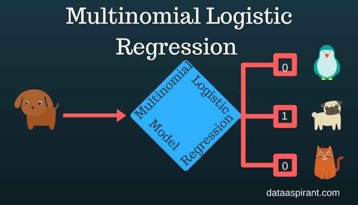

## Table of Contents

## What is Multinomial Regression and how does it differ from other regression models?

Multinomial Regression is a type of regression analysis used when the outcome variable is categorical with more than two categories. It extends the idea of logistic regression, which is used for binary outcomes, to handle multiple categories. In Multinomial Regression, the probability of an observation falling into a particular category is modeled using a set of predictor variables. The model estimates the likelihood of each category relative to a reference category, and it uses a softmax function to convert these estimates into probabilities that sum to one across all categories. This makes it useful for classification problems where the outcome can be one of several distinct classes.

The key difference between Multinomial Regression and other regression models lies in the nature of the dependent variable and the way probabilities are calculated. For instance, in linear regression, the outcome is continuous, and the model predicts a numeric value based on the input features. In contrast, Multinomial Regression deals with categorical outcomes and focuses on predicting the probability of each category. Compared to logistic regression, which is limited to binary outcomes, Multinomial Regression can handle multiple categories, making it more versatile for certain types of data. Additionally, while ordinal logistic regression is used for ordered categorical data, Multinomial Regression does not assume any order among the categories, making it suitable for nominal data where no natural ordering exists among the outcome categories.

## What are the key assumptions underlying Multinomial Regression?

Multinomial Regression relies on several key assumptions that are important for the model to work correctly. One main assumption is that the observations are independent of each other. This means that the outcome for one observation should not affect the outcome for another. Another important assumption is that there is no perfect multicollinearity among the predictor variables. This means that the predictors should not be too closely related to each other, as this can make it hard for the model to tell them apart and estimate their effects accurately.

Another assumption is that the model should fit the data well. This means that the relationship between the predictors and the outcome should be correctly captured by the model. If the model does not fit well, the predictions might not be accurate. Lastly, the assumption of large sample sizes is often important for Multinomial Regression. With more data, the estimates of the model become more reliable. If the sample size is too small, the model might not work as well.

In summary, for Multinomial Regression to work properly, the observations need to be independent, the predictors should not be too closely related, the model should fit the data well, and there should be enough data to make reliable estimates. Keeping these assumptions in mind helps ensure that the results from a Multinomial Regression analysis are trustworthy and useful.

## How do you prepare data for Multinomial Regression analysis?

Preparing data for Multinomial Regression involves a few key steps to make sure your analysis will be accurate and reliable. First, you need to check your outcome variable. Make sure it is categorical and has more than two categories. If it's not already in the right format, you might need to convert it. For example, if your outcome is a number that represents different categories, you should change it into a categorical variable. Next, you need to look at your predictor variables. Make sure they are in a format that can be used in the model. Sometimes, you might need to transform them, like turning a continuous variable into categories or vice versa, depending on what makes sense for your analysis.

After you've checked and formatted your variables, you should clean your data. This means dealing with missing values and outliers. Missing data can be a big problem, so you might need to either remove the observations with missing values or fill them in with a reasonable guess, like the average value of that variable. Outliers can also affect your results, so you should check for them and decide if they should be removed or kept. Once your data is clean, you should check for multicollinearity among your predictors. This means making sure that your predictors are not too closely related to each other. If they are, you might need to remove or combine some of them. Finally, you can split your data into a training set and a test set. This helps you check how well your model works on new data. 

To perform Multinomial Regression, you can use software like R or Python. Here's a simple example in Python using the `statsmodels` library:

```python
import pandas as pd
import statsmodels.api as sm
from statsmodels.formula.api import mnlogit

# Assume 'data' is your DataFrame with the variables
# 'outcome' is your categorical outcome variable
# 'predictor1', 'predictor2', etc., are your predictor variables

# Fit the model
model = mnlogit("outcome ~ predictor1 + predictor2", data=data).fit()

# Print the summary of the model
print(model.summary())
```

This code sets up and fits a Multinomial Regression model, and then prints out a summary of the results. By following these steps, you can prepare your data and run a Multinomial Regression analysis effectively.

## What is the mathematical formulation of Multinomial Regression?

Multinomial Regression is a way to predict the probability of an outcome that can be one of several categories. It uses a set of predictor variables to estimate these probabilities. The model works by comparing the probability of each category to a reference category. The probabilities are calculated using a function called the softmax function, which makes sure that the probabilities for all categories add up to 1. The mathematical formula for Multinomial Regression can be written as:

$$ P(Y = k | X) = \frac{\exp(\beta_k \cdot X)}{\sum_{j=0}^{K} \exp(\beta_j \cdot X)} $$

Here, $P(Y = k | X)$ is the probability that the outcome $Y$ is in category $k$ given the predictor variables $X$. The term $\beta_k$ represents the coefficients for category $k$, and the softmax function ensures that the probabilities sum to 1 across all categories $K$. The model estimates these coefficients using a method called maximum likelihood estimation, which finds the values of $\beta$ that make the observed data most likely.

In practice, you can use software like Python to fit a Multinomial Regression model. Here's a simple example using the `statsmodels` library:

```python
import pandas as pd
import statsmodels.api as sm
from statsmodels.formula.api import mnlogit

# Assume 'data' is your DataFrame with the variables
# 'outcome' is your categorical outcome variable
# 'predictor1', 'predictor2', etc., are your predictor variables

# Fit the model
model = mnlogit("outcome ~ predictor1 + predictor2", data=data).fit()

# Print the summary of the model
print(model.summary())
```

This code sets up and fits a Multinomial Regression model, and then prints out a summary of the results. By using this approach, you can predict the probabilities of different categories based on your predictor variables.

## How do you interpret the coefficients in a Multinomial Regression model?

In Multinomial Regression, the coefficients represent how the predictor variables affect the log-odds of being in one category compared to the reference category. For each category, there is a set of coefficients. If a coefficient is positive, it means that as the predictor variable increases, the log-odds of being in that category (versus the reference category) also increase. If the coefficient is negative, the log-odds decrease as the predictor variable increases. The size of the coefficient shows how strong the effect is. For example, if the coefficient for a predictor is 0.5, it means that for every one-unit increase in that predictor, the log-odds of being in that category increase by 0.5.

To understand the actual change in probability, you need to convert the log-odds to probabilities using the softmax function. The formula for this is $$ P(Y = k | X) = \frac{\exp(\beta_k \cdot X)}{\sum_{j=0}^{K} \exp(\beta_j \cdot X)} $$. This formula calculates the probability of being in category $k$ given the predictor variables $X$. The coefficients $\beta_k$ are used in this calculation. So, while the coefficients themselves tell you about the log-odds, the softmax function helps you see how these log-odds translate into actual probabilities for each category. This way, you can see how changes in the predictors affect the chances of the outcome being in different categories.

## What are the common metrics used to evaluate the performance of a Multinomial Regression model?

To evaluate how well a Multinomial Regression model performs, you can use several common metrics. One important metric is accuracy, which tells you the percentage of correct predictions out of all predictions. For example, if your model predicts the correct category 80 times out of 100, the accuracy is 80%. Another useful metric is the confusion matrix, which shows how many predictions were correct or incorrect for each category. This helps you see if the model is better at predicting some categories than others. You can also use precision and recall. Precision measures how many of the predicted positive cases are actually positive, while recall measures how many of the actual positive cases were correctly predicted.

Another important metric is the F1 score, which is the harmonic mean of precision and recall. It gives you a single number that balances both precision and recall, which is helpful when you want to see overall performance. The log-loss or cross-entropy loss is also used, which measures how close the predicted probabilities are to the actual outcomes. A lower log-loss means the model's predictions are more accurate. You can also use the area under the ROC curve (AUC-ROC) for each category, which shows how well the model can distinguish between categories. These metrics help you understand different aspects of your model's performance and choose the best model for your needs.

## How does one handle multicollinearity in Multinomial Regression?

Multicollinearity happens when predictor variables in a Multinomial Regression model are too closely related to each other. This can make it hard for the model to tell the difference between the effects of these variables, leading to unreliable estimates of the coefficients. To handle multicollinearity, you can start by checking for it using methods like the Variance Inflation Factor (VIF). If you find high VIF values, it means there's a problem with multicollinearity. You can then try to fix it by removing some of the closely related variables or combining them into a new variable that captures their shared effect.

Another way to deal with multicollinearity is by using techniques like Principal Component Analysis (PCA) or regularization methods such as Ridge or Lasso regression. PCA can help by creating new variables that are not correlated with each other, while regularization methods add a penalty to the coefficients to reduce their size, which can help manage the impact of multicollinearity. By using these approaches, you can improve the reliability of your Multinomial Regression model and get more accurate predictions.

## What are the best practices for feature selection in Multinomial Regression?

Feature selection in Multinomial Regression is important to make sure your model works well and is easy to understand. You should start by looking at each feature to see if it's useful for predicting the outcome. One way to do this is by using methods like backward elimination, forward selection, or stepwise regression. These methods help you add or remove features one by one, based on how much they improve the model's performance. You can also use statistical tests like the chi-square test to see if a feature is important. Another good approach is to use techniques like Lasso or Ridge regression, which can automatically select important features by adding a penalty to the coefficients.

Another best practice is to use domain knowledge to guide your feature selection. If you know a lot about the topic you're studying, you can pick features that make sense based on what you know. This can help you avoid including features that might not be relevant or might cause problems like multicollinearity. You can also use methods like Principal Component Analysis (PCA) to create new features that capture the most important information from your original features, reducing the number of variables you need to consider. By combining these approaches, you can choose the best features for your Multinomial Regression model and make sure it works well for your data.

## How can you implement Multinomial Regression using popular machine learning libraries like scikit-learn or R?

To implement Multinomial Regression using scikit-learn in Python, you can use the `LogisticRegression` class with the `multi_class` parameter set to `'multinomial'`. First, you need to import the necessary libraries and prepare your data. Then, you can create and fit the model. Here's a simple example:

```python
from sklearn.linear_model import LogisticRegression
from sklearn.model_selection import train_test_split
from sklearn.preprocessing import StandardScaler

# Assume 'X' is your feature matrix and 'y' is your target variable
X_train, X_test, y_train, y_test = train_test_split(X, y, test_size=0.2, random_state=42)

scaler = StandardScaler()
X_train_scaled = scaler.fit_transform(X_train)
X_test_scaled = scaler.transform(X_test)

model = LogisticRegression(multi_class='multinomial', solver='lbfgs', max_iter=1000)
model.fit(X_train_scaled, y_train)

# You can then use the model to make predictions and evaluate its performance
y_pred = model.predict(X_test_scaled)
accuracy = model.score(X_test_scaled, y_test)
print(f"Accuracy: {accuracy}")
```

In R, you can use the `nnet` package to perform Multinomial Regression. The `multinom` function from this package allows you to fit a model where the outcome variable can have more than two categories. Here's how you can do it:

```r
# Install and load the nnet package if not already installed
# install.packages("nnet")
library(nnet)

# Assume 'data' is your data frame, 'outcome' is your categorical outcome variable,
# and 'predictor1', 'predictor2', etc., are your predictor variables
model <- multinom(outcome ~ predictor1 + predictor2, data = data)

# You can then summarize the model and make predictions
summary(model)

# To make predictions, you can use the predict function
predictions <- predict(model, newdata = data, "class")
```

## What are the challenges and limitations of using Multinomial Regression in real-world scenarios?

Using Multinomial Regression in real-world scenarios can be tricky because of a few challenges. One big problem is dealing with too many categories. When the outcome variable has a lot of categories, the model can get very complex and hard to understand. This can also make it tough to find enough data for each category, which is important for the model to work well. Another challenge is multicollinearity, where the predictor variables are too closely related to each other. This can make it hard for the model to figure out which variable is really affecting the outcome, leading to unreliable results. You can try to fix this by removing or combining some variables, but it's not always easy to do.

Another limitation is that Multinomial Regression assumes that the categories are not ordered. If your categories have a natural order, like low, medium, and high, then using Multinomial Regression might not be the best choice. Instead, you might want to use Ordinal Logistic Regression, which can handle ordered categories better. Also, the model assumes that the observations are independent, which might not always be true in real-world data. If the data has some kind of structure or pattern, like time series data or grouped data, then Multinomial Regression might not capture these relationships well. In these cases, you might need to use more advanced models that can handle these kinds of dependencies.

## How does Multinomial Regression compare to other classification methods like Random Forests or SVMs?

Multinomial Regression is a type of classification method that works well when you want to predict which category an outcome falls into, especially when those categories are not ordered. It uses a formula to calculate the probability of each category based on the predictor variables. For example, if you want to predict what type of fruit someone might buy based on their age and income, Multinomial Regression can help by figuring out the likelihood of them choosing apples, bananas, or oranges. The model uses a softmax function to turn these calculations into probabilities that add up to 1. The formula for this is $$ P(Y = k | X) = \frac{\exp(\beta_k \cdot X)}{\sum_{j=0}^{K} \exp(\beta_j \cdot X)} $$. This approach is good for understanding how each predictor affects the outcome, but it can struggle with complex relationships between variables or when there are many categories.

Compared to other methods like Random Forests or Support Vector Machines (SVMs), Multinomial Regression is simpler and easier to interpret. Random Forests are great at handling complex patterns in the data by building many decision trees and combining their results. They can deal with multicollinearity and non-linear relationships better than Multinomial Regression. SVMs, on the other hand, try to find the best boundary to separate different categories by maximizing the margin between them. SVMs can also handle non-linear relationships well, especially when using different kernels. However, both Random Forests and SVMs can be harder to explain because they are more like "black boxes" compared to the clear coefficients you get from Multinomial Regression. So, if understanding how each predictor affects the outcome is important, Multinomial Regression might be a better choice, but if you need a model that can handle more complex data, Random Forests or SVMs could be more suitable.

## What advanced techniques can be applied to improve the accuracy of Multinomial Regression models?

One way to improve the accuracy of Multinomial Regression models is by using regularization techniques like Lasso or Ridge regression. These methods add a penalty to the coefficients to prevent them from getting too big, which can help the model perform better on new data. For example, Lasso regression can also help with feature selection by shrinking some coefficients to zero, making the model simpler and easier to understand. Another technique is to use ensemble methods, like boosting or bagging, which combine multiple Multinomial Regression models to make better predictions. These methods can capture more complex patterns in the data and often lead to more accurate results.

Another advanced technique is to apply feature engineering, where you create new predictor variables from your existing data. This can help the model capture more information and improve its accuracy. For example, you might combine two related variables into a new one or create interaction terms between variables. You can also use dimensionality reduction methods like Principal Component Analysis (PCA) to create new features that are not correlated with each other, which can help with multicollinearity issues. By carefully selecting and engineering your features, you can make your Multinomial Regression model more effective and accurate.

## References & Further Reading

[1]: Agresti, A. (2013). ["Categorical Data Analysis"](https://link.springer.com/article/10.1007/s00362-015-0733-8). Wiley.

[2]: Long, J. Scott. (1997). ["Regression Models for Categorical and Limited Dependent Variables"](https://archive.org/details/regressionmodels0000long_j0n5). SAGE Publications.

[3]: Hosmer, D. W., Lemeshow, S., & Sturdivant, R. X. (2013). ["Applied Logistic Regression"](https://onlinelibrary.wiley.com/doi/book/10.1002/9781118548387). Wiley.

[4]: Peduzzi, P., Concato, J., Kemper, E., Holford, T. R., & Feinstein, A. R. (1996). ["A simulation study of the number of events per variable in logistic regression analysis."](https://pubmed.ncbi.nlm.nih.gov/8970487/) Journal of Clinical Epidemiology, 49(12), 1373-1379.

[5]: McFadden, D. (1973). ["Conditional logit analysis of qualitative choice behavior."](https://escholarship.org/uc/item/61s3q2xr) In P. Zarembka (Ed.), Frontiers in Econometrics. Academic Press.

[6]: LeCessie, S., & Van Houwelingen, J. C. (1992). ["Ridge estimators in logistic regression."](https://academic.oup.com/jrsssc/article/41/1/191/6990520) Journal of the Royal Statistical Society: Series C (Applied Statistics), 41(1), 191-201.