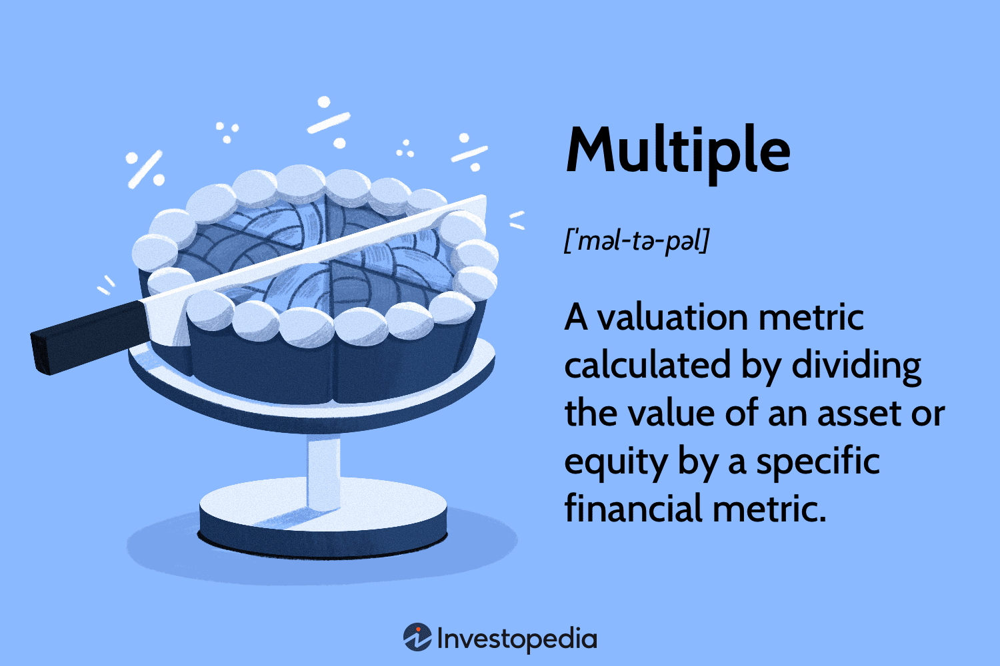

The evolution of trading has brought substantial advancements with algorithmic trading at the forefront. Algorithmic trading, commonly referred to as algo trading, employs computer programs that execute trades based on predefined criteria, significantly enhancing speed and accuracy compared to traditional trading methods. This approach leverages advanced algorithms to analyze vast amounts of market data and make decisions quickly, thus optimizing both timing and execution of trades.

Algorithmic trading is based on strategies that apply various types of complex calculations to identify and capitalize on market opportunities. These calculations range from simple moving averages to intricate statistical models, each tailored to specific trading strategies. Understanding these mechanisms is essential for optimizing decision-making processes and improving financial outcomes. The precision offered by algorithmic trading allows for the minimization of human error and reduction of emotional bias often present in manual trading, offering traders a significant competitive advantage.



This article explores the intricate calculations used in multiple algorithmic trading strategies, examining how they are applied, their inherent advantages, and potential pitfalls. By highlighting these aspects, readers can better comprehend the computational foundations that underpin modern trading strategies, setting the stage for improved trading performance and strategic insight.

## Table of Contents

## What is Algorithmic Trading?

Algorithmic trading, often referred to as algo trading, involves the use of computer algorithms to automate the trading process, ensuring that trades are executed at optimal prices with minimal human intervention. It capitalizes on computational power and advanced algorithms to make split-second decisions based on predefined criteria, such as timing, price, and quantity. This automation allows for a rapid and efficient execution of trades, significantly reducing the latency that is inherent in manual trading processes.

The essence of algorithmic trading lies in the strategic design and programming of algorithms aimed at achieving high returns. Traders and financial institutions develop complex algorithms to analyze market data and [carry](/wiki/carry-trading) out orders when certain conditions or patterns are identified. These strategies rely on mathematical models and statistical analyses to predict future price movements, thereby maximizing profits and minimizing risks.

Algorithmic trading is particularly prevalent among hedge funds and institutional traders due to its efficiency and speed in handling large volumes of trades. These entities benefit from reduced transaction costs and improved market [liquidity](/wiki/liquidity-risk-premium), allowing them to capitalize on arbitrage opportunities and execute large orders without significantly impacting the market prices. Moreover, the ability to backtest strategies using historical data provides an edge in refining approaches that generate consistent returns.

By leveraging technology and data analysis, [algorithmic trading](/wiki/algorithmic-trading) facilitates a more disciplined and emotion-free trading environment. As a result, it plays a crucial role in modern financial markets, offering a competitive advantage to those adept at harnessing its capabilities.

## Types of Algorithmic Trading Strategies

Algorithmic trading strategies employ various mathematical and statistical models to identify trading opportunities and execute trades efficiently. Here, we explore four prevalent strategies: [trend following](/wiki/trend-following), [momentum](/wiki/momentum) trading, mean reversion, and [arbitrage](/wiki/arbitrage). Each strategy applies specific calculations, contributing to its unique approach.

Trend Following:
Trend following strategies involve analyzing market data to detect directional trends and trading in alignment with these trends. This approach typically employs calculations such as moving averages. A Moving Average (MA) is a statistical calculation that smooths price data by creating a constantly updated average price. Common variations include the Simple Moving Average (SMA) and the Exponential Moving Average (EMA). The Moving Average Crossover, where a short-term MA crosses above or below a long-term MA, is a vital signal for this strategy.

Momentum Trading:
Momentum trading capitalizes on the strength of existing market trends. This strategy focuses on the rate of change in prices and employs calculations such as the Rate of Change (ROC) and Relative Strength Index (RSI). ROC is a momentum oscillator that measures the percentage change between the current price and the price “n” periods ago. RSI is another momentum indicator that evaluates the speed and change of price movements, oscillating between 0 and 100. High RSI values typically indicate an overbought condition, while low values suggest oversold conditions.

Mean Reversion:
Mean reversion strategies are based on the assumption that asset prices will revert to their historical average over time. Statistical analyses are crucial in identifying when a price has deviated significantly from its average. Bollinger Bands are a popular tool used in this strategy. These bands consist of a moving average and bands set at a standard deviation level above and below that average. When prices move outside these bands, it may suggest a reversion to the mean is impending.

Arbitrage:
Arbitrage strategies exploit price differences of the same asset across different markets or forms. Calculations for this strategy focus on identifying discrepancies and executing simultaneous trades to capitalize on these differences. Key to this approach is understanding the price correlation and calculating potential profits against transaction costs to ensure that the arbitrage opportunity is worthwhile.

Understanding and applying the correct mathematical calculations and indicators for these strategies is essential to enhance the efficiency and success of algorithmic trading. Each strategy's effective application can vary significantly based on market conditions, requiring traders to have a comprehensive grasp of underlying calculations.

## Calculation in Trend Following Strategies

Trend following is a popular strategy in algorithmic trading, focusing on capitalizing on market trends by aligning trades in the same direction. The cornerstone of this strategy is the use of technical indicators and mathematical models to identify and confirm market trends. 

A primary tool in trend following strategies is the calculation of moving averages. Moving averages are used to smooth out price data and generate a clearer picture of the trend direction. There are several types of moving averages, including the Simple Moving Average (SMA) and the Exponential Moving Average (EMA). The SMA is calculated as the arithmetic mean of a given set of prices over a specific number of periods. For instance, a 20-day SMA for a stock is calculated as follows:

$$
\text{SMA} = \frac{P_1 + P_2 + \ldots + P_n}{n}
$$

where $P_1, P_2, \ldots, P_n$ are the closing prices of the stock for $n$ days.

The EMA, on the other hand, gives more weight to recent prices, making it more sensitive to new information. Its formula is:

$$
\text{EMA}_{\text{today}} = \left( \frac{2}{n+1} \right) \times (P_{\text{today}} - \text{EMA}_{\text{yesterday}}) + \text{EMA}_{\text{yesterday}}
$$

where $n$ is the number of days in the moving average.

Moving Average Crossover is a widely used technical indicator that signals potential buy or sell opportunities. This indicator typically involves two moving averages: a shorter-period moving average and a longer-period one. When the shorter moving average crosses above the longer moving average, it generates a buy signal, indicating the beginning of an upward trend. Conversely, when it crosses below, it might signal a trend reversal or a decline, recommending a sell action. In Python, such a crossover could be implemented as follows:

```python
def moving_average(data, window_size):
    return data.rolling(window=window_size).mean()

short_window = 20
long_window = 50

data['Short_MA'] = moving_average(data['Close'], short_window)
data['Long_MA'] = moving_average(data['Close'], long_window)

data['Signal'] = 0.0  
data['Signal'][short_window:] = np.where(data['Short_MA'][short_window:] > data['Long_MA'][short_window:], 1.0, 0.0)
data['Position'] = data['Signal'].diff()
```

Objective decision-making is a significant benefit of these calculations. By relying on pre-defined criteria, traders can remove emotional bias, which often clouds judgment and leads to suboptimal trading decisions. Utilizing moving averages and other technical indicators helps traders adhere to their strategy, making data-driven decisions rather than reacting impulsively to market movements.

## Calculation in Momentum Trading

Momentum trading is a strategy that capitalizes on the continuance of existing trends in the market, buying assets when the momentum is strong. It primarily involves the application of technical calculations to determine the strength and direction of price trends. 

The Rate of Change (ROC) and the Relative Strength Index (RSI) are among the fundamental indicators used in momentum trading. These indicators help quantify the speed of price movements and identify overbought or oversold conditions.

### Rate of Change (ROC)

The ROC is a momentum oscillator that measures the percentage change in price between the current price and the price a specific number of periods ago. The formula is:

$$
\text{ROC} = \left( \frac{\text{Current Price} - \text{Price} \, n \, \text{Periods Ago}}{\text{Price} \, n \, \text{Periods Ago}} \right) \times 100
$$

A positive ROC indicates upward momentum, while a negative ROC suggests downward momentum. Traders often look for zero-line crossovers or extreme values as potential buy or sell signals.

### Relative Strength Index (RSI)

The RSI is another widely used momentum oscillator, typically calculated over a 14-day period. It compares the magnitude of recent gains to recent losses to determine overbought or oversold conditions. The RSI is calculated using the formula:

$$
\text{RSI} = 100 - \left( \frac{100}{1 + \text{RS}} \right)
$$

where RS (Relative Strength) is the average of 'n' days' up closes divided by the average of 'n' days' down closes.

An RSI above 70 may indicate an overbought condition, while an RSI below 30 could signal an oversold condition. These thresholds can be adjusted based on the asset and market conditions being analyzed.

### Short-Term Price Movements

Momentum traders focus on short-term price movements to capitalize on quick changes in market conditions. By using the ROC and RSI, traders can make informed decisions based on mathematical models rather than emotions. The execution of trades often involves setting precise entry and [exit](/wiki/exit-strategy) points, often automated through algorithmic trading platforms to eliminate human error and emotion from decisions.

### Understanding Trend Drivers

Successful momentum trading requires an understanding of the broader forces driving market trends, such as economic indicators, market psychology, and geopolitical events. These factors can influence the behavior seen in the technical indicators, affecting their reliability. Thus, momentum traders often supplement their strategies with news analysis and other market data to build a comprehensive view of the markets.

In summary, momentum trading relies heavily on technical analysis and calculations like Rate of Change and Relative Strength Index to harness short-term price movements. These methodologies allow traders to systematically approach trading, leveraging the natural flow of the market to capture profits.

## Mean Reversion and Arbitrage Calculations

Mean reversion and arbitrage are two prominent strategies in algorithmic trading that leverage statistical calculations to identify trading opportunities.

Mean reversion relies on the assumption that asset prices tend to return to their historical averages. This strategy involves the use of statistical tools to spot deviations from the mean and capitalize on the potential correction. A common statistical indicator used in mean reversion is the Standard Deviation, which quantifies the amount of variability or [dispersion](/wiki/dispersion-trading) in a set of prices. The calculation of the z-score can also serve as a measure of how far a current price is from the mean. The z-score is computed as:

$$
z = \frac{X - \mu}{\sigma}
$$

where $X$ is the current asset price, $\mu$ is the historical average price, and $\sigma$ is the standard deviation of the asset's price over a given period. A z-score significantly above or below zero indicates a noteworthy deviation from the mean, potentially signaling a trading opportunity.

Arbitrage, on the other hand, seeks to exploit price differences for the same asset across different markets or asset classes. Arbitrage calculations often involve identifying and executing trades that take advantage of these discrepancies almost instantaneously. For example, in [statistical arbitrage](/wiki/statistical-arbitrage), traders employ models to predict the expected price of an asset based on historical correlations with other assets. If the current market price deviates from the predicted value, traders might execute trades to profit from the expected return to the correlation-based price.

Python can be effectively used to automate such computational processes. Here is a simplified Python example for calculating the z-score for mean reversion:

```python
import numpy as np

def calculate_z_score(current_price, historical_prices):
    mean_price = np.mean(historical_prices)
    std_deviation = np.std(historical_prices)
    z_score = (current_price - mean_price) / std_deviation
    return z_score

current_price = 105
historical_prices = [100, 102, 98, 101, 99]
z_score = calculate_z_score(current_price, historical_prices)
print(f"Z-Score: {z_score}")
```

For arbitrage, the calculations are oriented towards detecting and executing trades simultaneously in multiple markets to pocket the spread between varying prices. This involves monitoring real-time data feeds from various exchanges, ensuring minimal spreads, and executing high-frequency trades to lock in profits. The effectiveness of arbitrage depends significantly on transaction speed and low latency, highlighting the importance of robust technological infrastructure in algorithmic trading.

## Challenges and Pitfalls in Calculation Methods

Algorithmic trading calculations, while instrumental in executing strategies with speed and precision, are not without their challenges. One critical issue is overfitting, where a model performs well on historical data but fails to generalize effectively to new, unseen data. Overfitting occurs when a model is excessively complex, capturing noise in the data rather than the underlying pattern. For instance, a trading algorithm may incorporate numerous parameters that perfectly track past market movements but offer no predictive power for future trends. To mitigate overfitting, traders and developers can employ techniques such as cross-validation and regularization. Cross-validation involves splitting the data into training and testing sets to ensure that the model's performance is consistent across different data samples. Techniques like L1 (Lasso) and L2 (Ridge) regularization can also be applied to penalize excessive complexity in model parameters.

Another significant challenge is the incorporation of transaction costs and slippage into strategy development. In algorithmic trading, every trade incurs costs such as brokerage fees and taxes, which can erode the profits of a strategy that appears profitable in a frictionless market. Slippage, the difference between the expected price of a trade and the price at which it is executed, can further diminish returns, especially in volatile markets. Therefore, traders must incorporate these costs into their models. A basic way to calculate the net return accounting for transaction costs can be expressed as:

$$
\text{Net Return} = \left( \text{Gross Return} \times (1 - \text{Transaction Costs Percentage}) \right) - \text{Slippage}
$$

Python tools, such as NumPy and pandas, can aid in integrating these costs during [backtesting](/wiki/backtesting) and performance evaluation.

Finally, continuous testing and strategy adaptation are crucial as markets are dynamic and constantly evolving. What works under current conditions may become obsolete as market dynamics shift due to economic changes, technological advancements, or shifts in market sentiment. Ongoing verification ensures that strategies remain relevant and effective amid changing market conditions. This process involves retraining models regularly, updating the data used for training, and incorporating new information or variables as they become available. By maintaining flexibility and responsiveness in strategy development, traders can better navigate the inherent uncertainties of financial markets.

## Future of Algorithmic Trading Calculations

The future of algorithmic trading calculations appears promising, driven predominantly by rapid technological advancements and enhanced computing capabilities. Artificial intelligence (AI) and [machine learning](/wiki/machine-learning) (ML) play a pivotal role in this evolution, as they contribute to the development of sophisticated trading algorithms capable of executing more precise and efficient trades.

AI and ML algorithms are skilled at identifying patterns and correlations within large datasets, which traditional methods might overlook. These technologies allow for the creation of predictive models that improve forecast accuracy, ultimately leading to more informed trading decisions. For instance, machine learning algorithms can be trained on historical market data to develop models that predict future price movements with a high degree of accuracy. This is achieved through techniques such as supervised learning, where the algorithm is provided with input-output pairs, or unsupervised learning, which involves identifying hidden patterns within the data without labeled responses.

An example of a Python code snippet that might be used in machine learning for algorithmic trading is as follows:

```python
from sklearn.model_selection import train_test_split
from sklearn.ensemble import RandomForestRegressor
import pandas as pd

# Load historical market data
data = pd.read_csv('market_data.csv')
features = data[['feature1', 'feature2', 'feature3']]
target = data['target_price']

# Split the data into training and testing sets
X_train, X_test, y_train, y_test = train_test_split(features, target, test_size=0.2, random_state=42)

# Initialize the model
model = RandomForestRegressor()

# Train the model
model.fit(X_train, y_train)

# Make predictions
predictions = model.predict(X_test)
```

As AI continues to evolve, trading algorithms will become increasingly autonomous and adaptive, capable of refining their strategies based on real-time market feedback without human intervention. Moreover, the integration of natural language processing (NLP) is enabling algorithms to interpret and react to market sentiments derived from news articles, social media feeds, and other text-based data sources.

To remain competitive, traders must stay informed about these technological advancements. Familiarity with programming languages such as Python or R, alongside an understanding of AI and ML frameworks, becomes essential. Continuous education and adaptation to new tools and methodologies will be crucial for leveraging the full potential of algorithmic trading in future markets.

In conclusion, while the future of algorithmic trading calculations brings immense possibilities, it demands a proactive approach in embracing and integrating new technologies. The ability to anticipate market changes through advanced analytics will serve as a key differentiator for successful traders in this evolving landscape.

## Conclusion

Algorithmic trading embodies a complex landscape that necessitates a profound grasp of various calculation methodologies. Each trading strategy, whether it's trend following, momentum trading, mean reversion, or arbitrage, relies on unique calculations to enhance trading efficiency. These calculations, from moving averages in trend following to statistical models in mean reversion, serve as the backbone for executing trades with precision and speed. However, the benefits of algorithmic trading are accompanied by challenges that must be diligently addressed.

One of the primary challenges is overfitting, where models are excessively tailored to historical data, potentially undermining performance in live trading scenarios. This pitfall underscores the importance of developing robust algorithms that generalize well across different market conditions. Additionally, transaction costs and slippage are critical factors that can erode the profitability of algorithmic strategies. Accurately modeling these costs is essential to ensure that theoretical gains translate into real-world profits.

To achieve long-term success in algorithmic trading, traders must engage in continuous learning and adapt their strategies to evolving market dynamics. This involves staying informed about technological advancements, such as [artificial intelligence](/wiki/ai-artificial-intelligence) and machine learning, which hold the promise of refining algorithms for improved market forecasts and trade executions. By remaining agile and responsive to new information and tools, traders can maintain a competitive edge and optimize their trading outcomes.

## References & Further Reading

[1]: Bergstra, J., Bardenet, R., Bengio, Y., & Kégl, B. (2011). ["Algorithms for Hyper-Parameter Optimization."](https://papers.nips.cc/paper/4443-algorithms-for-hyper-parameter-optimization) Advances in Neural Information Processing Systems 24.

[2]: ["Advances in Financial Machine Learning"](https://www.amazon.com/Advances-Financial-Machine-Learning-Marcos/dp/1119482089) by Marcos Lopez de Prado

[3]: ["Evidence-Based Technical Analysis: Applying the Scientific Method and Statistical Inference to Trading Signals"](https://www.amazon.com/Evidence-Based-Technical-Analysis-Scientific-Statistical/dp/0470008741) by David Aronson

[4]: ["Machine Learning for Algorithmic Trading"](https://github.com/PacktPublishing/Machine-Learning-for-Algorithmic-Trading-Second-Edition) by Stefan Jansen

[5]: ["Quantitative Trading: How to Build Your Own Algorithmic Trading Business"](https://www.amazon.com/Quantitative-Trading-Build-Algorithmic-Business/dp/0470284889) by Ernest P. Chan