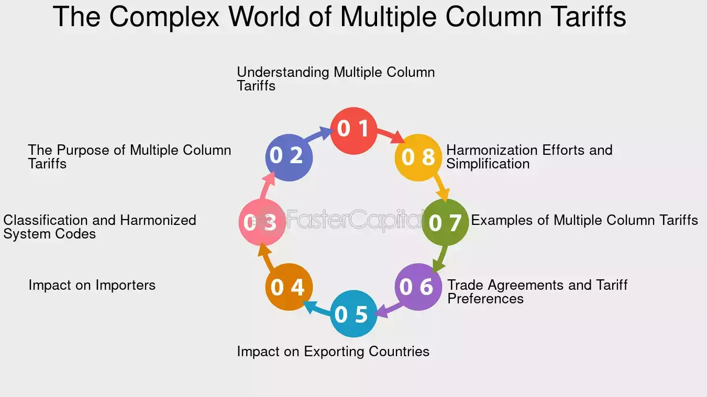

## Table of Contents

## What is a multiple column tariff?

A multiple column tariff is a type of tariff system used by countries to set different tax rates on imported goods. Instead of having one single rate for all goods, this system uses several columns, each with its own set of rates. This allows a country to charge different tariffs on the same product depending on where it comes from. For example, one column might have lower rates for goods from countries that the importing country has a trade agreement with, while another column might have higher rates for goods from countries without such agreements.

This system can be used to encourage trade with certain countries or to protect domestic industries from foreign competition. By setting different rates, a country can make goods from some countries cheaper and goods from others more expensive. This can help the country achieve its economic and political goals, like supporting allies or protecting local jobs. However, multiple column tariffs can also make trade more complicated and might lead to disagreements between countries.

## How does a multiple column tariff differ from other types of tariffs?

A multiple column tariff is different from other tariffs because it uses several different rates for the same product, depending on where it comes from. Most other tariffs, like a single-column tariff, use just one rate for all goods, no matter where they are from. With a multiple column tariff, a country can have lower rates for goods from countries it has trade deals with and higher rates for goods from other countries. This helps the country control trade and support its economic goals.

For example, a simple tariff might charge 10% on all imported cars, but a multiple column tariff could charge 5% on cars from Country A, 10% on cars from Country B, and 15% on cars from Country C. This flexibility allows the country to favor some trading partners over others. Other types of tariffs, like specific tariffs which charge a fixed fee per unit, or ad valorem tariffs which charge a percentage of the item's value, do not offer this kind of flexibility in rates based on the country of origin.

## What are the main components of a multiple column tariff?

A multiple column tariff has different sections, or columns, each with its own set of tax rates for goods. Each column can have different rates for the same product, depending on where the product comes from. This means a country can set lower taxes for goods from countries it has trade deals with and higher taxes for goods from other countries. The columns help the country control which goods come in and support its economic goals.

The main parts of a multiple column tariff are the columns themselves and the rates listed in each column. Each column is like a list of taxes for different products. For example, one column might list taxes for goods from countries with trade agreements, and another column might list taxes for goods from countries without agreements. The rates in each column can be different, so the country can make some goods cheaper or more expensive based on where they come from.

## Can you explain the historical context of multiple column tariffs?

Multiple column tariffs have been used by countries for a long time to control trade and support their economies. In the past, countries wanted to protect their own businesses and workers from competition with foreign goods. By using multiple column tariffs, they could charge different taxes on the same product depending on where it came from. This allowed them to make goods from some countries cheaper and goods from others more expensive. For example, in the early 20th century, the United States used multiple column tariffs to favor goods from countries it had trade agreements with, while charging higher taxes on goods from other countries.

Over time, the use of multiple column tariffs has changed as global trade has become more complicated. After World War II, many countries started working together to make trade easier and fairer. They created groups like the World Trade Organization (WTO) to help set rules for trade. These rules made it harder for countries to use multiple column tariffs to favor some countries over others. However, some countries still use them to protect certain industries or to support trade with specific partners. Today, multiple column tariffs are less common, but they can still be important tools for countries trying to manage their trade relationships.

## What are the primary objectives of implementing a multiple column tariff?

Countries use multiple column tariffs to control trade and help their economies. By setting different tax rates for the same product based on where it comes from, a country can make goods from some countries cheaper and goods from others more expensive. This helps the country support its trade partners and protect its own businesses and workers from too much competition.

For example, a country might want to help its allies or countries it has trade deals with. By charging lower taxes on goods from these countries, it can encourage more trade with them. At the same time, the country might want to protect its own industries from foreign competition. By charging higher taxes on goods from other countries, it can make those goods more expensive and less appealing to buyers. This way, the country can balance its economic goals and support its trade relationships.

## How is a multiple column tariff structured?

A multiple column tariff is set up with different sections, or columns, each showing different tax rates for goods. Each column has its own list of taxes for the same product, but the rates can be different depending on where the product comes from. For example, one column might have lower taxes for goods from countries the importing country has trade deals with, while another column might have higher taxes for goods from countries without such deals. This way, the country can control which goods come in and support its economic goals.

The structure helps the country make some goods cheaper or more expensive based on where they come from. By setting different rates in each column, the country can favor trade with certain partners and protect its own industries. For instance, a country might have one column for goods from countries it wants to support, with lower taxes, and another column for goods from other countries, with higher taxes. This flexibility allows the country to balance its trade relationships and economic needs.

## What are the economic impacts of a multiple column tariff on domestic industries?

A multiple column tariff can help domestic industries by making foreign goods more expensive. When a country uses different tax rates for the same product based on where it comes from, it can charge higher taxes on goods from countries it doesn't have trade deals with. This makes those goods cost more for buyers, which can make people choose to buy products made at home instead. This helps domestic industries by giving them a better chance to sell their goods and keep their businesses strong.

On the other hand, multiple column tariffs can also hurt domestic industries in some ways. If the tariffs make foreign goods too expensive, it might lead to less competition, which can make domestic companies less motivated to improve their products or keep prices low. Also, if other countries don't like the tariffs, they might put their own tariffs on goods from the country using multiple column tariffs. This can make it harder for domestic industries to sell their products in foreign markets, which can hurt their business.

## How do multiple column tariffs affect international trade relations?

Multiple column tariffs can change how countries trade with each other. When a country uses different tax rates for the same product based on where it comes from, it can make goods from some countries cheaper and goods from others more expensive. This can help the country support its trade partners and protect its own businesses. But it can also make other countries unhappy because they might feel treated unfairly. If countries feel they are not being treated equally, it can lead to disagreements and tensions in international trade.

These tariffs can also lead to a cycle of retaliation. If one country uses multiple column tariffs to charge higher taxes on goods from another country, that country might respond by putting its own tariffs on goods from the first country. This can make trade between the two countries harder and more expensive. Over time, this can hurt the relationships between countries and make global trade more complicated. It's important for countries to work together and follow trade rules to keep international trade smooth and fair.

## What are the potential benefits of using a multiple column tariff for a country's economy?

Using a multiple column tariff can help a country's economy by making foreign goods more expensive. When a country charges different taxes on the same product based on where it comes from, it can make goods from countries without trade deals cost more. This can make people choose to buy products made at home instead, which helps domestic industries grow and create more jobs. By supporting local businesses, the country can keep its economy strong and protect its workers from too much competition from abroad.

Another benefit is that multiple column tariffs can help a country support its trade partners. By charging lower taxes on goods from countries it has trade deals with, the country can encourage more trade with these partners. This can lead to stronger economic ties and better relationships with other countries. It also gives the country more control over its trade, allowing it to balance its economic goals and support the industries it wants to grow.

## What challenges and criticisms are associated with multiple column tariffs?

Multiple column tariffs can cause problems because they make trade more complicated. When a country uses different tax rates for the same product based on where it comes from, it can lead to disagreements with other countries. Those countries might feel they are not being treated fairly, which can hurt international trade relationships. Also, if one country uses multiple column tariffs, other countries might respond by putting their own tariffs on goods from the first country. This can start a cycle of retaliation, making trade between countries harder and more expensive.

Another challenge is that multiple column tariffs can hurt the economy in some ways. If the tariffs make foreign goods too expensive, it might reduce competition, which can make domestic companies less motivated to improve their products or keep prices low. This can lead to less innovation and higher prices for consumers. Critics also argue that multiple column tariffs can be used to protect certain industries at the expense of others, which can distort the economy and lead to inefficiencies. Overall, while multiple column tariffs can help protect domestic industries, they also come with significant challenges and criticisms that need to be carefully managed.

## How do multiple column tariffs influence global supply chains?

Multiple column tariffs can make global supply chains more complicated. When a country uses different tax rates for the same product based on where it comes from, it can change how companies move goods around the world. Companies might have to pay more to get goods from some countries, which can make them choose different suppliers or change their supply routes. This can slow down the supply chain and make it more expensive to get goods to where they need to go.

These tariffs can also lead to less trade between countries. If one country puts high taxes on goods from another country, that country might put high taxes on goods from the first country too. This can make it harder for companies to trade with each other, which can disrupt global supply chains. When trade is disrupted, it can be harder for companies to get the materials they need to make their products, which can lead to delays and higher costs.

## What advanced strategies can countries employ to optimize the use of multiple column tariffs?

Countries can use multiple column tariffs in smart ways to help their economies. One way is to use them to support trade with countries they have good relationships with. By setting lower taxes for goods from these countries, a country can encourage more trade and build stronger economic ties. This can help the country get important goods and materials more easily, which can keep its industries strong and growing. Another strategy is to use multiple column tariffs to protect certain industries that are important for the country's economy. By charging higher taxes on goods from countries without trade deals, the country can make those goods more expensive and help its own businesses compete better.

However, countries need to be careful when using multiple column tariffs. They should make sure they follow the rules set by groups like the World Trade Organization to avoid disagreements with other countries. It's also important to keep an eye on how these tariffs affect the economy. If they make foreign goods too expensive, it might hurt competition and lead to higher prices for consumers. Countries can use data and research to see how their tariffs are working and make changes if needed. By using multiple column tariffs in a smart and careful way, countries can help their economies while keeping good relationships with other countries.

## References & Further Reading

[1]: Bown, C. P. (2019). ["The 2018 US-China Trade Conflict after Forty Years of Special Protection."](https://www.tandfonline.com/doi/full/10.1080/17538963.2019.1608047) Peterson Institute for International Economics Working Paper.

[2]: Lopez de Prado, M. (2018). ["Advances in Financial Machine Learning."](https://www.amazon.com/Advances-Financial-Machine-Learning-Marcos/dp/1119482089) Wiley.

[3]: Jansen, S. (2020). ["Machine Learning for Algorithmic Trading: Predictive Models to Extract Signals from Market and Alternative Data for Systematic Trading Strategies with Python."](https://www.amazon.com/Machine-Learning-Algorithmic-Trading-alternative/dp/1839217715) Packt Publishing.

[4]: Aronson, D. R. (2006). ["Evidence-Based Technical Analysis: Applying the Scientific Method and Statistical Inference to Trading Signals."](https://www.amazon.com/Evidence-Based-Technical-Analysis-Scientific-Statistical/dp/0470008741) Wiley.

[5]: Baldwin, R. (2016). ["The Great Convergence: Information Technology and the New Globalization."](https://www.jstor.org/stable/j.ctv24w655w) Harvard University Press.

[6]: Chan, E. P. (2008). ["Quantitative Trading: How to Build Your Own Algorithmic Trading Business."](https://github.com/ftvision/quant_trading_echan_book) Wiley.