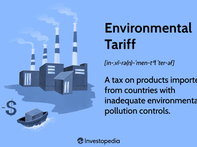

In recent times, trade policy and tariff strategies have emerged as pivotal components in the discourse of global economics. Their significance lies not just in influencing economic activities but in reshaping the political and social interactions among nations. Trade policies, encompassing both protectionist and liberalization measures, serve as a nation's blueprint for governing imports and exports, influencing everything from local economies to global supply chains.

A crucial aspect of trade policies is tariffs, which are taxes imposed on imported goods. Tariffs aim to protect domestic industries from foreign competition by making imported goods more expensive. By altering the price dynamics within a country's markets, tariffs can modify consumer behavior and impact the competitive landscape, influencing which industries thrive or struggle. However, tariffs can also provoke retaliatory actions from other nations, leading to trade wars that disrupt established trade patterns and economic relations.

As these economic instruments continue to evolve, they interact with a rapidly changing financial environment marked by the rise of algorithmic trading. Algorithmic trading, which utilizes complex algorithms to execute trades at high speed and volume, has introduced a layer of complexity to how tariffs and trade policies influence financial markets. These automated systems can swiftly react to policy changes and tariffs, altering market dynamics almost instantaneously. The integration of algorithmic trading into the financial markets has become a critical point of study for understanding both opportunities and risks associated with modern economic policies.

This article will explore the multifaceted economic effects of trade policies and tariffs, alongside examining the influential role of algorithmic trading in shaping contemporary financial landscapes. The discussion will cover the mechanics of tariff systems and the responsive nature of algorithmic trading to these economic measures, illustrating the intricate interplay between these forces. Understanding these dynamics is essential for grasping the ongoing and future transformations in global economics.

## Table of Contents

## Understanding Trade Policies and Tariffs

Trade policies are a critical aspect of the global economic system, consisting of a wide range of laws, regulations, and international agreements that govern the exchange of goods and services across national borders. These policies play a pivotal role in shaping economic relationships by establishing the rules under which international trade occurs.

Tariffs are a fundamental component of trade policy. They are essentially taxes imposed on imported goods, designed to increase the cost of foreign products, thereby influencing consumer and business purchasing decisions. By raising the price of imported goods, tariffs are used to protect domestic industries from foreign competition. This protectionist measure allows local industries to grow and maintain jobs by limiting the influx of cheaper or more competitive foreign goods into the market, providing them with a cost advantage.

There are various types of tariffs, each with different implications for trade relationships. A single column tariff refers to a standardized tariff rate applied uniformly to a specific imported good, regardless of its country of origin. This straightforward approach simplifies the calculation of import duties and ensures consistent application across different nations.

Conversely, multiple column tariffs involve different tariff rates for the same product based on bilateral or multilateral trade agreements. These rates can vary significantly, reflecting the country's economic relationships or strategic agreements with certain nations. For instance, under a free trade agreement, a country might impose lower tariffs or even allow tariff-free entry for particular goods from a partner country, thereby fostering closer economic ties and trade flows between them.

Grasping the intricacies of these tariff systems is crucial for understanding their far-reaching economic impacts. For example, by altering the cost structure of imported goods, tariffs can influence domestic consumption patterns, potentially leading to changes in the supply chain and pricing strategies within a market. Moreover, the strategic use of tariffs can serve as a negotiating tool in international diplomacy, affecting trade balances and economic policies. By comprehensively analyzing trade policies and tariff structures, stakeholders can better anticipate their consequences, navigate potential challenges, and identify opportunities within the ever-evolving global trade landscape.

## Economic Impact of Tariffs

Tariffs are a critical economic instrument used by governments to regulate trade by imposing duties on imported goods. One of the primary effects of tariffs is their ability to alter domestic prices of imported products. When a tariff is applied, the price of imported goods in the domestic market increases, making these goods more expensive for consumers. As a result, this can lead to inflationary pressures, as higher costs for foreign products drive up overall consumer prices.

The imposition of tariffs can also significantly affect the competitiveness of domestic industries. By increasing the cost of imported goods, tariffs provide a protective barrier for local producers against foreign competition. This protection can help domestic industries grow by enabling them to compete on more favorable terms, potentially leading to increased production and employment within the country.

On a larger scale, tariffs can incite trade wars, where countries engage in retaliatory measures by imposing their own tariffs. This can lead to a cascade of protectionist policies that disrupt international trade flows, causing inefficiencies and strained economic relations between nations. The uncertainty created by such trade disputes can hinder long-term investment decisions and cause [volatility](/wiki/volatility-trading-strategies) in global markets.

For developing nations, tariffs can serve as a strategic tool to protect and nurture nascent industries, a concept known as infant industry protection. By shielding fledgling sectors from the pressures of established foreign competitors, these tariffs can foster local innovation and industrial growth. However, there is a potential downside, as tariffs can also lead to increased costs for essential imports, such as raw materials and technology, which are crucial for development.

In the long term, the economic ramifications of tariffs extend beyond immediate price changes. They can lead to shifts in production patterns, as countries and companies adjust to new cost structures and supply chain configurations. Additionally, prolonged use of tariffs can influence international relations, either by fostering alliances through favorable trade agreements or by creating tensions and conflicts over perceived trade imbalances. Finally, global supply chains may evolve as businesses seek to mitigate the impact of tariffs by relocating production or sourcing from alternative countries, thereby altering traditional trade routes and economic interdependencies.

## Algorithmic Trading in the Context of Tariffs

Algorithmic trading involves the use of complex algorithms to automate trading decisions, execution, and processes, performing trades at high speeds and large volumes. This approach leverages computational models to identify trading opportunities based on specified criteria and market data. Algorithmic trading has become an integral part of financial markets, with its ability to process information and execute trades far more efficiently than human traders.

Trade policies and tariffs have a considerable impact on financial market volatility, which poses both challenges and opportunities for [algorithmic trading](/wiki/algorithmic-trading) systems. The imposition or alteration of tariffs can lead to fluctuations in market conditions, affecting asset prices, investor sentiment, and overall market stability. Algorithmic trading systems are designed to adapt to these changes swiftly, reacting to new information and adjusting strategies in real-time. 

For example, when a government announces new tariffs, these algorithms can rapidly interpret the potential economic implications, predict market movements, and execute trades within milliseconds. Such responsiveness enables traders to capitalize on sudden price movements, enhancing the potential for profit while also contributing to market [liquidity](/wiki/liquidity-risk-premium). This agility is facilitated by the algorithm's ability to process vast amounts of data and execute trades with minimal latency.

The interaction between algorithmic trading and tariffs can significantly influence market efficiency. Market efficiency refers to the degree to which market prices fully reflect all available information. Algorithmic trading contributes to market efficiency by rapidly incorporating news, such as tariff changes, into asset prices. However, this same speed and automation can exacerbate market volatility, particularly when multiple algorithms react simultaneously, potentially leading to significant price fluctuations.

Policymakers and traders must therefore understand the implications of algorithmic trading in response to tariffs to maintain market stability. Effective regulation and oversight may be necessary to mitigate the risks associated with high-frequency trading, preventing scenarios where algorithms amplify market shocks. 

Furthermore, continuous advancements in [machine learning](/wiki/machine-learning) and data analysis are likely to enhance the sophistication of algorithmic trading systems, enabling them to better anticipate the market impacts of trade policies and tariffs. As such, the evolving relationship between algorithmic trading and economic policies will remain a critical area of focus for stakeholders in global financial markets.

## Case Studies: Tariffs and Algorithmic Trading

Examining historical instances where tariffs have impacted markets offers valuable insights into their effects and the role of algorithmic trading. One prominent example is the U.S.-China trade war, which had significant implications for global financial markets. The trade conflict began in 2018, primarily driven by U.S. tariff impositions on Chinese goods, with China responding in kind (Bown, 2019). This series of tariff announcements and retaliations created substantial market volatility, with rapid changes in commodity prices, equity markets, and currency values.

Algorithmic trading systems played a crucial role during this period, as they are designed to process vast amounts of data quickly and execute trades based on real-time information. These systems were able to react almost instantaneously to news regarding tariff changes, resulting in a swift re-calibration of portfolios and trading strategies. For instance, machine learning models within algorithmic systems could analyze patterns and sentiment from news articles and social media, updating their trading decisions as needed. This behavior contributed to significant trading volumes and price swings in affected markets.

The European Union (EU) has also implemented tariffs that impacted non-member countries, affecting their financial markets. For example, EU tariffs on steel and aluminum directly affected markets in exporting countries, such as India and Brazil. Algorithmic trading, with its ability to efficiently evaluate trade-related news and adapt to new data swiftly, helped traders navigate these regulatory changes. Algorithms evaluated the effects of tariffs on various sectors, adjusting exposure and allocating resources in potentially less vulnerable industries.

The interaction between economic policy and modern trading technologies is further underscored by these examples. Algorithmic trading systems enhance market efficiencies through their ability to process and act on information faster than human traders. However, they can also exacerbate market fluctuations during periods of high uncertainty, such as during sudden tariff announcements or geopolitical tensions. Understanding this interplay is essential for traders and policymakers aiming to stabilize markets and mitigate adverse effects on the global economy.

In summary, case studies like the U.S.-China trade war and EU tariffs reveal the profound impact of tariffs on financial markets and the significant influence of algorithmic trading in such contexts. These scenarios underscore the need for adaptive strategies that leverage technology while considering the broader implications of trade policies on economic stability.

## Conclusion

Trade policies and tariffs are critical components of the global economic framework, exerting a profound influence on financial markets and international relations. The implementation of tariffs impacts not only the economic structure by modifying the prices of imported goods but also the competitiveness of domestic industries. These economic instruments can lead to significant shifts in international trade dynamics and are often pivotal in global economic negotiations.

The integration of algorithmic trading has introduced a new dimension to how these trade policies affect market dynamics. Algorithmic trading, with its capacity to execute trades at high speeds and volumes, presents both challenges and opportunities. On one hand, algorithms can quickly process and respond to tariff-related news, contributing to increased market efficiency and liquidity. On the other hand, this rapid response can also lead to heightened market volatility, requiring sophisticated risk management strategies.

Looking toward the future, economic landscapes will demand adaptive strategies that account for both evolving trade policies and technological advances in trading mechanisms. The pace of change in both spheres necessitates a robust understanding of their interplay to devise effective economic strategies and policies. Investors, policymakers, and economists must recognize the importance of this complex interaction and adapt accordingly.

Continued analysis and adaptation will be crucial as global trade continues to evolve alongside new trading technologies. Keeping abreast of advancements in algorithmic trading technologies and international trade policies will be essential in navigating and stabilizing financial markets. As these elements develop, ongoing research and policy adaptations will support smarter trading decisions and more resilient economic frameworks.

## References & Further Reading

[1]: Bown, C. P. (2019). ["The 2018 US-China Trade Conflict after Forty Years of Special Protection."](https://www.tandfonline.com/doi/full/10.1080/17538963.2019.1608047) Peterson Institute for International Economics Working Paper.

[2]: Lopez de Prado, M. (2018). ["Advances in Financial Machine Learning."](https://www.amazon.com/Advances-Financial-Machine-Learning-Marcos/dp/1119482089) Wiley.

[3]: Jansen, S. (2020). ["Machine Learning for Algorithmic Trading: Predictive Models to Extract Signals from Market and Alternative Data for Systematic Trading Strategies with Python."](https://www.amazon.com/Machine-Learning-Algorithmic-Trading-alternative/dp/1839217715) Packt Publishing.

[4]: Aronson, D. R. (2006). ["Evidence-Based Technical Analysis: Applying the Scientific Method and Statistical Inference to Trading Signals."](https://www.amazon.com/Evidence-Based-Technical-Analysis-Scientific-Statistical/dp/0470008741) Wiley.

[5]: Baldwin, R. (2016). ["The Great Convergence: Information Technology and the New Globalization."](https://www.jstor.org/stable/j.ctv24w655w) Harvard University Press.

[6]: Chan, E. P. (2008). ["Quantitative Trading: How to Build Your Own Algorithmic Trading Business."](https://github.com/ftvision/quant_trading_echan_book) Wiley.